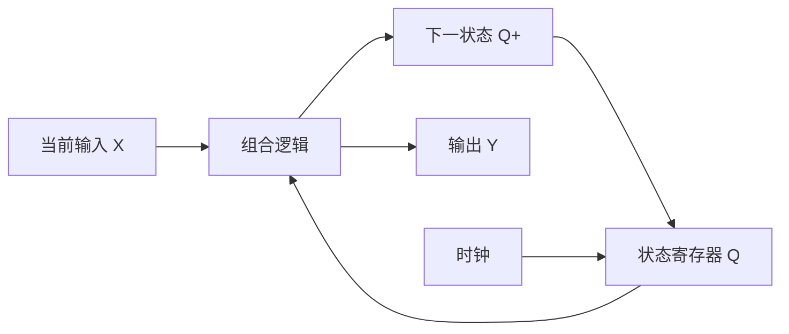

# 数字电子技术基础｜讲义合订本

本册将历次基础讲解、完整例题、48个细分知识点和提高原理按12章合并，并加入生活情境与师生双视角讲解。各章依次为“生活课堂”“概念与串讲”“细分知识点与例题”“提高参考（部分章节）”。第一轮从生活课堂进入概念和例题，提高参考留到第二轮。

[总目录](README.md) · [全部题目](02-题目合订本.md) · [全部解析](03-解析合订本.md)

## 章节目录

- [第1章：二进制、位权和编码](01-讲义合订本.md#%E7%AC%AC1%E7%AB%A0)
- [第2章：逻辑门、逻辑运算和真值表](01-讲义合订本.md#%E7%AC%AC2%E7%AB%A0)
- [第3章：逻辑代数与函数表达](01-讲义合订本.md#%E7%AC%AC3%E7%AB%A0)
- [第4章：卡诺图，一次只学会一种圈法](01-讲义合订本.md#%E7%AC%AC4%E7%AB%A0)
- [第5章：组合电路分析与设计](01-讲义合订本.md#%E7%AC%AC5%E7%AB%A0)
- [第6章：常用组合逻辑模块](01-讲义合订本.md#%E7%AC%AC6%E7%AB%A0)
- [第7章：数字电平与输入输出特性](01-讲义合订本.md#%E7%AC%AC7%E7%AB%A0)
- [第8章：锁存器与触发器](01-讲义合订本.md#%E7%AC%AC8%E7%AB%A0)
- [第9章：同步时序电路与状态表](01-讲义合订本.md#%E7%AC%AC9%E7%AB%A0)
- [第10章：计数器、寄存器与时序模块](01-讲义合订本.md#%E7%AC%AC10%E7%AB%A0)
- [第11章：异步时序电路的基础](01-讲义合订本.md#%E7%AC%AC11%E7%AB%A0)
- [第12章：D/A 与 A/D，从方向和刻度学起](01-讲义合订本.md#%E7%AC%AC12%E7%AB%A0)

**统一符号：** 逻辑式中＋表示或，连写表示与，⊕表示异或，上横线或Ā等表示取反；Q⁺表示下一状态；数值计算中的加号为普通加法。位序默认最高位在左，采样沿、复位、转换模型按各例题条件。

## 怎么自学与怎么授课

本次把12章都补成“生活情境—学生理解—老师讲法—完整推导—课堂纠错”的双视角讲义。原有48个细分知识点、E例题和全部练习继续使用；新增课堂检查用于交流理解，不另起一套试卷编号。

**难度约定：** 基础★是读懂概念并能解释；应用★★是独立列表、推导或计算；提高★★★是讨论边界、时序、误差或反例。星级是本资料的教学分层，不是官方难度评级。刚入门可以停在★★，不以做出★★★作为进入下一章的前提。

### 如果你是学生

每章先读“生活课堂”，尝试用自己的话回答“这个输入代表什么、输出要表达什么”。随后遮住解答自己列一次表或计算，再对照步骤找出差异；最后回到本章K知识点及E例题，完成对应S题。看懂生活故事不算学完，至少应能把故事转换成明确的变量、规则和验证方法。

遇到不会的题，先判断卡在哪一层：没读懂“至少/恰好”等规则；没有把中文翻成变量；会列表却不会化简；会公式却弄错位序或时刻。分别回到对应环节补，不必每次把整章从头重读。

### 如果你是老师

每次课只确定一个可观察的目标。例如“能用真值表说明或与异或的区别”，比“掌握逻辑门”更容易检查。下列40分钟结构用于一个小主题，不要求40分钟讲完一整章。

| 环节 | 参考时间 | 老师做什么 | 学生要交出什么 |
|---|---:|---|---|
| 生活问题 | 5分钟 | 给清楚规则，先不报公式 | 对两个具体情境作预测 |
| 定义变量与边界 | 5分钟 | 约定0/1、位序、有效时刻或转换模型 | 说清每个符号代表什么 |
| 逐步建模 | 10分钟 | 由学生给判断，板书表格与式子 | 一张完整表或逐步计算 |
| 配套例题 | 10分钟 | 让学生先做，再解释关键转折 | 独立完成主要步骤 |
| 错例与迁移 | 7分钟 | 改一条条件，让学生找反例 | 解释原答案为何还能用或不能用 |
| 离堂检查 | 3分钟 | 给一道小检查，不只问“懂了吗” | 一个结果加一句依据 |

**板书统一留四块：** 题意与变量；真值表/状态表/时序条件；表达式或电路；核验与适用条件。组合问题重点列当前输入，时序问题必须加当前状态和更新时间，转换问题必须先写量程、位数、映射及误差定义。

#### 课堂上怎样接住学生的错误

不要只回答“这个公式记错了”。先请学生解释他认为的0、1、状态或码值含义，再给一个能区分两种理解的具体例子。例如学生认为“或”只能满足一个，就追问“两项都满足时到底让不让进”；学生把触发器当导线，就指着两个时钟沿之间问“现在允许更新了吗”。

纠错后让学生做一个只改一处条件的新例子。若只能复述刚讲过的数字，理解可能还停留在记忆；若能说清改变的条件如何改变表格或方程，才更接近真正掌握。

### 12章教学路线与生活入口

| 顺序 | 生活入口 | 学生要能回答 | 老师重点追问 |
|---|---|---|---|
| [1](01-讲义合订本.md#生活课堂1) | 库存卡片与数量编码 | 为什么同一个1在不同位置值不同？ | 32种记录为何最大是31？ |
| [2](01-讲义合订本.md#生活课堂2) | 入场规则与双开关灯 | 同时、至少一个、恰好一个有什么区别？ | 两个输入都是1时呢？ |
| [3](01-讲义合订本.md#生活课堂3) | 简化重复的入场规定 | 删去条件后，结果为何没变？ | 能否找到改变了输出的一行？ |
| [4](01-讲义合订本.md#生活课堂4) | 自动与手动点亮规则 | 圈内变量为何能消去？ | 哪些变量一直不变？ |
| [5](01-讲义合订本.md#生活课堂5) | 三人表决器 | 怎样从文字一路设计到电路？ | 至少两人与恰好两人差在哪行？ |
| [6](01-讲义合订本.md#生活课堂6) | 广播信号选择与呼叫 | 选择数据、产生选择线、报告编号如何区分？ | 被选中为什么也可能输出0？ |
| [7](01-讲义合订本.md#生活课堂7) | 发送保证与接收门槛 | 发出的1能保证被认作1吗？ | 不能保证认高，就一定认低吗？ |
| [8](01-讲义合订本.md#生活课堂8) | 拍照与开窗 | D变了，Q为什么不一定变？ | 哪个时刻才允许采样？ |
| [9](01-讲义合订本.md#生活课堂9) | 单键切换台灯 | 当前输入为何还不够？ | 必须记住多少历史？ |
| [10](01-讲义合订本.md#生活课堂10) | 循环号码牌与传送带 | 数值更新与数据移位有什么区别？ | 清零检测发生在何时？ |
| [11](01-讲义合订本.md#生活课堂11) | 接力更新与中间结果 | 最终状态正确，过程为何仍可能出问题？ | 现在看到的是稳定状态吗？ |
| [12](01-讲义合订本.md#生活课堂12) | 有限刻度测量连续电压 | 码、代表值和真实输入为何不同？ | 当前算的是哪一种误差？ |

**生活类比的使用规则：** 每个例子先声明理想化假设，不把玩具模型当作某种真实产品的内部设计。类比用来打开理解，最后必须回到可检验的表格、方程和时序条件。不会因为故事听起来合理，就自动认为电路结论正确。

---

## 第1章

**二进制、位权和编码**

### 生活课堂｜用五张卡片表示库存数量

**难度：基础★ → 应用★★；对应 K01—K06。** 学生学完应能解释“每一位为什么代表不同数量”；老师先讲位权，再讲编码约定，不先要求背转换口诀。

#### 学生视角：0和1究竟在说什么

桌上有五张卡片，分别写着16、8、4、2、1。每张只能选一次：选中记1，不选记0。要表示22件商品，就选16、4、2，记录为10110。这串数字不是“五个独立的小数量”，而是五个位置的选择记录。

| 从左往右的位置 | 第4位 | 第3位 | 第2位 | 第1位 | 第0位 |
|---|---:|---:|---:|---:|---:|
| 位权 | 16 | 8 | 4 | 2 | 1 |
| 是否选中 | 1 | 0 | 1 | 1 | 0 |
| 对总数的贡献 | 16 | 0 | 4 | 2 | 0 |

因此10110₂＝1×16＋0×8＋1×4＋1×2＋0×1＝22₁₀。**0不是“这个位置不存在”，而是“这个位置没有贡献”。** 十进制的205中，0也保留了十位的位置。

#### 老师视角：一段可以直接使用的讲法

先拿出卡片，让学生拼出22，暂时不写“二进制”三个字。板书“数量＝各位数字×对应位权，再相加”，再把卡片选择记录写成10110。

> 老师：“把最左边的1挪到最右边，数量会一样吗？”  
> 学生：“都是一个1，应该一样？”  
> 老师：“同样一张‘选中’标签，贴在16的卡片上代表16，贴在1的卡片上代表1。数值同时由数字和位置决定。请你解释10000与00001。”

接着问：“五张卡片各有选和不选两种情况，总共有多少种记录？”让学生从一张2种、两张4种推到五张32种。最后才归纳：n位有2ⁿ种码字；按无符号整数解释，范围是0至2ⁿ－1。

**板书顺序：** 十进制205的位权 → 二进制10110的位权 → 32种记录与最大31 → 整数除2倒读 → 小数乘2顺读 → BCD分组。可分成两次基础课，避免把整数、小数、编码一次塞完。

#### 配套生活例题：给26个零件记数【基础★】

要求用最少位数的无符号二进制记录26。

1. 四位最大为15，不够；五位最大为31，足够，因此至少5位。
2. 26减去16余10；再减8余2；不选4；选2；不选1，得到11010₂。
3. 倒过来核验：16＋8＋2＝26，既验证转换也验证位序。
4. 若显示屏约定使用8421 BCD，应把十位2写成0010、个位6写成0110，结果为0010 0110，不能把11010直接冒充两个十进制数位的BCD。

**理解追问【应用★★】：** 同样的0010 0110，按8位无符号二进制解释是38，按两个BCD数位解释是26。不是哪一种算错了，而是解释规则不同；不能只看比特串就擅自确定含义。

#### 课堂纠错与当堂检查

- 学生说“五位最大32”：让他把五张卡片全选，亲自算16＋8＋4＋2＋1＝31。32是记录数量，0也占一种。
- 学生把0.1₂看成0.1₁₀：让他沿位权每向右除2，得到0.1₂＝1/2。整数点左右是同一套规律。
- 口头检查：“0.101₂是多少？”应答1/2＋1/8＝0.625；“十进制10的BCD与二进制？”应答0001 0000与1010。

**类比边界：** 卡片帮助理解位权；实际电路用电平等物理状态表示比特，不会真的搬动卡片。码字还可能表示字符、状态或有符号数，本例只按给定的无符号整数与8421 BCD解释。

**学后衔接：** 读[K01](01-讲义合订本.md#K01)至K06及例题，做[S01](02-题目合订本.md#S01)、[S06](02-题目合订本.md#S06)，再进入A卷。

### 概念与串讲

**本课目标：** 看懂一串 0 和 1 表示什么，区分二进制数和 BCD 编码。

#### 1.1 数字电路为什么经常用 0 和 1

数字电路把信号划分为离散的逻辑状态。入门时主要研究 0、1 两种状态，通常对应规定范围内的低、高电平。逻辑 1 不等于固定的 1 V；电压范围取决于器件。

一个能取 0 或 1 的位置称为一位（bit）。四位共有 $2^4=16$ 种不同组合。作为无符号二进制整数，它们表示 0–15；“16 种数”和“最大值 16”不能混淆。

#### 1.2 位权怎么读

十进制从右向左的整数位权是 1、10、100……；二进制则是 1、2、4、8、16……。二进制小数点右边的位权依次为 $1/2、1/4、1/8$……。

例：

$$1101_2=1\times8+1\times4+0\times2+1\times1=13_{10}.$$

反过来，把十进制 13 写成二进制：先取不超过 13 的最大二次幂 8，剩 5；再取 4，剩 1；2 不取；1 取。因此在 8、4、2、1 这四个位置填 `1、1、0、1`，得到 `1101`。

十六进制一位对应四位二进制，符号为 0–9、A–F，其中 A=10、F=15。例如 $1010_2=A_{16}$。先掌握整数转换，小数转换可随后补练。

#### 1.3 二进制数和 BCD 码有什么区别

8421 BCD 把**每一位十进制数字分别写成四位二进制**。

十进制 13：作为普通二进制是 `1101`；作为 BCD，则把十位 1 编成 `0001`、个位 3 编成 `0011`，合起来是 `0001 0011`。

BCD 的每组四位只能表示十进制数字 0–9，所以 `1010`–`1111` 不能作为一个合法 BCD 数字。BCD 是编码方法，不是逢 16 进位的新数制。

### 细分知识点与例题

#### K01

**整数位权：从二进制读出数值**

**先理解：** 从最右边起，位权依次是 1、2、4、8、16……；该位为 1 就加上该位权，为 0 就不加。写在数前面的 0 不改变无符号数值。

**配套例题 E01：** 把 10110₂ 转为十进制。

1. 先写五个位权：16、8、4、2、1。
2. 把各位对应：1×16＋0×8＋1×4＋1×2＋0×1。
3. 相加得 22，因此 10110₂＝22₁₀。

**容易混淆：** 不要把“有五位”理解成最大值 16；五位共有32种组合，最大无符号值31。

[配套随堂题 S01](02-题目合订本.md#S01)

#### K02

**十进制整数转二进制**

**先理解：** 可把整数拆成若干不同的二次幂；也可不断除以2记录余数，最后把余数倒过来读。

**配套例题 E02：** 把十进制26转为二进制。

1. 26中先取16，余10；再取8，余2。
2. 4不取，2取，1不取。
3. 按16、8、4、2、1填入1、1、0、1、0，得到11010₂；再按位权加回26验算。

**容易混淆：** 除2法需要倒读余数；不是按照计算产生的先后顺序直接抄。

[配套随堂题 S02](02-题目合订本.md#S02)

#### K03

**二进制小数的位权**

**先理解：** 小数点右侧的位权依次为1/2、1/4、1/8……，每向右一位再除以2。整数和小数部分分别计算再相加。

**配套例题 E03：** 将101.01₂转为十进制。

1. 整数101₂＝4＋1＝5。
2. 小数.01₂＝0×1/2＋1×1/4＝0.25。
3. 合起来为5.25。

**容易混淆：** 小数点右第一位是1/2，不是1/10。

[配套随堂题 S03](02-题目合订本.md#S03)

#### K04

**十进制小数转二进制**

**先理解：** 对小于1的非负小数反复乘2，每次取整数部分作为下一位，再用剩余小数继续。产生的整数位顺序就是二进制小数顺序。

**配套例题 E04：** 把0.375转为二进制小数。

1. 0.375×2＝0.75，取整数0，余0.75。
2. 0.75×2＝1.5，取整数1，余0.5；0.5×2＝1，取整数1，余0。
3. 顺序读为.011₂。验算1/4＋1/8＝0.375。

**容易混淆：** 小数乘2法顺读，整数除2法倒读；有些十进制有限小数在二进制中会无限循环。

[配套随堂题 S04](02-题目合订本.md#S04)

#### K05

**二进制与十六进制的对应**

**先理解：** 十六进制一位恰好对应四位二进制。A、B、C、D、E、F分别为十进制10至15；分组从小数点向两侧进行。

**配套例题 E05：** 把11010110₂写成十六进制和十进制。

1. 从右起分组：1101、0110。
2. 1101为13，用D表示；0110为6，所以为D6₁₆。
3. D6₁₆＝13×16＋6＝214。

**容易混淆：** 整数部分最左组不足四位时，在左边补0，不在右边随意补0。

[配套随堂题 S05](02-题目合订本.md#S05)

#### K06

**8421 BCD：按十进制数字分组编码**

**先理解：** 每个十进制数字分别用四位表示。0至9是合法数字码，1010至1111不是一个合法的8421 BCD数字。

**配套例题 E06：** 十进制42的二进制与BCD分别是什么？

1. 普通二进制把42作为一个数：42＝32＋8＋2，得到101010₂。
2. BCD分别处理数字4和2：4→0100，2→0010。
3. 拼成0100 0010，这是42的BCD，不是42的普通二进制。

**容易混淆：** 同一个比特串必须结合编码约定解读。

[配套随堂题 S06](02-题目合订本.md#S06)

**过关标准：** 能独立完成整数转换，知道位数决定组合数量，知道数值与编码方式需要一起解释。

**本章基础练习：** [1.1—1.4](02-题目合订本.md#1.1)；随堂题见各K知识点下方链接。

---

## 第2章

**逻辑门、逻辑运算和真值表**

### 生活课堂｜把“满足什么条件”翻译成逻辑门

**难度：基础★ → 应用★★；对应 K07—K08。** 学生需要先给0、1明确含义；老师重点检查“同时”“至少一个”“恰好一个”的区别。

#### 学生视角：一条规则就是一个函数

给一个教学用活动室设置入场规则：A＝有预约，B＝有当日入场凭证，F＝允许进入。若规则是“有预约并且有凭证”，则F＝AB；若改成“有预约或有凭证，满足一项即可”，则F＝A＋B。

关键不在于记门的名字，而在于判断：**两项条件都满足时，输出应不应该为1？** “至少一个”允许两项都满足；“恰好一个”不允许。

| A | B | 同时满足 AB | 至少一个 A＋B | 恰好一个 A⊕B |
|---:|---:|---:|---:|---:|
| 0 | 0 | 0 | 0 | 0 |
| 0 | 1 | 0 | 1 | 1 |
| 1 | 0 | 0 | 1 | 1 |
| 1 | 1 | 1 | 1 | 0 |

#### 老师视角：不要直接从符号讲起

先给学生两张“预约”“凭证”卡，依次摆出四种组合，让学生按规则举“允许”或“不允许”。等四行表都填完，再给三个输出列命名为与、或、异或。

> 老师：“小明有预约，也有凭证，‘至少有一个’满足吗？”  
> 学生：“满足，因为有两个更满足。”  
> 老师：“对，所以逻辑或的1＋1＝1。这个1表示规则成立，没在计算凭证张数。”

板书必须同时写出“变量含义”和“函数”。如果只写F＝AB，不写A、B代表什么，学生容易把真实物品数量与真假混起来。随后教非运算：若A＝有预约，则Ā＝没有预约，而不是“预约数量减一”。

#### 配套生活例题：两个拨动开关的灯【应用★★】

约定一个理想控制模型：开关A、B各有0、1两个位置；**两者位置不同时灯亮，相同时灯灭**。不讨论具体接线，先只设计逻辑功能。

1. 按00、01、10、11列出四行输入，输出依次为0、1、1、0。
2. 输出1有两种情况：A＝0且B＝1，对应ĀB；A＝1且B＝0，对应AB̄。
3. 两种情况满足任意一种即可，故F＝ĀB＋AB̄＝A⊕B。
4. 固定B＝0，翻动A会让F在0、1之间变化；固定B＝1，翻动A同样会改变F。因此无论另一个开关在哪个位置，这个开关都能改变灯的亮灭。

**老师的理解追问：** “为什么不能用或门？”要求学生提供反例：A＝B＝1时，或门输出1，但题目要求0。能拿出反例，比只说‘因为它是异或’更能证明理解。

#### 课堂纠错与当堂检查

- “A＋B就是只能选一个”：先代入11；普通逻辑或包含两者同时成立。
- “非门输出负数”：逻辑非只有0↔1，不是普通负号。
- 检查：“不是同时具有预约和凭证”写成什么？应答(A B)的反，即Ā＋B̄；“两样都没有”是ĀB̄，两个中文句子不能混用。
- 检查：“至少一个不满足”和“没有任何一个满足”是否相同？不相同；A＝1、B＝0就是反例。

**类比边界：** 开关例采用明确规定的输入编码；若把其中一个开关的0、1标签反过来，表达式会变为同或。真实控制还要考虑电气安全、接触抖动与延迟，本节只讨论理想逻辑关系。

**学后衔接：** [K07](01-讲义合订本.md#K07)、[K08](01-讲义合订本.md#K08) → [S07](02-题目合订本.md#S07)、[S08](02-题目合订本.md#S08)。

### 概念与串讲

**前置：** 知道 0、1 是逻辑状态。本课开始的逻辑表达式中，$+$ 表示“或”，连写表示“与”，上横线表示“非”。

#### 2.1 三种基本运算

- 与：$F=AB$，A、B **都为 1**，F 才为 1。
- 或：$F=A+B$，A、B **至少一个为 1**，F 就为 1。
- 非：$F=\overline A$，把 0 变成 1，把 1 变成 0。

所以逻辑运算中 $1+1=1$。这里的加号是“或”的符号，不是在做普通整数加法。

逻辑门就是实现相应运算的电路部件。可以先把它看成一个有输入、输出的小盒子：两个输入送入与门，输出就是 AB。

#### 2.2 真值表是把所有情况列全

两个输入共有 $2^2=4$ 种组合。按二进制顺序列出，不容易漏行。

| A | B | 与 AB | 或 A+B | 异或 $A\oplus B$ |
|---:|---:|---:|---:|---:|
| 0 | 0 | 0 | 0 | 0 |
| 0 | 1 | 0 | 1 | 1 |
| 1 | 0 | 0 | 1 | 1 |
| 1 | 1 | 1 | 1 | 0 |

异或表示“两输入不同”；同或表示“两输入相同”。与非是先与后非，$\overline{AB}$；或非是先或后非，$\overline{A+B}$。先学清运算顺序，再记名称。

#### 2.3 完整例题：允许启动且没有故障

设 A=1 表示收到启动请求，B=1 表示发生故障。只有请求存在且无故障时，电机允许启动 F=1。

第一步，翻译文字：“有请求”是 A，“无故障”是 $\overline B$，“且”表示与，因此 $F=A\overline B$。

第二步，逐行核对：

| A | B | 非 B | F |
|---:|---:|---:|---:|
| 0 | 0 | 1 | 0 |
| 0 | 1 | 0 | 0 |
| 1 | 0 | 1 | 1 |
| 1 | 1 | 0 | 0 |

第三步，写连接：B 先经过非门，结果与 A 一起进入与门。

### 细分知识点与例题

#### K07

**逻辑门：与、或、非、异或**

**先理解：** 与要求全为1；或要求至少一个1；非把0/1互换；异或表示两输入不同。同或是异或取反，与非、或非分别对与、或结果取反。逻辑式中的＋表示或。

**配套例题 E07：** A＝1、B＝0，求AB、A＋B、A⊕B、与非、或非。

1. 与：1和0没有同时为1，所以AB＝0；或：至少一个1，所以A＋B＝1。
2. 异或：输入不同，结果1。
3. 再分别取反：与非1、或非0。

| A | B | 与 | 或 | 异或 | 同或 |
|---:|---:|---:|---:|---:|---:|
|0|0|0|0|0|1|
|0|1|0|1|1|0|
|1|0|0|1|1|0|
|1|1|1|1|0|1|

**容易混淆：** 逻辑或中1＋1＝1；数值加法中1＋1＝10₂。先看题目在做哪一种运算。

[配套随堂题 S07](02-题目合订本.md#S07)

#### K08

**逐行列真值表**

**先理解：** n个输入有2ⁿ种组合。先按二进制顺序列输入，再增加中间运算列，最后算输出。不要凭直觉跳过某行。

**配套例题 E08：** 列F＝ĀB的真值表（上横线或Ā表示取反）。

1. 输入AB依次为00、01、10、11。
2. Ā依次为1、1、0、0。
3. 再与B相与，F依次为0、1、0、0；只有A＝0且B＝1时输出1。

| A | B | Ā | F＝ĀB |
|---:|---:|---:|---:|
|0|0|1|0|
|0|1|1|1|
|1|0|0|0|
|1|1|0|0|

**容易混淆：** 三个变量的行序应为000、001、010、011、100、101、110、111。

[配套随堂题 S08](02-题目合订本.md#S08)

**过关标准：** 能把简单文字条件翻译成表达式，并用真值表逐行检查。

**本章基础练习：** [2.1—2.4](02-题目合订本.md#2.1)；随堂题见各K知识点下方链接。

---

## 第3章

**逻辑代数与函数表达**

### 生活课堂｜把重复的入场规则说得更简单

**难度：基础★ → 应用★★；对应 K09—K12。** 学生要解释每一步为什么等价；老师区分“简化句子”与“改变规则”。

#### 学生视角：化简是在保留所有情况下的结果

某活动规定：“会员可以进入；不是会员但有体验票的人也可以进入。”定义M＝会员，T＝有体验票，F＝允许进入。原规则是F＝M＋M̄T。

听起来有两条，但可以改说成“会员或持有体验票即可”。因为持票者如果是会员，第一条已允许；如果不是会员，第二条允许。因此F＝M＋T。我们省去了重复判断，没有省去任何人的资格。

| M | T | 原规则 M＋M̄T | 简化规则 M＋T |
|---:|---:|---:|---:|
| 0 | 0 | 0 | 0 |
| 0 | 1 | 1 | 1 |
| 1 | 0 | 1 | 1 |
| 1 | 1 | 1 | 1 |

#### 老师视角：让学生先讲理由，再写定律

> 老师：“删掉‘不是会员’这几个字，会不会让本来不能进的人进来？”  
> 学生：“可能会多放进有票的会员。”  
> 老师：“有票的会员，原来的第一条不是已经放行了吗？请找一行原来0、现在1的情况。”

学生发现四行输出完全相同后，再板书：

M＋M̄T＝(M＋M̄)(M＋T)＝1·(M＋T)＝M＋T。

第一步是逻辑代数的分配律X＋YZ＝(X＋Y)(X＋Z)，不能拿普通数的加乘法习惯判断。教学顺序建议为：生活分类讨论 → 真值表验证 → 代数推导 → 类似表达式迁移。

#### 配套生活例题：从同一规则写三种表达【应用★★】

取变量顺序MT，M为高位。

1. 输出1的输入是01、10、11，故最小项式F＝M̄T＋MT̄＋MT＝Σm(1,2,3)。每一项精确对应一行。
2. 输出0只有00，该行对应的最大项为M＋T，故F＝ΠM(0)＝M＋T。这里ΠM中的M是最大项记号，与本例变量M需根据位置区分。
3. 若输出R表示“拒绝进入”，R＝F̄＝(M＋T)的反＝M̄T̄。两项资格都没有才拒绝。
4. 把简式再展开：M＋T＝M(T＋T̄)＋T(M＋M̄)，展开后合并重复项，又得到三个最小项，说明不同表达形式描述同一张表。

**老师要点：** 最小项中的变量一个不少，是为了锁定唯一一行；化简式允许少写变量，是因为把输出相同的多行合在了一起。后者正是下一章卡诺图的核心。

#### 课堂纠错与当堂检查

- 学生把(M＋T)的反写成M̄＋T̄：让他代入M＝1、T＝0；正确拒绝输出0，错误式输出1。反例会暴露“整体取反没有交换与、或”。
- 学生从M＋MT＝M推得可以做“减法消项”：提醒这里的依据是吸收律；不要创造逻辑减法，也不能从AB＝AC直接把A约掉。
- 检查：“允许条件是同时有票T和预约R，拒绝条件是什么？”应答T̄＋R̄；没有票或没有预约就拒绝。
- 检查：“F＝A＋AB，B改变一定影响输出吗？”不影响，因为函数等于A；表达式里出现变量，不代表该变量一定能影响结果。

**类比边界：** 假定会员资格、票据真假都是已确定的二值输入，规则不涉及次数、过期时间或历史记录。加入这些条件后，必须重新定义变量，不能直接沿用简式。

**学后衔接：** [K09](01-讲义合订本.md#K09)至K12 → [S09](02-题目合订本.md#S09)、[S10](02-题目合订本.md#S10) → B卷基础部分。

### 概念与串讲

**前置：** 与、或、非和真值表。本课目标是把同一个功能写得更简单。

#### 3.1 先理解这些规律

$$A+0=A,\quad A\cdot1=A,\quad A+1=1,\quad A\cdot0=0$$
$$A+A=A,\quad AA=A,\quad A+\overline A=1,\quad A\overline A=0.$$

例如 $A+A=A$：A 为 0 时两边都为 0；A 为 1 时两边都为 1。逻辑等式只需在所有输入组合下输出相同。

常用分配律与吸收律：

$$A(B+C)=AB+AC,\qquad A+AB=A.$$

**为什么能吸收？** A=1 时，无论 B 是什么，A 已足够让输出为 1；A=0 时，AB 也一定为 0，所以 AB 不改变输出。

德摩根定律：

$$\overline{AB}=\overline A+\overline B,\qquad \overline{A+B}=\overline A\,\overline B.$$

例：不是“A、B 都满足”，意味着“至少一个不满足”。对括号整体取反时，不能只给变量加横线而保留原运算符。

#### 3.2 完整例题：化简 $AB+A\overline B$

提取共同因子 A：

$$AB+A\overline B=A(B+\overline B)=A\cdot1=A.$$

意义：不论 B 取 0 还是 1，只要 A=1 就输出 1，B 已不影响结果。化简式应能用这一句话解释。

#### 3.3 从真值表写表达式

以两个变量 AB 为例，某函数仅在 `01、10` 输出 1：

- `01` 对应 $\overline AB$：A 必须为 0，B 必须为 1。
- `10` 对应 $A\overline B$。
- 只要命中其中一行就输出 1，因此 $F=\overline AB+A\overline B$。

每个包含全部变量、只在一行取 1 的乘积项叫最小项。以 AB 为位序，上式也记作 $F=\Sigma m(1,2)$，就是“1 号和 2 号行输出为 1”。

也能从输出为 0 的行写最大项之积：本例 0 行为 `00、11`，因此 $F=(A+B)(\overline A+\overline B)=\Pi M(0,3)$。最大项是在指定那一行等于 0 的或项。第一轮先熟练“找 1 行→写乘积项→求或”，再练最大项。

### 细分知识点与例题

#### K09

**化简先练提取与吸收**

**先理解：** 先熟悉互补律A＋Ā＝1、AĀ＝0；再练分配和吸收。每一步都应保持所有输入下的输出一致。

**配套例题 E09：** 化简AC＋AC̄，并解释结果。

1. 提取共同因子A：A(C＋C̄)。
2. 括号内恒为1，得到A×1＝A。
3. C无论取0还是1，都不再影响输出。另有吸收律A＋AB＝A，因为AB为1时A必为1。

**容易混淆：** 逻辑化简不能照搬普通代数的减法和约分。

[配套随堂题 S09](02-题目合订本.md#S09)

#### K10

**德摩根：整体取反的两步**

**先理解：** 对与取反变成各项取反后求或；对或取反变成各项取反后求与。先看最外层，再处理内部。

**配套例题 E10：** 求F＝A＋BC的反函数。

1. 最外层为或，先得到F̄＝Ā·(BC)̄。
2. 再对BC取反，(BC)̄＝B̄＋C̄。
3. 所以F̄＝Ā(B̄＋C̄)。

**容易混淆：** 不能只给变量加反号却保留原来的与/或结构。

[配套随堂题 S10](02-题目合订本.md#S10)

#### K11

**最小项：从输出1的行写函数**

**先理解：** 最小项含全部变量，且只在某一行等于1。该行某变量为0，就在乘积项中写它的反；为1就写原变量。

**配套例题 E11：** 变量顺序ABC，F仅在编号3、5输出1，写标准与或式。

1. 3写成三位二进制011，所以m3＝ĀBC。
2. 5写成101，所以m5＝AB̄C。
3. 两行任意命中即可，F＝ĀBC＋AB̄C＝Σm(3,5)。

| ABC | 最小项编号 | 最小项 |
|---|---|---|
|000|m0|ĀB̄C̄|
|001|m1|ĀB̄C|
|010|m2|ĀBC̄|
|011|m3|ĀBC|
|100|m4|AB̄C̄|
|101|m5|AB̄C|
|110|m6|ABC̄|
|111|m7|ABC|

**容易混淆：** 最小项编号必须先确认变量位序。

[配套随堂题 S11](02-题目合订本.md#S11)

#### K12

**最大项：从输出0的行写函数**

**先理解：** 最大项是在指定一行取0的或项。该行变量为0就写原变量，为1就写反变量；把所有0行的最大项相与。

**配套例题 E12：** ABC位序下，F仅在0、2号行输出0，写标准或与式。

1. 0为000，要让或项在此为0，M0＝A＋B＋C。
2. 2为010，所以M2＝A＋B̄＋C。
3. F＝M0M2＝(A＋B＋C)(A＋B̄＋C)＝ΠM(0,2)。

**容易混淆：** 最小项列1行，最大项列0行；不能把相同编号直接互换。

[配套随堂题 S12](02-题目合订本.md#S12)

**过关标准：** 每一步化简能指出依据，能从真值表写出最小项之和。

**本章基础练习：** [3.1—3.4](02-题目合订本.md#3.1)；随堂题见各K知识点下方链接。

---

## 第4章

**卡诺图，一次只学会一种圈法**

### 生活课堂｜为什么圈一组格子，就能少写一个条件

**难度：基础★ → 应用★★ → 提高★★★（追问选做）；对应 K13—K15。** 老师先让学生理解变量消去，再教圈图规则。

#### 学生视角：有时某个条件已经不重要

设一个理想照明控制规则：A＝自动模式开启，B＝环境较暗，C＝手动点亮指令有效。手动指令有效就亮；没有手动指令时，自动模式开启且环境较暗才亮。这里只研究点亮指令，不涉及保持开关状态。

按文字得到F＝C＋C̄AB。由上一章的规律可化简为F＝C＋AB。C＝1时，A、B无论怎样变化，F都为1，因此这一整组情况下不用再写A、B。

#### 老师视角：从八种情况进入卡诺图

板书顺序为“定义ABC → 八行表 → 填图 → 圈组 → 解释消去”。不要先画圈再补理由。

| A | B | C | F | 为什么 |
|---:|---:|---:|---:|---|
| 0 | 0 | 0 | 0 | 两条点亮条件均不成立 |
| 0 | 0 | 1 | 1 | 手动指令 |
| 0 | 1 | 0 | 0 | 自动模式没开 |
| 0 | 1 | 1 | 1 | 手动指令 |
| 1 | 0 | 0 | 0 | 环境不暗 |
| 1 | 0 | 1 | 1 | 手动指令 |
| 1 | 1 | 0 | 1 | 自动点亮 |
| 1 | 1 | 1 | 1 | 两条条件都成立 |

按A作行、BC按00、01、11、10排列：

| A＼BC | 00 | 01 | 11 | 10 |
|---|---:|---:|---:|---:|
| 0 | 0 | 1 | 1 | 0 |
| 1 | 0 | 1 | 1 | 1 |

> 老师：“把中间两列共四格圈起来，哪个变量一直是1？”  
> 学生：“C；A和B都变过。”  
> 老师：“所以这四格共同的理由只有C＝1，写成C。不是把A、B删掉不管，而是把它们所有可能性都包括了。”

#### 配套完整例题：从最小项到最简式【应用★★】

已知F＝Σm(1,3,5,6,7)，位序ABC。

1. 把五个1填入上图，其他位置为0。
2. 圈m1、m3、m5、m7，四格中C恒为1，得C。
3. m6尚未覆盖，把m6和m7圈成一对，两格A＝B＝1、C变化，得AB。m7允许被重复覆盖。
4. 合并得F＝C＋AB。核验m6：C＝0但AB＝1，仍输出1；核验m4：C＝0且B＝0，输出0。
5. 解释不能继续删：只留C会漏掉m6；只留AB会漏掉m1、m3、m5。因此这两个项在本覆盖中都必要。

**提高追问★★★（第二轮）：** 若题目保证ABC＝110永远不会出现，把m6当无关项d，最简式可选F＝C，因为所有规定为1的格都是C＝1。只有明确给出的约束允许这样做，不能因为“生活里很少发生”自行把m6删掉。

#### 课堂纠错与当堂检查

- 学生问“能不能圈三个1”：不能按标准卡诺图法圈三格；2ⁿ大小的矩形才对应某些变量完整取遍0、1后的乘积项。
- 学生不愿重叠：让他比较m6单独写ABC̄与和m7合成AB，重叠有助于化简。
- 检查：“列为何不是00、01、10、11？”因为01到10变了两位，破坏相邻格只变一位的条件。
- 检查：“左右两边的00和10能相邻吗？”能，只差B这一位；图的边界可绕接，斜对角仍不算相邻。

**类比边界：** 生活例只是规则模型；手动按钮真实电路若要‘按一下持续亮’，还需要存储状态，不能只用这里的组合函数描述。

**学后衔接：** [K13](01-讲义合订本.md#K13)至K15 → [S13](02-题目合订本.md#S13)、[S15](02-题目合订本.md#S15) → B卷。

### 概念与串讲

**前置：** 最小项和逻辑化简。本课先学三变量图，再迁移到四变量图。

#### 4.1 为什么相邻格可以合并

$$\overline ABC+ABC=BC(\overline A+A)=BC.$$

两项只有 A 不同，合并后 A 被消去。卡诺图就是把“只差一位”的输入排在相邻位置，方便观察这种合并。

三变量图：行用 A，列用 BC，列序必须是 `00、01、11、10`，不能直接用普通二进制递增顺序。

| A \ BC | 00 | 01 | 11 | 10 |
|---|---:|---:|---:|---:|
| 0 | m0 | m1 | m3 | m2 |
| 1 | m4 | m5 | m7 | m6 |

#### 4.2 完整例题：$F=\Sigma m(1,3,5,7)$

先在 1、3、5、7 对应的格子填 1，其他填 0：

| A \ BC | 00 | 01 | 11 | 10 |
|---|---:|---:|---:|---:|
| 0 | 0 | 1 | 1 | 0 |
| 1 | 0 | 1 | 1 | 0 |

中间四格可以圈成一个矩形。圈内 A 可为 0 或 1，B 也可为 0 或 1，只有 C 始终为 1，所以得到 $F=C$。

**圈内变化的变量消去；不变的变量保留。** 不要只背“圈四个消两个”，要说清是哪两个。

#### 4.3 圈图规则

圈 1、2、4、8……个格子，组成可对应一个乘积项的矩形；不能圈 3 格或 6 格。圈可以重叠，必须覆盖全部 1，不得包含规定的 0。上下或左右边界可以相接，斜对角不算相邻。

四变量图的行 AB、列 CD 都用 `00、01、11、10`。例如 $\Sigma m(0,1,2,3,8,9,10,11)$ 占据 AB=00 与 AB=10 两行，这两行隔着图的上下边界相邻；圈八格后只有 B=0 不变，结果为 $\overline B$。

无关项 X 表示题目允许该行输出取 0 或 1，可帮助扩大圈，也可不用。它不代表实际输出是某种“第三种逻辑”。第一轮没有掌握普通圈法前，不必追求含无关项的最优化。

### 细分知识点与例题

#### K13

**三变量卡诺图：先圈四格**

**先理解：** 行用A，列BC按00、01、11、10排列。相邻格只差一位；圈1、2、4、8格的矩形，圈内变化的变量消去。上下左右边界可相邻，斜角不算。

**配套例题 E13：** 化简F＝Σm(0,2,4,6)。

1. 两行在BC＝00、10两列为1，其余为0。
2. 这两列在左右边界相邻，可连同两行圈四格。
3. 圈内A、B都变化，C始终0，所以F＝C̄。

例题填图（最左与最右列绕边界相邻）：

| A / BC | 00 | 01 | 11 | 10 |
|---|---:|---:|---:|---:|
|0|1|0|0|1|
|1|1|0|0|1|

**容易混淆：** 圈可以重叠，不能覆盖规定为0的格；不用为了避免重叠而把圈缩小。

[配套随堂题 S13](02-题目合订本.md#S13)

#### K14

**四变量卡诺图：读出不变变量**

**先理解：** 行AB与列CD都按00、01、11、10排列。圈越大，可消去的变量通常越多；但每个圈仍须满足相邻矩形和不覆盖0的规则。

**配套例题 E14：** 化简Σm(4,5,6,7,12,13,14,15)。

1. 4至7位于AB＝01行，12至15位于AB＝11行。
2. 两行相邻且全为1，圈成八格。
3. A、C、D变化，B保持1，所以F＝B。

例题填图（中间两行圈八格）：

| AB / CD | 00 | 01 | 11 | 10 |
|---|---:|---:|---:|---:|
|00|0|0|0|0|
|01|1|1|1|1|
|11|1|1|1|1|
|10|0|0|0|0|

**容易混淆：** 圈八格不是“结果一定为A”；要看究竟哪一个变量没变。

[配套随堂题 S14](02-题目合订本.md#S14)

#### K15

**无关项：允许使用的自由**

**先理解：** X是题目允许取0或1的输入组合。化简时可把某些X当1扩大圈，也可不用；规定的1必须覆盖，规定的0不能覆盖。

**配套例题 E15：** ABC位序，必需1为1、3，无关项为5、7，其他为0，求一个简式。

1. 1、3都满足A＝0、C＝1；不用X可得ĀC。
2. 借助5、7，可把所有C＝1的四格一起圈。
3. 得到F＝C，在必需输入上仍正确；无关输入5、7被此实现取为1。

**容易混淆：** X不是实际电路会输出的第三种稳定逻辑值；需求若改为这些输入必须0，要重新化简。

[配套随堂题 S15](02-题目合订本.md#S15)

### 提高参考｜逻辑代数：从表达式到行为

第二轮选读；其中Q编号对应题目合订本末尾的挑战题。

**考纲覆盖：** 基本定律、运算规律、各种表达形式、代数化简、卡诺图化简。对应 Q01–Q03。

#### 1.1 先掌握什么

二进制位权、二/十/十六进制转换、8421 BCD 码；与、或、非、与非、或非、异或、同或；真值表和门电路图。

二进制数 `1010` 表示十进制 10，但 `1010` 不是一个有效的 8421 BCD 数字。数值相同不等于编码规则相同。

#### 1.2 基本定律要会使用，也要会证明

$$
A+AB=A,\qquad A(A+B)=A
$$
$$
A+\overline AB=A+B,\qquad A+BC=(A+B)(A+C)
$$
$$
\overline{AB}=\overline A+\overline B,\qquad
\overline{A+B}=\overline A\,\overline B
$$

例如 $A+\overline AB=(A+\overline A)(A+B)=A+B$。消去项的依据是逻辑恒等式，不能照搬普通代数中的减法、约分。

**共识定理：**

$$AB+\overline AC+BC=AB+\overline AC.$$

$BC$ 对稳态函数是冗余项，但在特定门电路中可能用于消除冒险。判断“多余”必须先明确评价目标。

#### 1.3 四种表达方式

文字要求 → 真值表 → 逻辑表达式 → 逻辑电路图。

最小项包含全部变量，只对应真值表的一行。$F=\Sigma m(\cdots)$ 列出输出为 1 的行；最大项之积 $F=\Pi M(\cdots)$ 列出输出为 0 的行。

例：变量次序为 $ABC$ 时，$m_5=A\overline BC$，$M_5=\overline A+B+\overline C$。前者在 `101` 为 1，后者在 `101` 为 0。

#### 1.4 卡诺图为什么能化简

相邻格仅有一位不同，因此 $ABC+AB\overline C=AB$。每合并一个完整的二倍区域，就消去一个变化的变量。

- 采用格雷码排列，例如 `00、01、11、10`；图的上下、左右边界可相邻，斜对角不相邻。
- 圈中格数为 $1,2,4,8,\ldots$；必须是可对应一个乘积项的矩形区域。
- 圈可重叠；覆盖全部必需的 1，不能覆盖规定的 0；无关项可用可不用。
- 对两级与或式，通常先减少乘积项数，再减少文字数；这不保证实际芯片数量、延迟或功耗都最小。

**理解检验：** 两个化简式若只在无关输入处不同，可以同时满足原题；若以后要求这些输入必须输出 0，原来的化简可能失效。

**过关标准：** 能正确填格、按规则圈格，并从每个圈读出表达式。

**本章基础练习：** [4.1—4.4](02-题目合订本.md#4.1)；随堂题见各K知识点下方链接。

---

## 第5章

**组合电路分析与设计**

### 生活课堂｜三人表决器为什么要先把规则说清楚

**难度：基础★ → 应用★★ → 提高★★★（冒险）；对应 K16—K20。** 目标是掌握“文字→表→式→实现→检查”的完整过程。

#### 学生视角：设计不是凭感觉连几个门

A、B、C分别表示三个人是否赞成，赞成为1；F＝1表示提案通过。规则是“至少两人赞成”。这意味着两人赞成和三人赞成都通过，不能把“至少两人”读成“恰好两人”。

| ABC | 赞成人数 | F |
|---|---:|---:|
| 000 | 0 | 0 |
| 001 | 1 | 0 |
| 010 | 1 | 0 |
| 011 | 2 | 1 |
| 100 | 1 | 0 |
| 101 | 2 | 1 |
| 110 | 2 | 1 |
| 111 | 3 | 1 |

#### 老师视角：每一步都让学生有可检查的产物

先让学生独立判断111，再让他列八行表。如果111就读错了，不要让他急着画卡诺图；先纠正题意。随后板书F＝Σm(3,5,6,7)，用图得到F＝AB＋AC＋BC。

> 老师：“式子为什么出现三个‘两人组合’？”  
> 学生：“AB、AC、BC分别表示三种可能的赞成搭档。”  
> 老师：“三人都赞成会不会被算三次？”  
> 学生：“数人数会，但这里是逻辑或，只表示是否存在至少一对，输出仍是1。”

**建议的板书分区：** 左侧写条件和真值表，中间写化简，右侧写电路连接与核验。提醒学生门电路图中的导线连接代表明确的信号关系，每个输出都要能追溯到表达式。

#### 配套完整例题：设计并检查表决器【应用★★】

1. 由表得到F＝ĀBC＋AB̄C＋ABC̄＋ABC。
2. 将111分别与011、101、110配对，得到BC、AC、AB，故F＝AB＋AC＋BC。
3. 实现：三个二输入与门分别产生AB、AC、BC，再送入一个三输入或门；若限定只能用二输入或门，可用两个二输入或门级联。
4. 核验通过边界：011输出1；核验不通过边界：001输出0；核验容易误判的111输出1。完整验证仍应覆盖八行。
5. 若规则改为“恰好两人”，111必须变0，函数改为ĀBC＋AB̄C＋ABC̄；原表决器已不符合新需求，不能只改文字说明。

**连到加法器【应用★★】：** 三个输入相加时，和位S＝A⊕B⊕C，进位位Cout＝AB＋AC＋BC。表决器恰好等于全加器的进位函数。注意S只是一位：111的算术总和是11₂，因此S＝1、Cout＝1，不能把异或误认为完整三数之和。

#### 进阶课堂：正确的逻辑表为什么仍可能闪一下【提高★★★，选做】

考虑两级与或式G＝AB＋ĀC，B＝C＝1、A从1变0。稳定前后G都应为1；但若AB先降为0、ĀC后升为1，中间两项可能短暂都为0，产生静态1冒险。增加不改变逻辑功能的冗余项BC，得到G＝AB＋ĀC＋BC，可在本次单输入变化中用始终为1的BC保持输出。

老师先画“两条路径到达时间不同”的时间线，再讲共识项；不要让基础学生把“化简项越少”和“任意实现都无毛刺”混为一谈。上述消除结论针对所述两级实现和单输入变化，不能推广到任意多输入同时变化。

**课堂检查：** “至少一人”和“恰好一人”的111行分别是什么？分别为1与0；“组合电路会记住上一轮投票吗？”理想组合功能不会，输出取决于当前输入，实际响应存在传播延迟。

**类比边界：** 假定三人的票已稳定且编码正确。真实按钮可能抖动，结果显示还可能需要锁存，这些是额外设计环节。

**学后衔接：** [K17](01-讲义合订本.md#K17)、[K19](01-讲义合订本.md#K19)及[S17](02-题目合订本.md#S17)；第二轮回到[K16](01-讲义合订本.md#K16)理解冒险。

### 概念与串讲

**前置：** 真值表、表达式、化简。本课把这些工具连成完整解题过程。

#### 5.1 什么是组合电路

输入稳定并经过必要的传播时间后，输出由当前输入决定，不需要记住之前发生过什么。一个开关是否当前按下可以直接判断；“已经按过几次”需要保存历史，属于时序问题。

分析已有电路：写各门输出 → 合成表达式 → 列真值表 → 说明功能。

设计新电路：定义输入输出 → 列真值表 → 写表达式 → 化简 → 说明门的连接。

#### 5.2 完整例题：三人表决，至少两票赞成才通过

A、B、C 分别表示三人的票，1 为赞成，F=1 表示通过。

| ABC | 赞成票数 | F |
|---|---:|---:|
| 000 | 0 | 0 |
| 001 | 1 | 0 |
| 010 | 1 | 0 |
| 011 | 2 | 1 |
| 100 | 1 | 0 |
| 101 | 2 | 1 |
| 110 | 2 | 1 |
| 111 | 3 | 1 |

先写 $F=\Sigma m(3,5,6,7)$。卡诺图可分别把 3 与 7、5 与 7、6 与 7 合并，得到：

$$F=BC+AC+AB.$$

用三个二输入与门产生 AB、AC、BC，再接一个或门。结果也可直接理解为：任意一对人同时赞成就通过。

#### 5.3 半加器与全加器

两个一位数相加，`1+1=10`：低位的“和”是 0，高位的“进位”是 1。这里的加法是数值加法。

半加器：$S=A\oplus B$，$C=AB$。

全加器还接收低位送来的 $C_{in}$，所以 $S=A\oplus B\oplus C_{in}$；三位输入至少两位为 1 时有进位，$C_{out}=AB+AC_{in}+BC_{in}$。三人表决原理直接用于进位设计。

#### 5.4 初步认识冒险

门输出不会瞬间更新。如果同一输入经不同长度的路径影响输出，切换时可能短暂出现错误脉冲，称为冒险问题。先会设计稳态逻辑，再检查切换过程。

例如 $F=\overline AB+AC$：B=C=1 时理论输出恒为 1，但 A 变化时，旧路径可能已关闭，新路径还没打开。加上始终有效的 BC 项可以覆盖这次切换间隙。这是单输入变化条件下的静态 1 冒险示例，不要求初学时处理所有复杂毛刺。

### 细分知识点与例题

#### K16

**冒险入门：稳态表没有描述延迟**

**先理解：** 门电路有传播延迟。同一输入经不同路径到达输出，切换时可能出现短脉冲。先会判断稳态，再检查一个输入变化时是否可能短暂断开覆盖。本应保持1却短暂变0，称静态1冒险。

**配套例题 E16：** F＝ĀB＋AC，B＝C＝1，A变化时为何可能短暂为0？

1. 稳态代入得F＝Ā＋A＝1。
2. A改变时，原来为1的乘积项可能先变0，另一项稍后才变1，中间存在空隙。
3. 加上BC项，在B＝C＝1时不依赖A，能覆盖该切换间隙。

**容易混淆：** 这是两级与或、单输入变化下的静态1冒险示例，不等于解决任意多输入变化。

[配套随堂题 S16](02-题目合订本.md#S16)

#### K17

**组合电路设计：先写条件，再列情况**

**先理解：** 顺序为定义输入输出→列真值表→写表达式→化简→连接门电路。所有变量含义应先明确，如1究竟表示故障还是正常。

**配套例题 E17：** 安全门S关闭且两个启动按钮A、B至少一个按下，机器才运行。求F。

1. 定义S＝1表示关闭，A/B＝1表示按下。
2. 按钮条件是A＋B，再与安全条件S相与，F＝S(A＋B)。
3. S＝0的所有行输出0；S＝1时只有AB＝00输出0。连接为先或后与。

**容易混淆：** “至少一个”是或，“恰好一个”是异或。

[配套随堂题 S17](02-题目合订本.md#S17)

#### K18

**半加器：和位与进位分开算**

**先理解：** 半加器输入两个二进制位，不接收低位进位。数值和由低位S与高位C组成，A＋B（数值）＝2C＋S。

**配套例题 E18：** 列半加器四种输入，并推导输出。

1. 00相加得0，S＝0、C＝0；01和10得1，S＝1、C＝0。
2. 11相加为10₂，S＝0、C＝1。
3. 因此S＝A⊕B，C＝AB。

| AB | 数值和 | C | S |
|---|---:|---:|---:|
|00|0|0|0|
|01|1|0|1|
|10|1|0|1|
|11|2|1|0|

**容易混淆：** 输出顺序写CS可直接表示数值，但题目若指定SC则不可自行对调。

[配套随堂题 S18](02-题目合订本.md#S18)

#### K19

**全加器：多一个输入进位**

**先理解：** 全加器相加A、B、Cin三个一位数；S表示和的奇偶，至少两位为1时产生Cout。

**配套例题 E19：** 输入A＝B＝Cin＝1时，求S和Cout，并写通式。

1. 三个1相加得3，即11₂，所以S＝1、Cout＝1。
2. S＝A⊕B⊕Cin。
3. Cout＝AB＋ACin＋BCin，任何两位同时为1即可进位。

| A B Cin | 数值和 | Cout | S |
|---|---:|---:|---:|
|000|0|0|0|
|001|1|0|1|
|010|1|0|1|
|011|2|1|0|
|100|1|0|1|
|101|2|1|0|
|110|2|1|0|
|111|3|1|1|

**容易混淆：** Cin是输入，Cout是输出；不能把同一题的两者当成一个量。

[配套随堂题 S19](02-题目合订本.md#S19)

#### K20

**BCD加法：何时加6**

**先理解：** 两个合法BCD数字及进位相加，第一次四位和超过9或已有二进制进位时，低四位加0110修正。原因是二进制四位逢16进位，十进制一位逢10进位，相差6。

**配套例题 E20：** 求BCD的7＋5。

1. 先做二进制：0111＋0101＝1100，即12。
2. 12不是合法个位BCD，低四位加0110：1100＋0110＝1 0010。
3. 个位0010为2，十进制进位1，结果BCD为0001 0010。

**容易混淆：** 第一次和为8或9时不能修正；若首次已有进位，也必须修正低四位。

[配套随堂题 S20](02-题目合订本.md#S20)

**过关标准：** 能从文字要求完成真值表和表达式，区分“至少”和“恰好”。

**本章基础练习：** [5.1—5.4](02-题目合订本.md#5.1)；随堂题见各K知识点下方链接。

---

## 第6章

**常用组合逻辑模块**

### 生活课堂｜“选一路”“指一个位置”“报编号”是三件事

**难度：基础★ → 应用★★；对应 K21—K25。** 学生应能根据数据流向选模块；老师不要让学生只靠名称里的“选择”“编码”猜答案。

#### 学生视角：用教室广播理解不同模块

以下都是理想二值模型。一条数据线只有0、1，不把真实声音直接当作一个比特。

| 生活任务的抽象 | 模块 | 真正做的事 |
|---|---|---|
| 四个信号源中选一个送到输出 | 数据选择器MUX | 多路数据→一路数据；另有选择信号 |
| 一个数据源送往四路中的指定一路 | 数据分配器DEMUX | 一路数据→被选中的输出；其他输出按约定置0 |
| 两位编号指定四个位置中的一个 | 2—4译码器 | 二进制编号→一路有效的选择信号 |
| 四处有人呼叫，报告一个呼叫位置 | 编码器/优先编码器 | 请求线→二进制编号；多请求时需规则 |

译码器输出通常是“谁被选中”，选择器输出是“被选中的数据是什么”。**被选中不代表数据必为1。** 如果被选的数据为0，MUX输出就应为0。

#### 老师视角：画箭头，不先背芯片型号

板书四张小框图，用粗箭头表示数据、细箭头表示选择编号。让学生说清有多少条数据输入、多少条输出、选择位需要多少位，再给模块名称。

> 老师：“选择编号是10，输出是不是一定为1？”  
> 学生：“选中了2号，应该是1吧。”  
> 老师：“若是译码器，2号选择线有效；若是数据选择器，输出等于D₂。D₂＝0时，选中的正是一个0。这两个问题问的是不同的量。”

本节均用高电平有效模型讲解；实际器件若低电平有效，要按符号、使能端和功能表重做判断。

#### 配套例题一：4选1选择器实现表决函数【应用★★】

要实现上一章F＝AB＋AC＋BC，取选择端S₁＝A、S₀＝B，把C留在数据端。

| 选择AB | 代入后的F | 应接的数据端 |
|---|---|---|
| 00 | 0 | D₀＝0 |
| 01 | C | D₁＝C |
| 10 | C | D₂＝C |
| 11 | 1 | D₃＝1 |

步骤是：固定选择变量 → 化简剩余函数 → 接数据端。不能把最小项编号直接当成4个数据端的固定数值，因为函数还有C没有固定。

核验A＝0、B＝1、C＝0：选D₁＝C＝0，F＝0；C改成1，仍选D₁但F变1。**选择地址没变，不意味着输出不能变。**

#### 配套例题二：为什么呼叫器还要“有效位”【应用★★】

设请求R₃优先于R₂、R₁、R₀；Y₁Y₀报告最高优先级请求的编号，V表示至少有一个请求。

- R₃R₂R₁R₀＝0101：R₂与R₀同时请求，输出Y＝10、V＝1。
- 输入0001：报告0号，Y＝00、V＝1。
- 输入0000：本例约定Y＝00、V＝0。

后两种编号相同，有效位不同。若省去V且没有额外协议，就无法仅凭00区分“0号请求”和“无人请求”。V＝R₃＋R₂＋R₁＋R₀。

#### 课堂纠错与检查

- “编码器总能识别任何多路同时有效”：普通编码器通常需要输入限制；优先编码器通过优先规则处理多请求。
- “译码器只有一条输出线”：2—4译码器有4条输出线；正常使能时，常说“一路有效”不等于“只有一条线”。
- 检查：“8选1至少需要几位选择信号？”3位，因为2³＝8；“比较两个无符号数先看哪一位？”从最高位向低位，遇到首个不同位即可决定大小。

**类比边界：** 广播只是帮助理解信号流向；真正的音频切换器是否适合某信号幅度与频率，还要看电路类型和电气指标，本章不据此设计实际音频设备。

**学后衔接：** [K21](01-讲义合订本.md#K21)至K25 → [S22](02-题目合订本.md#S22)、[S23](02-题目合订本.md#S23) → C卷。

### 概念与串讲

**前置：** 组合设计。本课先把模块当作有明确规则的功能块，不要求先背芯片引脚。

#### 6.1 译码与编码

二线—四线译码器把两位地址 AB 转为四路输出。先按“输出高有效且器件已使能”学习：

$$Y_0=\overline A\,\overline B,\quad Y_1=\overline AB,\quad Y_2=A\overline B,\quad Y_3=AB.$$

例如输入 `10`，只有 Y2=1。它相当于指出“现在输入的是哪一个编号”。实际模块可能低有效，要先读功能表。

普通编码器反过来把某一路有效输入变为编号，通常要求一次只有一路有效。优先编码器允许多路同时有效，选优先级最高的一路，并常用有效标志 V 区分“没有请求”和“0 号请求”。

#### 6.2 选择器与分配器

二选一数据选择器的规则：S=0 选 D0，S=1 选 D1。

$$F=\overline SD_0+SD_1.$$

四选一用两位地址 AB，依次选择 I0、I1、I2、I3。注意“地址”和“数据”是不同输入。

分配器把一路数据 D 送到选定通道，例如四路输出 $Z_i=D Y_i$。当 D=0 时所有输出都为 0；译码器的选中输出仍可以为 1，这是二者角色的差别。

#### 6.3 完整例题：已知地址，找出被选数据

某四选一选择器 $I_0=0,I_1=C,I_2=1,I_3=\overline C$。

当 AB=01 时，选择 I1，所以 F=C；若 C=0，F=0，若 C=1，F=1。当 AB=10 时选 I2，F 始终为 1，C 不影响该分支。

要用 MUX 实现一个函数，就逐个固定地址，求剩余输入应产生什么输出，再接到对应数据端。

#### 6.4 加法器和比较器

多位加法器可以把全加器串接：低位进位成为高位的输入进位。简单串接会产生逐级进位延迟。

无符号数比较，从最高位开始找第一个不同位，那里为 1 的数较大。例如 `1010` 与 `0111` 比较，最高位已分别为 1、0，所以前者大，不必再比较低位。若高位相等，再向低位看。

**读任何模块先确认四件事：** 使能是否有效、输入输出是否低有效、当前选择哪一路、未选中输出是什么。

### 细分知识点与例题

#### K21

**译码器：地址变为一路有效**

**先理解：** 先用高有效二线—四线译码器：AB为地址，Y0＝ĀB̄，Y1＝ĀB，Y2＝AB̄，Y3＝AB。前提是器件已使能。低有效型则选中输出为0。

**配套例题 E21：** 高有效译码器输入AB＝11，输出是什么？

1. 地址11₂对应编号3。
2. 所以Y3＝1，Y0、Y1、Y2＝0。
3. 按Y0到Y3顺序写为0、0、0、1。

高有效且已使能时：

| AB | Y0 | Y1 | Y2 | Y3 |
|---|---:|---:|---:|---:|
|00|1|0|0|0|
|01|0|1|0|0|
|10|0|0|1|0|
|11|0|0|0|1|

**容易混淆：** “选中”不总等于输出1，先看有效电平。

[配套随堂题 S21](02-题目合订本.md#S21)

#### K22

**编码器：编号与有效标志**

**先理解：** 普通编码通常要求一次一路有效；优先编码允许同时请求，但只选择优先级最高的一路。有效信号V区分无请求与编号为0的请求。

**配套例题 E22：** 四路优先级3＞2＞1＞0，R3、R1同时为1，求编号与V。

1. 先找最高有效请求：3号。
2. 3的二进制为11，所以编号11。
3. 确有请求，V＝1，低优先级R1不改变选择。

**容易混淆：** 编号00既可能是0号有效，也可能是无请求时约定输出，必须结合V。

[配套随堂题 S22](02-题目合订本.md#S22)

#### K23

**MUX：固定地址，求数据端**

**先理解：** 二选一F＝S̄I0＋SI1。四选一用地址AB依次选择I0、I1、I2、I3。实现逻辑函数时，固定地址后求剩余变量函数。

**配套例题 E23：** 用地址AB的四选一实现F＝A＋B＋C。

1. AB＝00时F＝C，所以I0＝C。
2. AB＝01或10时，已有一个1，F恒为1；AB＝11同样为1。
3. 因此I1＝I2＝I3＝1，选择器按地址输出所需函数。

| 地址AB | 选中数据端 | 例题F＝A＋B＋C |
|---|---|---|
|00|I0|C|
|01|I1|1|
|10|I2|1|
|11|I3|1|

**容易混淆：** 数据端可以是变量、反变量、常数或较简单的逻辑式，不一定只能接0、1。

[配套随堂题 S23](02-题目合订本.md#S23)

#### K24

**DEMUX：把数据送到选定通道**

**先理解：** 数据分配器只有一路数据D，多个输出。用译码器地址输出Yi构成Zi＝D·Yi，未选中的输出为0（本节采用高有效模型）。

**配套例题 E24：** AB＝10、D＝1，四路分配器输出是什么？

1. 地址选择2号通道。
2. D＝1，因此Z2＝1，其余Zi为0。
3. D若变0，即使地址不变，四路也全为0。

**容易混淆：** 选择器是多路选一路，分配器是一路分往多路中的一路。

[配套随堂题 S24](02-题目合订本.md#S24)

#### K25

**无符号比较：从最高不同位判断**

**先理解：** 高位的权重超过全部更低位之和；所以第一个不同的高位已经决定大小。若该位相同才继续比较更低位。

**配套例题 E25：** 比较1011₂和1001₂。

1. 最高位均1，下一位均0，继续。
2. 第三位分别1、0，前者较大。
3. 因此1011₂＞1001₂；十进制11＞9可验算。

**容易混淆：** 该方法在此用于无符号数；带符号编码需先明确编码规则。

[配套随堂题 S25](02-题目合订本.md#S25)

### 提高参考｜组合逻辑：分析、设计与模块实现

第二轮选读；其中Q编号对应题目合订本末尾的挑战题。

**考纲覆盖：** 组合逻辑定义、分析和设计、竞争冒险、编码器、译码器、选择器、分配器、加法器、比较器及 MSI 应用。对应 Q02、Q04–Q06、Q24。

#### 2.1 组合电路的定义有时间尺度

在输入稳定并经过传播延迟后，输出仅由当前输入决定；没有用于保存历史的逻辑状态。定义不意味着输入改变后输出立即正确。

分析顺序：标记中间节点 → 写各门表达式 → 化简 → 列真值表或分类 → 说明功能。

设计顺序：定义输入输出及有效电平 → 明确合法输入 → 列真值表 → 化简 → 选器件 → 检查动态行为。

#### 2.2 冒险的边界

输入信号经不同路径到达输出，延迟不同，可能出现不符合期望的短脉冲。

- **静态 1 冒险：** 理论上应保持 1，却短暂变 0。
- **静态 0 冒险：** 理论上应保持 0，却短暂变 1。
- **动态冒险：** 理论上只应翻转一次，却发生多次翻转。

在两级与或实现、单输入变化等假设下，给相邻的 1 增加共同覆盖项可消除相应静态 1 冒险。多输入同时变化、多级逻辑和异步反馈，需要另作分析。

例如 $F=\overline AB+AC$，当 $B=C=1$、$A$ 翻转时，两个乘积项可能短暂同时为 0。加上 $BC$ 可在这次转换中保持输出为 1。

**错误推断：** “真值表完全正确，所以电路没有毛刺。”真值表给出稳态结果，没有记录传播延迟。

#### 2.3 读懂 MSI 模块，比背引脚更重要

MSI 指中规模集成。对每个模块都检查：使能条件、有效电平、数据方向、输出形式和级联条件。

| 模块 | 核心原理 | 必须辨析 |
|---|---|---|
| 普通编码器 | 在限定输入模式下把输入位置编码 | 通常需要独热等输入约束 |
| 优先编码器 | 多输入有效时选优先级最高者 | 编码为 0 不一定代表“无输入”，常需有效标志 |
| 译码器 | 把地址转换为某一路有效输出 | 输出可能低有效，不能直接照抄“最小项求或”接法 |
| 数据选择器 MUX | 从多路数据中选一路 | 选择端固定后，求函数关于剩余变量的余因子 |
| 数据分配器 DEMUX | 把一路数据送往选定通道 | 数据输入、地址输入、使能输入职责不同 |
| 全加器 | $S=A\oplus B\oplus C_{in}$；$C_{out}=AB+AC_{in}+BC_{in}$ | 和位与进位不能混淆 |
| 数值比较器 | 从最高不同位决定大小 | 无符号比较与有符号比较规则不同 |

香农展开：$F=\overline SF|_{S=0}+SF|_{S=1}$。这是使用选择器实现逻辑函数的依据。

无符号多位比较可逐级写为：$G_i=A_i\overline B_i+E_iG_{i-1}$，其中 $E_i=\overline{A_i\oplus B_i}$，最低级以前 $G_{-1}=0$。高位相等时，才需要低位比较结果。

**BCD 修正：** 两个有效十进制数字加进位后，若四位和大于 9 或已有二进制进位，则低四位加 `0110`。修正原因是每个十进制数字只使用 16 个四位码中的 10 个。

**过关标准：** 会用功能规则求输出，不混淆地址、数据、使能和有效标志。

**本章基础练习：** [6.1—6.4](02-题目合订本.md#6.1)；随堂题见各K知识点下方链接。

---

## 第7章

**数字电平与输入输出特性**

### 生活课堂｜发送方说“1”，接收方就一定能认出吗

**难度：基础★ → 应用★★；对应 K26—K28。** 本章从理想0、1走向实际电压。老师应分开讲电压兼容、噪声裕量和驱动能力。

#### 学生视角：数字信号仍然有真实的电压

可把接口理解为两方事先约定识别标准：发送方保证“我发出的高电平至少这么高”，接收方保证“达到这个门槛，我就认作高”。两个保证能衔接，信号才可靠。

这只是对“保证与门槛”的类比：实际比较的是电压，不是声音大小，也不是主观感觉。以下数据是教学假设，且假定器件在规定供电、温度、负载条件下工作。

| 符号 | 含义 | 本例数值 |
|---|---|---:|
| VOH(min) | 发送方高电平输出的保证下限 | 2.4 V |
| VOL(max) | 发送方低电平输出的保证上限 | 0.4 V |
| VIH(min) | 接收方保证识别高电平的最低输入电压 | 2.0 V |
| VIL(max) | 接收方保证识别低电平的最高输入电压 | 0.8 V |

因此输入≤0.8 V可保证判低，≥2.0 V可保证判高；两者之间不能保证逻辑解释。不要把中间区间认作第三种合法逻辑值。

#### 老师视角：把四个量画在同一根电压轴上

从低到高标出0.4、0.8、2.0、2.4 V，分别标明“输出保证”和“输入要求”。让学生用手指沿轴移动一个电压点，回答接收方能否保证识别。

> 老师：“高电平输出最坏是2.4 V，途中下降0.3 V，剩2.1 V，可以保证认高吗？”  
> 学生：“可以，因为仍高于2.0 V。”  
> 老师：“下降0.5 V，变成1.9 V呢？”  
> 学生：“不能保证认高，但也不能直接说一定变成0。”

最后一句很关键：不满足保证条件不等于已经确定发生相反结果。

#### 配套例题一：噪声裕量【基础★】

高电平噪声裕量NMH＝VOH(min)－VIH(min)＝2.4－2.0＝0.4 V。它表示按本例静态最坏保证，高电平还有多少向下降的余地。

低电平噪声裕量NML＝VIL(max)－VOL(max)＝0.8－0.4＝0.4 V。低电平关心向上抬升，所以减法顺序与高电平不同；用“还能走多远才到门槛”比死背更稳。

#### 配套例题二：为什么一个输出不能随便接很多输入【应用★★】

仍用教学数据：输出高电平允许的拉电流幅值为0.4 mA，每个负载高电平输入电流幅值为0.02 mA；输出低电平允许灌电流8 mA，每个负载低电平输入电流幅值为0.8 mA。

1. 按高电平电流预算，最多0.4÷0.02＝20个相同输入负载。
2. 按低电平预算，最多8÷0.8＝10个。
3. 两种状态都要满足，直流扇出上限取min(20,10)＝10，不取平均值，也不取较大值。
4. 若问实际高速使用可否接10个，还须检查电容、边沿速度、时序等条件；这个计算只给出本例直流约束。

#### 课堂纠错与检查

- “高电平永远等于5 V”：高低电平由器件规范与供电条件决定，不是统一固定数值。
- “高阻Z就是0”：Z表示输出端不主动驱动为高或低，线路电压还由其他驱动、上拉/下拉及负载决定。
- “两个输出并联就更有力”：普通推挽输出若一个驱高、一个驱低，会发生冲突；不能直接并接。开漏、三态总线需满足各自接线与控制条件。
- 检查：“VOH(min)＝1.8 V，接收端VIH(min)＝2.0 V，能保证兼容吗？”不能；“高、低电平允许扇出分别12、8，取多少？”8。

**类比边界：** 电流预算是接口约束，不是简单水桶装水。输入电流大小、符号和容性负载要依数据手册判断；本章不能用某一组教学数字替代所有TTL、CMOS器件参数。

**学后衔接：** [K26](01-讲义合订本.md#K26)至K28 → [S26](02-题目合订本.md#S26)、[S27](02-题目合订本.md#S27) → D卷前半。

### 概念与串讲

**前置：** 逻辑 0、1 的意义。本课回答“逻辑表达式正确，为什么还要看电压和电流”。

#### 7.1 四个参数各管什么

| 参数 | 它说明什么 |
|---|---|
| $V_{OH(min)}$ | 输出 1 时，驱动器保证至少达到的电压 |
| $V_{OL(max)}$ | 输出 0 时，驱动器保证不超过的电压 |
| $V_{IH(min)}$ | 接收器保证识别为 1 所需的最低输入电压 |
| $V_{IL(max)}$ | 接收器保证识别为 0 所允许的最高输入电压 |

O 表示输出，I 表示输入；H、L 表示高、低。输入落在两个保证范围之间时，不能保证被识别为哪种逻辑。

#### 7.2 完整例题：输出能否被输入认出

驱动器保证高态至少 2.4 V，接收器只需至少 2.0 V，就有 0.4 V 的高态余量：

$$NM_H=2.4-2.0=0.4\,V.$$

接收器要求低态不超过 0.8 V，驱动器保证低态不超过 0.4 V，低态余量也为 0.4 V：

$$NM_L=0.8-0.4=0.4\,V.$$

这些余量称为噪声容限。计算时把“最差保证输出”和“接收要求”对应起来，比背符号方向更重要。

#### 7.3 扇出与三态

一个输出可驱动的输入数量称为扇出。简化地看：若最多能提供 6 mA，而每个输入需要 0.5 mA，则电流条件允许最多 12 个。实际还要分别检查高、低态电流、电平和切换时的电容负载。

三态输出除 0、1 外，还可进入高阻态 Z，表示暂时不主动驱动。Z 不是另一种确定逻辑电平。多个输出共用总线时，要防止一个主动拉高、另一个主动拉低形成争用。

开漏输出只能主动拉低，释放时需上拉等外部条件建立高电平；普通推挽输出可主动拉高和拉低，不能随意直接并联。

参数定义与具体应用可核对 [TI 标准逻辑数据手册解读](https://www.ti.com/lit/an/szza036c/szza036c.pdf)。此处先学保证范围和连接条件，复杂的时钟偏斜预算留到提高阶段。

### 细分知识点与例题

#### K26

**电平阈值与噪声容限**

**先理解：** VOH/VOL是输出保证，VIH/VIL是输入识别要求；NMH＝VOH(min)−VIH(min)，NML＝VIL(max)−VOL(max)。参数成立需满足指定电源、负载条件。

**配套例题 E26：** VOH至少2.7V，VIH至少2.0V；VOL最多0.3V，VIL最多0.8V，求容限。

1. 高态2.7−2.0＝0.7V。
2. 低态0.8−0.3＝0.5V。
3. 两者均为正，给定条件下有相应的保证电平余量。

**容易混淆：** 电流小不能弥补电压不兼容。

[配套随堂题 S26](02-题目合订本.md#S26)

#### K27

**扇出：分别检查高态与低态**

**先理解：** 给定可驱动电流与每个输入的需求，分别计算高、低态能接多少个，再取较小整数。忽略交流负载仅是本节简化。

**配套例题 E27：** 高态可供0.6mA，每输入需0.03mA；低态可吸收6mA，每输入需0.5mA，求直流扇出。

1. 高态比值0.6/0.03＝20。
2. 低态比值6/0.5＝12。
3. 两种逻辑状态都要满足，最大整数扇出为12。

**容易混淆：** 取较小值并向下取整；不能四舍五入超出电流限额。

[配套随堂题 S27](02-题目合订本.md#S27)

#### K28

**推挽、开漏与高阻态**

**先理解：** 推挽可主动拉高和拉低；开漏只主动拉低，释放时通常靠上拉建立高电平；三态输出的Z为高阻、不主动驱动，不是确定的0。

**配套例题 E28：** 两个已释放的开漏输出共用上拉，随后其中一个拉低，总线如何变化？

1. 都释放且上拉有效时，总线为高。
2. 任意一路主动拉低且满足负载条件，总线变低。
3. 另一已释放输出不会主动拉高与其对抗。

**容易混淆：** 两个输出一高一低且都主动驱动时会争用；三态使能切换也应避免重叠。

[配套随堂题 S28](02-题目合订本.md#S28)

### 提高参考｜输入输出特性：逻辑正确还不够

第二轮选读；其中Q编号对应题目合订本末尾的挑战题。

**考纲覆盖：** 数字集成电路输入输出特性。对应 Q07–Q09；Q08 的定量时序预算是深化训练。

#### 3.1 电平兼容与噪声容限

$V_{OH(min)}$ 是驱动器保证的最小高电平输出，$V_{OL(max)}$ 是最大低电平输出；$V_{IH(min)}$、$V_{IL(max)}$ 是接收器保证识别高、低电平的输入界限。

$$NM_H=V_{OH(min)}-V_{IH(min)}$$
$$NM_L=V_{IL(max)}-V_{OL(max)}$$

若容限为负，不能保证兼容；不是说每一块样片都必然失败。上述保证以指定电源、负载和温度条件为前提。

#### 3.2 扇出与输出结构

忽略交流负载且各输入相同时，直流扇出上限为：

$$N\le\min\left(\frac{|I_{OH(max)}|}{I_{IH(max)}},\frac{I_{OL(max)}}{|I_{IL(max)}|}\right).$$

结果向下取整。CMOS 输入静态电流小，仍会因输入电容、布线电容和切换速度限制负载数量。

- 推挽输出能主动拉高和拉低，不应把两个可能输出相反电平的推挽端直接并联。
- 开漏/开集电极输出需要合适上拉；任一路拉低，总线为低。
- 三态输出的高阻态 Z 表示不主动驱动，不是逻辑 0，也不是逻辑 1。

电平、负载、三态与时序参数的定义可核对 [TI 标准逻辑数据手册解读](https://www.ti.com/lit/an/szza036c/szza036c.pdf)；总线争用和电容负载问题见 [TI Designing With Logic](https://www.ti.com/lit/an/sdya009c/sdya009c.pdf)。

#### 3.3 建立与保持：两种不同约束

在同相同时钟、忽略偏斜和抖动的简化寄存器到寄存器路径中：

$$T\ge t_{CQ(max)}+t_{comb(max)}+t_{setup}$$
$$t_{CQ(min)}+t_{comb(min)}\ge t_{hold}.$$

第一式约束新数据赶得上下一次采样；第二式约束新数据不能过早破坏本次采样。降低频率通常能改善建立时间，却不能直接修复保持时间违例。

若接收端时钟比发送端晚到 $s$，则：

$$T\ge t_{CQ(max)}+t_{comb(max)}+t_{setup}-s$$
$$t_{CQ(min)}+t_{comb(min)}\ge t_{hold}+s.$$

正偏斜有利于建立约束，不利于保持约束。

**过关标准：** 会对照输出保证与输入要求，不把电压够不够和电流够不够混为一谈。

**本章基础练习：** [7.1—7.4](02-题目合订本.md#7.1)；随堂题见各K知识点下方链接。

---

## 第8章

**锁存器与触发器**

### 生活课堂｜拍照留下的一瞬间，与打开窗户持续观看

**难度：基础★ → 应用★★；对应 K29—K33。** 学生要区分“输入现在是什么”和“输出保存了什么”；老师用时间线教采样，不用静态真值表代替所有时序行为。

#### 学生视角：为什么D变了，Q却可能不变

把D想成窗外一个正在变换的0/1标牌。边沿触发的D触发器像在指定时刻拍照：有效边沿到来时记录D，随后保存这次结果。理想模型为Q⁺＝D，但这个更新规则只在规定边沿生效。

透明锁存器更像有一道可开关的窗：使能有效期间，窗开着，Q可以随D变化；使能无效后，窗关上，保存关窗前满足时序要求的值。两者都有存储能力，但接收输入的时间条件不同。

#### 老师视角：让三名学生扮演D、时钟和Q

D同学随教师指令举牌；时钟同学只在指定时刻敲一下桌子；Q同学只在敲桌时抄D的牌，其他时刻不能改。演示一次后，才写“上升沿触发”和Q⁺＝D。

> 老师：“D在两个有效边沿之间变了又变，Q要跟着改吗？”  
> 学生：“不改，只在有效边沿采样。”  
> 老师：“那输入出现过一次短暂的0，就保证被记住了吗？”  
> 学生：“不保证，要看采样时刻是否落在它稳定为0的时间段。”

板书上将D、CLK、Q分成三行。先标有效边沿，再求边沿处的D，最后补Q的水平保持段；不要从左到右见D变化就让Q变化。

#### 配套完整例题：输入变化了四次，输出变化几次【应用★★】

理想上升沿D触发器，初始Q＝0、D＝0。有效上升沿在t＝2、5、8；D于t＝1变1，t＝3变0，t＝4变1，t＝6变0。所有变化远离采样沿，忽略传播延迟。

| 时刻 | 事件 | D | 事件后的Q | 理由 |
|---:|---|---:|---:|---|
| 0 | 初始 | 0 | 0 | 已知初值 |
| 1 | D变1 | 1 | 0 | 不是采样沿 |
| 2 | 有效上升沿 | 1 | 1 | 记录1 |
| 3 | D变0 | 0 | 1 | 保持 |
| 4 | D变1 | 1 | 1 | 保持 |
| 5 | 有效上升沿 | 1 | 1 | 再次记录1，不发生数值变化 |
| 6 | D变0 | 0 | 1 | 保持 |
| 8 | 有效上升沿 | 0 | 0 | 记录0 |

Q只改变两次。t＝3到4的低电平没有被任何有效边沿采到，所以没有出现在Q上。“有采样”与“输出发生跳变”也不是同一件事：t＝5采到的仍是1。

#### 从D迁移到JK、T【基础★→应用★★】

D描述“下次记什么”；T描述“下次要不要翻转”：T＝0保持，T＝1翻转，Q⁺＝Q⊕T。JK的00保持、01清0、10置1、11翻转，也都要结合有效触发时刻判断。

老师可问：“想让D触发器每拍翻转，应把D接什么？”学生从目标Q⁺＝Q̄推出D＝Q̄；“想用JK实现D功能？”取J＝D、K＝D̄，输入0时清0、输入1时置1。先理解目标状态，再做转换，不先背接线。

#### 课堂纠错与检查

- “Q⁺＝D意味着Q永远等于D”：忽略了触发条件；要求学生指出上表t＝3时D＝0而Q＝1。
- “采样沿前一瞬间改D也没关系”：实际器件有建立和保持时间。若要求建立10 ns、保持5 ns，采样前仅1 ns才改变D就违反建立要求，不能保证本次结果；不能武断指定必采旧值或新值。
- 检查：“异步清零有效时一定要等时钟吗？”不需要，按器件规则强制清零；释放清零还应满足相关恢复/移除时序要求。
- 检查：“T＝1且初始Q＝0，连续三次有效沿后Q？”依次1、0、1。

**类比边界：** 拍照比喻只用于理解离散采样；真实触发器有延迟与时序限制，违反限制可能出现不确定结果或亚稳态，不能用无限快的理想照相机推断真实行为。

**学后衔接：** [K29](01-讲义合订本.md#K29)至K33 → [S29](02-题目合订本.md#S29)、[S31](02-题目合订本.md#S31) → D卷后半。

### 概念与串讲

**前置：** 逻辑门。本课开始引入“记住过去”的能力。

#### 8.1 当前状态和下一状态

Q 表示器件当前保存的值，$Q^+$ 表示更新后的值。“下一状态”不是另一个输出引脚，而是同一状态变量更新后的取值。

基本 SR 锁存器可用交叉反馈的门构成。先学高有效 SR 规则：S=1 置 1，R=1 清 0，S=R=0 保持；S=R=1 为禁止组合。NAND 构成的低有效 SR 输入极性不同，必须按器件规则判断。

#### 8.2 锁存与边沿采样

高电平透明 D 锁存器：使能为 1 期间，Q 可以跟随 D；使能为 0 时保持。

上升沿 D 触发器：只在时钟从 0 到 1 的那个边沿采样 D，其他时间保持。真实器件有传播延迟，并要求 D 在边沿前后稳定足够时间，分别称为建立与保持要求。本课理想练习默认满足这些条件。

主从结构通过两级交替工作的存储部分隔离输入与输出。具体动作仍看器件规定；先掌握“何时采样”和“采到什么”两个问题。

#### 8.3 常用触发器

| 类型 | 输入条件 | 更新规则 |
|---|---|---|
| D | 任意 D | $Q^+=D$ |
| JK | J=0、K=0 | 保持 Q |
| JK | J=0、K=1 | 清 0 |
| JK | J=1、K=0 | 置 1 |
| JK | J=1、K=1 | 翻转，即 $Q^+=\overline Q$ |
| T | T=0 | 保持 |
| T | T=1 | 翻转 |

JK 的统一表达式为 $Q^+=J\overline Q+\overline KQ$，T 为 $Q^+=T\oplus Q$。先用表算熟，再用公式。

#### 8.4 完整例题：四次采样

D 触发器初始 Q=0，四个上升沿前的 D 依次为 0、1、1、0。每次只把该时刻 D 抄到下一状态，所以各沿后 Q 依次为 0、1、1、0。

第三次也采样，但前后都为 1，因此没有输出翻转。边沿之间即使 D 改变，理想边沿触发器也不立即跟着改变。

异步清零是另一个控制：它有效时不必等时钟就可清零。不能因为器件正常在时钟沿更新，就认为清零也一定同步。

### 细分知识点与例题

#### K29

**D触发器：只在有效沿抄入数据**

**先理解：** 当前Q为旧状态，下一状态Q⁺为更新后状态。理想上升沿D触发器在有效沿令Q⁺＝D，其余时间保持；默认建立、保持条件满足。

**配套例题 E29：** 初始Q＝0，连续三个上升沿前D为1、1、0，求沿后Q。

1. 第一沿采1，Q变1。
2. 第二沿再采1，Q保持1，虽然采样但无翻转。
3. 第三沿采0，Q变0。

**容易混淆：** 边沿之间D变化不立即更新Q；这与透明锁存器不同。

[配套随堂题 S29](02-题目合订本.md#S29)

#### K30

**JK触发器：保持、清零、置一、翻转**

**先理解：** JK＝00保持，01清零，10置1，11翻转。统一方程Q⁺＝JQ̄＋K̄Q。先按表判断动作，再使用当前Q。

**配套例题 E30：** 初始Q＝0，JK依次为10、00、11、01，求每拍状态。

1. 10置1，第一拍Q＝1；00保持，第二拍仍1。
2. 11翻转当前1为0，第三拍Q＝0。
3. 01清0，第四拍仍0；结果1、1、0、0。

| J | K | 旧Q＝0时Q⁺ | 旧Q＝1时Q⁺ | 动作 |
|---:|---:|---:|---:|---|
|0|0|0|1|保持|
|0|1|0|0|清零|
|1|0|1|1|置一|
|1|1|1|0|翻转|

**容易混淆：** JK＝11不是置1，而是翻转；其结果依赖旧Q。

[配套随堂题 S30](02-题目合订本.md#S30)

#### K31

**T触发器与简单功能转换**

**先理解：** T＝0保持，T＝1翻转，Q⁺＝T⊕Q。若用D实现T，直接令D＝T⊕Q；若用JK实现T，可令J＝K＝T。

**配套例题 E31：** 初始Q＝0，T依次1、1、0、1，求Q序列。

1. 第一拍翻为1，第二拍再翻为0。
2. 第三拍T＝0，保持0。
3. 第四拍翻为1，序列1、0、0、1。

**容易混淆：** T表示是否改变，而不是下一状态的数值。

[配套随堂题 S31](02-题目合订本.md#S31)

#### K32

**SR锁存与透明D锁存**

**先理解：** 高有效SR：10置1、01清0、00保持、11禁止。高电平透明D锁存器在使能E＝1时跟随D，E＝0时保存；不是只在E的上升沿采一次。

**配套例题 E32：** Q初始0，E＝1期间D从0变1再变0，随后E变0、D变1，忽略延迟，Q如何变化？

1. E＝1时透明，Q随D先变1再变0。
2. E变0时锁住当时的0。
3. 随后D变1但E＝0，Q仍0。

**容易混淆：** SR的有效电平必须明确；低有效NAND型规则不能直接套高有效表。

[配套随堂题 S32](02-题目合订本.md#S32)

#### K33

**建立、保持与异步清零**

**先理解：** 建立时间要求数据在采样沿前已稳定，保持时间要求沿后继续稳定；异步清零有效时不等时钟。释放异步清零也要满足器件规定的恢复等条件。

**配套例题 E33：** 有效沿20ns，建立2ns、保持1ns，数据至少需在哪段时间不变？

1. 沿前2ns，从18ns起就要稳定。
2. 沿后1ns，到21ns才可改变。
3. 因此要求覆盖18至21ns的稳定窗口；边界按题设理想条件。

**容易混淆：** 保持时间不是把时钟放慢就一定能修复；第一轮只学采样窗口，不做复杂偏斜预算。

[配套随堂题 S33](02-题目合订本.md#S33)

### 提高参考｜触发器：先分清“何时变化”和“怎样变化”

第二轮选读；其中Q编号对应题目合订本末尾的挑战题。

**考纲覆盖：** 电路结构与动作特点、基本类型、状态描述、触发器转换及简单应用。对应 Q10–Q12。

#### 4.1 结构与动作特点

交叉反馈可以保存状态。基本 SR 锁存器可由交叉耦合 NOR 或 NAND 门构成：NOR 型输入高有效，NAND 型输入低有效，其禁止输入组合不同。

门控锁存器在使能有效期间透明；边沿触发器在指定边沿采样。主从结构利用两级相反相位的锁存实现隔离，但分析具体主从器件时仍应依据其动作规定，不能把所有主从结构一概等同于理想边沿采样。

#### 4.2 特性方程与激励表

| 类型 | 特性方程/动作 | 关键条件 |
|---|---|---|
| D | $Q^+=D$ | 在有效边沿采样 |
| JK | $Q^+=J\overline Q+\overline KQ$ | 00 保持，01 清零，10 置一，11 翻转 |
| T | $Q^+=T\oplus Q$ | T=0 保持，T=1 翻转 |
| 高有效 SR | $Q^+=S+\overline RQ$ | 仅用于满足 $SR=0$ 的合法输入 |

| $Q\to Q^+$ | D | T | J | K |
|---|---:|---:|---:|---:|
| 0→0 | 0 | 0 | 0 | X |
| 0→1 | 1 | 1 | 1 | X |
| 1→0 | 0 | 1 | X | 1 |
| 1→1 | 1 | 0 | X | 0 |

**特性方程**解决“给定输入，下一状态是什么”；**激励表**解决“为了指定的状态变化，需要什么输入”。

例如用 JK 实现 T 功能，可令 $J=K=T$。转换题应代入特性方程验证全部输入与当前状态，不能只检查某一种状态。

#### 4.3 异步控制端

异步清零有效时，不等时钟边沿即可清零。释放清零后不代表立即采样 D。释放接近时钟边沿时还需满足恢复/移除时间；条件不满足时，不能用理想逻辑模型承诺确定结果。

触发器的实用功能包括分频、状态保存、移位和同步设计中的存储。直接令理想边沿 JK 的 $J=K=1$ 可实现二分频，但仍需正确初始化和满足器件时序条件。

**过关标准：** 会根据当前状态、输入和采样时刻求下一状态，区分保持与翻转。

**本章基础练习：** [8.1—8.4](02-题目合订本.md#8.1)；随堂题见各K知识点下方链接。

---

## 第9章

**同步时序电路与状态表**

### 生活课堂｜为什么同一个按钮，有时让灯开，有时让灯关

**难度：基础★ → 应用★★；对应 K34—K36。** 用状态保存必要历史，逐步建立状态表、状态图和驱动方程。

#### 学生视角：只看当前输入，信息不够

一个理想台灯，每检测到一次有效按键事件就切换亮灭。初始灯灭。若当前事件输入x＝1，仅凭这个1不能判断灯接下来是亮还是灭：还得知道它原来亮不亮。

因此引入状态Q：0＝灯灭，1＝灯亮。把x定义成**已处理好的单拍按键事件**，有事件为1，无事件为0。这里不把持续按住直接等同于每一拍都有新事件。

状态是对历史的压缩：从初始灭开始，发生过偶数次事件就是灭，奇数次就是亮；不必把每次按键发生的完整过程全部存下来，只存奇偶这一位就够了。

#### 老师视角：先证明需要记忆，再引入符号

> 老师：“两盏灯都收到x＝1，一盏原来亮，一盏原来灭，下一步相同吗？”  
> 学生：“不同，原来亮的灭，原来灭的亮。”  
> 老师：“说明输入x还不足以决定结果。我们必须加上当前状态Q。时序电路的关键不是题目里出现了时钟，而是输出或演变依赖所保存的状态。”

板书两种状态，再画箭头：x＝0时自环保持；x＝1时互相跳转。随后把每条箭头翻译成表，最后才化简方程。时钟用于统一这套同步模型的更新时间。

#### 配套完整例题：设计单键切换控制【应用★★】

| 当前Q | 输入x | 下一状态Q⁺ | 理由 |
|---:|---:|---:|---|
| 0 | 0 | 0 | 灭且没有新事件 |
| 0 | 1 | 1 | 灭→亮 |
| 1 | 0 | 1 | 亮且没有新事件 |
| 1 | 1 | 0 | 亮→灭 |

1. 从表看Q⁺在Q与x不同的时候为1，故Q⁺＝Q⊕x。
2. 用D触发器实现时，D＝Q⊕x；用T触发器时，T＝x。二者都实现同一状态转移。
3. 指示灯输出L＝Q，取决于当前状态，属于Moore型输出。状态更新以后，新Q对应新亮灭。
4. 初始Q＝0，输入事件序列为1、0、1、1、0，逐拍状态为1、1、0、1、1。

| 拍数 | x | 更新前Q | 更新后Q | 更新后的灯 |
|---:|---:|---:|---:|---|
| 1 | 1 | 0 | 1 | 亮 |
| 2 | 0 | 1 | 1 | 亮 |
| 3 | 1 | 1 | 0 | 灭 |
| 4 | 1 | 0 | 1 | 亮 |
| 5 | 0 | 1 | 1 | 亮 |

**输出类型追问【应用★★】：** 若另有组合信号P＝Qx，定义为“本拍将执行亮→灭”的判定，P同时依赖当前Q和输入x，属于Mealy型输出。P与L含义不同；不能仅凭同一电路里有Q就把所有输出都叫Moore输出。讨论P时要明确是采样前根据当前Q、x作判断。

#### 学生常问：状态越多越准确吗

若只需知道亮灭，把历史按“按了0次、1次、2次、3次……”分别存储是冗余的。所有偶数次历史在这项任务下都可归为灭，所有奇数次历史归为亮：之后接入相同事件序列，会产生相同亮灭行为。

但如果新增需求“累计按满10次后锁定”，奇偶状态就不够了，因为还需记录累计次数。**能否合并状态，取决于完整任务下的当前输出和未来行为是否可区分。**

**课堂检查：** 连续两个x＝1后，是否回原状态？是；“两个状态目前输出相同就可合并吗？”不一定，还要检查未来输入下的输出与转移行为。

**类比边界：** 实际按钮通常要消抖、同步与事件提取；本例x已完成这些处理。若直接把长按的高电平接作x，模型会每拍翻转，不会自动理解为“一次按键”。

**学后衔接：** [K34](01-讲义合订本.md#K34)至K36 → [S34](02-题目合订本.md#S34)、[S35](02-题目合订本.md#S35) → E卷。

### 概念与串讲

**前置：** D、JK、T 规则。本课先会分析一两位状态，再谈复杂设计。

#### 9.1 为什么需要状态

如果要判断“到目前为止共输入了奇数个还是偶数个 1”，只看当前输入不够，必须记录历史。但不必记住整个输入串，只保存奇偶性这一位状态即可。

令 Q=0 表示偶数，Q=1 表示奇数。输入 x=0 时奇偶性不变，x=1 时翻转：

$$Q^+=Q\oplus x.$$

用 D 触发器实现时，直接令 $D=Q\oplus x$。

#### 9.2 完整例题：从含义写出状态表

| 当前 Q | 输入 x | 下一状态 $Q^+$ | 理由 |
|---:|---:|---:|---|
| 0 | 0 | 0 | 偶数加零，仍偶数 |
| 0 | 1 | 1 | 偶数加一，变奇数 |
| 1 | 0 | 1 | 奇数加零，仍奇数 |
| 1 | 1 | 0 | 奇数加一，变偶数 |

状态图可以用两圆圈 E、O 表示：输入 0 留在原圈；输入 1 在 E、O 之间切换。

若输出 y=Q，输出只由当前状态决定，称 Moore 型；若输出还直接使用当前输入，称 Mealy 型。例如 y=Q 与 y=Q异或x，表达的观察时刻和含义不同，不能未经定义互换。

#### 9.3 两只 D 触发器如何分析

给定 $D_1=Q_0,D_0=\overline{Q_1}$，当前 $Q_1Q_0=00$。

D 触发器下一状态等于其 D 输入，所以用**旧的** Q1=0、Q0=0 同时计算：D1=0，D0=1，下一状态为 01。不能先改 Q1，再把改后的 Q1 用于计算同一个沿上的 Q0。

完整分析需列出所有四种当前状态，而不只检查 00。设计则反过来：先决定每个状态要去哪里，再把下一状态表转为各 D 输入的逻辑函数。

#### 9.4 状态化简的入门标准

有些状态保存了重复的信息，可以合并。但当前输出相同只是第一步；还要保证对每个输入，它们进入相同或等价的状态组。可先按输出分组，再反复检查后继，直到分组不再变化。

### 细分知识点与例题

#### K34

**时序分析：驱动方程变状态表**

**先理解：** 对于D触发器，把各Di作为对应Qi⁺；右侧都用同一拍的旧状态。先列全状态表，再读循环功能。

**配套例题 E34：** D1＝Q0，D0＝Q̄1，列两位状态转移。

1. 00→01，01→11：分别代入旧Q1、Q0。
2. 10→00，11→10。
3. 所以00→01→11→10→00，四态循环；不是普通二进制递增顺序。

| 旧Q1Q0 | D1＝Q0 | D0＝Q̄1 | 新Q1Q0 |
|---|---:|---:|---|
|00|0|1|01|
|01|1|1|11|
|10|0|0|00|
|11|1|0|10|

**容易混淆：** 不能按程序赋值顺序先更新一个状态，再用新值算另一个。

[配套随堂题 S34](02-题目合订本.md#S34)

#### K35

**同步设计：从状态含义求D输入**

**先理解：** 先决定状态记录什么，再按各输入规定下一状态，最后用D＝目标Q⁺实现。Moore输出只看当前状态，Mealy输出还直接看当前输入。

**配套例题 E35：** 用一位状态记录已经输入的1的个数奇偶：Q＝0偶数，Q＝1奇数。

1. x＝0不增加1，状态保持；x＝1改变奇偶，状态翻转。
2. 因此Q⁺＝Q⊕x。
3. 用D触发器令D＝Q⊕x；若y＝Q则是Moore输出。

| 旧Q | x | Q⁺ | 理由 |
|---:|---:|---:|---|
|0|0|0|偶数加零|
|0|1|1|偶数加一|
|1|0|1|奇数加零|
|1|1|0|奇数加一|

**容易混淆：** 题目必须说明输出在接收当前位之前还是之后观察，不能把两者混用。

[配套随堂题 S35](02-题目合订本.md#S35)

#### K36

**状态化简：输出相同还要看后继**

**先理解：** 先按输出分组，再检查每个输入下后继属于哪组；不断细分直到稳定。只有无法用未来输入区分的状态才可合并。

**配套例题 E36：** Moore状态A、B输出0，C输出1。A的0/1后继为A/C，B为B/C，C为A/C，能合并吗？

1. 初分{A,B}和{C}。
2. A、B对输入0都留在第一组，对1都去C，后继组一致。
3. 分组稳定，A、B可合并为G；G/C对0都去G，对1都去C，输出仍分别0/1。

**容易混淆：** 输出相同只是必要检查之一；若后继可区分，就不能合并。

[配套随堂题 S36](02-题目合订本.md#S36)

### 提高参考｜时序逻辑：状态是对历史的压缩

第二轮选读；其中Q编号对应题目合订本末尾的挑战题。

**考纲覆盖：** 定义、描述与分析工具、状态化简、同步设计和异步设计。对应 Q12–Q16。

#### 5.1 分清三个表达式

驱动方程：触发器输入怎样由当前状态和外部输入产生。

状态方程：$Q^+=f(Q,X)$。

输出方程：Moore 型 $Y=g(Q)$；Mealy 型 $Y=g(Q,X)$。

状态图的每条边必须说明触发条件；Mealy 图常标 `输入/输出`，Moore 图通常把输出写在状态内。

#### 5.2 同步分析与设计

分析：检查时钟和复位 → 写驱动方程 → 代入特性方程 → 枚举全部状态 → 作状态表/图 → 解释功能和异常状态。

设计：把题意转为状态含义 → 状态转移 → 等价状态化简 → 编码 → 选择触发器 → 求驱动方程 → 检查未用状态、输出和时序。

所谓“状态等价”，不是当前输出相同，而是在任意未来输入序列下都不可由输出区分。Moore 状态可先按输出分组，再反复按后继所属分组细分。

#### 5.3 自启动必须检查所有状态

三位寄存器有 8 个编码；设计模 5 电路只使用 5 个，其余 3 个仍可能因上电或干扰出现。如果题目要求任意状态恢复，应定义这 3 个状态的转移，不能当无关项随意化简。

“上电复位后能运行”和“从任意状态都能恢复”不是相同性质。

#### 5.4 异步设计的范围

异步时序电路没有统一时钟保证所有状态同时更新。脉动计数器是一个常见例子，更一般的异步控制器还涉及稳定状态、流表、反馈、竞争与冒险。

入门采用**基本模式假设**：一次只改变一个外部输入，并等待电路稳定后再改变下一输入。即使输入只有一位变化，内部若需要多位状态同时变化，也可能因延迟产生竞争。

格雷编码可减少某些状态转换中多位变化的风险，但不能单独保证整个异步电路无冒险。Q16 只要求受约束协议下的设计，不扩大到任意速度的异步系统综合。

**过关标准：** 能逐行计算状态转移，并解释状态存储的信息；不会把同一拍的新旧值混用。

**本章基础练习：** [9.1—9.4](02-题目合订本.md#9.1)；随堂题见各K知识点下方链接。

---

## 第10章

**计数器、寄存器与时序模块**

### 生活课堂｜循环号码牌与传送带，分别存什么

**难度：基础★ → 应用★★ → 提高★★★（异常状态）；对应 K37—K41。** 将计数器与寄存器放在一起比较：一个按规则更新数值，一个保存或搬移比特。

#### 学生视角：模6不是“用六位”

一个教学用号码牌只显示0、1、2、3、4、5，每收到一次有效事件就前进一格，5之后回0。它有六个有效状态，叫模6计数器；“模”描述循环包含几个状态，不描述触发器数量。

两位最多编码4种状态，不够；三位可编码8种，足够，因此至少需要3个二值存储位。多出的110、111如何处理，是设计者必须说明的问题。

#### 老师视角：先让学生走一圈，再谈清零接线

在地上放0—5六张纸，让学生每听一声拍手前进一步，5之后回0。然后把每个编号写成三位二进制。

> 老师：“第六次拍手以后站在哪里？”  
> 学生：“从初始0出发，六次后回到0。”  
> 老师：“我们有六个状态，但已经走了六次转移。不要把状态个数、当前编号和累计事件数混成一个量。”

板书000→001→010→011→100→101→000。讲“同步清零”时先写时钟沿到来之前的状态，再写沿后的状态；学生必须分清判断发生在哪个时刻。

#### 配套例题一：两种模6构造为何检测不同数【应用★★】

**方案甲：同步清零。** 使用具备同步清零功能的二进制计数模块，且清零优先于计数。当前状态为5（101）时使清零条件有效；下一个有效时钟沿到来，直接变成000。可见稳定循环为0至5。

若误到当前6才启动同步清零，状态会先在6停留一拍，再回0，循环就包含0至6共7个状态。

**方案乙：异步清零。** 使用带异步清零的模块，在检测到6（110）时立即清零。计数从5进到6，清零路径再使状态回0；6可能作为极短暂状态出现，不能说电路绝不会经过6。设计还需满足清零脉宽、译码与器件时序要求。

**关键解释：** 两者检测数字不同，原因是清零生效时刻不同；不能死背“模N永远译码N”或“永远译码N－1”。预置装载、上下计数等结构还要单独分析。

#### 配套例题二：移位寄存器保存的是一列数据【基础★→应用★★】

四位寄存器初始Q₃Q₂Q₁Q₀＝0000，约定每个有效沿执行Q₃⁺＝Q₂、Q₂⁺＝Q₁、Q₁⁺＝Q₀、Q₀⁺＝s。输入串s依次为1、0、1、1。

| 拍数 | 本拍串行输入s | 沿后的Q₃Q₂Q₁Q₀ |
|---:|---:|---|
| 0 | — | 0000 |
| 1 | 1 | 0001 |
| 2 | 0 | 0010 |
| 3 | 1 | 0101 |
| 4 | 1 | 1011 |

所有右侧都用**更新前**的状态同时计算，不能先改Q₀再拿新Q₀算Q₁。像传送带上一排位置每次共同前进一步，最新数据从右侧进入；方向以方程为准，不只说“左移/右移”而不给位序。

#### 环形与扭环：反馈改变循环【应用★★】

将上述s改接Q₃，初始0001，依次得到0001→0010→0100→1000→0001，这是单个1循环移动的四位环形计数器。若初始0000，会永远保持全0，因此“有四位”不自动保证进入四状态循环。

若改接s＝Q̄₃，从0000开始，得到0000→0001→0011→0111→1111→1110→1100→1000→0000，这是四位Johnson扭环的8状态有效循环；四位仍共有16种编码，不能把“有效循环8个状态”说成“只能编码8种状态”。

**提高检查★★★：** 可规定模6设计的110、111下一拍均回000以实现恢复，但必须把这两行纳入状态表、驱动方程及验证；口头说“会自启动”并不会让电路自动具备该能力。

**类比边界与衔接：** 号码牌是状态模型，传送带是同步搬移模型；事件输入已处理成有效脉冲。[K37](01-讲义合订本.md#K37)至K41 → [S38](02-题目合订本.md#S38)、[S40](02-题目合订本.md#S40)。

### 概念与串讲

**前置：** 状态表。先从正常循环理解模数，再检查清零和初态。

#### 10.1 模数是循环里有几个状态

`00→01→10→11→00` 有四个不同状态，是模 4 计数器。三个触发器最多可编码八个状态，但也可设计成只循环六个状态的模 6 电路。

表示 M 个状态至少需要满足 $2^n\ge M$ 的 n 位；这只是状态数量条件，还要设计正确的转移。

#### 10.2 完整例题：用 T 触发器构成同步模 4

两只触发器共用时钟。观察二进制加一：最低位每拍都翻转，所以 T0=1；高位只有旧最低位为 1 时才翻转，所以 T1=Q0。

| 当前 Q1Q0 | T1 | T0 | 下一状态 |
|---|---:|---:|---|
| 00 | 0 | 1 | 01 |
| 01 | 1 | 1 | 10 |
| 10 | 0 | 1 | 11 |
| 11 | 1 | 1 | 00 |

这里所有位使用旧状态计算并在同一时钟沿更新，所以称同步计数。

#### 10.3 同步清零和异步清零

要数 0–9：同步清零在看到 9 后请求“下一拍归零”；异步反馈清零常在刚进入 10 时立即归零。

前者的 9 是最后一个正常状态，后者的 10 是短暂触发清零的状态。真实异步反馈还需要满足复位脉宽等条件，不能只按理想表就保证硬件可靠。

HC163 的清零为同步，HC161 为异步；它们正常计数本身都属于同步计数。器件语义见 [TI HC163](https://www.ti.com/product/SN74HC163)、[TI HC161](https://www.ti.com/product/SN74HC161)。

同步预置是到有效沿时装入指定数字。例如四位计数器从 6 数至 15 再装入 6，包含 6、7……15，共 10 个状态。

#### 10.4 寄存器与移位

普通寄存器保存一组位；移位寄存器每次把旧数据移往相邻位置，并送入新位。

规定四位移位为：

$$(Q_3,Q_2,Q_1,Q_0)^+=(Q_2,Q_1,Q_0,x).$$

例如旧值 `1100`、新输入 x=1，新值为 `1001`：最左边的 1 被移出，其余三位左移，右端填 1。

环形计数器把移出的位送回；三位独热初态 `001` 可循环 `001→010→100→001`。Johnson 扭环把移出位取反后送回，例如三位从 `000` 出发可得到六状态循环 `000→001→011→111→110→100→000`。这些结论都依赖规定的初态，其他初态要另检查。

多个计数模块同步级联时共用时钟，用低位的进位条件使能高位。计数、保持、清零、装入同时出现时，应按功能表规定的优先级处理。

### 细分知识点与例题

#### K37

**模数、状态数与触发器数量**

**先理解：** 模数是正常循环的不同状态数。n个二进制触发器有2ⁿ种编码，表示M个状态至少要求2ⁿ≥M，但数量足够不代表转移已正确。

**配套例题 E37：** 从0数到11再回0，模数和最少触发器数是多少？

1. 包含0至11共12个状态，模12。
2. 三位只能表示8个，不够。
3. 四位有16个，足够，至少4只。

**容易混淆：** 从0开始要把0计入；不能把终止数字当模数。

[配套随堂题 S37](02-题目合订本.md#S37)

#### K38

**同步清零与异步清零的检测时刻**

**先理解：** 同步清零在下一有效沿生效；异步清零有效后不等时钟。正常计数同步与清零同步是两件事。

**配套例题 E38：** 做0至7的循环，用带同步清零的计数器应检测哪个数？

1. 希望7之后的下一拍直接回0。
2. 因此在当前7时请求同步清零。
3. 若等到8才请求，会先保留8再下一拍归零，正常状态数变为9。

**容易混淆：** 异步反馈清零可在刚进入8时触发，但8可能短暂出现，实际要检查脉宽和毛刺。

[配套随堂题 S38](02-题目合订本.md#S38)

#### K39

**同步装入与级联的基本方法**

**先理解：** 同步装入在有效沿把预置数写入。二进制n位从P数至2ⁿ−1，再装入P，模数为2ⁿ−P。同步级联使用公共时钟，低位终端条件控制高位使能。

**配套例题 E39：** 四位计数器从9数至15，再在下一沿装入9，模数是多少？

1. 列状态9、10、11、12、13、14、15。
2. 共7个状态，所以模7，也等于16−9。
3. 若两位十进制级联，个位旧值为9时才使能十位进位，不是每拍都让十位加1。

**容易混淆：** 装入动作是进入下一个周期的起始状态，不要把它额外算成一个不同状态。

[配套随堂题 S39](02-题目合订本.md#S39)

#### K40

**寄存器：并行装入与移位**

**先理解：** 普通寄存器保存一组位；并行装入一次写入所有位；移位按约定方向移动旧数据并送入新位。若有多种控制，需要先规定优先级。

**配套例题 E40：** 四位规则Q⁺＝(Q2,Q1,Q0,x)，旧Q＝0110，新x＝1，求新值。

1. 移出最左位0，保留旧的110。
2. 剩下三位成为新Q3Q2Q1。
3. 右端补x＝1，得到1101。

**容易混淆：** 移位方向由题目方程决定，不要只凭“左移/右移”的口头印象。

[配套随堂题 S40](02-题目合订本.md#S40)

#### K41

**环形与Johnson：先从指定初态列循环**

**先理解：** 环形把移出位送回；Johnson把移出位取反后送回。不能只根据结构名称保证所有初态都会进入预期循环。

**配套例题 E41：** 三位Johnson规则Q⁺＝(Q1,Q0,Q̄2)，从000列循环。

1. 000→001→011→111。
2. 再有111→110→100→000。
3. 共有六个状态；每步按规则逐位抄入即可。

**容易混淆：** 三位共有八种编码，列出这个六态循环还没有检查另外两态。

[配套随堂题 S41](02-题目合订本.md#S41)

### 提高参考｜计数器、寄存器与 MSI 时序模块

第二轮选读；其中Q编号对应题目合订本末尾的挑战题。

**考纲覆盖：** 计数器、寄存器、移位寄存器型计数器及模块应用。对应 Q17–Q20。

#### 6.1 计数不是只会画正常循环

模数是正常循环中的不同计数状态数。$n$ 个触发器至多有 $2^n$ 个编码，正常循环可以只使用其中一部分。

- 同步清零：检测终止状态，等下一有效边沿归零。
- 异步清零：进入检测状态后立即触发归零，检测状态可能只短暂出现。
- 同步置数：在有效边沿装入预置数据；从 $P$ 连续计到 $2^n-1$ 再装入 $P$，模数为 $2^n-P$。
- 实际反馈清零必须满足脉宽和恢复等要求，不能仅凭理想状态表保证硬件可靠。

SN74HC163 的清零为同步，SN74HC161 的清零为异步；两者都是同步计数器，“同步计数”不能用于推断其清零方式。参见 [TI HC163](https://www.ti.com/product/SN74HC163) 与 [TI HC161](https://www.ti.com/product/SN74HC161)。

#### 6.2 级联与寄存器

同步级联采用公共时钟，用低位的终端计数条件控制高位使能。把低位输出直接当高位时钟，会改变时钟结构，不能再按公共时钟同步模型分析。

普通寄存器保存多位数据；移位寄存器在有效边沿把旧状态依次传向相邻级。若兼有保持、移位和并行装入，必须先规定控制优先级。例如“清零优先于装入，装入优先于移位，最后保持”，再用各级输入选择逻辑实现。

#### 6.3 环形与扭环形

- $n$ 位独热环形计数器的预期循环长为 $n$，但全零会锁死，其他多 1 状态也可能构成别的循环。
- $n$ 位 Johnson 扭环形计数器从规定初态可得到 $2n$ 个状态；不能据此说全部 $2^n$ 个状态都进入这一个循环。
- 验证方法是枚举状态图，寻找所有闭合循环，而非只从 0 开始观察。

**过关标准：** 会数完整循环，不把同步计数、同步清零和同步装入当成同一概念。

**本章基础练习：** [10.1—10.4](02-题目合订本.md#10.1)；随堂题见各K知识点下方链接。

---

## 第11章

**异步时序电路的基础**

### 生活课堂｜接力更新时，为什么会看到“中间结果”

**难度：基础★ → 应用★★ → 提高★★★（竞态）；对应 K42。** 先理解异步不是“没有时间规律”，再认识稳定状态、输入约束与延迟。

#### 学生视角：没有统一口令，不等于同时完成

同步系统像一组人听到统一口令后更新各自记录；异步系统中，一处变化可能触发另一处变化，传播需要时间。接力的比喻可以帮助理解“前一级动了，后一级稍后才动”，但不能代替具体电路分析。

一个简单异步存储模型是高有效NOR型SR锁存器：S＝1用于置1，R＝1用于清0，S＝R＝0保持。它可以不依赖公共时钟而响应输入变化，但仍有传播延迟、稳定条件和禁止输入。

#### 老师视角：先教“保持”这件事

用一张可翻面的状态牌Q演示：置位指令到来翻到1；指令撤去后仍保持1；复位指令到来翻到0；撤去仍保持0。然后列稳态规则。

| S | R | 稳态含义 |
|---:|---:|---|
| 0 | 0 | 保持原状态 |
| 0 | 1 | Q＝0 |
| 1 | 0 | Q＝1 |
| 1 | 1 | 本NOR型SR锁存器的禁止输入，不能作为正常互补状态使用 |

> 学生：“输入都变成0，输出不是也该变0吗？”  
> 老师：“那是把它当成组合函数了。00表示没有新命令，反馈仍保存以前的状态。相同00输入下，Q可能是0，也可能是1，取决于历史。”

提醒学生NOR型高有效与NAND型低有效SR锁存器的有效电平、禁止组合不同。先看器件结构或功能表，不能混套。

#### 配套例题一：不靠时钟的置位与复位【基础★】

初始Q＝0，输入依次为(S,R)＝00→10→00→01→00，每一步都等电路达到稳定后才进行下一步。稳定Q依次为0→1→1→0→0。

分析方法：每次先看命令，再看原状态；00时抄原状态，10置1，01清0。如果出现11，本表不能继续作为正常状态规则推下去。对NOR交叉耦合结构，11会迫使两输出均低，随后同时撤销输入的结果还会受实际延迟等影响。

#### 配套例题二：异步二进制计数的中间状态【应用★★】

设一个两位上数的脉动计数器：低位Q₀先在输入时钟作用下翻转；高位Q₁在Q₀下降沿触发翻转。当前稳定状态为Q₁Q₀＝01。

1. 下一次计数事件先使Q₀从1变0；Q₁尚未来得及变，瞬间编码为00。
2. Q₀的下降沿经过高位触发器的延迟后，使Q₁从0变1，最终稳定到10。
3. 所以物理变化可能经历01→00→10，而理想稳定计数关系写作01→10。
4. 若组合译码器检测“等于0”，在这次本应从1数到2的过程中，可能短暂输出有效。不能只凭稳定状态表就断言译码输出一定没有脉冲。

**老师追问：** “能否看到00就立刻说计数器已经回零？”不能，必须结合观察时刻与电路稳定性；稳定结果是2，中途编码是传播过程。

#### 提高层：什么时候延迟会改变最后结果【提高★★★，第二轮】

对某些基本模式异步状态机，设计假定：电路已稳定，外部输入一次只改变一位，并等再次稳定后才发生下一次变化。这是特定分析模型的条件，不是所有异步电路的普遍使用规则。

若一次状态迁移有多个状态变量需要改变，不同变化先后可能产生竞态；如果最终稳定状态也会随先后次序不同而不同，称为临界竞态。它与“输出短暂闪一下但最终逻辑值正确”的冒险不是同一概念。状态编码、过渡状态等处理要依据完整状态转移来做，不能看到两个比特变化就随手加门。

**课堂检查：** “没有公共时钟就没有传播延迟吗？”仍有；“所有异步系统都要求外部一次只变一位吗？”不是，这是本节所述基本模式的约束。

**类比边界：** 接力只解释事件先后，不能保证某条路径的实际快慢。还要区分异步状态机、脉动计数器、器件的异步清零端，它们都涉及异步行为，但不是同一个概念。

**学后衔接：** [K42](01-讲义合订本.md#K42) → [S42](02-题目合订本.md#S42)与[11.1](02-题目合订本.md#11.1)；基础稳固后再读本书时序提高参考。

### 概念与串讲

**前置：** SR 锁存器、状态表。本课只要求掌握受约束的简单异步电路，不直接做复杂握手控制器。

#### 11.1 “异步”指什么

同步时序电路用公共时钟统一安排状态更新。异步时序电路没有这样的统一安排，输入或内部信号的变化可能直接引起状态变化。

需要区分：一个同步电路带有异步复位端，不代表它正常计数就是脉动式异步计数。

#### 11.2 完整例题：SR 保存一个开关命令

高有效 SR 锁存器初始 Q=0。依次施加 `SR=10、00、01、00`，每次都等它稳定：

| SR | 动作 | 稳定后的 Q |
|---|---|---:|
| 10 | 置 1 | 1 |
| 00 | 保持 | 1 |
| 01 | 清 0 | 0 |
| 00 | 保持 | 0 |

同样是 SR=00，第二步输出 1，第四步输出 0，因为保存的历史不同。这个例子已经包含了异步状态记忆，不需要先引入复杂状态编码。

#### 11.3 简单设计怎么做

要求 U=1、V=0 时置 1；U=0、V=1 时清 0；两者相同时保持。可以先列期望控制表，再把 S、R 当作组合函数设计。

假设一次只改一个外部输入，电路稳定后再改下一个，称为常用的基本模式条件。这个条件让初学分析可以按稳定状态逐步进行；不能把结论直接用于任意速度、任意同时变化的输入。

一般异步分析常用流表记录“某个输入下，当前状态最终稳定到哪里”。稳定状态是反馈完成后不再继续改变的状态。若多位状态因不同延迟先后变化，可能产生竞争；出现不希望的输出短脉冲则要检查冒险。第一轮先理解现象，复杂消除方法放到提高阶段。

#### 11.4 脉动计数器的延迟顺序

设两只下降沿 T 触发器均 T=1。低位 Q0 由外部时钟触发，高位 Q1 由 Q0 的下降沿触发。

旧状态 Q1Q0=01 时，外部有效沿先让 Q0 从 1 变 0；随后 Q0 的下降沿才使 Q1 从 0 变 1。实际经过 `01→00→10`。最后的计数正确，但位变化并不同时，不能把中间码当作稳定计数结果来使用。

### 细分知识点与例题

#### K42

**简单异步控制与脉动传播**

**先理解：** 异步电路没有公共时钟统一更新。基础分析采用一次只改一个外部输入、等待电路稳定再改变下一输入的条件；脉动计数还需按逐级有效沿分析。

**配套例题 E42：** 高有效SR锁存初态0，依次输入10、00、01；为何输出能保存？

1. 10直接置1，不等公共时钟。
2. 00撤销命令但通过反馈保持1。
3. 01清0；同样的00可能保持不同历史值，因此需要状态而非无反馈组合逻辑。

**容易混淆：** 输入禁止组合和传播延迟都要单独检查，不能只看最终状态。

[配套随堂题 S42](02-题目合订本.md#S42)

**过关标准：** 能按发生顺序解释状态变化，知道稳态逻辑分析不包含全部传播过程。

**本章基础练习：** [11.1—11.4](02-题目合订本.md#11.1)；随堂题见各K知识点下方链接。

---

## 第12章

**D/A 与 A/D，从方向和刻度学起**

### 生活课堂｜用有限刻度记录连续变化的量

**难度：基础★ → 应用★★ → 提高★★★（误差与结构）；对应 K43—K48。** 先讲方向，再讲量程和步长，最后计算码值与误差。所有公式都要随模型一起使用。

#### 学生视角：分成多少格，与量得多准不是一回事

设一个理想测量链路，传感器把待测量变成0至8 V范围内的电压。本例只讨论电压到码字的转换；实际物理量和电压之间的关系要另给标定式。

3位ADC共有2³＝8个码，把输入范围[0,8 V)分成8个等宽区间，步长Δ＝8/8＝1 V。测到5.3 V时，无法保留所有小数细节，只能记录它落在哪一格。这像用有限分辨能力的尺子记录长度，但格子的划分与代表值必须先约定。

**先分清两个问题：** 采样回答“什么时候测一次”，量化回答“每次测到的幅值用哪个离散码表示”。多采几次不自动让每次的幅值刻度更细；增加位数也不自动提高采样频率。

#### 老师视角：先画区间，不先套公式

在0至8的数轴上每隔1 V画一格，写上000至111，使用左闭右开的边界：

| 输入Vin范围（V） | 输出码 | 十进制码k | 若取区间中心估计Vin（V） |
|---|---|---:|---:|
| [0,1) | 000 | 0 | 0.5 |
| [1,2) | 001 | 1 | 1.5 |
| [2,3) | 010 | 2 | 2.5 |
| [3,4) | 011 | 3 | 3.5 |
| [4,5) | 100 | 4 | 4.5 |
| [5,6) | 101 | 5 | 5.5 |
| [6,7) | 110 | 6 | 6.5 |
| [7,8) | 111 | 7 | 7.5 |

> 老师：“5.1 V和5.8 V的码相同，说明电压本来相同吗？”  
> 学生：“不相同，只是落在同一量化区间。”  
> 老师：“那3位码能告诉你输入究竟是5.1还是5.8吗？”  
> 学生：“不能；信息已经被压缩到区间编号。”

随后板书k＝⌊Vin/Δ⌋；只在本例[0,8 V)范围和给定区间模型内用它。8 V本身已不在该半开区间内，不能硬算出三位无法表示的码8；题目若含端点或越界，须给出饱和等规则。

#### 配套例题一：ADC码、代表值、量化误差【应用★★】

Vin＝5.3 V，3位、参考范围8 V，采用上表区间和中心代表值。

1. Δ＝1 V，5.3∈[5,6)，k＝5，输出101。
2. 根据码5用区间中心估计输入，V估计＝(5＋0.5)×1＝5.5 V。
3. 定义误差e＝V估计－Vin，得到e＝＋0.2 V。若题目把误差定义为输入减估计值，符号相反，大小不变。
4. 对理想中心代表值，区间内有|e|≤Δ/2＝0.5 V。这个界针对量化误差；不能把偏置、增益、非线性和噪声都自动塞进同一个保证。

#### 配套例题二：同一个码交给DAC，为什么可能不是5.5 V【应用★★】

另给一个理想3位单极性DAC，定义Vout＝8k/2³ V。输入101，即k＝5，故Vout＝5 V。这个DAC的码权按kΔ定义，与前面“区间中心估计输入”的(k＋1/2)Δ不是同一映射。

最大输入码111对应7 V，不是8 V；8 V是本例参考尺度。若题目采用满码对应量程上限的定义，分母可能为2³－1，必须跟着题目模型，不能混用。

**老师追问：** “ADC得到码5后，再接这个DAC，一定精确还原原来的5.3 V吗？”不能，量化已丢失区间内部信息，而且本例DAC输出5 V，需按具体映射比较；不要把理想中心估计的±0.5 LSB界直接套到这个下边界输出。

#### 配套例题三：逐次逼近像从高位开始试大小【应用★★】

仍以3位、参考8 V、内部DAC输出k V为教学模型，Vin＝5.3 V。比较规则：试探电压不高于输入则保留该位，否则清除。

| 次序 | 试探码 | 试探电压 | 比较结论 | 处理后保留码 |
|---:|---|---:|---|---|
| 1 | 100 | 4 V | 4≤5.3 | 保留最高位，100 |
| 2 | 110 | 6 V | 6>5.3 | 清本次位，100 |
| 3 | 101 | 5 V | 5≤5.3 | 保留最低位，101 |

老师可用“先问是否至少4，再试是否至少6，再试是否至少5”讲二分式逐位决策。基础模型需要3次位判定；真实器件总转换时间还可能包含采样、控制等开销。

#### 从原理迁移到结构与指标【提高★★★，第二轮】

- 理想3位全并行ADC用7个比较门槛区分8个区间，所以需要2³－1＝7个比较器。不能把“3位”当成只需要3个比较器。
- 双积分ADC先在固定时间积分输入，再用反向参考积分回零，以时间比求输入；应理解积分过程与抑制干扰的条件，不只背“慢、精度高”。
- 加权电阻和R—2R梯形网络的共同任务是形成二进制权重；R—2R只需两种名义阻值，不代表对匹配和误差没有要求。
- 3位改为4位，同样8 V范围下Δ从1 V降为0.5 V，分辨率更细；若器件存在较大偏置，绝对测量仍可能不准。“位数更多”不等于“整体精度一定更高”。

**课堂检查：** 本模型Vin＝6.0 V输出什么？110，边界属于[6,7)；“DAC是不是把数字写成带小数的数？”不是，它将数字码转换为对应模拟电压或电流；“ADC是否能区分同一格内任意两个电压？”理想静态码不能。

**类比边界与衔接：** 尺子帮助理解刻度，转换器还包含采样、参考、比较及电路误差；本章公式均随已声明的理想模型使用。[K43](01-讲义合订本.md#K43)至K48 → [S45](02-题目合订本.md#S45)、[S47](02-题目合订本.md#S47) → F卷。

### 概念与串讲

**前置：** 二进制位权、比较器。本课所有数值题均先规定理想转换模型。

#### 12.1 先分清方向

D/A（DAC）：数字码 → 模拟电压或电流。例如让数字控制字决定输出电压。

A/D（ADC）：模拟电压等 → 数字码。例如把传感器电压交给计算机处理。A/D 的基本过程包括采样、保持、量化、编码；量化是把连续幅值划分到有限的区间。

#### 12.2 完整例题：四位 DAC

采用理想模型：

$$V_o=V_{ref}\frac D{2^n}.$$

n 是位数，D 是数字码对应的无符号整数。设 n=4、$V_{ref}=8$ V，有 16 个码：0–15。相邻两个码的电压差为：

$$\Delta=8/16=0.5\,V.$$

输入 `1010` 对应 D=10，输出 $10\times0.5=5$ V；最大码 15 对应 7.5 V。最大码输出比参考电压少一个步长，这是本模型规定的结果。

LSB 可理解为最低有效位对应的一步。最高位贡献 4 V，后面依次为 2、1、0.5 V。

二进制权电阻 DAC 用不同电阻形成这些权重；R–2R 梯形网络用两种阻值和梯形连接形成逐级权重。知道作用后，再结合教材电路逐节点分析，不用一开始背复杂电路结论。原理参考 [ADI MT-015](https://www.analog.com/media/en/training-seminars/tutorials/MT-015.pdf)。

#### 12.3 ADC：同一码代表一段输入范围

设输入范围为 $[0,8)$ V，三位 ADC 共 8 个码，均匀步长为 1 V。明确规定向下分箱：

$$D=\lfloor V_{in}/\Delta\rfloor.$$

2.3 V 落在 [2,3) V，编码为十进制 2，即 `010`。数字码并没有保留 2.3 V 的全部细节，2.1 V 和 2.9 V 也会落在同一码。

若用区间中心重建，本区间代表值为 2.5 V；重建误差为 $2.5-2.3=0.2$ V。在本均匀分箱模型内，中心重建误差绝对值不超过半个步长。

#### 12.4 三种常见 ADC 怎样工作

- 并行比较型：同时与多个阈值比较，再编码。基本 n 位结构需要 $2^n-1$ 个比较器。
- 逐次逼近型：先试最高位，再逐位试低位，使用内部 DAC 和比较器缩小范围。
- 双积分型：先对输入积分，再用反向参考积分回零，通过时间比例确定输入；需明确积分过程，不是逐位试码。

逐次逼近小例子：三位、参考 8 V，输入保持为 5.3 V。试 `100` 得 4 V，保留；试 `110` 得 6 V，超过输入，撤销第二位；试 `101` 得 5 V，保留。最终为 `101`。

分辨率描述刻度细不细；精度还受失调、增益、参考源和非线性等影响。刻度更细的尺子不一定更准。具体指标可参阅 [ADI ADC 非线性说明](https://www.analog.com/en/resources/technical-articles/inldnl-measurements-for-types-of-highspeed-adcs.html)。第一轮先能算步长、代码和理想误差。

### 细分知识点与例题

#### K43

**DAC：位数、步长和码值**

**先理解：** 本节采用理想单极性模型Vo＝Vref·D/2ⁿ，D为无符号整数。步长Δ＝Vref/2ⁿ，最大码为2ⁿ−1，所以最大输出通常比Vref少一个Δ。

**配套例题 E43：** 4位DAC，Vref＝3.2V，输入1011，求输出和最大输出。

1. Δ＝3.2/16＝0.2V。
2. 1011为11，输出11×0.2＝2.2V。
3. 最大码15，最大输出3.0V。

**容易混淆：** 若题目给的是最大码输出而非参考电压，分母和已知量需重新对应。

[配套随堂题 S43](02-题目合订本.md#S43)

#### K44

**DAC的位权与R–2R结构**

**先理解：** 最高位在比例模型中贡献Vref/2，之后依次减半。权电阻或R–2R网络用于形成这些权重；R–2R只使用两种阻值，不代表两种输出电压。

**配套例题 E44：** 4位DAC参考8V，输入1001，按位权求输出。

1. 从高位到低位权重为4、2、1、0.5V。
2. 1001只有最高位和最低位为1。
3. 输出4＋0.5＝4.5V，与9×8/16一致。

**容易混淆：** 实际反相运放电路可能有负号和额外电阻比增益；本节只讨论所规定的正比例模型。

[配套随堂题 S44](02-题目合订本.md#S44)

#### K45

**ADC：代码对应输入区间**

**先理解：** 均匀n位ADC输入跨度FSR，步长Δ＝FSR/2ⁿ。这里明确采用D＝floor(Vin/Δ)，floor表示向下取整，例如5.4取5；输入范围从0起且不含上端点。代码D对应[DΔ,(D＋1)Δ)。

**配套例题 E45：** 3位ADC范围[0,4)V，输入2.7V，求码及区间。

1. Δ＝4/8＝0.5V。
2. 2.7/0.5＝5.4，向下取整得5，即101。
3. 对应区间[2.5,3.0)V，确实包含2.7V。

例题分箱示意（Δ＝0.5V）：

| 输入区间/V | 整数码 | 三位码 |
|---|---:|---|
|[0,0.5)|0|000|
|[0.5,1)|1|001|
|[1,1.5)|2|010|
|[1.5,2)|3|011|
|[2,2.5)|4|100|
|[2.5,3)|5|101|
|[3,3.5)|6|110|
|[3.5,4)|7|111|

**容易混淆：** 代码是区间编号，不是把输入电压精确保存下来。

[配套随堂题 S45](02-题目合订本.md#S45)

#### K46

**量化误差与分辨率**

**先理解：** 误差定义为重建值减实际输入。按区间中心重建时，在本均匀模型内理想量化误差绝对值不超过Δ/2；按下界重建的误差界不同。位数不直接保证实际总精度。

**配套例题 E46：** 步长0.5V，输入2.7V，落在[2.5,3.0)V，中心重建是多少？

1. 中心为(2.5＋3.0)/2＝2.75V。
2. 误差2.75−2.7＝＋0.05V。
3. 误差绝对值0.05不超过半步长0.25V。

**容易混淆：** 失调、增益和参考源误差不会仅因位数增加就必然消失。

[配套随堂题 S46](02-题目合订本.md#S46)

#### K47

**SAR：逐位试码的四个动作**

**先理解：** 输入在转换期间保持；从最高位开始试置1，用内部DAC得到试探电压，输入不小于试探电压就保留，否则撤销，再试下一位。

**配套例题 E47：** 3位、参考8V，输入保持5.6V，给出逐次逼近过程。

1. 试100→4V，5.6≥4，保留最高位。
2. 试110→6V，5.6＜6，撤销中间位，回100。
3. 试101→5V，5.6≥5，保留，最终101。

**容易混淆：** 每轮都基于此前已确定的位，不是每次重新从000开始。

[配套随堂题 S47](02-题目合订本.md#S47)

#### K48

**ADC结构比较：并行与积分**

**先理解：** 基本Flash用多个阈值并行比较，n位需2ⁿ−1个比较器；双积分先固定时间对输入积分，再用反向参考积分回零，理想幅值关系T2＝(Vin/Vref)T1。计数比较型则逐码增加直到比较达到条件，时间随输入码变化。

**配套例题 E48：** 3位Flash需几只比较器？双积分Vin＝1V、Vref＝2V、T1＝10ms，回零时间多少？

1. 3位有8个码区间，内部需要7条分界，所以Flash为7只比较器。
2. 双积分代入T2＝(1/2)×10ms。
3. 得到5ms；计算使用反向参考电压的幅值。

**容易混淆：** 器件真实转换还含启动、采样和控制开销，不能把一个简化模型当成所有ADC的统一时间公式。

[配套随堂题 S48](02-题目合订本.md#S48)

### 提高参考｜D/A 与 A/D：先约定映射，再套公式

第二轮选读；其中Q编号对应题目合订本末尾的挑战题。

**考纲覆盖：** 基本原理、典型电路、分辨率、精度等主要指标。对应 Q21–Q24。

#### 7.1 D/A 的权重与结构

D/A 将数字码转换为模拟量。对本资料采用的理想单极性二进制比例模型：

$$V_o=V_{ref}\frac{D}{2^n},\quad D=0,\ldots,2^n-1.$$

$$\Delta=\frac{V_{ref}}{2^n},\qquad V_{o,max}=V_{ref}-\Delta.$$

最高位贡献 $V_{ref}/2$，其后依次减半。反相运放输出可能带负号和电阻比增益，必须按实际拓扑写公式。

二进制权电阻网络以不同电阻产生不同权重，位数增加时电阻比例范围增大；R–2R 梯形网络用两种阻值形成逐级二进制权重，但仍依赖电阻比例精度及具体开关、输出电路。原理参考 [Analog Devices MT-015](https://www.analog.com/media/en/training-seminars/tutorials/MT-015.pdf)。

如果题目给的是“最大码对应的输出 $V_{o,max}$”，则步长可写为 $V_{o,max}/(2^n-1)$。这是已知量不同，不能把两个分母机械互换。

#### 7.2 A/D 的典型结构

A/D 通常涉及采样、保持、量化、编码。量化把连续幅值划分为有限区间；编码给区间编号。量化误差和电路误差要分开。

| 结构 | 核心机制 | 分析重点 |
|---|---|---|
| 并行比较型 Flash | 同时与多个阈值比较，再编码 | 理想基本 $n$ 位结构需 $2^n-1$ 个比较器，硬件规模增长快 |
| 逐次逼近型 SAR | 从最高位开始试码，用 DAC 和比较器作二分搜索 | 基本逐位结构需 $n$ 次判决，另考虑采样及控制开销 |
| 计数比较型 | 计数器逐码增加，DAC 输出与输入比较 | 转换时间随输入码变化，基本最坏情况接近 $2^n$ 个计数周期 |
| 双积分型 | 固定时间积分输入，再用反向参考积分回零 | 理想条件下 $T_2=(V_{in}/V_{ref})T_1$；比例测量可抵消共用积分器的 RC 因子 |

#### 7.3 分辨率与精度

在总输入跨度为 FSR 的均匀量化模型中，名义步长 $\Delta=FSR/2^n$。位数多意味着名义刻度细，不保证总误差小。失调、增益、参考源、非线性、噪声等均可能影响准确度。ADC 步宽与理想 LSB 的区别可参阅 [ADI 的 INL/DNL 说明](https://www.analog.com/en/resources/technical-articles/inldnl-measurements-for-types-of-highspeed-adcs.html)；本资料不要求展开高阶动态指标。

若用区间中心重建，在限定量程内有 $|e_q|\le\Delta/2$；若向下取码并以区间下界重建，误差为 $-\Delta<e_q\le0$（误差定义为重建值减输入值）。

**所以“ADC 误差恒为半个 LSB”缺少前提。** 必须说明转换阈值、重建规则、端点和是否包含非理想误差。

**过关标准：** 先写清转换方向和模型，再算位数、步长、码值与电压，不机械混用不同公式。

**本章基础练习：** [12.1—12.4](02-题目合订本.md#12.1)；随堂题见各K知识点下方链接。

---

## 技术资料与适用边界

基础符号、器件语义与物理条件以具体器件资料为准，例题中的电压和时间数据为题设数值：

- 输入输出参数、建立保持概念：[TI标准逻辑数据手册解读](https://www.ti.com/lit/an/szza036c/szza036c.pdf)。
- 同步与异步清零的实际器件示例：[HC163](https://www.ti.com/product/SN74HC163)、[HC161](https://www.ti.com/product/SN74HC161)。
- DAC二进制权重与R–2R结构：[ADI MT-015](https://www.analog.com/media/en/training-seminars/tutorials/MT-015.pdf)。
- ADC理想步宽与非线性指标：[ADI INL/DNL说明](https://www.analog.com/en/resources/technical-articles/inldnl-measurements-for-types-of-highspeed-adcs.html)。

本讲义的理想模型计算不是实体电路时序或模拟仿真。更复杂的状态、冒险和系统设计，可在基础稳定后查阅原项目提高册。

本次为结构整理；题干、解答、数值与原题号保持不变。原始版本完整保存在归档文件夹，不再作为日常入口。
