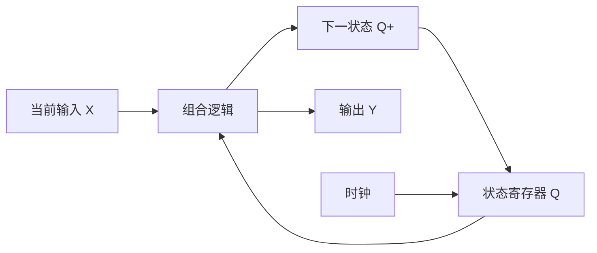

# 数字电子技术基础：原理与考纲对照

> **提高阶段选读。** 本册不是入门材料。请先学习 [基础讲义—从零到综合](基础讲义-从零到综合.md)，完成每课前三题，再按需要选读本册。

> 依据：用户提供的深圳大学生物医学工程专业《数字电子技术基础》75 分考纲。未将该文本认定为已核实的最新官方考纲。编写日期：2026-09-25。
>
> 定位：理解型参考资料与提高训练。覆盖考纲，挑战题以原创推导、反例辨析和综合设计为主；难度为本资料内部评级，不代表深圳大学真题难度或命题频率。

## 使用方式与难度

完成基础讲义后，本册用于按模块查阅和深化；再按需要选做《02-分级挑战题》，最后对照《03-解析与评分》。不把高难挑战题作为第一轮起点。

| 等级 | 含义 | 作答要求 |
|---|---|---|
| ★★☆☆☆ L2 | 基础理解 | 说明概念，完成单一模型计算 |
| ★★★☆☆ L3 | 迁移应用 | 在不同表示、器件或题目条件之间转换 |
| ★★★★☆ L4 | 深入理解 | 推导结果，检查边界，并辨析错误方案 |
| ★★★★★ L5 | 综合挑战 | 跨模块设计、构造反例、证明性质或处理时序约束 |

本套 24 题：L3 共 4 题，L4 共 13 题，L5 共 7 题。预计每题 15–45 分钟，时间只作学习安排参考。

## 符号约定

- $+$ 表示逻辑或，连写或 $\cdot$ 表示逻辑与，$\overline A$ 表示非，$\oplus$ 表示异或。电压及普通数值公式中的加号为算术加法。
- $Q$ 是当前状态，$Q^+$ 是下一状态。默认所有同步触发器使用同一上升沿，所有数据输入满足时序要求；另有说明时按题设。
- 二进制字最左侧为最高位。$m_i$ 是序号为 $i$ 的最小项，编号以题目指定变量顺序为准。
- `X` 作为无关项时表示设计自由；作为未知状态时表示暂时不能确定。两种含义不能混用。
- 本资料讨论的未用状态、无关输入组合是否可忽略，必须以题目对运行条件和恢复能力的要求为依据。

## 1. 逻辑代数：从表达式到行为

**考纲覆盖：** 基本定律、运算规律、各种表达形式、代数化简、卡诺图化简。对应 Q01–Q03。

### 1.1 先掌握什么

二进制位权、二/十/十六进制转换、8421 BCD 码；与、或、非、与非、或非、异或、同或；真值表和门电路图。

二进制数 `1010` 表示十进制 10，但 `1010` 不是一个有效的 8421 BCD 数字。数值相同不等于编码规则相同。

### 1.2 基本定律要会使用，也要会证明

$$
A+AB=A,\qquad A(A+B)=A
$$
$$
A+\overline AB=A+B,\qquad A+BC=(A+B)(A+C)
$$
$$
\overline{AB}=\overline A+\overline B,\qquad
\overline{A+B}=\overline A\,\overline B
$$

例如 $A+\overline AB=(A+\overline A)(A+B)=A+B$。消去项的依据是逻辑恒等式，不能照搬普通代数中的减法、约分。

**共识定理：**

$$AB+\overline AC+BC=AB+\overline AC.$$

$BC$ 对稳态函数是冗余项，但在特定门电路中可能用于消除冒险。判断“多余”必须先明确评价目标。

### 1.3 四种表达方式

文字要求 → 真值表 → 逻辑表达式 → 逻辑电路图。

最小项包含全部变量，只对应真值表的一行。$F=\Sigma m(\cdots)$ 列出输出为 1 的行；最大项之积 $F=\Pi M(\cdots)$ 列出输出为 0 的行。

例：变量次序为 $ABC$ 时，$m_5=A\overline BC$，$M_5=\overline A+B+\overline C$。前者在 `101` 为 1，后者在 `101` 为 0。

### 1.4 卡诺图为什么能化简

相邻格仅有一位不同，因此 $ABC+AB\overline C=AB$。每合并一个完整的二倍区域，就消去一个变化的变量。

- 采用格雷码排列，例如 `00、01、11、10`；图的上下、左右边界可相邻，斜对角不相邻。
- 圈中格数为 $1,2,4,8,\ldots$；必须是可对应一个乘积项的矩形区域。
- 圈可重叠；覆盖全部必需的 1，不能覆盖规定的 0；无关项可用可不用。
- 对两级与或式，通常先减少乘积项数，再减少文字数；这不保证实际芯片数量、延迟或功耗都最小。

**理解检验：** 两个化简式若只在无关输入处不同，可以同时满足原题；若以后要求这些输入必须输出 0，原来的化简可能失效。

## 2. 组合逻辑：分析、设计与模块实现

**考纲覆盖：** 组合逻辑定义、分析和设计、竞争冒险、编码器、译码器、选择器、分配器、加法器、比较器及 MSI 应用。对应 Q02、Q04–Q06、Q24。

### 2.1 组合电路的定义有时间尺度

在输入稳定并经过传播延迟后，输出仅由当前输入决定；没有用于保存历史的逻辑状态。定义不意味着输入改变后输出立即正确。

分析顺序：标记中间节点 → 写各门表达式 → 化简 → 列真值表或分类 → 说明功能。

设计顺序：定义输入输出及有效电平 → 明确合法输入 → 列真值表 → 化简 → 选器件 → 检查动态行为。

### 2.2 冒险的边界

输入信号经不同路径到达输出，延迟不同，可能出现不符合期望的短脉冲。

- **静态 1 冒险：** 理论上应保持 1，却短暂变 0。
- **静态 0 冒险：** 理论上应保持 0，却短暂变 1。
- **动态冒险：** 理论上只应翻转一次，却发生多次翻转。

在两级与或实现、单输入变化等假设下，给相邻的 1 增加共同覆盖项可消除相应静态 1 冒险。多输入同时变化、多级逻辑和异步反馈，需要另作分析。

例如 $F=\overline AB+AC$，当 $B=C=1$、$A$ 翻转时，两个乘积项可能短暂同时为 0。加上 $BC$ 可在这次转换中保持输出为 1。

**错误推断：** “真值表完全正确，所以电路没有毛刺。”真值表给出稳态结果，没有记录传播延迟。

### 2.3 读懂 MSI 模块，比背引脚更重要

MSI 指中规模集成。对每个模块都检查：使能条件、有效电平、数据方向、输出形式和级联条件。

| 模块 | 核心原理 | 必须辨析 |
|---|---|---|
| 普通编码器 | 在限定输入模式下把输入位置编码 | 通常需要独热等输入约束 |
| 优先编码器 | 多输入有效时选优先级最高者 | 编码为 0 不一定代表“无输入”，常需有效标志 |
| 译码器 | 把地址转换为某一路有效输出 | 输出可能低有效，不能直接照抄“最小项求或”接法 |
| 数据选择器 MUX | 从多路数据中选一路 | 选择端固定后，求函数关于剩余变量的余因子 |
| 数据分配器 DEMUX | 把一路数据送往选定通道 | 数据输入、地址输入、使能输入职责不同 |
| 全加器 | $S=A\oplus B\oplus C_{in}$；$C_{out}=AB+AC_{in}+BC_{in}$ | 和位与进位不能混淆 |
| 数值比较器 | 从最高不同位决定大小 | 无符号比较与有符号比较规则不同 |

香农展开：$F=\overline SF|_{S=0}+SF|_{S=1}$。这是使用选择器实现逻辑函数的依据。

无符号多位比较可逐级写为：$G_i=A_i\overline B_i+E_iG_{i-1}$，其中 $E_i=\overline{A_i\oplus B_i}$，最低级以前 $G_{-1}=0$。高位相等时，才需要低位比较结果。

**BCD 修正：** 两个有效十进制数字加进位后，若四位和大于 9 或已有二进制进位，则低四位加 `0110`。修正原因是每个十进制数字只使用 16 个四位码中的 10 个。

## 3. 输入输出特性：逻辑正确还不够

**考纲覆盖：** 数字集成电路输入输出特性。对应 Q07–Q09；Q08 的定量时序预算是深化训练。

### 3.1 电平兼容与噪声容限

$V_{OH(min)}$ 是驱动器保证的最小高电平输出，$V_{OL(max)}$ 是最大低电平输出；$V_{IH(min)}$、$V_{IL(max)}$ 是接收器保证识别高、低电平的输入界限。

$$NM_H=V_{OH(min)}-V_{IH(min)}$$
$$NM_L=V_{IL(max)}-V_{OL(max)}$$

若容限为负，不能保证兼容；不是说每一块样片都必然失败。上述保证以指定电源、负载和温度条件为前提。

### 3.2 扇出与输出结构

忽略交流负载且各输入相同时，直流扇出上限为：

$$N\le\min\left(\frac{|I_{OH(max)}|}{I_{IH(max)}},\frac{I_{OL(max)}}{|I_{IL(max)}|}\right).$$

结果向下取整。CMOS 输入静态电流小，仍会因输入电容、布线电容和切换速度限制负载数量。

- 推挽输出能主动拉高和拉低，不应把两个可能输出相反电平的推挽端直接并联。
- 开漏/开集电极输出需要合适上拉；任一路拉低，总线为低。
- 三态输出的高阻态 Z 表示不主动驱动，不是逻辑 0，也不是逻辑 1。

电平、负载、三态与时序参数的定义可核对 [TI 标准逻辑数据手册解读](https://www.ti.com/lit/an/szza036c/szza036c.pdf)；总线争用和电容负载问题见 [TI Designing With Logic](https://www.ti.com/lit/an/sdya009c/sdya009c.pdf)。

### 3.3 建立与保持：两种不同约束

在同相同时钟、忽略偏斜和抖动的简化寄存器到寄存器路径中：

$$T\ge t_{CQ(max)}+t_{comb(max)}+t_{setup}$$
$$t_{CQ(min)}+t_{comb(min)}\ge t_{hold}.$$

第一式约束新数据赶得上下一次采样；第二式约束新数据不能过早破坏本次采样。降低频率通常能改善建立时间，却不能直接修复保持时间违例。

若接收端时钟比发送端晚到 $s$，则：

$$T\ge t_{CQ(max)}+t_{comb(max)}+t_{setup}-s$$
$$t_{CQ(min)}+t_{comb(min)}\ge t_{hold}+s.$$

正偏斜有利于建立约束，不利于保持约束。

## 4. 触发器：先分清“何时变化”和“怎样变化”

**考纲覆盖：** 电路结构与动作特点、基本类型、状态描述、触发器转换及简单应用。对应 Q10–Q12。

### 4.1 结构与动作特点

交叉反馈可以保存状态。基本 SR 锁存器可由交叉耦合 NOR 或 NAND 门构成：NOR 型输入高有效，NAND 型输入低有效，其禁止输入组合不同。

门控锁存器在使能有效期间透明；边沿触发器在指定边沿采样。主从结构利用两级相反相位的锁存实现隔离，但分析具体主从器件时仍应依据其动作规定，不能把所有主从结构一概等同于理想边沿采样。

### 4.2 特性方程与激励表

| 类型 | 特性方程/动作 | 关键条件 |
|---|---|---|
| D | $Q^+=D$ | 在有效边沿采样 |
| JK | $Q^+=J\overline Q+\overline KQ$ | 00 保持，01 清零，10 置一，11 翻转 |
| T | $Q^+=T\oplus Q$ | T=0 保持，T=1 翻转 |
| 高有效 SR | $Q^+=S+\overline RQ$ | 仅用于满足 $SR=0$ 的合法输入 |

| $Q\to Q^+$ | D | T | J | K |
|---|---:|---:|---:|---:|
| 0→0 | 0 | 0 | 0 | X |
| 0→1 | 1 | 1 | 1 | X |
| 1→0 | 0 | 1 | X | 1 |
| 1→1 | 1 | 0 | X | 0 |

**特性方程**解决“给定输入，下一状态是什么”；**激励表**解决“为了指定的状态变化，需要什么输入”。

例如用 JK 实现 T 功能，可令 $J=K=T$。转换题应代入特性方程验证全部输入与当前状态，不能只检查某一种状态。

### 4.3 异步控制端

异步清零有效时，不等时钟边沿即可清零。释放清零后不代表立即采样 D。释放接近时钟边沿时还需满足恢复/移除时间；条件不满足时，不能用理想逻辑模型承诺确定结果。

触发器的实用功能包括分频、状态保存、移位和同步设计中的存储。直接令理想边沿 JK 的 $J=K=1$ 可实现二分频，但仍需正确初始化和满足器件时序条件。

## 5. 时序逻辑：状态是对历史的压缩

**考纲覆盖：** 定义、描述与分析工具、状态化简、同步设计和异步设计。对应 Q12–Q16。

### 5.1 分清三个表达式

驱动方程：触发器输入怎样由当前状态和外部输入产生。

状态方程：$Q^+=f(Q,X)$。

输出方程：Moore 型 $Y=g(Q)$；Mealy 型 $Y=g(Q,X)$。

状态图的每条边必须说明触发条件；Mealy 图常标 `输入/输出`，Moore 图通常把输出写在状态内。

### 5.2 同步分析与设计

分析：检查时钟和复位 → 写驱动方程 → 代入特性方程 → 枚举全部状态 → 作状态表/图 → 解释功能和异常状态。

设计：把题意转为状态含义 → 状态转移 → 等价状态化简 → 编码 → 选择触发器 → 求驱动方程 → 检查未用状态、输出和时序。

所谓“状态等价”，不是当前输出相同，而是在任意未来输入序列下都不可由输出区分。Moore 状态可先按输出分组，再反复按后继所属分组细分。

### 5.3 自启动必须检查所有状态

三位寄存器有 8 个编码；设计模 5 电路只使用 5 个，其余 3 个仍可能因上电或干扰出现。如果题目要求任意状态恢复，应定义这 3 个状态的转移，不能当无关项随意化简。

“上电复位后能运行”和“从任意状态都能恢复”不是相同性质。

### 5.4 异步设计的范围

异步时序电路没有统一时钟保证所有状态同时更新。脉动计数器是一个常见例子，更一般的异步控制器还涉及稳定状态、流表、反馈、竞争与冒险。

入门采用**基本模式假设**：一次只改变一个外部输入，并等待电路稳定后再改变下一输入。即使输入只有一位变化，内部若需要多位状态同时变化，也可能因延迟产生竞争。

格雷编码可减少某些状态转换中多位变化的风险，但不能单独保证整个异步电路无冒险。Q16 只要求受约束协议下的设计，不扩大到任意速度的异步系统综合。

## 6. 计数器、寄存器与 MSI 时序模块

**考纲覆盖：** 计数器、寄存器、移位寄存器型计数器及模块应用。对应 Q17–Q20。

### 6.1 计数不是只会画正常循环

模数是正常循环中的不同计数状态数。$n$ 个触发器至多有 $2^n$ 个编码，正常循环可以只使用其中一部分。

- 同步清零：检测终止状态，等下一有效边沿归零。
- 异步清零：进入检测状态后立即触发归零，检测状态可能只短暂出现。
- 同步置数：在有效边沿装入预置数据；从 $P$ 连续计到 $2^n-1$ 再装入 $P$，模数为 $2^n-P$。
- 实际反馈清零必须满足脉宽和恢复等要求，不能仅凭理想状态表保证硬件可靠。

SN74HC163 的清零为同步，SN74HC161 的清零为异步；两者都是同步计数器，“同步计数”不能用于推断其清零方式。参见 [TI HC163](https://www.ti.com/product/SN74HC163) 与 [TI HC161](https://www.ti.com/product/SN74HC161)。

### 6.2 级联与寄存器

同步级联采用公共时钟，用低位的终端计数条件控制高位使能。把低位输出直接当高位时钟，会改变时钟结构，不能再按公共时钟同步模型分析。

普通寄存器保存多位数据；移位寄存器在有效边沿把旧状态依次传向相邻级。若兼有保持、移位和并行装入，必须先规定控制优先级。例如“清零优先于装入，装入优先于移位，最后保持”，再用各级输入选择逻辑实现。

### 6.3 环形与扭环形

- $n$ 位独热环形计数器的预期循环长为 $n$，但全零会锁死，其他多 1 状态也可能构成别的循环。
- $n$ 位 Johnson 扭环形计数器从规定初态可得到 $2n$ 个状态；不能据此说全部 $2^n$ 个状态都进入这一个循环。
- 验证方法是枚举状态图，寻找所有闭合循环，而非只从 0 开始观察。

## 7. D/A 与 A/D：先约定映射，再套公式

**考纲覆盖：** 基本原理、典型电路、分辨率、精度等主要指标。对应 Q21–Q24。

### 7.1 D/A 的权重与结构

D/A 将数字码转换为模拟量。对本资料采用的理想单极性二进制比例模型：

$$V_o=V_{ref}\frac{D}{2^n},\quad D=0,\ldots,2^n-1.$$

$$\Delta=\frac{V_{ref}}{2^n},\qquad V_{o,max}=V_{ref}-\Delta.$$

最高位贡献 $V_{ref}/2$，其后依次减半。反相运放输出可能带负号和电阻比增益，必须按实际拓扑写公式。

二进制权电阻网络以不同电阻产生不同权重，位数增加时电阻比例范围增大；R–2R 梯形网络用两种阻值形成逐级二进制权重，但仍依赖电阻比例精度及具体开关、输出电路。原理参考 [Analog Devices MT-015](https://www.analog.com/media/en/training-seminars/tutorials/MT-015.pdf)。

如果题目给的是“最大码对应的输出 $V_{o,max}$”，则步长可写为 $V_{o,max}/(2^n-1)$。这是已知量不同，不能把两个分母机械互换。

### 7.2 A/D 的典型结构

A/D 通常涉及采样、保持、量化、编码。量化把连续幅值划分为有限区间；编码给区间编号。量化误差和电路误差要分开。

| 结构 | 核心机制 | 分析重点 |
|---|---|---|
| 并行比较型 Flash | 同时与多个阈值比较，再编码 | 理想基本 $n$ 位结构需 $2^n-1$ 个比较器，硬件规模增长快 |
| 逐次逼近型 SAR | 从最高位开始试码，用 DAC 和比较器作二分搜索 | 基本逐位结构需 $n$ 次判决，另考虑采样及控制开销 |
| 计数比较型 | 计数器逐码增加，DAC 输出与输入比较 | 转换时间随输入码变化，基本最坏情况接近 $2^n$ 个计数周期 |
| 双积分型 | 固定时间积分输入，再用反向参考积分回零 | 理想条件下 $T_2=(V_{in}/V_{ref})T_1$；比例测量可抵消共用积分器的 RC 因子 |

### 7.3 分辨率与精度

在总输入跨度为 FSR 的均匀量化模型中，名义步长 $\Delta=FSR/2^n$。位数多意味着名义刻度细，不保证总误差小。失调、增益、参考源、非线性、噪声等均可能影响准确度。ADC 步宽与理想 LSB 的区别可参阅 [ADI 的 INL/DNL 说明](https://www.analog.com/en/resources/technical-articles/inldnl-measurements-for-types-of-highspeed-adcs.html)；本资料不要求展开高阶动态指标。

若用区间中心重建，在限定量程内有 $|e_q|\le\Delta/2$；若向下取码并以区间下界重建，误差为 $-\Delta<e_q\le0$（误差定义为重建值减输入值）。

**所以“ADC 误差恒为半个 LSB”缺少前提。** 必须说明转换阈值、重建规则、端点和是否包含非理想误差。

## 8. 学习路线与验收

| 顺序 | 阅读和题目 | 达标标准 |
|---|---|---|
| 1 | 第 1 章；Q01、Q03 | 会用真值表复核化简，能解释无关项 |
| 2 | 第 2 章；Q02、Q04–Q06 | 能从题意设计，能辨析动态毛刺 |
| 3 | 第 3 章；Q07–Q09 | 能分别判断电平、电流和时间约束 |
| 4 | 第 4 章；Q10–Q12 | 能使用特性方程与激励表，区分锁存和边沿采样 |
| 5 | 第 5 章；Q13–Q16 | 能建立状态、证明等价或不等价、检查恢复能力 |
| 6 | 第 6 章；Q17–Q20 | 能解释计数差一、同步级联和非法循环 |
| 7 | 第 7 章；Q21–Q23，最后 Q24 | 能定义转换模型，并把逻辑、时序与模拟量联系起来 |

第一轮不必强求一次做对 L5。每题留下三行复盘：我采用的模型；关键条件；条件改变后哪里会失效。能复现推导再算掌握，认得答案不算。
