# 全书习题合订本

[全书目录](00-全书习题总目录.md) · [正文引用索引](正文引用索引.md) · [完整性核查](完整性核查.md)

本卷以原页影像保存题面；492道编号题，无答案。OCR检索稿见各章入口。

---

# 第1章 绪论

[全书目录](00-全书习题总目录.md) · [完整性核查](完整性核查.md)

本版第1章没有章末习题，题数为0；没有补写或借用其他版本的题目。

目录（PDF第11页）显示第1章以“小结、参考文献和延伸读物”结束，第2章从书页23开始。书页22（PDF第37页）也未列习题。

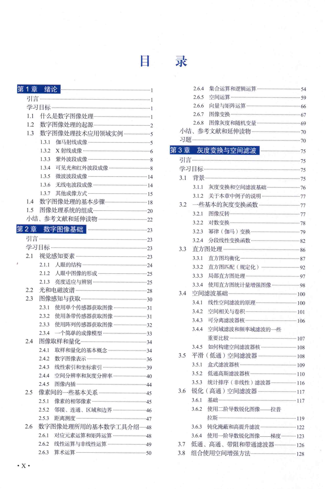

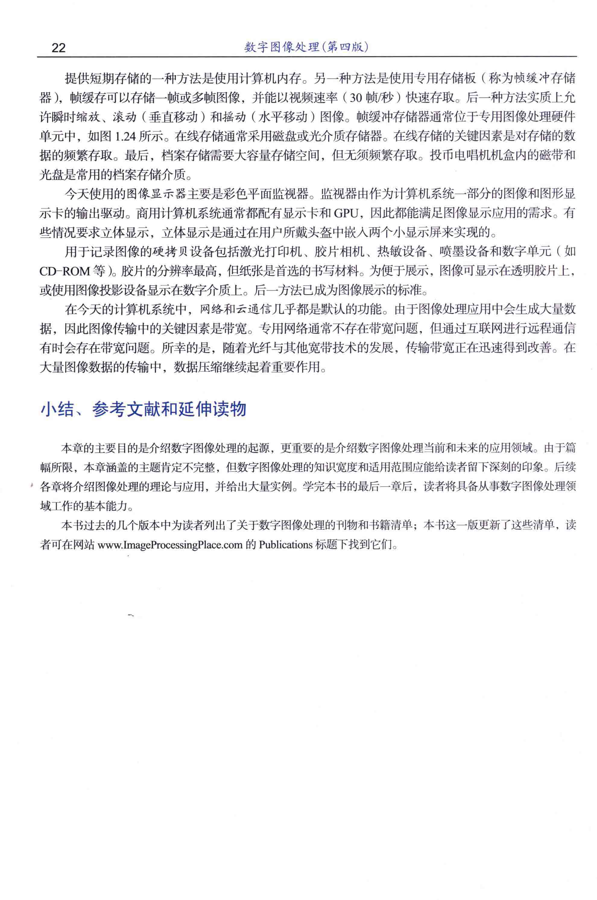

---

# 第2章 数字图像基础

41道编号题；书页70–74；源PDF第85–89页。

**原页是正式题面。** 题号、星号、子问、公式、表格和配图均保留在原图中，不提供解答。整页保留可避免跨题排版的插图被截断。

[OCR检索稿（待逐字复核）](OCR检索稿/第02章-数字图像基础.md) · [本章正文引用](正文引用索引.md#第2章)

[全书目录](00-全书习题总目录.md) · [完整性核查](完整性核查.md)

| 原书页 | 源PDF页 | 本页起始题号范围 | 页首先续上页 |
|---|---|---|---|
| [70](#书页70) | 85 | 2.1–2.6 | 无 |
| [71](#书页71) | 86 | 2.7–2.18 | 2.6 |
| [72](#书页72) | 87 | 2.19–2.32 | 2.18 |
| [73](#书页73) | 88 | 2.33–2.39 | 2.32 |
| [74](#书页74) | 89 | 2.40–2.41 | 2.39 |

## 题号索引

[2.1](#书页70)　[2.2](#书页70)　[2.3](#书页70)　[2.4](#书页70)　[2.5](#书页70)　[2.6](#书页70)（跨页）　

[2.7](#书页71)　[2.8](#书页71)　[2.9](#书页71)　[2.10](#书页71)　[2.11](#书页71)　[2.12](#书页71)　[2.13](#书页71)　[2.14](#书页71)　[2.15](#书页71)　[2.16](#书页71)　[2.17](#书页71)　[2.18](#书页71)（跨页）　

[2.19](#书页72)　[2.20](#书页72)　[2.21](#书页72)　[2.22](#书页72)　[2.23](#书页72)　[2.24](#书页72)　[2.25](#书页72)　[2.26](#书页72)　[2.27](#书页72)　[2.28](#书页72)　[2.29](#书页72)　[2.30](#书页72)　[2.31](#书页72)　[2.32](#书页72)（跨页）　

[2.33](#书页73)　[2.34](#书页73)　[2.35](#书页73)　[2.36](#书页73)　[2.37](#书页73)　[2.38](#书页73)　[2.39](#书页73)（跨页）　

[2.40](#书页74)　[2.41](#书页74)　

## 书页70

源PDF第85页。

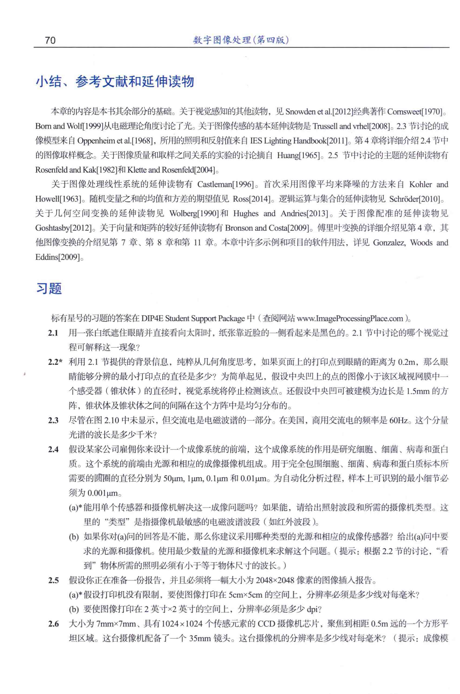

## 书页71

源PDF第86页。页首续题2.6。

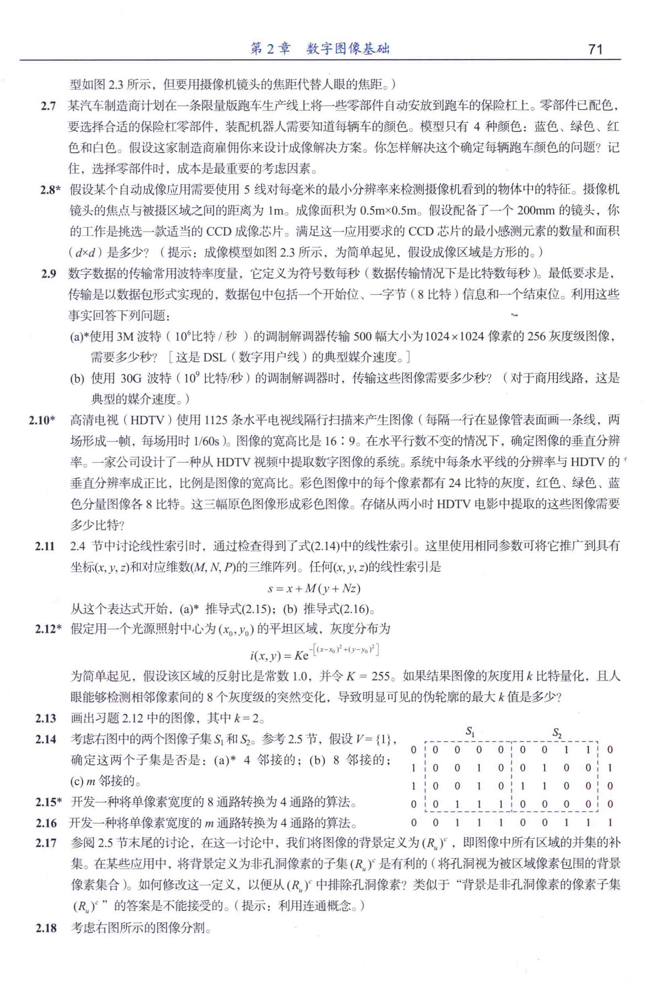

## 书页72

源PDF第87页。页首续题2.18。

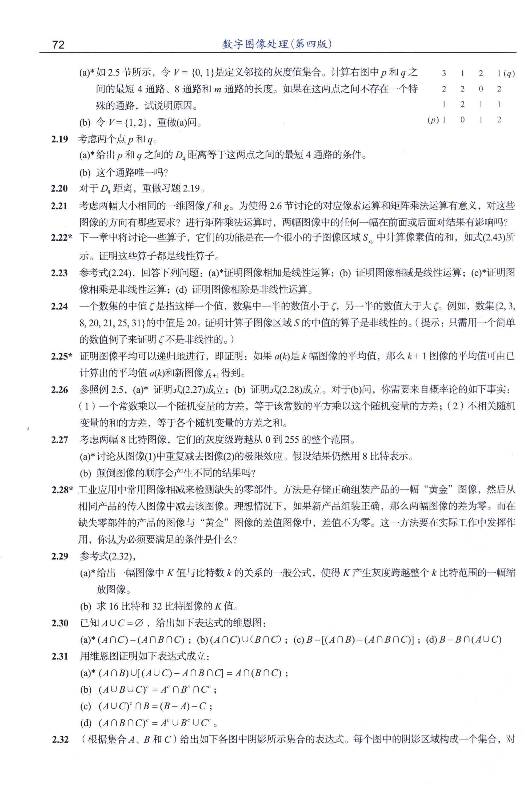

## 书页73

源PDF第88页。页首续题2.32。

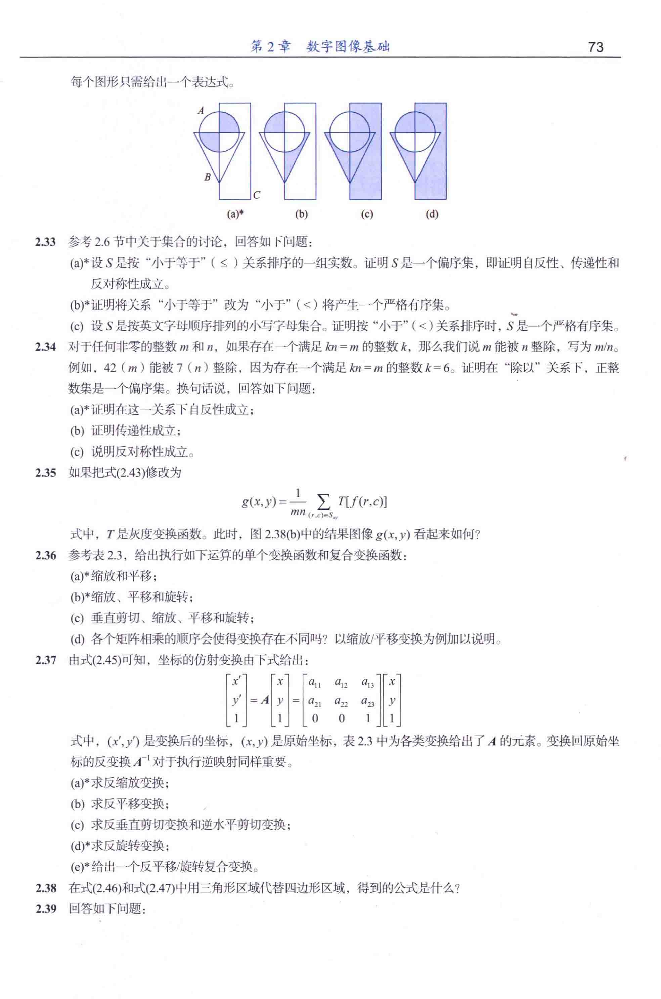

## 书页74

源PDF第89页。页首续题2.39。

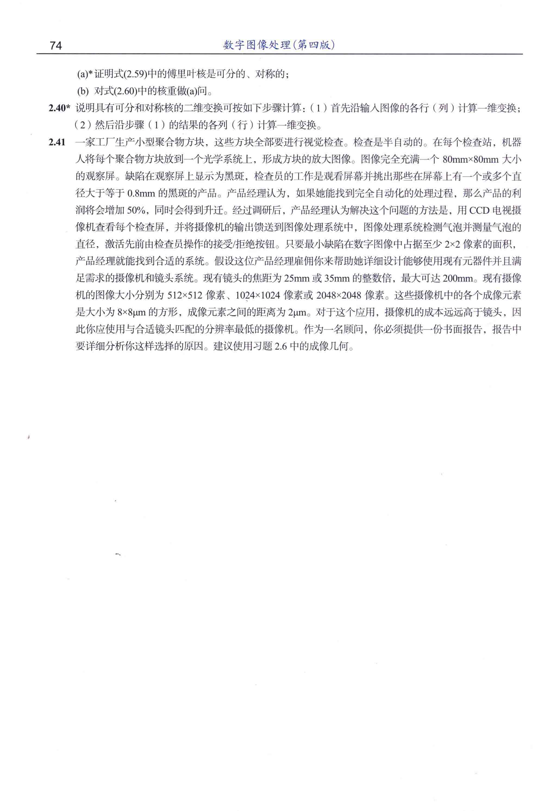

---

# 第3章 灰度变换与空间滤波

47道编号题；书页132–136；源PDF第147–151页。

**原页是正式题面。** 题号、星号、子问、公式、表格和配图均保留在原图中，不提供解答。整页保留可避免跨题排版的插图被截断。

[OCR检索稿（待逐字复核）](OCR检索稿/第03章-灰度变换与空间滤波.md) · [本章正文引用](正文引用索引.md#第3章)

[全书目录](00-全书习题总目录.md) · [完整性核查](完整性核查.md)

| 原书页 | 源PDF页 | 本页起始题号范围 | 页首先续上页 |
|---|---|---|---|
| [132](#书页132) | 147 | 3.1–3.11 | 无 |
| [133](#书页133) | 148 | 3.12–3.21 | 3.11 |
| [134](#书页134) | 149 | 3.22–3.33 | 3.21 |
| [135](#书页135) | 150 | 3.34–3.44 | 3.33 |
| [136](#书页136) | 151 | 3.45–3.47 | 3.44 |

## 题号索引

[3.1](#书页132)　[3.2](#书页132)　[3.3](#书页132)　[3.4](#书页132)　[3.5](#书页132)　[3.6](#书页132)　[3.7](#书页132)　[3.8](#书页132)　[3.9](#书页132)　[3.10](#书页132)　[3.11](#书页132)（跨页）　

[3.12](#书页133)　[3.13](#书页133)　[3.14](#书页133)　[3.15](#书页133)　[3.16](#书页133)　[3.17](#书页133)　[3.18](#书页133)　[3.19](#书页133)　[3.20](#书页133)　[3.21](#书页133)（跨页）　

[3.22](#书页134)　[3.23](#书页134)　[3.24](#书页134)　[3.25](#书页134)　[3.26](#书页134)　[3.27](#书页134)　[3.28](#书页134)　[3.29](#书页134)　[3.30](#书页134)　[3.31](#书页134)　[3.32](#书页134)　[3.33](#书页134)（跨页）　

[3.34](#书页135)　[3.35](#书页135)　[3.36](#书页135)　[3.37](#书页135)　[3.38](#书页135)　[3.39](#书页135)　[3.40](#书页135)　[3.41](#书页135)　[3.42](#书页135)　[3.43](#书页135)　[3.44](#书页135)（跨页）　

[3.45](#书页136)　[3.46](#书页136)　[3.47](#书页136)　

## 书页132

源PDF第147页。

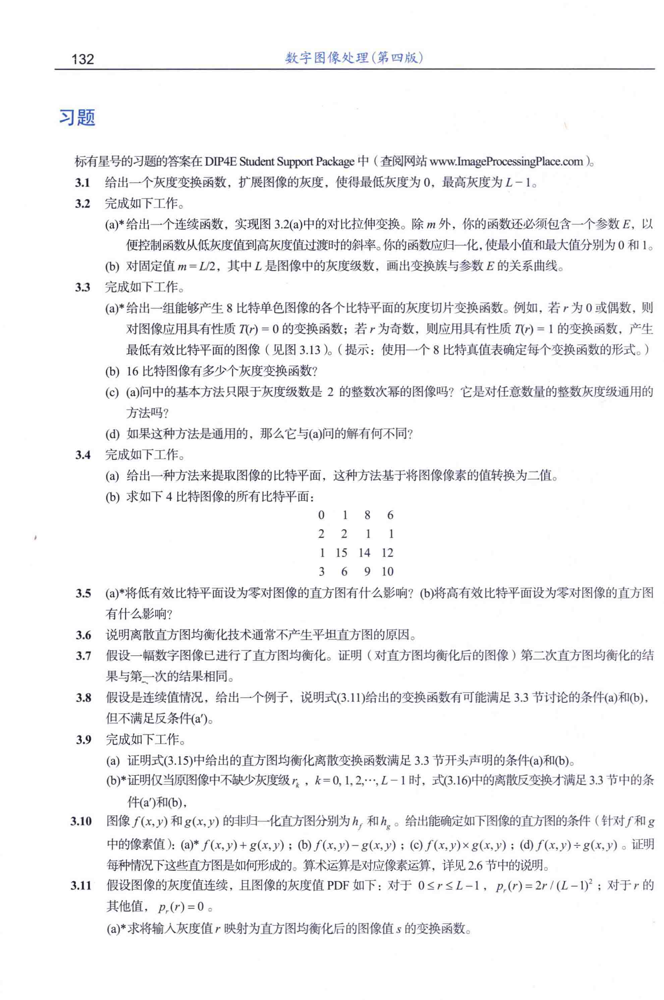

## 书页133

源PDF第148页。页首续题3.11。

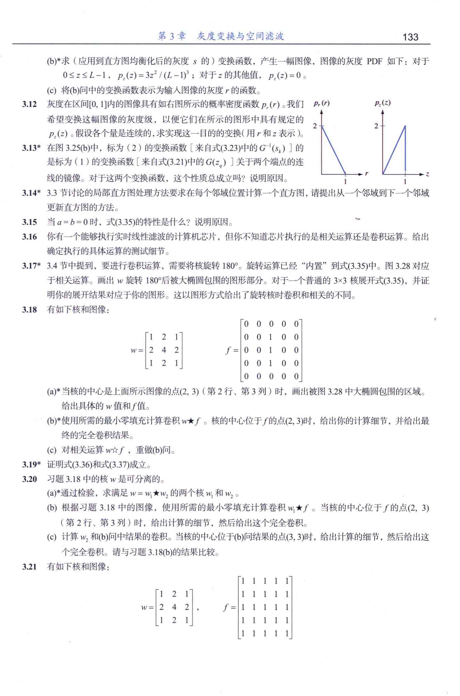

## 书页134

源PDF第149页。页首续题3.21。

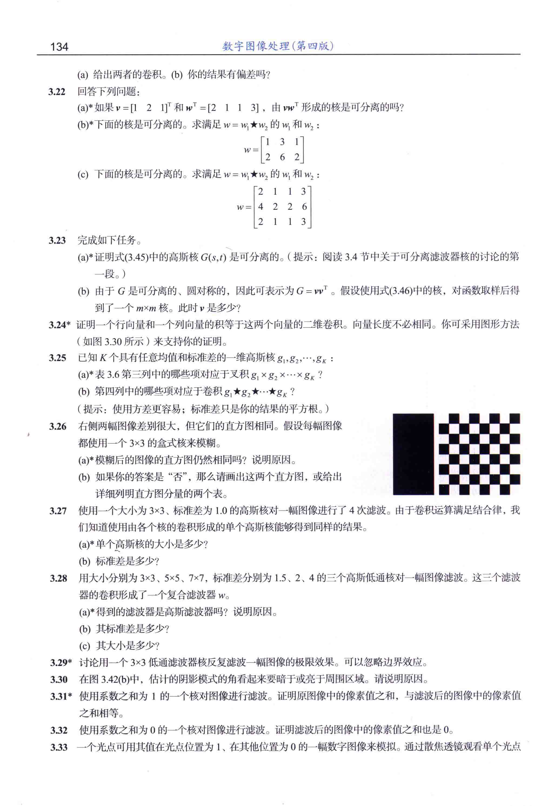

## 书页135

源PDF第150页。页首续题3.33。

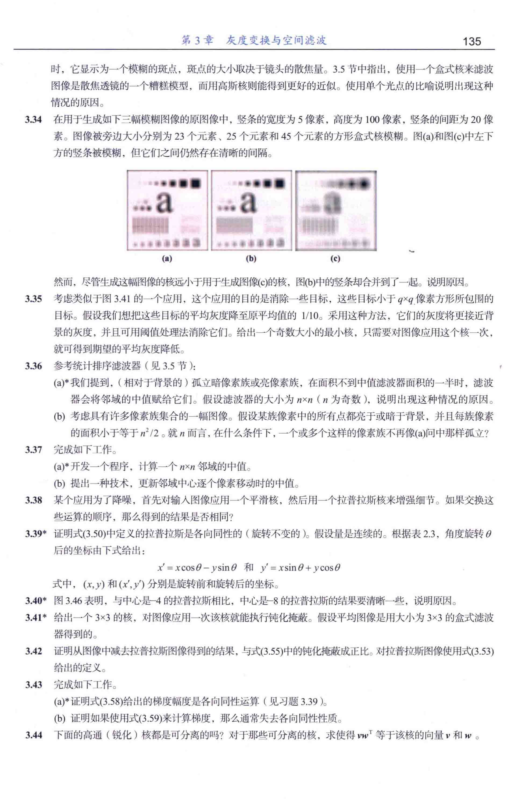

## 书页136

源PDF第151页。页首续题3.44。

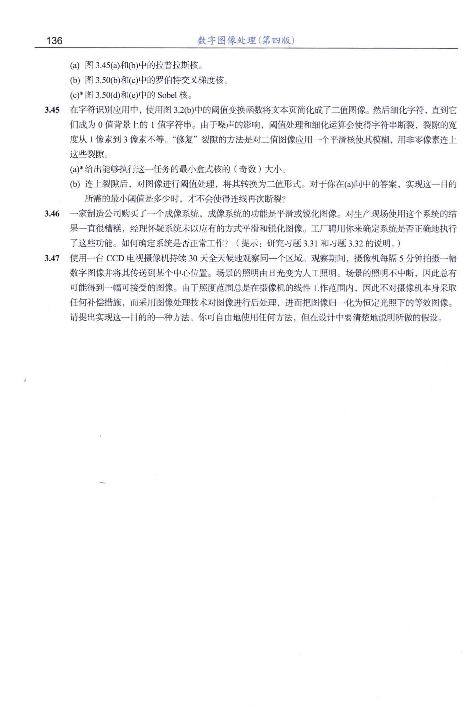

---

# 第4章 频率域滤波

64道编号题；书页213–218；源PDF第228–233页。

**原页是正式题面。** 题号、星号、子问、公式、表格和配图均保留在原图中，不提供解答。整页保留可避免跨题排版的插图被截断。

[OCR检索稿（待逐字复核）](OCR检索稿/第04章-频率域滤波.md) · [本章正文引用](正文引用索引.md#第4章)

[全书目录](00-全书习题总目录.md) · [完整性核查](完整性核查.md)

| 原书页 | 源PDF页 | 本页起始题号范围 | 页首先续上页 |
|---|---|---|---|
| [213](#书页213) | 228 | 4.1–4.14 | 无 |
| [214](#书页214) | 229 | 4.15–4.26 | 无 |
| [215](#书页215) | 230 | 4.27–4.36 | 4.26 |
| [216](#书页216) | 231 | 4.37–4.47 | 4.36 |
| [217](#书页217) | 232 | 4.48–4.57 | 4.47 |
| [218](#书页218) | 233 | 4.58–4.64 | 4.57 |

## 题号索引

[4.1](#书页213)　[4.2](#书页213)　[4.3](#书页213)　[4.4](#书页213)　[4.5](#书页213)　[4.6](#书页213)　[4.7](#书页213)　[4.8](#书页213)　[4.9](#书页213)　[4.10](#书页213)　[4.11](#书页213)　[4.12](#书页213)　[4.13](#书页213)　[4.14](#书页213)　

[4.15](#书页214)　[4.16](#书页214)　[4.17](#书页214)　[4.18](#书页214)　[4.19](#书页214)　[4.20](#书页214)　[4.21](#书页214)　[4.22](#书页214)　[4.23](#书页214)　[4.24](#书页214)　[4.25](#书页214)　[4.26](#书页214)（跨页）　

[4.27](#书页215)　[4.28](#书页215)　[4.29](#书页215)　[4.30](#书页215)　[4.31](#书页215)　[4.32](#书页215)　[4.33](#书页215)　[4.34](#书页215)　[4.35](#书页215)　[4.36](#书页215)（跨页）　

[4.37](#书页216)　[4.38](#书页216)　[4.39](#书页216)　[4.40](#书页216)　[4.41](#书页216)　[4.42](#书页216)　[4.43](#书页216)　[4.44](#书页216)　[4.45](#书页216)　[4.46](#书页216)　[4.47](#书页216)（跨页）　

[4.48](#书页217)　[4.49](#书页217)　[4.50](#书页217)　[4.51](#书页217)　[4.52](#书页217)　[4.53](#书页217)　[4.54](#书页217)　[4.55](#书页217)　[4.56](#书页217)　[4.57](#书页217)（跨页）　

[4.58](#书页218)　[4.59](#书页218)　[4.60](#书页218)　[4.61](#书页218)　[4.62](#书页218)　[4.63](#书页218)　[4.64](#书页218)　

## 书页213

源PDF第228页。

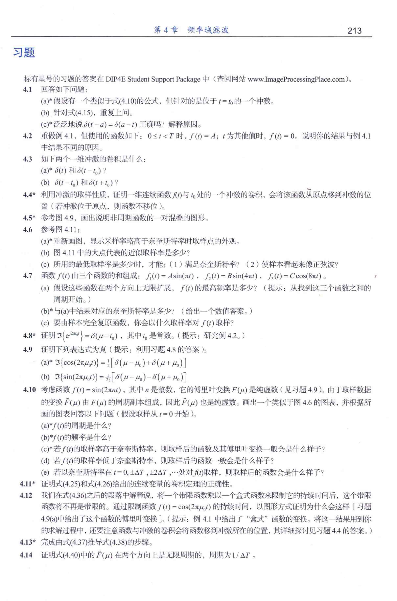

## 书页214

源PDF第229页。

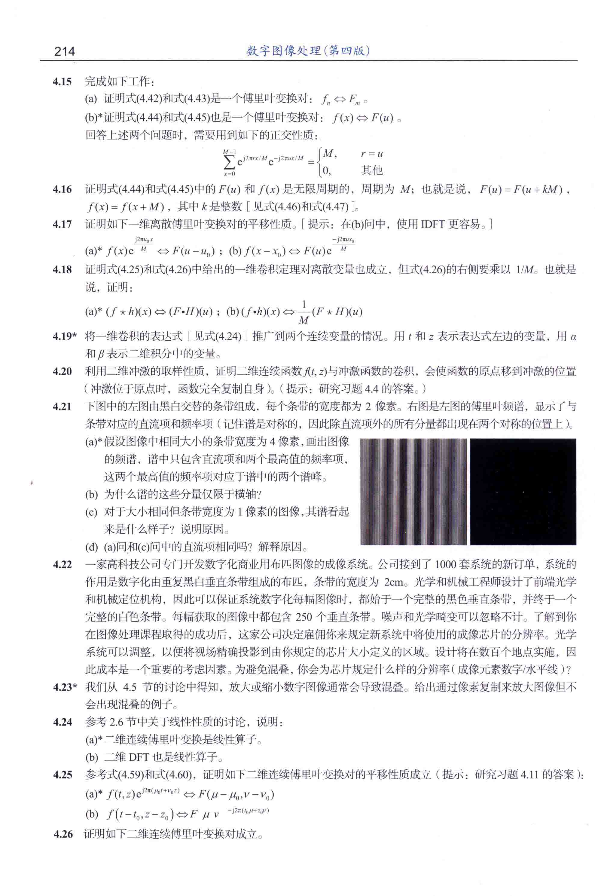

## 书页215

源PDF第230页。页首续题4.26。

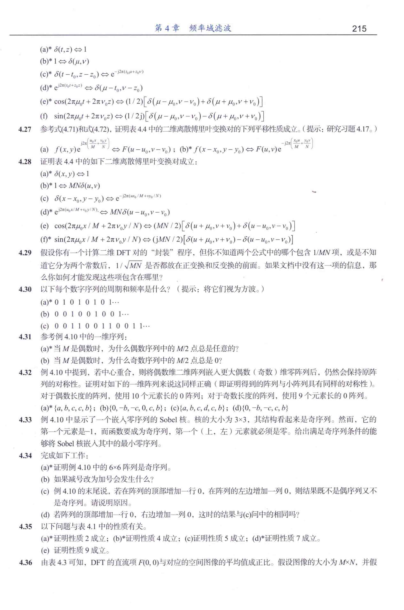

## 书页216

源PDF第231页。页首续题4.36。

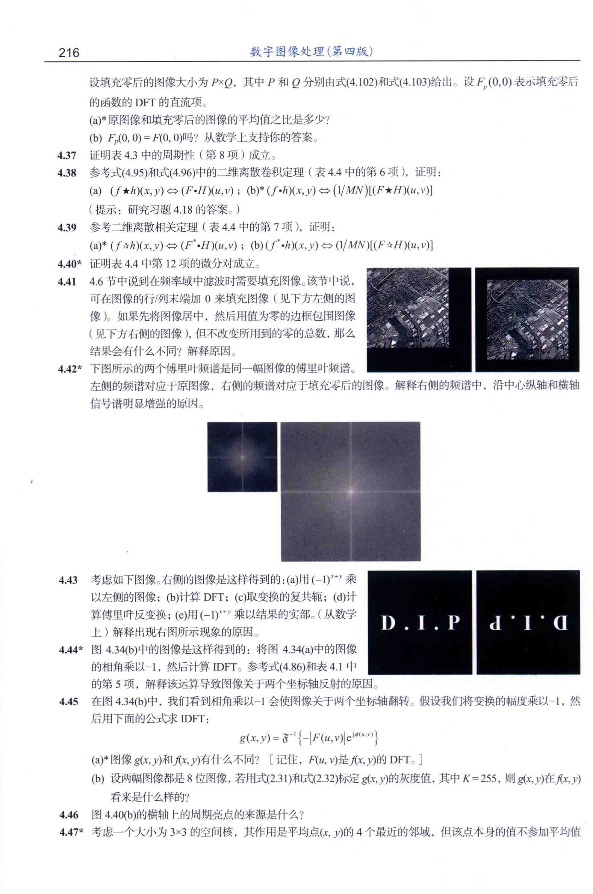

## 书页217

源PDF第232页。页首续题4.47。

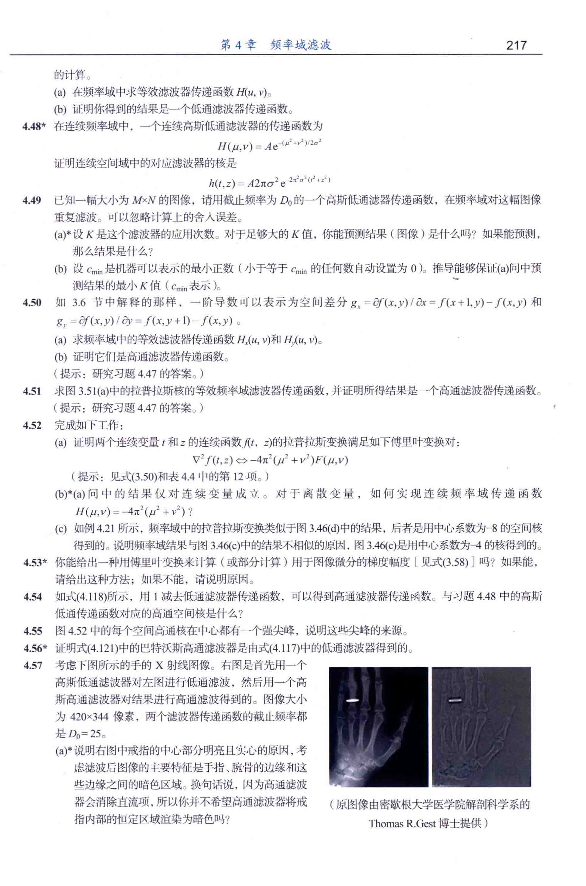

## 书页218

源PDF第233页。页首续题4.57。

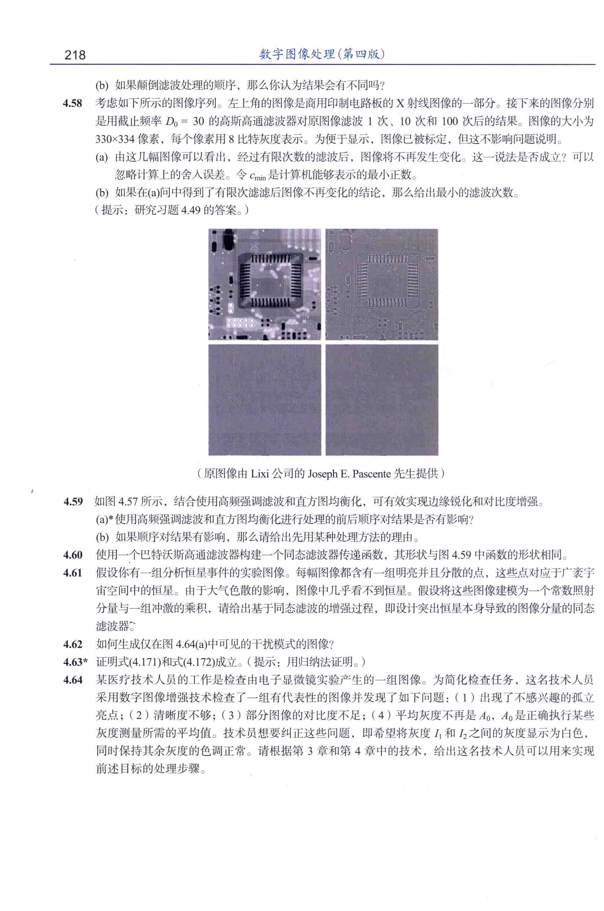

---

# 第5章 图像复原与重建

48道编号题；书页274–277；源PDF第289–292页。

**原页是正式题面。** 题号、星号、子问、公式、表格和配图均保留在原图中，不提供解答。整页保留可避免跨题排版的插图被截断。

[OCR检索稿（待逐字复核）](OCR检索稿/第05章-图像复原与重建.md) · [本章正文引用](正文引用索引.md#第5章)

[全书目录](00-全书习题总目录.md) · [完整性核查](完整性核查.md)

| 原书页 | 源PDF页 | 本页起始题号范围 | 页首先续上页 |
|---|---|---|---|
| [274](#书页274) | 289 | 5.1–5.12 | 无 |
| [275](#书页275) | 290 | 5.13–5.22 | 无 |
| [276](#书页276) | 291 | 5.23–5.34 | 无 |
| [277](#书页277) | 292 | 5.35–5.48 | 无 |

## 题号索引

[5.1](#书页274)　[5.2](#书页274)　[5.3](#书页274)　[5.4](#书页274)　[5.5](#书页274)　[5.6](#书页274)　[5.7](#书页274)　[5.8](#书页274)　[5.9](#书页274)　[5.10](#书页274)　[5.11](#书页274)　[5.12](#书页274)　

[5.13](#书页275)　[5.14](#书页275)　[5.15](#书页275)　[5.16](#书页275)　[5.17](#书页275)　[5.18](#书页275)　[5.19](#书页275)　[5.20](#书页275)　[5.21](#书页275)　[5.22](#书页275)　

[5.23](#书页276)　[5.24](#书页276)　[5.25](#书页276)　[5.26](#书页276)　[5.27](#书页276)　[5.28](#书页276)　[5.29](#书页276)　[5.30](#书页276)　[5.31](#书页276)　[5.32](#书页276)　[5.33](#书页276)　[5.34](#书页276)　

[5.35](#书页277)　[5.36](#书页277)　[5.37](#书页277)　[5.38](#书页277)　[5.39](#书页277)　[5.40](#书页277)　[5.41](#书页277)　[5.42](#书页277)　[5.43](#书页277)　[5.44](#书页277)　[5.45](#书页277)　[5.46](#书页277)　[5.47](#书页277)　[5.48](#书页277)　

## 书页274

源PDF第289页。

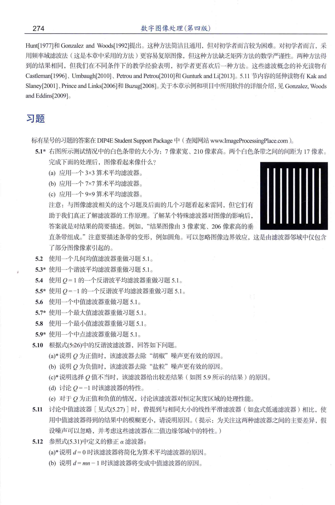

## 书页275

源PDF第290页。

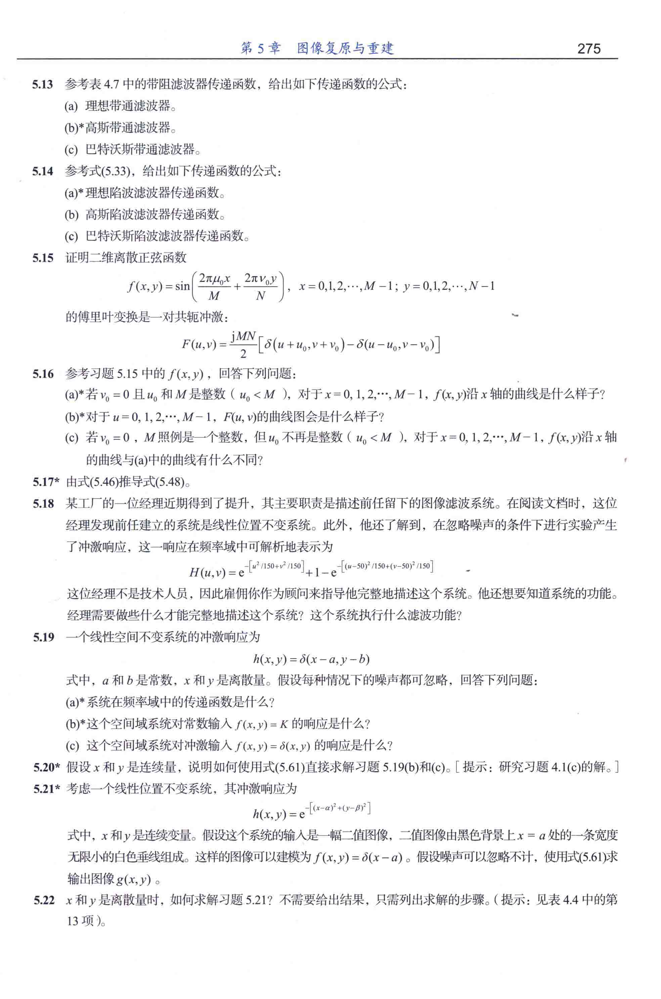

## 书页276

源PDF第291页。

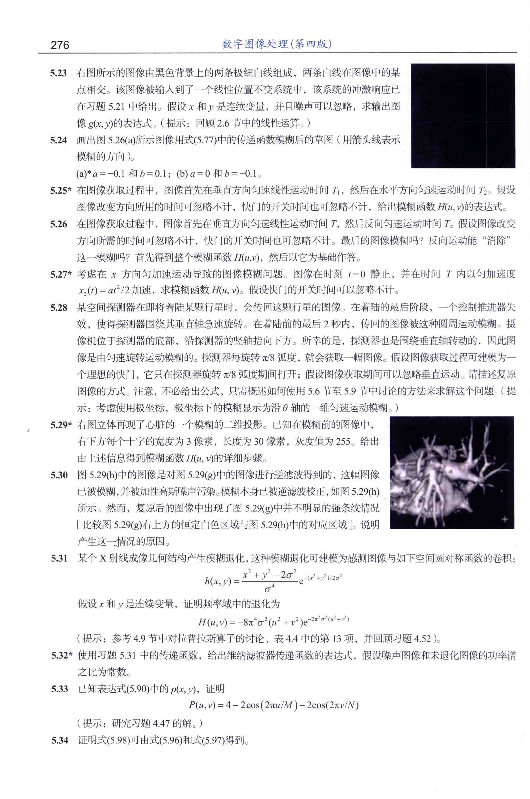

## 书页277

源PDF第292页。

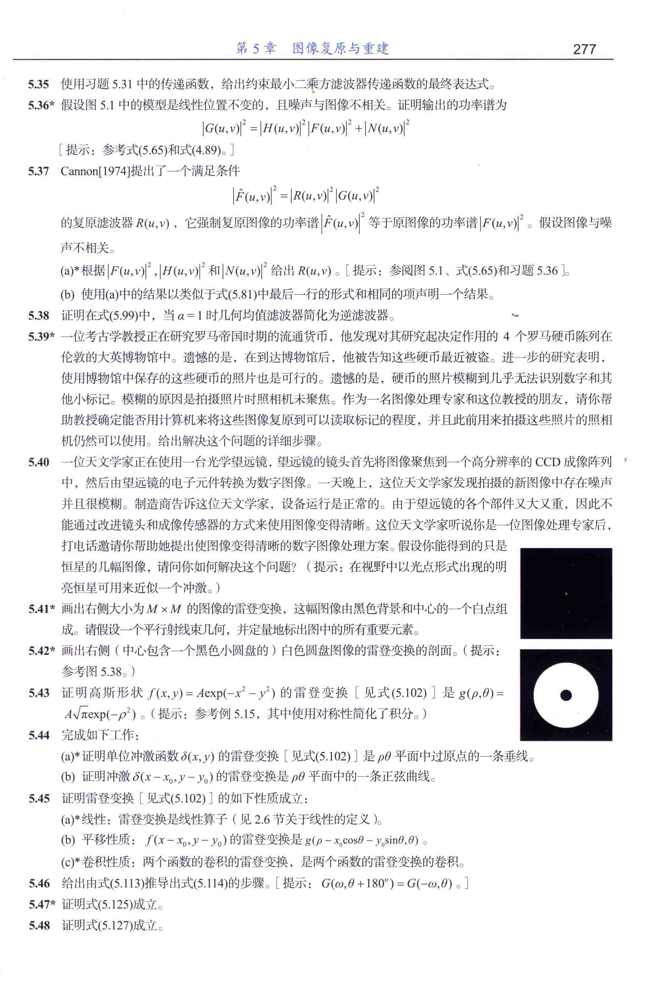

---

# 第6章 彩色图像处理

29道编号题；书页323–325；源PDF第338–340页。

**原页是正式题面。** 题号、星号、子问、公式、表格和配图均保留在原图中，不提供解答。整页保留可避免跨题排版的插图被截断。

[OCR检索稿（待逐字复核）](OCR检索稿/第06章-彩色图像处理.md) · [本章正文引用](正文引用索引.md#第6章)

[全书目录](00-全书习题总目录.md) · [完整性核查](完整性核查.md)

| 原书页 | 源PDF页 | 本页起始题号范围 | 页首先续上页 |
|---|---|---|---|
| [323](#书页323) | 338 | 6.1–6.8 | 无 |
| [324](#书页324) | 339 | 6.9–6.18 | 6.8 |
| [325](#书页325) | 340 | 6.19–6.29 | 6.18 |

## 题号索引

[6.1](#书页323)　[6.2](#书页323)　[6.3](#书页323)　[6.4](#书页323)　[6.5](#书页323)　[6.6](#书页323)　[6.7](#书页323)　[6.8](#书页323)（跨页）　

[6.9](#书页324)　[6.10](#书页324)　[6.11](#书页324)　[6.12](#书页324)　[6.13](#书页324)　[6.14](#书页324)　[6.15](#书页324)　[6.16](#书页324)　[6.17](#书页324)　[6.18](#书页324)（跨页）　

[6.19](#书页325)　[6.20](#书页325)　[6.21](#书页325)　[6.22](#书页325)　[6.23](#书页325)　[6.24](#书页325)　[6.25](#书页325)　[6.26](#书页325)　[6.27](#书页325)　[6.28](#书页325)　[6.29](#书页325)　

## 书页323

源PDF第338页。

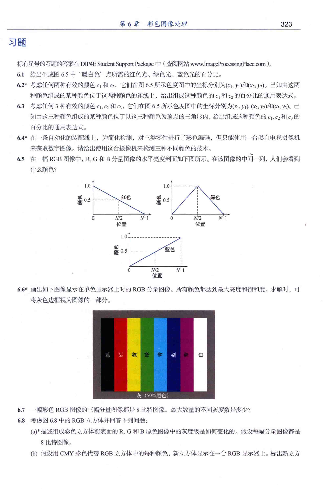

## 书页324

源PDF第339页。页首续题6.8。

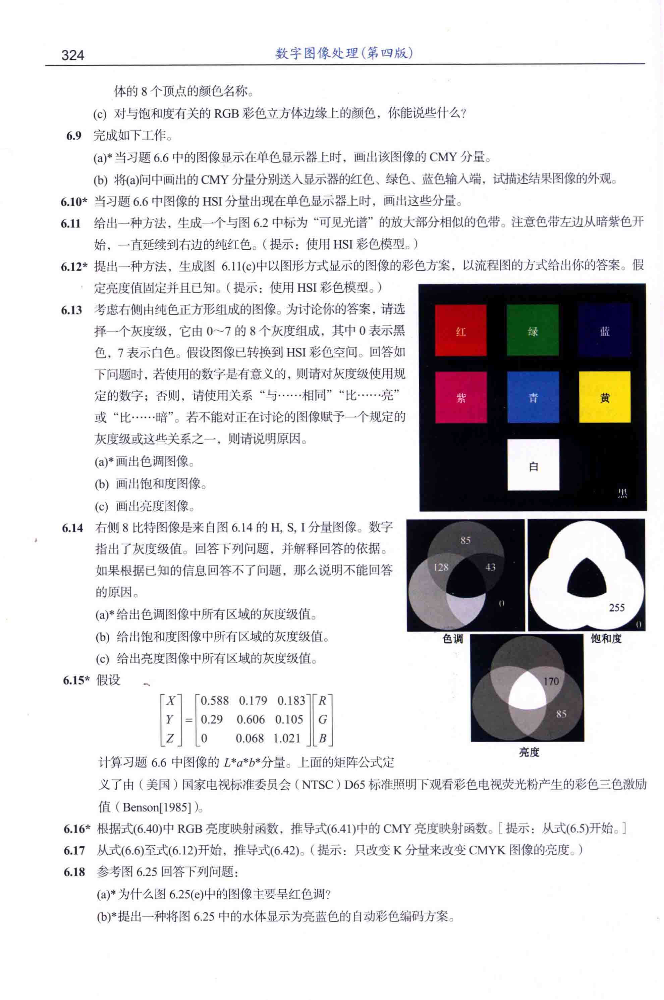

## 书页325

源PDF第340页。页首续题6.18。

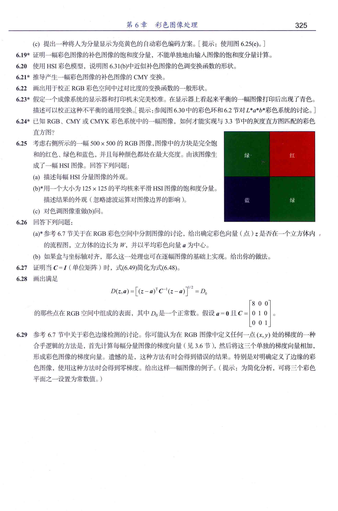

---

# 第7章 小波变换和其他图像变换

48道编号题；书页378–382；源PDF第393–397页。

**原页是正式题面。** 题号、星号、子问、公式、表格和配图均保留在原图中，不提供解答。整页保留可避免跨题排版的插图被截断。

[OCR检索稿（待逐字复核）](OCR检索稿/第07章-小波变换和其他图像变换.md) · [本章正文引用](正文引用索引.md#第7章)

[全书目录](00-全书习题总目录.md) · [完整性核查](完整性核查.md)

| 原书页 | 源PDF页 | 本页起始题号范围 | 页首先续上页 |
|---|---|---|---|
| [378](#书页378) | 393 | 习题标题与说明（无新题） | 无 |
| [379](#书页379) | 394 | 7.1–7.14 | 无 |
| [380](#书页380) | 395 | 7.15–7.34 | 7.14 |
| [381](#书页381) | 396 | 7.35–7.46 | 7.34 |
| [382](#书页382) | 397 | 7.47–7.48 | 7.46 |

## 题号索引

[7.1](#书页379)　[7.2](#书页379)　[7.3](#书页379)　[7.4](#书页379)　[7.5](#书页379)　[7.6](#书页379)　[7.7](#书页379)　[7.8](#书页379)　[7.9](#书页379)　[7.10](#书页379)　[7.11](#书页379)　[7.12](#书页379)　[7.13](#书页379)　[7.14](#书页379)（跨页）　

[7.15](#书页380)　[7.16](#书页380)　[7.17](#书页380)　[7.18](#书页380)　[7.19](#书页380)　[7.20](#书页380)　[7.21](#书页380)　[7.22](#书页380)　[7.23](#书页380)　[7.24](#书页380)　[7.25](#书页380)　[7.26](#书页380)　[7.27](#书页380)　[7.28](#书页380)　[7.29](#书页380)　[7.30](#书页380)　[7.31](#书页380)　[7.32](#书页380)　[7.33](#书页380)　[7.34](#书页380)（跨页）　

[7.35](#书页381)　[7.36](#书页381)　[7.37](#书页381)　[7.38](#书页381)　[7.39](#书页381)　[7.40](#书页381)　[7.41](#书页381)　[7.42](#书页381)　[7.43](#书页381)　[7.44](#书页381)　[7.45](#书页381)　[7.46](#书页381)（跨页）　

[7.47](#书页382)　[7.48](#书页382)　

## 书页378

源PDF第393页。

## 书页379

源PDF第394页。

## 书页380

源PDF第395页。页首续题7.14。

## 书页381

源PDF第396页。页首续题7.34。

## 书页382

源PDF第397页。页首续题7.46。

---

# 第8章 图像压缩和水印

35道编号题；书页451–453；源PDF第466–468页。

**原页是正式题面。** 题号、星号、子问、公式、表格和配图均保留在原图中，不提供解答。整页保留可避免跨题排版的插图被截断。

[OCR检索稿（待逐字复核）](OCR检索稿/第08章-图像压缩和水印.md) · [本章正文引用](正文引用索引.md#第8章)

[全书目录](00-全书习题总目录.md) · [完整性核查](完整性核查.md)

| 原书页 | 源PDF页 | 本页起始题号范围 | 页首先续上页 |
|---|---|---|---|
| [451](#书页451) | 466 | 8.1–8.7 | 无 |
| [452](#书页452) | 467 | 8.8–8.23 | 8.7 |
| [453](#书页453) | 468 | 8.24–8.35 | 8.23 |

## 题号索引

[8.1](#书页451)　[8.2](#书页451)　[8.3](#书页451)　[8.4](#书页451)　[8.5](#书页451)　[8.6](#书页451)　[8.7](#书页451)（跨页）　

[8.8](#书页452)　[8.9](#书页452)　[8.10](#书页452)　[8.11](#书页452)　[8.12](#书页452)　[8.13](#书页452)　[8.14](#书页452)　[8.15](#书页452)　[8.16](#书页452)　[8.17](#书页452)　[8.18](#书页452)　[8.19](#书页452)　[8.20](#书页452)　[8.21](#书页452)　[8.22](#书页452)　[8.23](#书页452)（跨页）　

[8.24](#书页453)　[8.25](#书页453)　[8.26](#书页453)　[8.27](#书页453)　[8.28](#书页453)　[8.29](#书页453)　[8.30](#书页453)　[8.31](#书页453)　[8.32](#书页453)　[8.33](#书页453)　[8.34](#书页453)　[8.35](#书页453)　

## 书页451

源PDF第466页。

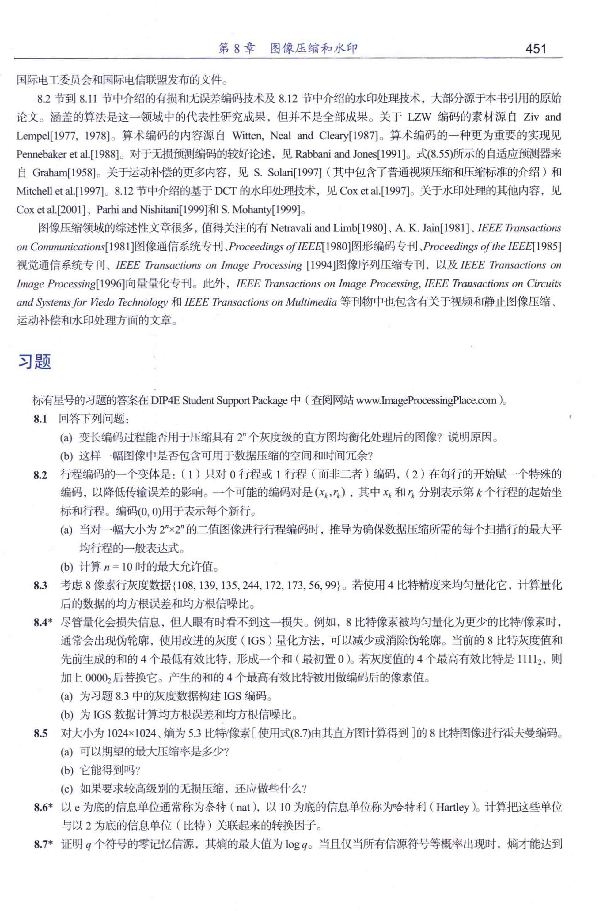

## 书页452

源PDF第467页。页首续题8.7。

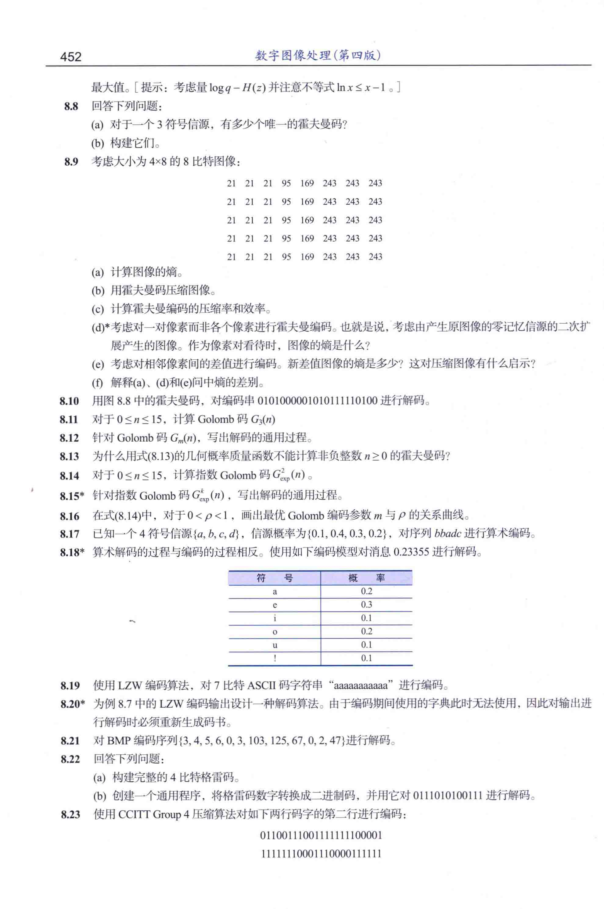

## 书页453

源PDF第468页。页首续题8.23。

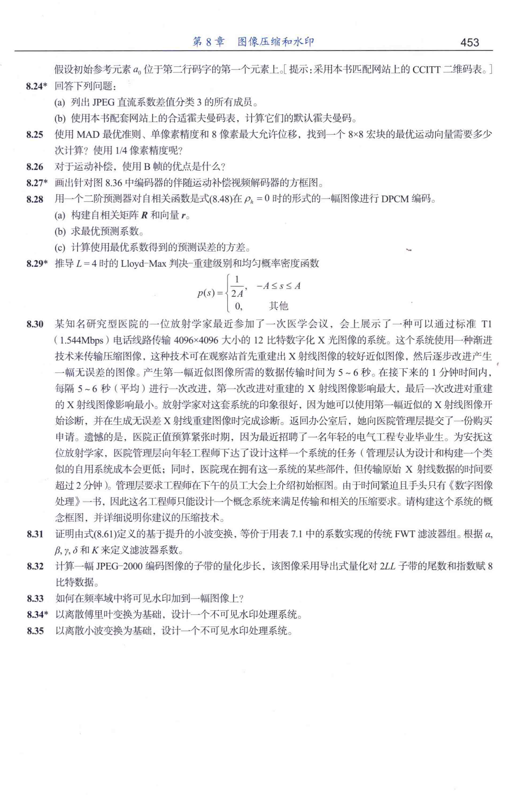

---

# 第9章 形态学图像处理

52道编号题；书页496–501；源PDF第511–516页。

**原页是正式题面。** 题号、星号、子问、公式、表格和配图均保留在原图中，不提供解答。整页保留可避免跨题排版的插图被截断。

[OCR检索稿（待逐字复核）](OCR检索稿/第09章-形态学图像处理.md) · [本章正文引用](正文引用索引.md#第9章)

[全书目录](00-全书习题总目录.md) · [完整性核查](完整性核查.md)

| 原书页 | 源PDF页 | 本页起始题号范围 | 页首先续上页 |
|---|---|---|---|
| [496](#书页496) | 511 | 9.1–9.6 | 无 |
| [497](#书页497) | 512 | 9.7–9.12 | 无 |
| [498](#书页498) | 513 | 9.13–9.22 | 9.12 |
| [499](#书页499) | 514 | 9.23–9.32 | 无 |
| [500](#书页500) | 515 | 9.33–9.46 | 9.32 |
| [501](#书页501) | 516 | 9.47–9.52 | 9.46 |

## 题号索引

[9.1](#书页496)　[9.2](#书页496)　[9.3](#书页496)　[9.4](#书页496)　[9.5](#书页496)　[9.6](#书页496)　

[9.7](#书页497)　[9.8](#书页497)　[9.9](#书页497)　[9.10](#书页497)　[9.11](#书页497)　[9.12](#书页497)（跨页）　

[9.13](#书页498)　[9.14](#书页498)　[9.15](#书页498)　[9.16](#书页498)　[9.17](#书页498)　[9.18](#书页498)　[9.19](#书页498)　[9.20](#书页498)　[9.21](#书页498)　[9.22](#书页498)　

[9.23](#书页499)　[9.24](#书页499)　[9.25](#书页499)　[9.26](#书页499)　[9.27](#书页499)　[9.28](#书页499)　[9.29](#书页499)　[9.30](#书页499)　[9.31](#书页499)　[9.32](#书页499)（跨页）　

[9.33](#书页500)　[9.34](#书页500)　[9.35](#书页500)　[9.36](#书页500)　[9.37](#书页500)　[9.38](#书页500)　[9.39](#书页500)　[9.40](#书页500)　[9.41](#书页500)　[9.42](#书页500)　[9.43](#书页500)　[9.44](#书页500)　[9.45](#书页500)　[9.46](#书页500)（跨页）　

[9.47](#书页501)　[9.48](#书页501)　[9.49](#书页501)　[9.50](#书页501)　[9.51](#书页501)　[9.52](#书页501)　

## 书页496

源PDF第511页。

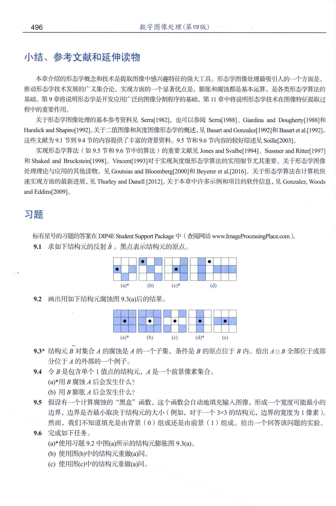

## 书页497

源PDF第512页。

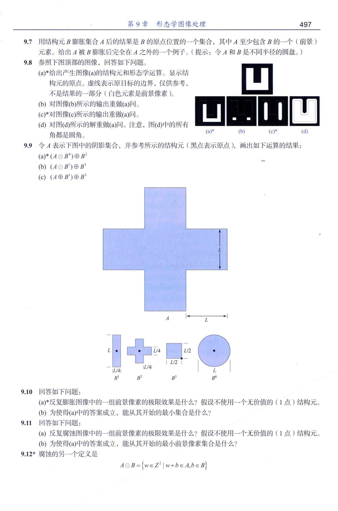

## 书页498

源PDF第513页。页首续题9.12。

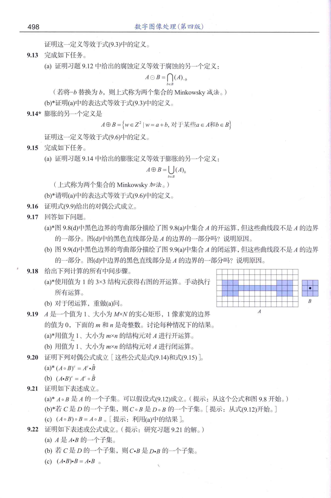

## 书页499

源PDF第514页。

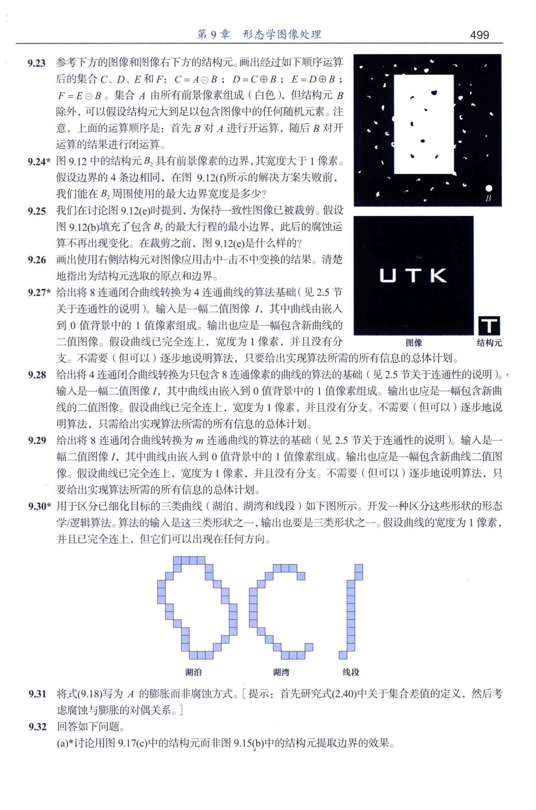

## 书页500

源PDF第515页。页首续题9.32。

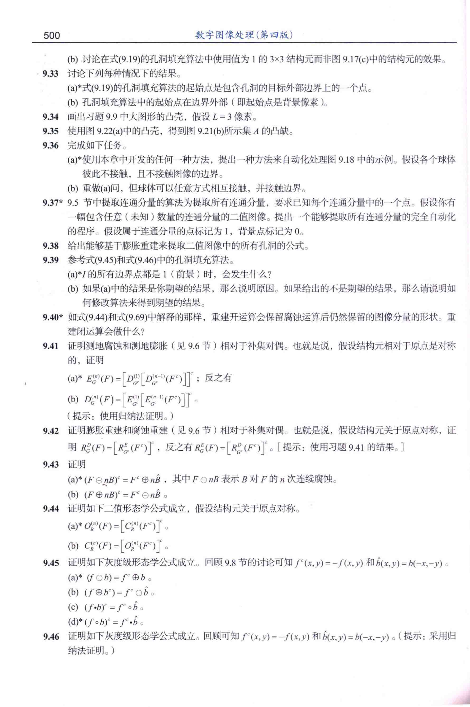

## 书页501

源PDF第516页。页首续题9.46。

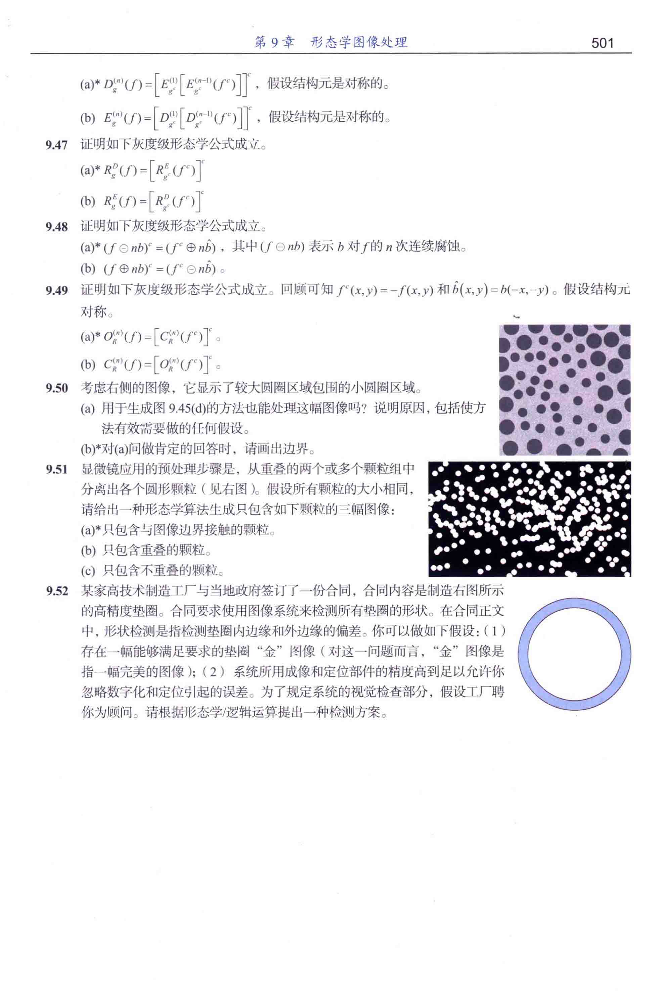

---

# 第10章 图像分割

55道编号题；书页579–583；源PDF第594–598页。

**原页是正式题面。** 题号、星号、子问、公式、表格和配图均保留在原图中，不提供解答。整页保留可避免跨题排版的插图被截断。

[OCR检索稿（待逐字复核）](OCR检索稿/第10章-图像分割.md) · [本章正文引用](正文引用索引.md#第10章)

[全书目录](00-全书习题总目录.md) · [完整性核查](完整性核查.md)

| 原书页 | 源PDF页 | 本页起始题号范围 | 页首先续上页 |
|---|---|---|---|
| [579](#书页579) | 594 | 10.1–10.11 | 无 |
| [580](#书页580) | 595 | 10.12–10.20 | 10.11 |
| [581](#书页581) | 596 | 10.21–10.32 | 10.20 |
| [582](#书页582) | 597 | 10.33–10.44 | 10.32 |
| [583](#书页583) | 598 | 10.45–10.55 | 10.44 |

## 题号索引

[10.1](#书页579)　[10.2](#书页579)　[10.3](#书页579)　[10.4](#书页579)　[10.5](#书页579)　[10.6](#书页579)　[10.7](#书页579)　[10.8](#书页579)　[10.9](#书页579)　[10.10](#书页579)　[10.11](#书页579)（跨页）　

[10.12](#书页580)　[10.13](#书页580)　[10.14](#书页580)　[10.15](#书页580)　[10.16](#书页580)　[10.17](#书页580)　[10.18](#书页580)　[10.19](#书页580)　[10.20](#书页580)（跨页）　

[10.21](#书页581)　[10.22](#书页581)　[10.23](#书页581)　[10.24](#书页581)　[10.25](#书页581)　[10.26](#书页581)　[10.27](#书页581)　[10.28](#书页581)　[10.29](#书页581)　[10.30](#书页581)　[10.31](#书页581)　[10.32](#书页581)（跨页）　

[10.33](#书页582)　[10.34](#书页582)　[10.35](#书页582)　[10.36](#书页582)　[10.37](#书页582)　[10.38](#书页582)　[10.39](#书页582)　[10.40](#书页582)　[10.41](#书页582)　[10.42](#书页582)　[10.43](#书页582)　[10.44](#书页582)（跨页）　

[10.45](#书页583)　[10.46](#书页583)　[10.47](#书页583)　[10.48](#书页583)　[10.49](#书页583)　[10.50](#书页583)　[10.51](#书页583)　[10.52](#书页583)　[10.53](#书页583)　[10.54](#书页583)　[10.55](#书页583)　

## 书页579

源PDF第594页。

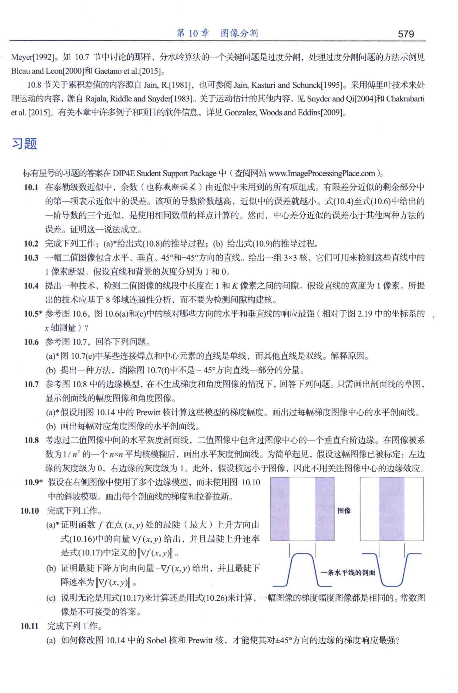

## 书页580

源PDF第595页。页首续题10.11。

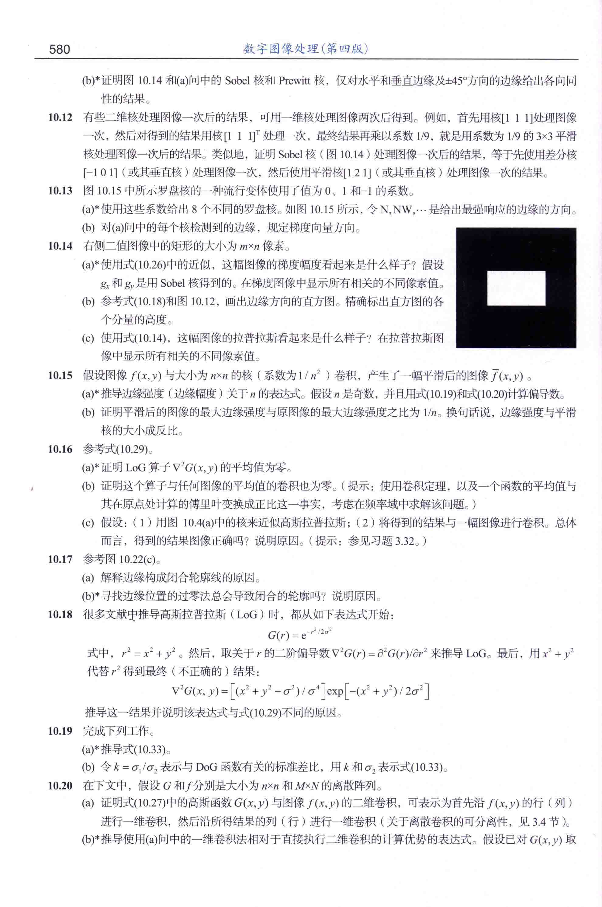

## 书页581

源PDF第596页。页首续题10.20。

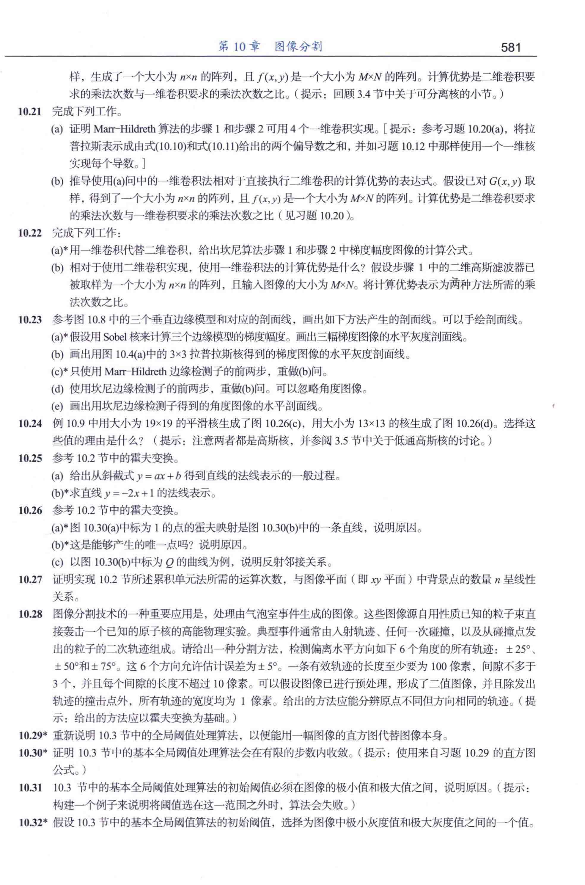

## 书页582

源PDF第597页。页首续题10.32。

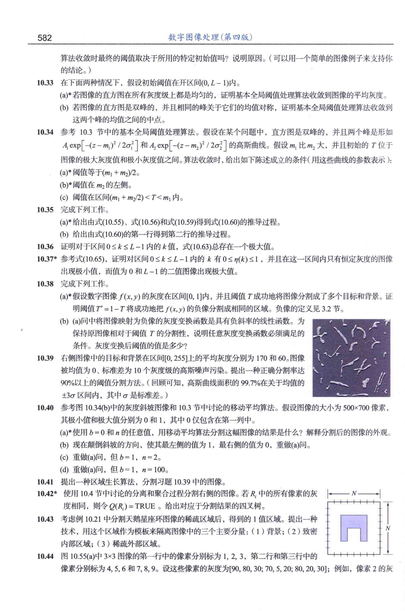

## 书页583

源PDF第598页。页首续题10.44。

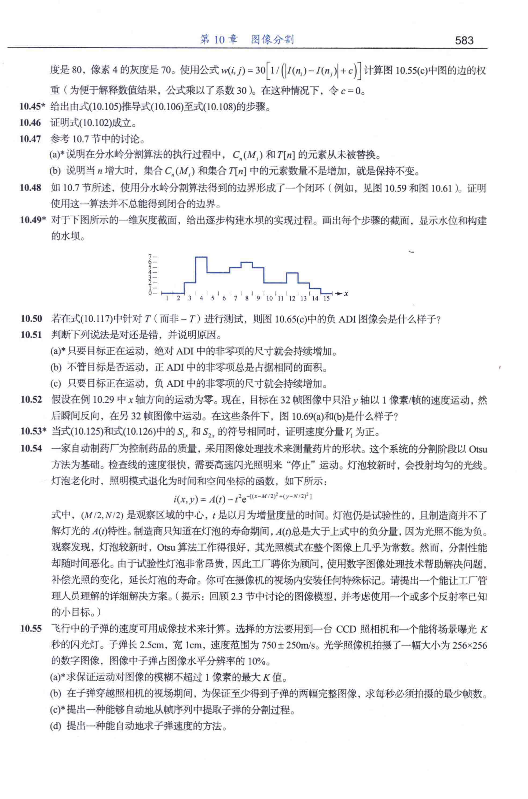

---

# 第11章 特征提取

39道编号题；书页649–651；源PDF第664–666页。

**原页是正式题面。** 题号、星号、子问、公式、表格和配图均保留在原图中，不提供解答。整页保留可避免跨题排版的插图被截断。

[OCR检索稿（待逐字复核）](OCR检索稿/第11章-特征提取.md) · [本章正文引用](正文引用索引.md#第11章)

[全书目录](00-全书习题总目录.md) · [完整性核查](完整性核查.md)

| 原书页 | 源PDF页 | 本页起始题号范围 | 页首先续上页 |
|---|---|---|---|
| [649](#书页649) | 664 | 11.1–11.12 | 无 |
| [650](#书页650) | 665 | 11.13–11.30 | 11.12 |
| [651](#书页651) | 666 | 11.31–11.39 | 11.30 |

## 题号索引

[11.1](#书页649)　[11.2](#书页649)　[11.3](#书页649)　[11.4](#书页649)　[11.5](#书页649)　[11.6](#书页649)　[11.7](#书页649)　[11.8](#书页649)　[11.9](#书页649)　[11.10](#书页649)　[11.11](#书页649)　[11.12](#书页649)（跨页）　

[11.13](#书页650)　[11.14](#书页650)　[11.15](#书页650)　[11.16](#书页650)　[11.17](#书页650)　[11.18](#书页650)　[11.19](#书页650)　[11.20](#书页650)　[11.21](#书页650)　[11.22](#书页650)　[11.23](#书页650)　[11.24](#书页650)　[11.25](#书页650)　[11.26](#书页650)　[11.27](#书页650)　[11.28](#书页650)　[11.29](#书页650)　[11.30](#书页650)（跨页）　

[11.31](#书页651)　[11.32](#书页651)　[11.33](#书页651)　[11.34](#书页651)　[11.35](#书页651)　[11.36](#书页651)　[11.37](#书页651)　[11.38](#书页651)　[11.39](#书页651)　

## 书页649

源PDF第664页。

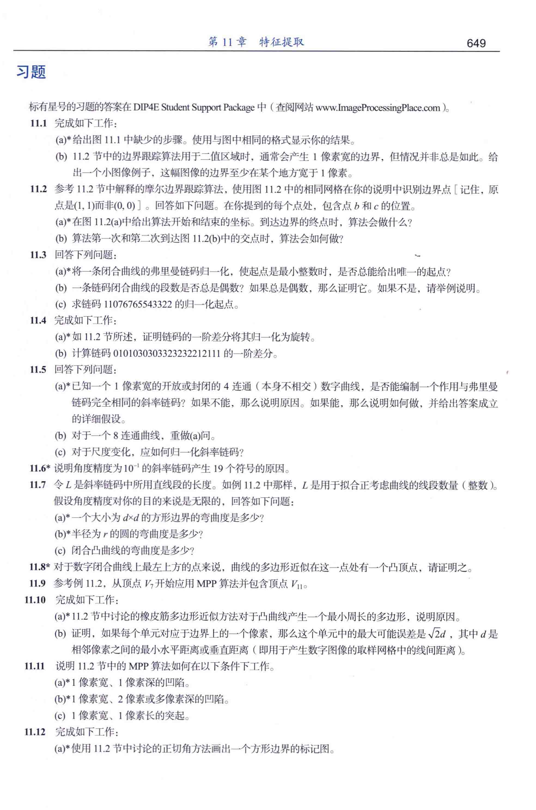

## 书页650

源PDF第665页。页首续题11.12。

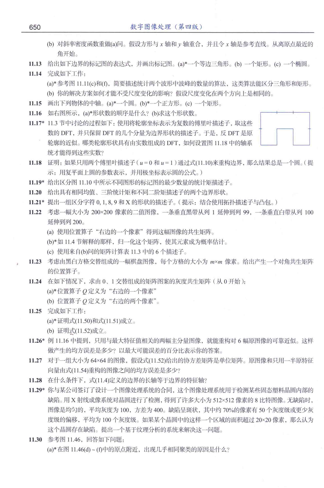

## 书页651

源PDF第666页。页首续题11.30。

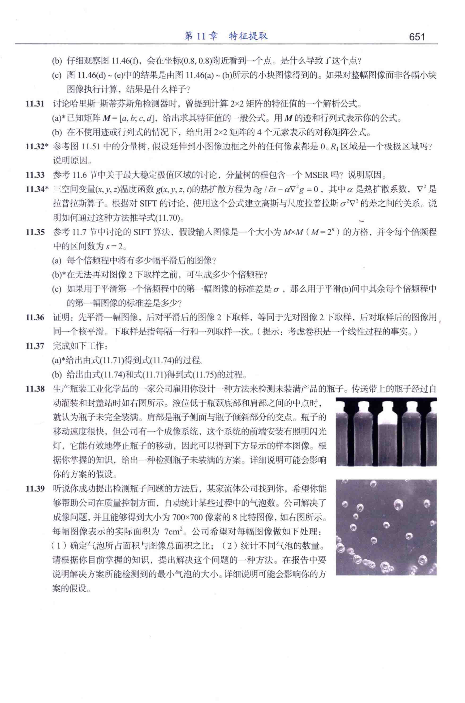

---

# 第12章 图像模式分类

34道编号题；书页715–718；源PDF第730–733页。

**原页是正式题面。** 题号、星号、子问、公式、表格和配图均保留在原图中，不提供解答。整页保留可避免跨题排版的插图被截断。

[OCR检索稿（待逐字复核）](OCR检索稿/第12章-图像模式分类.md) · [本章正文引用](正文引用索引.md#第12章)

[全书目录](00-全书习题总目录.md) · [完整性核查](完整性核查.md)

| 原书页 | 源PDF页 | 本页起始题号范围 | 页首先续上页 |
|---|---|---|---|
| [715](#书页715) | 730 | 12.1–12.10 | 无 |
| [716](#书页716) | 731 | 12.11–12.22 | 12.10 |
| [717](#书页717) | 732 | 12.23–12.32 | 无 |
| [718](#书页718) | 733 | 12.33–12.34 | 无 |

## 题号索引

[12.1](#书页715)　[12.2](#书页715)　[12.3](#书页715)　[12.4](#书页715)　[12.5](#书页715)　[12.6](#书页715)　[12.7](#书页715)　[12.8](#书页715)　[12.9](#书页715)　[12.10](#书页715)（跨页）　

[12.11](#书页716)　[12.12](#书页716)　[12.13](#书页716)　[12.14](#书页716)　[12.15](#书页716)　[12.16](#书页716)　[12.17](#书页716)　[12.18](#书页716)　[12.19](#书页716)　[12.20](#书页716)　[12.21](#书页716)　[12.22](#书页716)　

[12.23](#书页717)　[12.24](#书页717)　[12.25](#书页717)　[12.26](#书页717)　[12.27](#书页717)　[12.28](#书页717)　[12.29](#书页717)　[12.30](#书页717)　[12.31](#书页717)　[12.32](#书页717)　

[12.33](#书页718)　[12.34](#书页718)　

## 书页715

源PDF第730页。

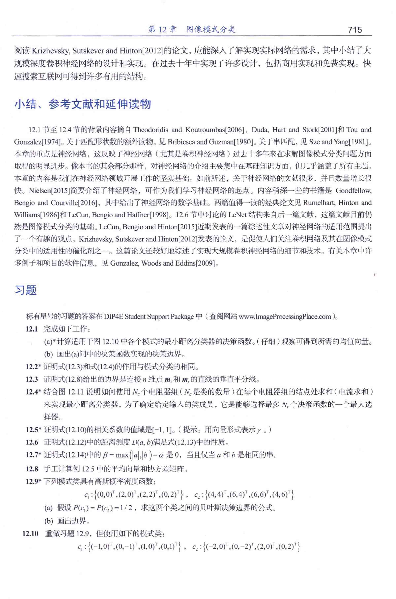

## 书页716

源PDF第731页。页首续题12.10。

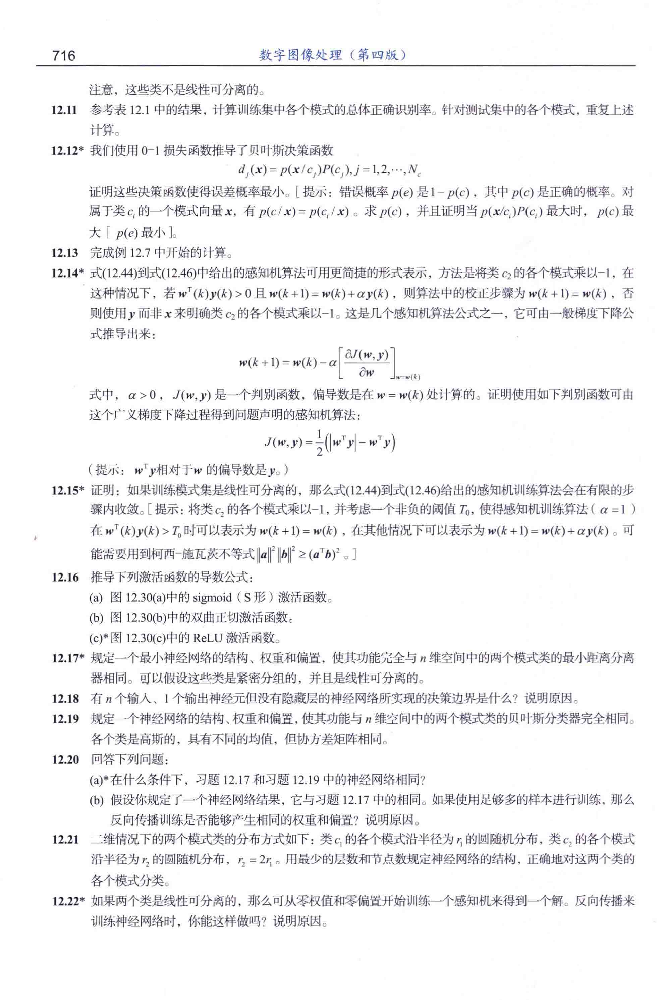

## 书页717

源PDF第732页。

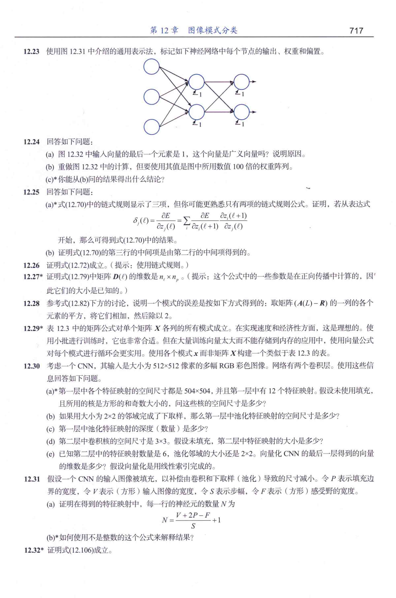

## 书页718

源PDF第733页。

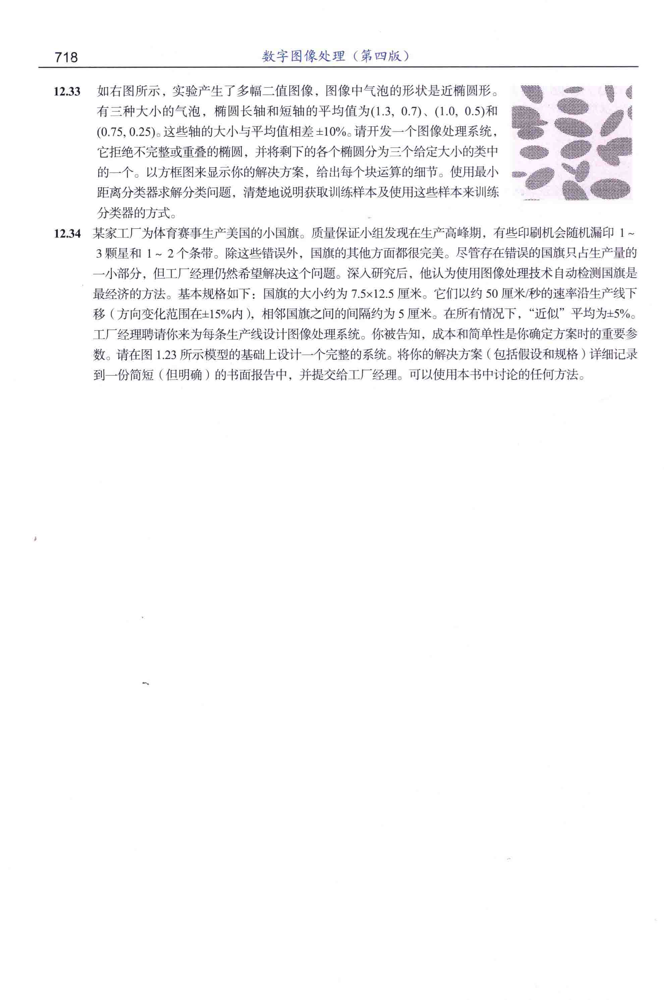

