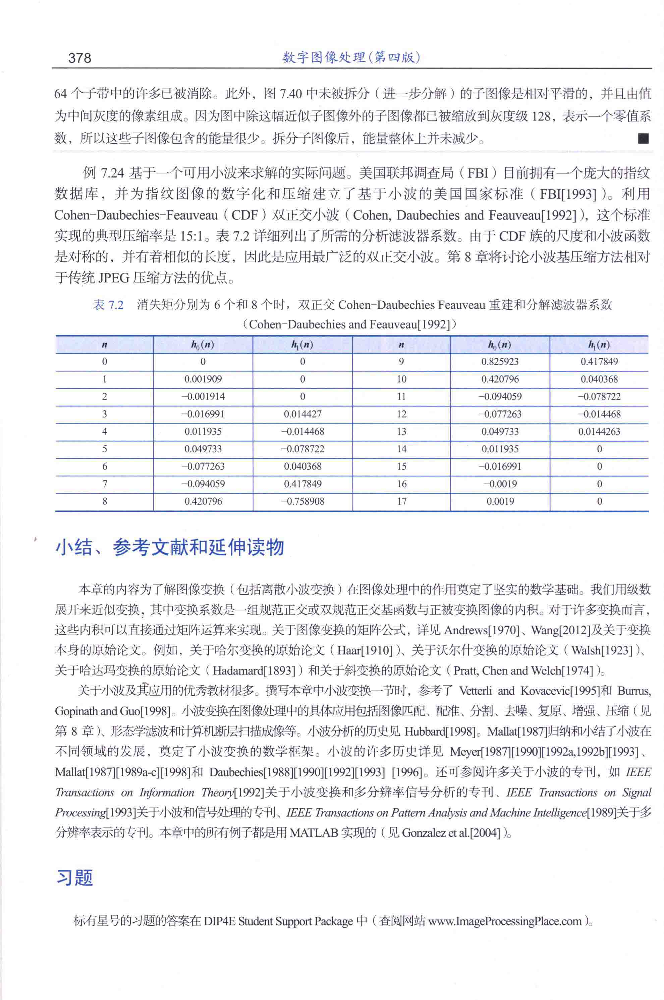
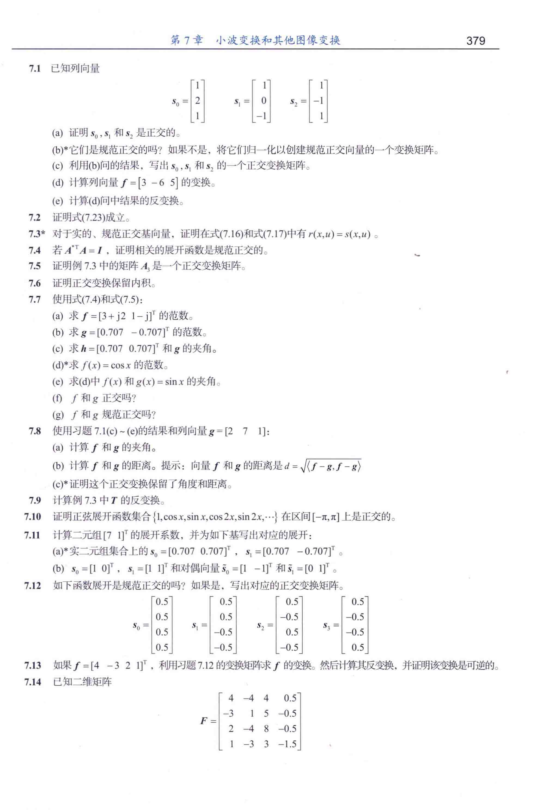
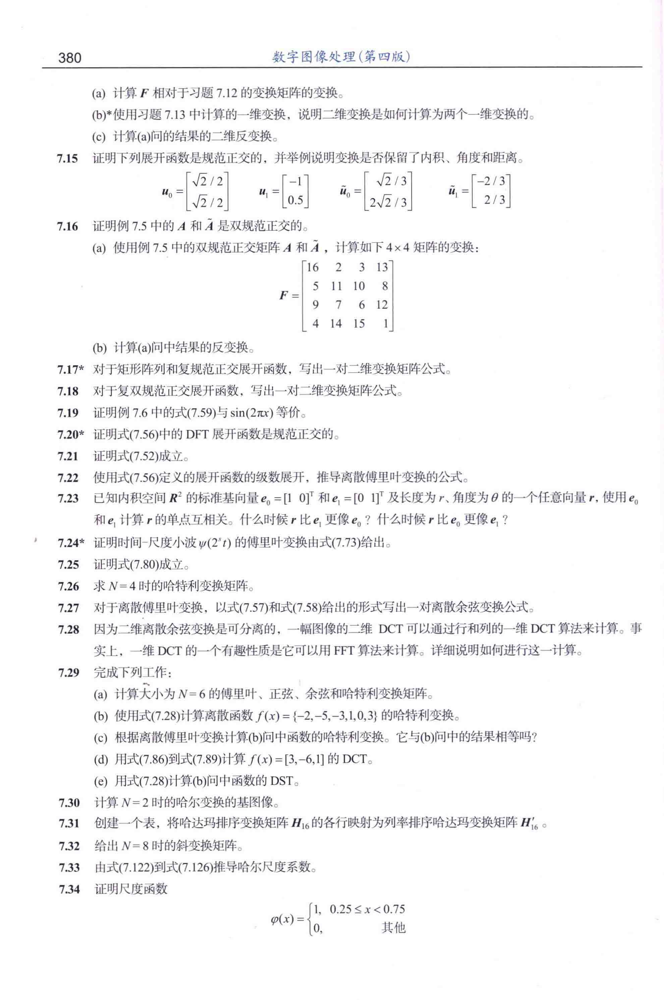
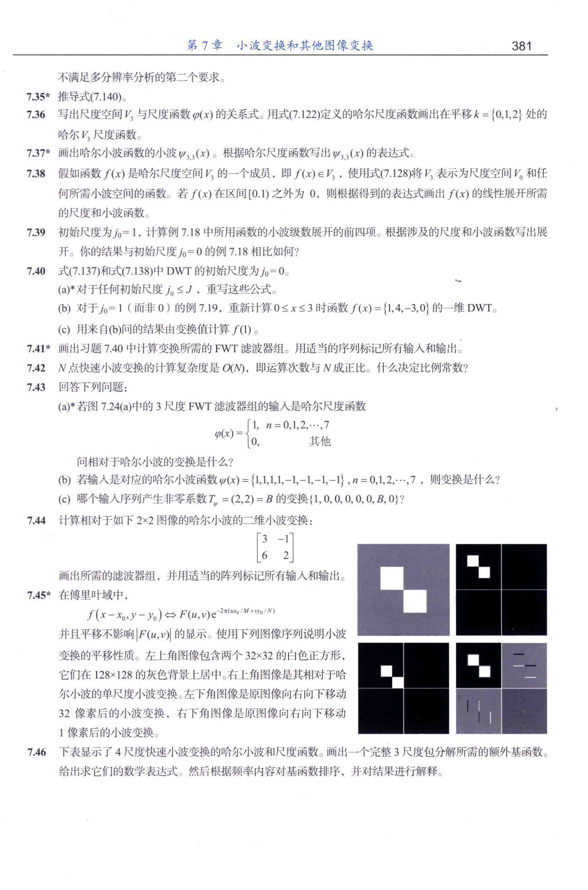
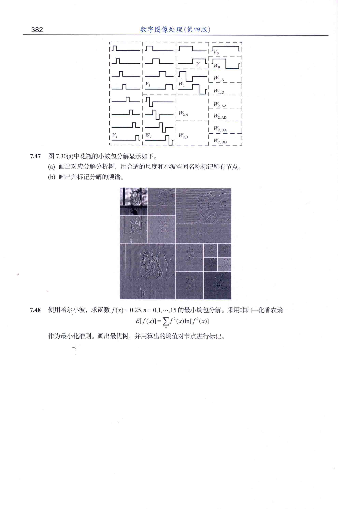

# 第7章 小波变换和其他图像变换

48道编号题；书页378–382；源PDF第393–397页。

**原页是正式题面。** 题号、星号、子问、公式、表格和配图均保留在原图中，不提供解答。整页保留可避免跨题排版的插图被截断。

[OCR检索稿（待逐字复核）](OCR检索稿/第07章-小波变换和其他图像变换.md) · [本章正文引用](正文引用索引.md#第7章)

[全书目录](00-全书习题总目录.md) · [完整性核查](完整性核查.md)

| 原书页 | 源PDF页 | 本页起始题号范围 | 页首先续上页 |
|---|---|---|---|
| [378](#书页378) | 393 | 习题标题与说明（无新题） | 无 |
| [379](#书页379) | 394 | 7.1–7.14 | 无 |
| [380](#书页380) | 395 | 7.15–7.34 | 7.14 |
| [381](#书页381) | 396 | 7.35–7.46 | 7.34 |
| [382](#书页382) | 397 | 7.47–7.48 | 7.46 |

## 题号索引

[7.1](#书页379)　[7.2](#书页379)　[7.3](#书页379)　[7.4](#书页379)　[7.5](#书页379)　[7.6](#书页379)　[7.7](#书页379)　[7.8](#书页379)　[7.9](#书页379)　[7.10](#书页379)　[7.11](#书页379)　[7.12](#书页379)　[7.13](#书页379)　[7.14](#书页379)（跨页）　

[7.15](#书页380)　[7.16](#书页380)　[7.17](#书页380)　[7.18](#书页380)　[7.19](#书页380)　[7.20](#书页380)　[7.21](#书页380)　[7.22](#书页380)　[7.23](#书页380)　[7.24](#书页380)　[7.25](#书页380)　[7.26](#书页380)　[7.27](#书页380)　[7.28](#书页380)　[7.29](#书页380)　[7.30](#书页380)　[7.31](#书页380)　[7.32](#书页380)　[7.33](#书页380)　[7.34](#书页380)（跨页）　

[7.35](#书页381)　[7.36](#书页381)　[7.37](#书页381)　[7.38](#书页381)　[7.39](#书页381)　[7.40](#书页381)　[7.41](#书页381)　[7.42](#书页381)　[7.43](#书页381)　[7.44](#书页381)　[7.45](#书页381)　[7.46](#书页381)（跨页）　

[7.47](#书页382)　[7.48](#书页382)　

## 书页378

源PDF第393页。

## 书页379

源PDF第394页。

## 书页380

源PDF第395页。页首续题7.14。

## 书页381

源PDF第396页。页首续题7.34。

## 书页382

源PDF第397页。页首续题7.46。

