# 830数字图像处理｜13套试题合订本

本文件只包含试题，按A—M顺序排列；独立答案另存。

每套150分、180分钟、16题；13套共208题。原题内容不变，配图沿用原文件。

---

## 830数字图像处理模拟试卷 A

**原创训练卷｜基础与常见题型｜满分150分｜闭卷180分钟**

本卷根据提供的历年题型和考纲编写，非官方试卷。请另纸作答，保留计算与推理过程。除特别说明外，矩阵坐标采用行 r、列 c，均从0开始，行向下、列向右；计算结果保留精确分数。结构元素原点、边界及取整规则以各题为准。

姓名：________　日期：________　开始时间：________　结束时间：________

### 一、简答题（每题5分，共40分）

#### 1. 取样与量化（5分）

分别解释图像取样和灰度量化。保持其他条件不变，空间取样过疏、灰度量化级数过少，各可能造成什么现象？

#### 2. 直方图均衡化（5分）

离散图像经过直方图均衡化后，直方图是否必然完全均匀？解释原因，并说明灰度映射中“多个输入灰度映射到同一输出灰度”的后果。

#### 3. 平滑滤波（5分）

比较均值滤波与中值滤波处理椒盐噪声的特点。中值滤波是否属于线性滤波？对于加性高斯噪声，能否断言中值滤波总优于均值滤波？说明理由。

#### 4. 相关与卷积（5分）

说明二维空间相关与卷积的区别。满足什么模板条件时，采用相同原点、边界和采样位置的两种运算对任意输入图像产生相同结果？

#### 5. 低通滤波与振铃（5分）

比较理想低通与高斯低通滤波器的频率响应形状，解释理想低通易出现振铃的原因，并说明提高平滑强度对图像细节的影响。

#### 6. 增强与复原（5分）

区分图像增强与图像复原的基本目标。写出线性空间不变退化模型的空间域和频率域表达式，并解释各项含义。

#### 7. 彩色图像亮度处理（5分）

为何分别对RGB三个通道进行直方图均衡化可能改变颜色？使用HSI模型进行亮度增强时，通常如何处理？还应注意什么限制？

#### 8. 非锐化掩蔽（5分）

设原图为 f，平滑图为 f̄。写出非锐化掩模及高提升增强的表达式，解释参数对结果的作用，并说明该方法可能增强噪声的原因。

### 二、计算题（每题10分，共40分）

#### 9. 离散直方图均衡化（10分）

一幅图像共有64个像素，灰度级为0至7，各级像素数依次为：

| 灰度 k | 0 | 1 | 2 | 3 | 4 | 5 | 6 | 7 |
|---|---:|---:|---:|---:|---:|---:|---:|---:|
| 像素数 nₖ | 4 | 8 | 12 | 16 | 12 | 8 | 4 | 0 |

定义 $S(k)=\sum_{j=0}^{k}n_j/64$，均衡化映射为 $s_k=\lfloor7S(k)+0.5\rfloor$。

（1）列出累积分布 S(k) 与灰度映射表。（4分）  
（2）求输出图像在灰度0至7上的像素数。（4分）  
（3）指出输出中没有像素的灰度级，并解释原因。（2分）

#### 10. 空间模板运算（10分）

给定图像 I 和模板 K：

$$I=\begin{bmatrix}1&2&2&3&4\\2&3&4&4&5\\2&4&9&5&6\\3&4&5&6&7\\4&5&6&7&8\end{bmatrix},\qquad
K=\begin{bmatrix}-1&0&1\\-2&0&2\\-1&0&1\end{bmatrix}.$$

模板原点位于中心。仅计算完整覆盖模板的内部像素，不补边，不取绝对值，不截断负值。

（1）按相关运算计算输出的3×3矩阵，对应原图 r,c∈{1,2,3}。（6分）  
（2）改用卷积运算，求原图中心位置(2,2)的响应。（2分）  
（3）该模板主要度量哪个方向的灰度变化，因而对哪种走向的边缘响应较强？（2分）

#### 11. 几何变换与插值（10分）

本题使用笛卡尔坐标：x向右、y向上，点用列向量表示。原图点 p 先绕 C=(1,1)逆时针旋转90°，再以 C 为中心放大2倍，最后平移 t=(3,−1)。即

$$q=2R_{90^\circ}(p-C)+C+t.$$

（1）写出从 p 到 q 的3×3齐次变换矩阵。（4分）  
（2）对输出像素 q=(3,3)作逆向映射。已知 f(2,1)=20、f(3,1)=40、f(2,2)=60、f(3,2)=80，求双线性插值结果。（4分）  
（3）几何变换中为何常采用逆向映射生成输出图像？（2分）

#### 12. 灰度共生矩阵（10分）

给定灰度级为0、1、2的图像：

$$I=\begin{bmatrix}0&0&1&2\\0&1&1&2\\2&2&1&0\\2&1&0&0\end{bmatrix}.$$

采用有向位移(Δr,Δc)=(0,1)，即只统计每个像素及其右邻像素。越界不计，不做循环延拓，不添加反向计数。共生矩阵的行表示起点灰度 i，列表示终点灰度 j。

（1）求未归一化共生矩阵 C。（5分）  
（2）求归一化矩阵 P。（2分）  
（3）按 $\mathrm{CON}=\sum_{i,j}(i-j)^2P(i,j)$ 求对比度。（3分）

### 三、综合分析与算法设计（共70分）

#### 13. 周期噪声的频域处理（15分）

128×128灰度图像含加性条纹噪声：

$$g(r,c)=f(r,c)+A\cos\left(2\pi\frac{8r}{128}\right),\qquad r,c=0,\ldots,127.$$

DFT中 u 对应行频率、v 对应列频率；不补零。未中心化频谱坐标均从0开始，中心化后直流位于(64,64)。

（1）写出噪声产生的两个频谱峰在未中心化和中心化频谱中的坐标。（4分）  
（2）设计去除该噪声的频域滤波流程，说明滤波器位置、成对设置及带宽选择。（7分）  
（3）比较上述方法与整幅图像强低通的取舍，并说明过宽的理想陷波区域可能造成的问题。（4分）

#### 14. 二值图像修复与边界提取（15分）

黑色背景上有若干轴对齐的实心白色矩形，每个矩形宽、高均不小于20像素。图像外部混有孤立单像素白点；矩形内部有单像素黑孔。各噪声点之间、噪声点与真实矩形边界之间、不同矩形之间的切比雪夫距离均不小于4像素；矩形与图像边界至少相距4像素。

使用原点居中的3×3全1方形结构元素 B，图像以外视为0。

（1）仅用开、闭运算构造去白点、填黑孔的组合流程，写出集合运算表达式。（6分）  
（2）解释其在题设条件下的作用。若目标改为细线、噪声靠近边缘，原流程可能出现什么问题？（5分）  
（3）对修复结果 R 提取一像素尺度的内部边界，写出表达式并解释。（4分）

#### 15. 接触细胞分割与计数（20分）

显微图像中细胞比背景亮，单个细胞大致呈圆形，背景亮度缓慢变化，并有少量随机噪声。部分细胞相互接触，少数细胞在二维投影中重叠。要求分割可辨认的完整细胞、计数并输出每个细胞面积；截断于图像边缘的细胞不计。不得使用深度学习。

（1）设计从原图到初始前景掩模的流程，说明背景校正、去噪和阈值选择依据。（8分）  
（2）设计分开接触细胞的方法，并说明如何抑制过分割。（6分）  
（3）说明计数、面积统计及验证方法，并讨论严重重叠时的局限。（6分）

#### 16. 彩色字符提取与识别（20分）

一张纸质表单上有红色序列号及其他颜色的文字、线框。相机拍摄带有近似全局一致的暖色偏，且存在缓慢变化的亮度阴影。图中有一块可见、未饱和的白色标定区域，并提供少量已标注字符模板。要求定位红色序列号并识别字符。不得使用深度学习，也不得使用直方图均衡化。

（1）设计偏色与亮度不均的校正方法。（6分）  
（2）设计红色区域提取及字符分割流程。（6分）  
（3）说明字符归一化、特征提取及分类方法。（6分）  
（4）列出一种可能失败的情形及相应的结果检查方法。（2分）

---

交卷前检查：题号、计算过程、坐标与模板约定、设计限制、输出与验证。

---

## 830数字图像处理模拟试卷 B

**原创训练卷｜形态学、分割与识别｜满分150分｜闭卷180分钟**

本卷根据提供的历年题型和考纲编写，非官方试卷。请另纸作答，保留计算与推理过程。除特别说明外，矩阵坐标采用行 r、列 c，均从0开始，行向下、列向右；结果保留精确分数。前景为1、背景为0。

姓名：________　日期：________　开始时间：________　结束时间：________

### 一、简答题（每题5分，共40分）

#### 1. 像素邻接（5分）

说明二值前景像素的4邻接、8邻接与m邻接。为什么m邻接需要对对角相邻像素的公共4邻域作额外限制？

#### 2. 膨胀与腐蚀的对偶性（5分）

在无限整数网格上，令补集相对于整个网格定义，结构元素B具有指定原点，反射为 $\hat B=\{-b:b\in B\}$。写出腐蚀与膨胀的一条对偶关系，并解释结构元素反射和补集边界约定的重要性。

#### 3. 形态学重建（5分）

说明基于膨胀的二值形态学重建中“标记”和“掩模”的作用。为什么重建开运算与普通开运算对目标形状的影响可能不同？

#### 4. Canny边缘检测（5分）

按处理顺序写出Canny边缘检测的主要步骤，并分别说明非极大值抑制和滞后阈值连接的作用。

#### 5. Otsu阈值分割（5分）

写出Otsu方法选择阈值的基本准则。它为何可能在光照不均、目标占比很小的图像上效果不佳？给出一种改进思路。

#### 6. 主成分分析（5分）

概述PCA从特征样本到低维特征的主要步骤。PCA后的各主成分“不相关”是否意味着一定“相互独立”？保留较大特征值对应的主成分是否总能去噪？

#### 7. 链码与归一化（5分）

边界链码受起点和图形旋转影响。分别说明减弱起点影响和旋转影响的方法，并指出差分链码的旋转不变性所依赖的离散方向条件。

#### 8. SIFT特征（5分）

概述SIFT的主要处理阶段，说明尺度选择和主方向分配的作用。为何不能把它理解为对任意缩放、旋转和成像变化都完全不变？

### 二、计算题（每题10分，共40分）

#### 9. 离散直方图规定化（10分）

源图与参考图均为16像素、4灰度级，直方图如下：

| 灰度 | 0 | 1 | 2 | 3 |
|---|---:|---:|---:|---:|
| 源图像素数 | 2 | 2 | 8 | 4 |
| 参考图像素数 | 4 | 4 | 2 | 6 |

设源图、参考图的累积分布分别为 S(k)、T(j)。对每个源灰度 k，选择使 $|S(k)-T(j)|$ 最小的 j；若并列，选较小 j。同一输入灰度的所有像素映射到同一输出级。

（1）计算两个累积分布。（3分）  
（2）求规定化映射。（4分）  
（3）求实际输出直方图。（2分）  
（4）说明实际输出与参考直方图是否必然一致。（1分）

#### 10. 二值形态学手算（10分）

给定图像：

$$A=\begin{bmatrix}
0&0&0&0&0&0&0\\
0&1&1&1&1&1&0\\
0&1&1&1&1&1&0\\
0&1&1&0&1&1&0\\
0&1&1&1&1&1&0\\
0&1&1&1&1&1&0\\
0&0&0&0&0&0&0
\end{bmatrix}.$$

结构元素为十字形，原点居中：$B=\{(0,0),(-1,0),(1,0),(0,-1),(0,1)\}$。图像以外全部为0；运算在无限网格上定义，答案只需写出原7×7区域。

（1）求 $A\ominus B$。（5分）  
（2）求 $A\circ B=(A\ominus B)\oplus B$。（5分）

#### 11. Otsu阈值计算（10分）

某图像灰度0、1、2、3的像素数依次为4、4、8、4。候选阈值 t∈{0,1,2}，低灰度类为 k≤t，高灰度类为 k>t。

（1）求每个候选阈值对应的类概率 ω₀、ω₁及类均值 μ₀、μ₁。（4分）  
（2）按 $\sigma_B^2=\omega_0\omega_1(\mu_0-\mu_1)^2$ 求各阈值的类间方差。（4分）  
（3）给出最优阈值及两类的灰度范围。（2分）

#### 12. 有向共生矩阵与同质性（10分）

给定图像：

$$I=\begin{bmatrix}0&1&1&2\\0&1&2&2\\1&1&2&0\\1&2&0&0\end{bmatrix}.$$

灰度级为0、1、2，采用有向位移(Δr,Δc)=(1,0)，即只统计像素及其正下方邻居。越界不计、不循环、不补充反向配对；行下标为起点灰度，列下标为终点灰度。

（1）求计数矩阵 C。（5分）  
（2）求归一化矩阵 P。（2分）  
（3）按本题定义 $\mathrm{HOM}=\sum_{i,j}P(i,j)/[1+(i-j)^2]$ 求同质性。（3分）

### 三、综合分析与算法设计（共70分）

#### 13. 去除触边目标（15分）

一幅二值粒子图像 A 中，粒子按4连通定义，各粒子彼此分离。其中部分粒子接触图像边界，要求完整删除所有触边粒子，而保留所有不触边粒子的完整形状，不按粒子大小筛选。只能使用膨胀、集合运算和迭代；结构元素为原点居中的3×3十字形，图像外为0。

（1）构造初始标记。（3分）  
（2）写出迭代公式及终止条件。（5分）  
（3）写出触边粒子集合和保留粒子集合。（3分）  
（4）说明一次腐蚀或普通开运算为何不能替代该流程。（4分）

#### 14. 区域生长分割（15分）

已知一个位于目标内部的可靠种子点。经过初步光照校正后，目标区域的灰度均值约90、标准差约8；背景均值约150、标准差约10。目标为一个4连通区域，局部存在噪声和弱边界，题给均值、标准差仅为近似统计信息。

（1）说明如何由种子建立初始区域与统计量。（3分）  
（2）设计邻域检查和像素接纳准则，并解释参数依据。（5分）  
（3）说明生长过程及停止条件。（3分）  
（4）讨论统计量更新、阈值宽窄和弱边界对泄漏及漏分的影响，给出防护方法。（4分）

#### 15. 两类细胞的传统方法分类（20分）

给定若干细胞图像及少量已标注样本。细胞之间没有重叠，但大小、位置和方向不同。第一类细胞外形接近圆盘，第二类具有明显星状突起。希望将每个完整细胞分成这两类，不得使用深度学习。

（1）设计预处理、分割与单细胞提取流程。（6分）  
（2）选择至少3种有区分意义的形状特征，给出定义或计算思路，解释尺度/方向变化的处理。（6分）  
（3）设计利用少量标注样本的分类方法。（4分）  
（4）设计验证方法，并说明对低质量或不确定样本如何处理。（4分）

#### 16. 运动目标提取与过线计数（20分）

固定路口相机拍摄彩色视频，但存在轻微抖动、云影引起的缓慢亮度变化和车辆阴影。视频开始的30帧不含车辆，可用于建立背景。要求提取运动车辆，并统计车辆按指定方向越过计数线的次数。不得使用深度学习。

（1）设计减小相机抖动影响的处理步骤。（6分）  
（2）设计背景模型及前景检测方法，说明更新策略。（5分）  
（3）说明如何减少云影和车辆阴影造成的误检。（3分）  
（4）设计前景后处理、跨帧关联及过线计数流程，说明如何避免同一车辆重复计数。（6分）

---

交卷前检查：连通性、结构元素、阈值分类约定、配对方向、训练与验证数据是否混用。

---

## 830数字图像处理模拟试卷 C

**原创训练卷｜频域、变换与综合应用｜满分150分｜闭卷180分钟**

本卷根据提供的历年题型和考纲编写，非官方试卷，综合程度略高于A、B卷。请另纸作答，保留计算与推理过程。除特别说明外，矩阵采用行 r、列 c 坐标，均从0开始，行向下、列向右；保留精确分数。log₂以2为底，定义0log₂0=0。

姓名：________　日期：________　开始时间：________　结束时间：________

### 一、简答题（每题5分，共40分）

#### 1. 缩小图像与混叠（5分）

把一幅图像的行、列尺寸均缩小为原来的1/2，为什么一般不能只隔行隔列取样？说明降采样前滤波的目的，以及滤波截止频率应如何对应新的取样率。

#### 2. 频率域滤波器之间的关系（5分）

说明如何由一个低通滤波器构造互补高通。若已有截止半径D₁<D₂的两个理想低通响应，如何构造对应的环形带通与带阻？指出直流分量在这些滤波器中的保留情况。

#### 3. 维纳滤波与约束最小二乘（5分）

从目标准则、所需先验和正则化作用三个方面，比较维纳滤波与约束最小二乘复原。为何不能把两者的所有参数都理解为同一个“噪声强度”？

#### 4. 灰度形态学（5分）

对原点居中、中心对称的平坦结构元素B，写出灰度膨胀和灰度腐蚀在邻域内的基本运算。它们与均值滤波有何区别？各说明一种对亮、暗结构的典型影响。

#### 5. DCT与DFT（5分）

比较DCT和DFT的基函数及系数表示。为什么DCT对许多自然图像具有较好的能量集中性？这种集中性是否对所有图像都成立？

#### 6. 三种图像变换（5分）

简述沃尔什—哈达玛变换、哈尔变换和斜变换的基函数特点或所适合表示的信号特征。

#### 7. 卷积神经网络的基本组件（5分）

说明卷积层、非线性激活及池化的主要作用。局部连接与权值共享怎样影响参数量？池化是否保证图像任意平移后的输出完全不变？

#### 8. 贝叶斯与最小距离分类（5分）

说明贝叶斯分类的基本决策依据。在各类特征满足高斯分布的条件下，何时贝叶斯分类可以化为到类均值的欧氏最小距离分类？若只有共同的一般协方差矩阵，距离形式有何变化？

### 二、计算题（每题10分，共40分）

#### 9. 灰度截断、均值与熵（10分）

一幅16像素图像的灰度级为0至7，各级像素数依次为

$$[2,2,4,4,2,1,1,0].$$

实施灰度变换 $T(k)=\min(7,2k)$。

（1）写出灰度映射和输出直方图。（4分）  
（2）计算输出图像的平均灰度。（2分）  
（3）按 $H=-\sum_kp_k\log_2p_k$ 计算变换前后的灰度熵，解释变化原因，并说明能否仅根据熵的变化判定增强质量。（4分）

#### 10. 可分离滤波与频率响应（10分）

给定原点位于中心的滤波核及其完整覆盖的局部图像块：

$$K=\frac1{16}\begin{bmatrix}1&2&1\\2&4&2\\1&2&1\end{bmatrix},\qquad
I_{\rm local}=\begin{bmatrix}2&4&6\\4&8&10\\6&10&12\end{bmatrix}.$$

（1）把K写成一个列向量与一个行向量的乘积。（2分）  
（2）计算该图像块中心的滤波输出。（2分）  
（3）以中心为零坐标、其他偏移为−1与1，求零相位频率响应 $H(\omega_r,\omega_c)$，并给出直流增益。（3分）  
（4）对M×N幅图像，忽略边界开销，比较直接二维滤波和两次一维滤波的乘法、加法次数。每次乘加均单独计数，不使用核对称性等额外优化。（3分）

#### 11. DFT与复原滤波（10分）

给定

$$f=\begin{bmatrix}1&2\\3&4\end{bmatrix}.$$

本题采用未归一化正向DFT：

$$F(u,v)=\sum_{r=0}^{1}\sum_{c=0}^{1}f(r,c)e^{-j2\pi(ur/2+vc/2)},\quad u,v=0,1.$$

退化响应和噪声频谱为

$$H=\begin{bmatrix}1&1/2\\1/4&0\end{bmatrix},\qquad
N=\begin{bmatrix}0&1\\1/4&1\end{bmatrix},\qquad G=HF+N,$$

其中HF表示逐元素乘积。维纳型复原取固定参数 K=1/16，采用 $\hat F_W=H^*G/(|H|^2+K)$。

（1）计算 F。（3分）  
（2）计算 G。（2分）  
（3）在频率(1,0)，分别计算直接反滤波和上述维纳型滤波的估计值。（3分）  
（4）分析频率(1,1)处两种方法的结果或是否有定义。固定K的维纳型滤波是否保证每个频点都比反滤波更接近真实F？（2分）

#### 12. 一级二维哈尔变换（10分）

给定

$$I=\begin{bmatrix}4&2&2&0\\2&0&0&2\\6&4&2&2\\4&2&2&2\end{bmatrix}.$$

对相邻两个数定义 $a=(x_0+x_1)/\sqrt2$、$d=(x_0-x_1)/\sqrt2$。先对每行相邻两对作变换，将结果依次排成[a₀,a₁,d₀,d₁]；再对每列同样处理，将低频系数放在上半部、高频放在下半部。仅作一级分解，不继续分解左上角子带。

（1）求变换后的4×4系数矩阵。（5分）  
（2）仅保留左上角2×2低频子带，其余系数置0，求逆变换重建图像。（3分）  
（3）按 $\mathrm{MSE}=\frac1{16}\sum_{r,c}[I(r,c)-\hat I(r,c)]^2$ 求均方误差。（2分）

### 三、综合分析与算法设计（共70分）

#### 13. 拉普拉斯金字塔与图像融合（15分）

设 $G_0$ 为原图，R表示低通后2倍降采样，E表示插零上采样后作增益适当的插值滤波；构建与重建时使用完全相同的E及尺寸、边界约定。定义 $G_{\ell+1}=R(G_\ell)$。

（1）给出拉普拉斯金字塔各层残差的表达式，说明需要保存哪些信息，以及降采样前为何要低通。（6分）  
（2）写出逐层重建公式。虽然R本身丢失信息，为什么保存残差后仍能在无量化误差时恢复原图？（4分）  
（3）两幅已配准图像在不同区域曝光较好，设计基于金字塔的融合方法，说明如何减轻拼接接缝。（5分）

#### 14. 投影重建（15分）

考虑二维平行束CT模型，已知0至π范围内多个角度的一维投影。

（1）说明简单反投影的基本操作、产生模糊的原因，以及傅里叶切片定理所表达的投影与原图频谱关系。（5分）  
（2）给出滤波反投影的主要步骤，说明斜坡滤波器的作用。（6分）  
（3）若角度很稀疏且投影含噪声，结果可能出现哪些问题？提出两项有依据的改进或取舍。（4分）

#### 15. 配准与缺陷检测（20分）

同一块近似平面的印刷电路板在两个时刻分别拍照，图像之间主要存在平移、面内旋转和等比例缩放，无明显透视变形；光照有所变化，少数位置可能出现划伤或元件缺损。要求标出疑似变化区域，不得使用深度学习。

（1）说明如何检测和描述用于配准的局部特征。（5分）  
（2）设计匹配筛选与几何变换估计方法，写出所采用变换模型。（6分）  
（3）设计配准后的光度校正、差异检测及区域后处理流程。（5分）  
（4）说明怎样验证配准可靠性，并处理可能产生假缺陷的情况。（4分）

#### 16. 小型CNN的结构与训练（20分）

用于二分类的网络如下，输入为28×28×1图像。所有卷积均无补零、步长1，每个输出通道带一个偏置；全连接每个输出带一个偏置。

1. 3×3卷积，4个输出通道；ReLU。
2. 2×2最大池化，步长2，无补零。
3. 3×3卷积，8个输出通道；ReLU。
4. 全局平均池化：每个通道的所有空间位置取均值。
5. 全连接层输出2个数，再作Softmax。

（1）依次写出各层输出尺寸，注明通道数。（6分）  
（2）计算两层卷积、全连接层及整个网络的可训练参数量；说明其他层是否含可训练参数。（6分）  
（3）概述有标注样本的训练流程，说明损失函数和参数更新过程。（4分）  
（4）针对样本较少、训练准确率高但验证准确率低的情况，提出两项合理措施，并解释为什么不能用测试集反复选择模型。（4分）

---

交卷前检查：DFT归一化、频率坐标、哈尔系数排列、卷积偏置与通道数、算法适用条件。

---

## 电子科技大学830数字图像处理原创模拟试卷 D卷

考试时间：180分钟；满分：150分。原创训练卷，非官方真题，分值与答案为训练用拟定。

答题要求：按题内坐标、边界及统计约定作答；过程分依据关键步骤。未要求取整时保留精确值；设计题可采用等效方案，但须说明参数、依据、失败条件和验证。

### 一、简答题（8题，共40分）

#### 1. 动态范围与显示增强（5分）

本题中的原始采样网格、视野和镜头不变，只比较数字记录位深与显示映射；不把屏幕缩放造成的视觉变化视为重新采集。

同一幅12位图像分别线性映射到8位显示器和按局部窗口拉伸显示。回答：（1）量化级数增加与空间分辨率提高是否等价，说明理由。（2分）（2）为何显示拉伸不能恢复已饱和区域的真实纹理？（2分）（3）指出比较两个增强结果时必须统一的一个显示条件。（1分）

#### 2. 伽马变换的方向（5分）

所有输入都已按同一黑白参考归一，暂不考虑设备自身伽马。回答应围绕实际给定函数，不能仅凭“伽马校正”名称判断明暗方向。

归一化灰度r∈[0,1]，变换s=r^γ，不含额外系数。（1）分别说明0<γ<1与γ>1对中间灰度的影响。（2分）（2）给出γ=1/2时r=1/4的输出，并说明0和1是否改变。（2分）（3）指出“变亮必然提高所有任务准确率”的一个反例。（1分）

#### 3. 局部直方图方法的限制（5分）

纸张阴影主要表现为缓慢的亮度变化，字符宽度只有数个像素。要求说明统计映射机制，不要求给出具体库函数或代码实现。

一张纸张图像左侧阴影明显，背景含细小扫描噪声。（1）解释全局均衡为何可能无法同时改善所有局部区域。（2分）（2）说明对比度受限自适应直方图均衡中裁剪直方图的目的。（2分）（3）网格分块独立处理时，为何需要块间插值？（1分）

#### 4. 逆向映射与空洞（5分）

假设几何变换在目标有效区域内可逆，输入与输出均为规则整数网格。这里的空洞专指未被赋值的输出位置，不指物体本身的孔洞。

做二维几何校正时：（1）说明逐个源像素前向投影为什么可能留下未赋值的输出像素。（2分）（2）说明逆向映射如何确定每个输出像素的输入位置。（2分）（3）输入位置在原图外时，需额外声明什么规则？（1分）

#### 5. 颜色与光度校正（5分）

两张照片均未饱和，印章的几何轮廓不变，最终仍需彩色图。回答中要区分亮度变化、色相偏移和转换后数值越界这三个问题。

同一红色印章在两次拍摄中亮度不同。（1）分别对R、G、B三个通道独立均衡可能引起什么颜色问题？（2分）（2）给出一种尽量保持色相的亮度增强思路。（2分）（3）为何还要检查输出RGB是否超出可表示范围？（1分）

#### 6. 标定模型的选择（5分）

只讨论二维平面之间的可逆映射，不涉及镜头径向畸变或纸张弯曲。控制点必须具有正确对应关系，且坐标测量存在小误差。

比较平面上的仿射变换与一般射影变换。（1）说明二者各自是否保持平行性。（2分）（2）说明一般射影变换至少需要几对非退化点对应，并写出自由度。（2分）（3）指出四对点仍不足以稳定标定的一种配置。（1分）

#### 7. 配准误差与图像差异（5分）

均方差在两图共同有效区域计算，图外补零不纳入比较。允许采用标志点或人工标注轮廓作为独立参考，不要求额外训练模型。

对已配准的两张图像计算像素均方差。（1）说明较小的均方差为什么不能单独证明几何配准正确。（2分）（2）给出两种具有互补性的配准评价量。（2分）（3）为何评价应包含未参与拟合的控制点？（1分）

#### 8. 特征尺度与降维（5分）

假设训练样本中两个特征方差均不为零。PCA采用协方差矩阵方法，类别标签不参与主轴计算；答题时需交代参数来自哪一批样本。

把灰度共生对比度和目标面积组成二维特征，面积的数值量级远大于前者。（1）直接做PCA可能出现什么偏向？（2分）（2）给出使用训练集完成标准化与PCA的顺序。（2分）（3）为什么不能预先利用测试集均值和方差？（1分）

### 二、计算题（4题，共40分）

#### 9. 分段增强后的直方图（10分）

图像空间排列未给出，所求统计只依赖计数。可用一张输入到输出的对照表展示灰度合并，平均灰度一律按全部十六个像素计算。

某3位图像共16个像素，灰度0至7的计数依次为n=[2,2,4,4,2,1,1,0]。为强调低灰度细节，使用确定映射T=[0,2,4,5,6,6,7,7]，即输入k映到T[k]；不再取整或归一化。（1）写出输出各灰度的计数与概率。（4分）（2）求增强前后的平均灰度。（4分）（3）判断该映射是否可由输出图完全逆转，并用一个具体碰撞解释。（2分）

#### 10. 射影逆映射与插值（10分）

源图四个灰度是整数坐标处的像素中心值，插值在这些中心之间进行，不使用像素角点坐标约定，也不把齐次第三分量当作深度。

图D-10给出标定框，源坐标(x,y)、输出坐标(u,v)均取左上角为原点，第一分量向右、第二分量向下。齐次列向量满足λ[u,v,1]ᵀ=H[x,y,1]ᵀ，H=[[2,0,0],[0,2,0],[1/2,0,1]]。源图f(0,0)=10、f(1,0)=40、f(0,1)=70、f(1,1)=100。（1）写出u、v的显式式子，并验证图中源点(2,2)的输出。（3分）（2）对输出Q=(1,1)求逆映射源坐标。（3分）（3）用双线性插值求Q的灰度，保留精确值。（4分）

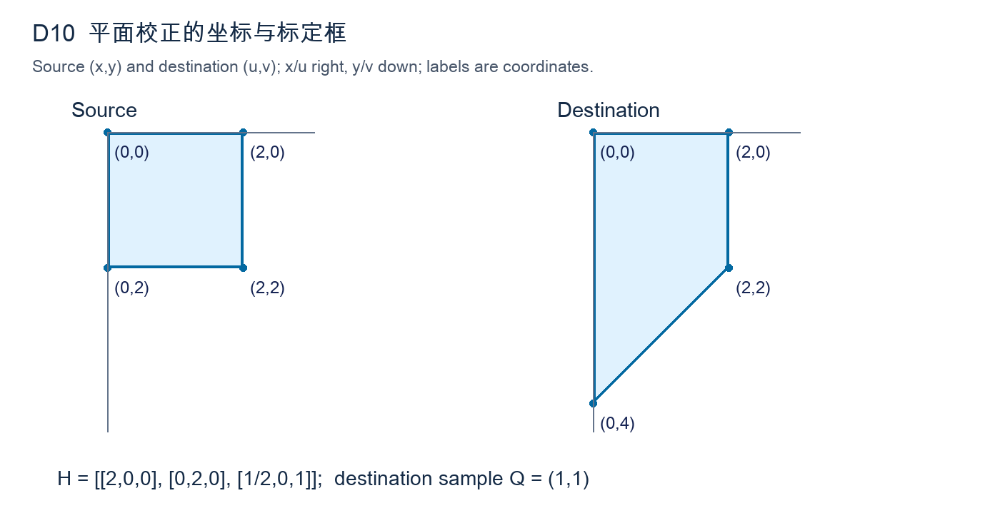

图D-10：源框顶点依次(0,0)、(2,0)、(2,2)、(0,2)；输出依次(0,0)、(2,0)、(2,2)、(0,4)。图形为坐标示意，所有数据以上述坐标为准。

#### 11. 斜向灰度共生统计（10分）

本题只给出三级离散灰度，不再重新量化。有效对数按实际矩阵边界决定，归一分母不是像素总数，也不是所有可能灰度对的种类数。

灰度矩阵A=[[0,0,1,2],[0,1,2,2],[1,2,2,0]]，行号向下、列号向右，均从0开始。只数位移(Δ行,Δ列)=(1,1)的有向像素对，越界不计，不添加反向对。共生矩阵C的行表示起点灰度，列表示终点灰度，灰度顺序0、1、2。（1）列出有效对并求C与P=C/ΣC。（5分）（2）求对比度Σ(i−j)²Pᵢⱼ和能量ΣPᵢⱼ²。（3分）（3）若图像整体旋转90°而位移不变，上述量必然不变吗？说明理由。（2分）

#### 12. 灰度开运算与白顶帽（10分）

本题研究相对于已知恒定背景的亮细节，信号幅度不限定为二值。所有中间结果均保留原灰度单位，不作阈值化或范围截断。

一维灰度信号定义在全部整数x上，x=−3,…,3时f=[5,5,9,9,9,5,8]，其余所有位置f=5。平坦结构元素B={−1,0,1}，原点0，腐蚀e(x)=min{f(x−1),f(x),f(x+1)}，开运算o(x)=max{e(x−1),e(x),e(x+1)}。（1）求x=−3,…,3上的e和o。（6分）（2）求白顶帽w=f−o，并说明本例保留何种亮结构。（3分）（3）若把未知图外值随意置0，为什么可能改变边界结果？（1分）

### 三、综合题（4题，共70分）

#### 13. 参考背景辅助的阴影分离（15分）

参考线与待检线已几何对齐，曝光和相机响应一致。缺陷仅改变局部透射率，不改变背景照明场；不得把两幅图分别均衡后再求比值。

图D-13是一条透射成像扫描线。无目标参考b=[30,40,60,80,60,40,30]，待检g=[30,40,30,80,30,40,30]；位置x=0,…,6由左到右，模型g(x)=b(x)t(x)，无加性噪声，所有b>0。暗缺陷使透射率t下降。（1）根据图中两条曲线，指出仅用g<35判缺陷会误报的位置并解释原因。（4分）（2）用参考校正恢复t，按t<0.75判缺陷。（5分）（3）写出对数域的等价分离形式。（3分）（4）若参考在某位置接近0，说明稳定处理及其代价。（3分）

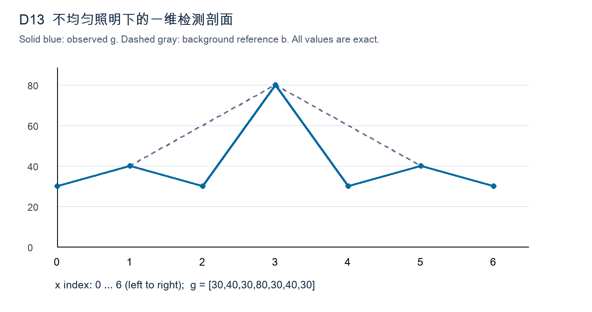

图D-13：蓝实线为g，灰虚线为b；纵轴为强度，横轴为位置编号；两条曲线数据均已在正文完整给出。

#### 14. 多尺度增强与边缘保真（15分）

可采用高斯差分、小波或其他可重建的多尺度方法。评分重点是各尺度与笔画、印章和噪点的关系，而不是笼统声称多尺度效果更好。

一幅灰度档案图同时含：缓慢变化的纸张底色、宽度约2像素的淡笔画、宽度约30像素的印章实心区、少量孤立亮噪点。要求增强淡笔画，同时保留印章整体灰度层次。不得仅写软件名称。（1）比较单一大窗口均值相减与多尺度分解各自可能保留或损伤的成分。（5分）（2）设计至少两个尺度的分解、增益和重建关系，给出完整表达式。（6分）（3）解释如何防止噪点放大和笔画旁的亮暗晕圈，并给出一种客观验证方式。（4分）

#### 15. 褪色地图的拼接与颜色一致性（20分）

两图之外还可使用地图上印刷的已知长度标尺，但不得假设所有匹配都正确。输出需标记缺失视野，不能把填充值误当成地图真实内容。

两张相邻地图照片有约30%重叠。纸张可视为同一平面，拍摄有透视差异，地图边框和文字有重复结构，局部图案褪色；两次曝光不同且一张边缘偏暗。不允许使用CNN。最终需输出可浏览的大图，并保留测距所需几何比例。（1）给出从特征匹配到稳健几何模型估计的流程及退化检查。（6分）（2）说明如何确定共同输出坐标、逆向采样和有效区域掩膜，并判断现有条件能否保证全图测距；如不能，指出还需何种几何约束。（4分）（3）设计重叠区的光度一致化与接缝融合，说明为何几何误差不能靠融合彻底修复。（6分）（4）提出几何与光度各一项独立验证及失效回退措施。（4分）

#### 16. 织物纹理的传统分类（20分）

类别名称中的横向和纵向默认相对工件规范摆放方向定义。可利用可见布边作为方向参考，但需说明参考缺失时怎样处理，避免任意旋转标签。

生产线要区分横向条纹、纵向条纹与无明显方向的粗糙织物。训练照片曝光、布面旋转角和拍摄距离会变，样本量有限。不得使用深度学习。（1）说明采集标定与灰度预处理应控制什么，并指出过度均衡的一项风险。（5分）（2）设计同时包含方向共生特征与尺度信息的特征向量，明确方向、量化、归一化约定。（6分）（3）给出标准化、PCA和分类器的训练/测试流程，说明是否应完全消除旋转信息。（5分）（4）设计验证划分和混淆分析，避免同一块布的相邻裁块导致虚高成绩。（4分）

---

## 电子科技大学830数字图像处理原创模拟试卷 E卷

考试时间：180分钟；满分：150分。原创训练卷，非官方真题，分值与答案为训练用拟定。

答题要求：按题内坐标、边界及统计约定作答；过程分依据关键步骤。未要求取整时保留精确值；设计题可采用等效方案，但须说明参数、依据、失败条件和验证。

### 一、简答题（8题，共40分）

#### 1. 滤波顺序的可交换性（5分）

两个滤波器均对整幅图像采用固定系数，不随像素值自适应变化。回答需区分理论无限信号与实际有限数组，不要求证明任意矩阵乘法性质。

两个线性空间不变滤波器依次作用于同一图像。（1）在无限域或一致循环边界下，为何通常可交换顺序？（2分）（2）若其中一步为中值滤波，是否仍普遍成立？（2分）（3）实际有限图像即使两步都线性，为何仍要说明边界处理？（1分）

#### 2. 有符号核与灰度范围（5分）

这里的负值是计算结果，图像原灰度仍全部非负。题目所说边缘强度统计是后续任务指标，不能用显示器无法显示负灰度作为截断理由。

对8位无符号图像使用零和的一阶差分核。（1）解释输出为何可以为负以及负号的意义。（2分）（2）说明先把所有负响应置0再进行边缘强度统计的后果。（2分）（3）给出一种计算阶段的数据类型处理原则。（1分）

#### 3. 频谱中心化的含义（5分）

采用常见的以左上角为数组索引原点的实现。中心化仅为频率坐标安排，输出图像尺寸不变；请说明空间操作对应的频域变化。

M、N均为偶数的图像做二维DFT。（1）为何常在变换前乘以(−1)^(x+y)？（2分）（2）这个操作与把图像空间中心移动到左上角是否同一回事？（2分）（3）逆变换后要如何解除该处理？（1分）

#### 4. 滤波器相位与边缘位置（5分）

设输入包含细线和孤立标志点，需要保持准确位置。两滤波器的幅度相同并不意味着它们具有相同的复数频率响应，勿忽略相位条件。

两个频域滤波器的幅度响应完全相同，但相位不同。（1）为什么它们的输出图像仍可能不同？（2分）（2）理想线性相位对应什么空间效果？（2分）（3）在目标定位任务中应额外检查哪一项误差？（1分）

#### 5. 带阻与陷波的选择（5分）

噪声候选峰位于一对共轭频率位置，未与直流重合。题目重点是频带选择与空间信息损失，不要求写出巴特沃斯陷波的完整公式。

某图频谱有一对远离直流的孤立强峰，同时真实对象也含相近半径的其他方向细纹理。（1）比较环形带阻与成对窄陷波的保留能力。（2分）（2）对实值图像为何通常对称设置一对陷波？（2分）（3）指出不能单凭强峰就断定其为噪声的原因。（1分）

#### 6. 可分离核的实现条件（5分）

乘法次数按每个输出像素独立估算，不考虑快速傅里叶变换、稀疏权重跳过或专用硬件。分离后的两条一维核长度分别为行数和列数。

一个m×n二维核恰好能写成h(i,j)=a(i)b(j)。（1）说明如何实现两次一维滤波。（2分）（2）比较逐像素的乘法次数，忽略边界。（2分）（3）为什么把任意核取横竖中间行列，并不能保证等价？（1分）

#### 7. 小波与傅里叶的局部性（5分）

小波采用同时带有尺度和平移位置索引的常规离散分解，暂不讨论压缩编码。回答需同时涉及局部结构定位与去噪可能损伤细节的原因。

图像仅左上角有一条细裂纹，其他区域平滑。（1）比较全图DFT与局部小波细节系数定位该裂纹的能力。（2分）（2）说明小波分解层数增加后，空间与频率分辨能力的大体变化。（2分）（3）为什么阈值处理细节系数仍可能损伤裂纹？（1分）

#### 8. 平滑与形态学的区别（5分）

结构元素具有明确原点，图外均为背景。细线中可能存在真实分叉，比较时不能仅依据滤后前景像素数多少判断保形效果或方法优劣。

对二值细线目标，分别使用均值滤波再阈值化和结构元素开运算。（1）比较两者决定像素保留的依据。（2分）（2）为何开运算的方向与大小会改变细线的存活情况？（2分）（3）给出一个适合采用重建开运算而非普通开运算的目的。（1分）

### 二、计算题（4题，共40分）

#### 9. 平滑改变直方图与二阶矩（10分）

直方图须按全部七个可能灰度列出，零计数也保留。方差描述当前四个位置的总体离散度，不使用除以三的样本方差或浮点结果的提前取整。

长度4的一维信号f=[0,0,6,6]，索引x=0,…,3。采用长度3均值核h=[1/3,1/3,1/3]，原点在中间，边界复制最近端点；只输出原4个位置，计算阶段不取整。定义总体方差σ²=(1/4)Σ(f−μ)²。（1）求滤后信号g。（3分）（2）列出f、g在灰度0至6的直方图计数。（3分）（3）比较两者均值与总体方差，并解释直方图变化不能独立说明空间结构改善。（4分）

#### 10. 差分的线性与循环卷积（10分）

这里的一维信号可看作图像中的一行，负滤波响应保留。循环卷积是周期延拓的明确定义，不允许在计算首元素时改成端点复制边界。

f[n]=[2,0,1,3]，仅n=0,…,3非零；h[0]=1、h[1]=−1，其余为0。卷积定义y[n]=Σₘh[m]f[n−m]。（1）求零延拓下的完整线性卷积，索引n=0,…,4。（4分）（2）把f改为4周期信号，求一周期循环卷积n=0,…,3。（3分）（3）用DFT计算完整线性卷积时最短需补到多长？解释两种结果首元素不同的原因。（3分）

#### 11. 二维频谱中的方向分离（10分）

像素均为实值，索引顺序始终写作行频率在前、列频率在后。判断条纹方向时请同时说明灰度在哪个方向变化，以避免横纹与横向变化混淆。

图E-11中4×4图像为f[y,x]=20+6cos(πx)+4cos(πy/2)，x、y=0,…,3。DFT取F[u,v]=Σ_yΣ_x f[y,x]exp[−j2π(uy+vx)/4]，逆变换乘1/16，不中心化。（1）列出所有非零频谱系数及其索引。（5分）（2）只将F[0,2]置0，其他系数不变，写出输出整幅图像。（3分）（3）该操作去除了哪一种空间方向的条纹？解释为何该奈奎斯特频率无需再找不同索引的共轭伙伴。（2分）

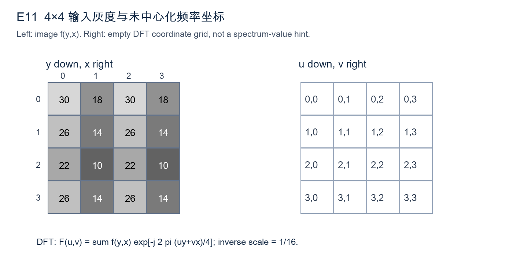

图E-11左侧数值矩阵为[[30,18,30,18],[26,14,26,14],[22,10,22,10],[26,14,26,14]]；右侧只是频率索引空格，不含答案。

#### 12. 量化后的水平共生矩阵（10分）

能量定义为归一化概率的平方和，不能对原始计数平方后直接报告。对称化问题只改变统计约定，不代表对原图进行镜像或旋转操作。

3位图像A=[[1,2,6,7],[0,5,4,2],[7,6,1,0]]先量化为Q：0至3映为0，4至7映为1。行向下、列向右。统计每行相邻的“左像素→右像素”，不跨行、不环绕、不对称补数。（1）给出Q与2×2有向共生计数矩阵C。（5分）（2）归一化并求对比度、能量。（3分）（3）若把C+Cᵀ再按其总和归一，本例P是否改变？这能否推广到任意图像？（2分）

### 三、综合题（4题，共70分）

#### 13. 斜边界中的滤波器选择（15分）

图中的脉冲与边界空间上分离，可先分析各自局部响应。后续非极大值抑制需基于梯度方向，而非直接沿图中斜线的延伸方向比较邻点。

图E-13给出7×7阵列，原点在左上角，x向右、y向下。除(1,1)外，x+y<6取20，x+y≥6取80；孤立点f(1,1)=140。只分析有完整3×3邻域的内部像素，不补边。（1）说明直接用一阶梯度检测时孤立点和斜边界分别会产生什么响应，勿把梯度方向等同于边界延伸方向。（4分）（2）针对该噪点，比较先3×3中值与先3×3均值的优缺点，并求两种方法在(1,1)的输出。（5分）（3）给出预处理后用Sobel求梯度模、方向及非极大值抑制的逻辑。（6分）

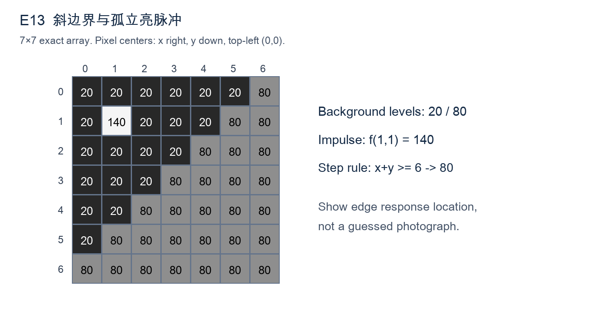

图E-13的全部数值由上述分段规则和单个替换点唯一确定，深灰20、较亮灰80、最亮140；图内同时印有各像素数值。

#### 14. 二维变换的基与能量（15分）

矩阵的第一个下标对应竖直基，第二个对应水平基。所有运算使用实数精确值，重建时不作舍入；平方能量是所有四个元素平方之和。

设正交归一2点变换矩阵W=(1/√2)[[1,1],[1,−1]]，图块A=[[4,4],[0,0]]，系数C=WAWᵀ，重建A=WᵀCW。（1）计算C并验证变换前后平方能量相同。（6分）（2）仅保留C₀₀，重建图块并解释丢失的结构方向。（5分）（3）说明2点正交DCT与此处矩阵的关系，以及为何不能据此断言大尺寸DCT与Haar完全相同。（4分）

#### 15. 周期干扰与真实纹理共存（20分）

可以使用参考帧辅助估计，但不能假设参考与产品图像像素值完全相同。物体移动量可记录，频率位置、相位和空间分布应分别讨论。

工业板面上有沿斜向排列的真实周期网纹，相机电源还引入位置固定的水平明暗条带。已获得同曝光的均匀白板参考帧和三张板面小幅移动后的观测帧。不得使用学习型去噪器。（1）设计区分真实纹理频峰与干扰频峰的证据链。（6分）（2）给出频域处理流程，明确填充、中心化、成对陷波和逆变换。（6分）（3）提出陷波宽度、过渡带与振铃之间的取舍。（4分）（4）说明如何验证没有把真实网纹删掉，以及完全重叠频率时的能力边界。（4分）

#### 16. 细导线分割与断点判断（20分）

交叉导线在图像中可连接为同一成分，因此单纯连通成分计数不能直接代表导线条数。允许输出待人工复核的候选断点，需保留处理证据。

灰度照片含宽约2至4像素的亮导线，背景照明缓慢变化；导线可交叉，另有少量亮尘点。目标是提取导线网络并标记真实断点，不能把所有小间隙都自动补上。不使用CNN。（1）设计照明校正、抑噪与多方向细线增强流程。（6分）（2）给出局部阈值及形态学步骤，并说明结构元素尺度依据。（5分）（3）说明如何由骨架识别端点、交叉点和可疑断裂，明确邻域与误差来源。（5分）（4）提出验证指标及错误修补的防范措施。（4分）

---

## 电子科技大学830数字图像处理原创模拟试卷 F卷

考试时间：180分钟；满分：150分。原创训练卷，非官方真题，分值与答案为训练用拟定。

答题要求：按题内坐标、边界及统计约定作答；过程分依据关键步骤。未要求取整时保留精确值；设计题可采用等效方案，但须说明参数、依据、失败条件和验证。

### 一、简答题（8题，共40分）

#### 1. 退化模型的适用范围（5分）

题目仅讨论灰度与空间坐标上的成像近似，不涉及图像压缩或传输丢包。可把模糊看作系统的点响应，但必须区分信号依赖与位置依赖。

采用g=h*f+η进行图像复原。（1）分别解释f、h、η的意义及卷积模型隐含的空间条件。（3分）（2）镜头失焦程度随图像位置显著改变时，为什么一个全局h可能不够？（1分）（3）说明曝光饱和为何通常不能仅靠该线性模型描述。（1分）

#### 2. 噪声分布与滤波器匹配（5分）

三种噪声分别独立讨论，不假设它们同时出现。对泊松噪声采用未经额外电子增益缩放的理想计数模型，不能直接套用恒定方差假设。

分别考虑：零均值加性高斯噪声、仅有少量亮脉冲的盐噪声、计数成像中的泊松噪声。（1）指出三者对灰度统计的典型影响。（3分）（2）为何不能把同一种线性均值滤波当作三种情况下都最优的选择？（2分）

#### 3. 逆滤波的不可恢复频率（5分）

退化函数在讨论频率处已知，不考虑估计误差。请分别从唯一性和稳定性回答；两者相关，但不存在零点并不意味着任意直接求逆都稳定。

退化传递函数H在某一频率等于0。（1）无噪声时能否从该频率的观测G唯一确定F？说明原因。（2分）（2）H接近0但非0时，加性噪声会怎样影响直接逆滤波？（2分）（3）加入正则化是否等于重新测得了丢失信息？（1分）

#### 4. 噪声功率估计（5分）

本题没有可用的干净参考图，允许提出额外采集重复帧的方案。若用拟合趋势后的残差，应说明它与真实噪声并非自动严格相等。

只有一张未知内容的噪声图像，打算从其中一块区域估计噪声方差。（1）该区域应满足哪些条件？（2分）（2）若区域含缓慢灰度梯度，直接计算样本方差会出现什么偏差？（2分）（3）给出一种改善办法。（1分）

#### 5. 正则化参数的作用（5分）

所有候选解使用同一图像域和边界约定，避免将不同裁剪区域的残差直接比较。参数选择应能被数据或独立验证检查，而非只凭主观锐度。

约束最小二乘复原采用J(f)=||h*f−g||²+λ||Lf||²，λ≥0，L为离散拉普拉斯。（1）解释两项分别约束什么。（2分）（2）λ过小与过大的典型后果各是什么？（2分）（3）给出一种选择λ的可检验依据。（1分）

#### 6. 投影与反投影（5分）

投影角度表示直线法向的方向，距离参数表示该直线到坐标原点的有符号距离。无需推导完整重建公式，但不能把投影误写成单个像素取样。

对连续二维函数f(x,y)进行平行束投影。（1）写出Radon投影pθ(s)的几何含义，可用积分表达。（2分）（2）简述傅里叶切片定理。（2分）（3）为何未经滤波的直接反投影通常模糊？（1分）

#### 7. 退化估计的证据（5分）

允许利用同一次采集中的已知标记，但不能事先读取未知清晰整图。应区分观测频谱中的系统零点、真实图案结构与随机噪声扰动。

包装线上拍到一幅近似水平运动模糊图。（1）分别说明利用已知标记和频谱暗条纹估计退化函数的思路。（3分）（2）为什么误把物体本身周期纹理当作模糊零点会影响复原？（1分）（3）给出一种估计后检查h合理性的方法。（1分）

#### 8. 复原与识别的目标差异（5分）

分类器已有类别标签训练数据，但真实应用时没有测试标签。问题关注预处理造成的分布变化和质量控制，不要求推导完整高斯后验公式。

某分类系统把去模糊后的纹理特征送入高斯贝叶斯分类器。（1）解释视觉更锐利不一定分类更准确的原因。（2分）（2）说明训练集与测试集预处理需要怎样保持一致。（2分）（3）为何低置信度或严重退化图像应允许拒识？（1分）

### 二、计算题（4题，共40分）

#### 9. 平坦区直方图与噪声方差（10分）

观测值已减除固定电子偏置且未饱和，标定常数四视为准确已知。第一个问题的分布来自所给计数，后两个问题研究该经验分布的重复抽样。

已知某标定平坦区真实灰度恒为4，10个观测像素在灰度2、3、4、5、6的计数依次为[1,2,4,2,1]，其他灰度计数0。将经验频率视为概率，不采用无偏样本方差修正。（1）写出噪声η=g−4的概率分布、均值与方差。（5分）（2）若两个独立、同分布的此类噪声样本取平均，其均值和方差为多少？（3分）（3）若两个噪声的相关系数为ρ，写出平均后方差随ρ的表达式，并指出ρ=1时的结论。（2分）

#### 10. 约束最小二乘的频率解（10分）

所给正则算子只作为确定频率响应使用，无需从空间模板重新推导。正则参数不随频率变化，最终图像要求保留实值，不进行灰度范围裁剪。

长度4循环退化模型采用正变换无归一系数、逆DFT乘1/4。频率索引k=0,1,2,3，已知G=[8,2,1,2]、H=[1,1/2,1/4,1/2]、正则算子频率响应P=[0,2,4,2]，均为实数。取λ=1/4，使用F̂[k]=H*[k]G[k]/(|H[k]|²+λ|P[k]|²)。（1）逐频率求F̂，保留分数。（5分）（2）逆DFT求空间域f̂，保留分数或四位小数。（3分）（3）解释为什么本例直流项不受λ影响，以及λ增大时非零频率的变化。（2分）

#### 11. 两级Haar软阈值复原（10分）

最低频系数不参加阈值操作，细节排序在计算与重建中必须保持一致。软阈值不同于直接删除小系数后保留其余幅度不变的硬阈值。

一维观测向量g=[4,6,7,7]，使用正交归一Haar变换。第一级对相邻一对(a,b)计算低频(a+b)/√2和细节(a−b)/√2；第二级仅对两个低频再作同样运算。系数按[最粗低频c，最粗细节d，最细细节e₀,e₁]排列。（1）求全部系数。（4分）（2）仅对三个细节使用软阈值Sτ(z)=sign(z)max(|z|−τ,0)，τ=3/2，低频不变；求阈值后系数。（3分）（3）逐级逆变换重建向量并判断平均灰度是否保持。（3分）

#### 12. 少量投影的唯一性（10分）

像素值允许为任意非负实数，不额外要求整数，因此唯一性必须由投影约束本身判断。图中的额外斜射线是独立测量，不是由行列和计算所得。

图F-12为2×2未知非负图像[[a,b],[c,d]]。离散射线按图中约定对经过像素求和，路径权重全为1，无噪声；已知行投影a+b=3、c+d=7，列投影a+c=4、b+d=6。（1）用单参数写出所有满足行列投影的解，并利用非负性给出参数范围。（4分）（2）加入斜射线a+d=5后求唯一解。（4分）（3）解释为何仅有行列投影并不足够，不能只按“方程4个、未知数4个”判断。（2分）


图F-12：a、b为上行，c、d为下行；橙色文字为额外斜射线a+d，蓝线表示行求和；所有射线均按离散权重1定义，不使用连续几何长度。

### 三、综合题（4题，共70分）

#### 13. 点扩散函数零点与多帧融合（15分）

两幅观测已经精确配准，PSF也已知，并非需要同时估计运动轨迹的盲复原问题。融合公式需说明分子共轭与分母能量，不能直接平均两幅图。

图F-13给出长度4的两个循环PSF：h_A=[1/2,0,1/2,0]，h_B=[3/4,1/4,0,0]，索引n=0,…,3，核原点n=0。两幅图由同一未知f经这两个PSF生成，先忽略噪声。DFT正变换无归一，逆变换乘1/4。（1）根据图中脉冲间隔求H_A、H_B，指出各自是否有零点。（6分）（2）构造一非零实信号z使h_A*z=0，并说明仅观测A的歧义。（4分）（3）若两帧有独立同方差噪声，写出逐频率最小二乘融合公式并说明B帧的补充作用。（5分）


图F-13为精确离散茎状图：A在0、2处各为1/2，B在0处3/4、1处1/4，其余为0；横轴向右递增，不把脉冲连接为连续模糊曲线。

#### 14. 重建能保留什么形状（15分）

前景采用四连通解释，孔洞指方框内部与外界不连通的背景。标记严格包含于掩膜，所有迭代结果均须被原掩膜限制，不得自行闭运算补点。

二值掩膜定义在0≤x≤8、0≤y≤6的整数网格上，x向右、y向下。A含方形边框{(x,y):1≤x≤5,1≤y≤5且x∈{1,5}或y∈{1,5}}，另加(6,3)、(7,3)两点构成与边框相连的毛刺，再加孤立点(8,6)；其余为0。方形边框条件整体括在1≤x,y≤5内。标记M={(1,1)}，结构元素B={(0,0),(±1,0),(0,±1)}，图外为0。（1）写出膨胀重建的迭代式与终止条件。（4分）（2）描述最终重建结果、孔洞和孤立点是否保留。（6分）（3）说明能否同时去除与边框相连的毛刺，并提出一种额外处理及其风险。（5分）

#### 15. 运动模糊标签的可审核复原（20分）

最终识别需能追溯到原始照片中的字符位置，未知字符允许输出拒识。题目不要求声称恢复饱和区原始灰度，也不能把锐化当成退化参数估计。

流水线上同款包装标签包含黑色字符、灰色细分隔线和一条已知宽度的定位条。照片存在近似水平方向运动模糊与弱加性噪声，部分亮背景饱和。要求恢复可读标签并输出字符识别结果，禁止CNN。（1）给出退化及噪声参数估计方案，并说明定位条和饱和掩膜的用途。（6分）（2）比较截断逆滤波、维纳及约束最小二乘，选择一个主方案写明所需参数。（6分）（3）设计复原后字符分割与传统识别，同时说明怎样防止振铃被当作笔画。（5分）（4）给出可追溯的验收与失败回退方式。（3分）

#### 16. 有限投影重建与材料分类（20分）

两类工件可有相近平均灰度，分类证据依赖孔洞及纹理。所有尺度阈值应联系像素对应的实际尺寸，不能仅根据重建图看起来更平滑作结论。

系统通过多个角度的平行束投影重建小工件截面，并依据孔洞结构与粗糙纹理把工件分为两类。投影中有随机噪声、少量坏探测器形成的异常通道，而且角度覆盖不足180°。不使用深度学习。（1）设计投影预处理与异常通道处理，区分随机噪声与固定异常。（5分）（2）解释有限角与噪声分别带来什么重建问题，给出滤波反投影或正则化迭代方案。（6分）（3）设计保留孔洞的分割、形态/纹理特征与传统分类流程。（5分）（4）提出投影域和最终分类两层验证，并明确不能做出的保证。（4分）

---

## G卷｜形态学、拓扑与结构保持

原创模拟卷，非官方真题；根据已提供考纲及历史题型设计。满分150分，时间180分钟。建议简答40分钟、计算50分钟、综合80分钟、检查10分钟。所有评分均为本卷训练参考。

约定：二值前景为1、背景为0；二维矩阵左上角为(r,c)=(0,0)，r向下、c向右。结构元素均显式列出偏移，未说明时不作灰度截断。写明推导，只有结论不能获得全部过程分。综合题允许等效且可执行的方案。

### 一、简答题（共40分）

#### 1. 连通与拓扑约定（5分）

两个前景像素仅对角接触。说明4邻接与8邻接对目标计数的影响（2分）；为什么二值图像分析常让前景与背景采用互补邻接，而不同时任意采用8邻接（2分）？说明“孔洞”中的背景与图像外部有什么关系（1分）。

#### 2. 结构元素与方向选择（5分）

需保留图像中宽2像素、长30像素的水平亮线，同时压制同样宽度的竖直亮线。说明如何选择线形结构元素并使用开运算（3分）；若水平亮线中间存在1像素断口，为什么不能不加判断地先做大尺度闭运算（2分）？

#### 3. 平坦与非平坦灰度形态学（5分）

分别写出一维灰度膨胀中平坦结构元素和非平坦结构函数的表达式，明确反射位置与加法项（3分）；解释平坦膨胀为何一般不是线性滤波，并给出一个能说明问题的性质（2分）。

#### 4. 开运算与重建开运算（5分）

针对带有细长突出部分的宽目标，比较普通开运算与重建开运算的典型结果（3分）；说明重建开运算的标记图、掩膜图与停止条件（2分）。不要求证明所有形状下的结果。

#### 5. 距离变换与骨架（5分）

说明距离变换如何把二值形状变成灰度函数，并分别给出市街距离和欧氏距离的定义（3分）；说明直接取距离图全部局部极大值，为何不一定获得连通、单像素宽且稳定的骨架（2分）。

#### 6. 形态学梯度与微分边缘（5分）

写出平坦结构元素B下的形态学梯度（2分）；比较它与有符号的一阶微分响应在输出符号、边缘方向及结构元素尺度上的差别（3分）。

#### 7. 彩色形态学的通道问题（5分）

彩色图像每个RGB通道独立膨胀，为什么可能生成邻域中不存在的颜色（2分）？给出一个仅含两种颜色的具体反例（1分），并提出一种保留颜色关系的可行处理策略及限制（2分）。

#### 8. 频域与结构算子的边界（5分）

解释为什么一般不能通过“输入DFT乘一个固定传递函数”实现二值开运算（3分）；若图像含正弦周期干扰和孤立亮点，给出频域处理与形态学处理各自承担的任务，并说明需验证的细节（2分）。

### 二、计算题（共40分）

#### 9. 非平坦灰度膨胀与腐蚀（10分）

在长度5的周期域x=0,…,4上，f=[2,5,1,4,3]。结构函数的定义域为{-1,0,1}，b(-1)=0，b(0)=1，b(1)=0，原点为0。所有下标模5，不作截断。

（1）按D(x)=max_y[f(x-y)+b(y)]计算D，至少展开x=0的一次运算（4分）。
（2）按E(x)=min_y[f(x+y)-b(y)]计算E，并展开x=0（4分）。
（3）计算D-E，解释中心高度1为什么不能直接当作平坦结构元素处理（2分）。

#### 10. 击中—击不中定位端点（10分）

给定5×7二值图像，矩阵外为0：
```
0 0 0 0 0 0 0
0 1 1 1 0 0 0
0 0 0 0 0 1 0
0 1 1 0 0 1 0
0 0 0 0 0 0 0
```
以待检像素为原点，前景模板B1={(0,0),(0,-1)}；背景模板B2={(-1,0),(1,0),(0,1)}，其余位置不作要求。
（1）写出基于A、补集A^c和腐蚀的集合式（2分）。
（2）列出所有满足B1的位置，再列出击中—击不中的最终坐标及数量（5分）。
（3）该模板是否能检出所有方向的线段端点？给出覆盖四个轴向的办法，并指出它对斜线的限制（3分）。

#### 11. 白顶帽及其直方图（10分）

长度8周期信号f=[2,2,7,2,2,5,5,5]，平坦B={-1,0,1}，原点0，所有下标模8。先腐蚀后膨胀形成开运算。
（1）计算腐蚀序列及开运算序列（4分）。
（2）计算白顶帽W=f-(f∘B)，列出W的非零灰度及完整非零频数表，计算平均值（3分）。
（3）用W≥3检测局部亮目标，列出坐标；解释峰高为5的三像素平台与峰高为7的单点为何受到不同处理（3分）。

#### 12. 非对称模板的相关与卷积（10分）

图像邻域F与权重K如下，原点均在中心；只求中心响应，不归一化，不取绝对值：
```
F = 1 2 4       K =  0  1  2
    3 5 7           -1  0  1
    6 8 9           -2 -1  0
```
（1）按对应位置乘积求和计算相关响应（3分）。
（2）把K旋转180°后计算卷积响应（3分）。
（3）求K的系数和，说明对常量图像的响应；解释只比较响应绝对值会丢失什么信息（4分）。

### 三、综合题（共70分）

#### 13. 图像拓扑与填孔（15分）

图G-1是精确7×11像素示意图，黑色为前景1；坐标从0开始。原始数据为：
```
0 0 0 0 0 0 0 0 0 0 0
0 1 1 1 0 0 0 1 0 0 0
0 1 0 1 0 0 0 0 1 0 0
0 1 1 1 0 0 0 0 0 1 0
0 0 0 0 0 0 0 0 0 0 0
0 0 0 0 0 0 0 0 0 0 0
0 0 0 0 0 0 0 0 0 0 0
```
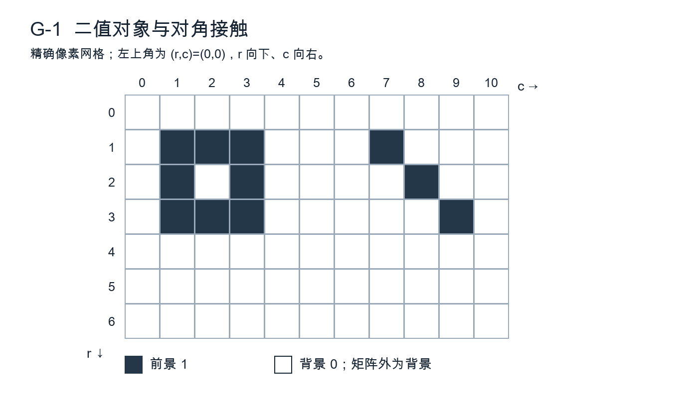

（1）分别在“前景4、背景8”和“前景8、背景4”下求前景分量C、孔洞H和欧拉数χ=C-H（6分）。
（2）采用背景8邻接，从图像边界背景出发设计迭代填孔，给出标记、掩膜、迭代式、停止条件，并列出本图新增的前景像素（6分）。
（3）判断“欧拉数相同就可认定两个对象形状相同”是否成立；构造一个不依赖本图尺寸的反例（3分）。

#### 14. 灰度重建中的狭窄瓶颈（15分）

图G-2显示掩膜F=[1,3,3,2,4,4,1]与标记X0=[0,0,3,0,0,0,0]。x=0,…,6；域外固定为0；B={-1,0,1}为平坦结构元素。迭代规定为Xk+1=min(F,δB(Xk))，逐点取最小值。

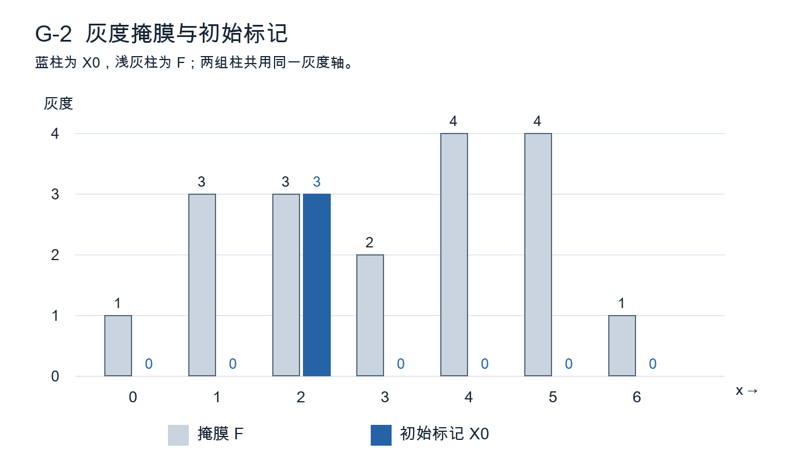

（1）验证标记不超过掩膜，求X1、X2以及最终稳定序列，说明稳定所需的有效变化轮数（7分）。
（2）解释右侧灰度4的平台为何不能恢复到4，指出约束传播的瓶颈位置（4分）。
（3）普通平坦膨胀若不与F取最小值，会出现何种越界传播？说明增加迭代次数能否消除本题瓶颈（4分）。

#### 15. 印刷导线的断裂与毛刺检测（20分）

固定相机采集灰度印刷导线图，导线暗、底板亮。主导线宽6—8像素；需报告长度至少3像素的侧向毛刺及宽1—2像素的断口。存在缓慢变化的照明与少量椒盐噪声，正常导线间最小距离只有4像素。不使用深度学习，不允许以修复图代替缺陷证据。

（1）设计照明校正、去噪、阈值分割顺序，说明哪些参数必须依据样本确定（5分）。
（2）分别提出毛刺候选和断口候选的生成办法，并解释为何不能使用同一个大结构元素一次解决两种缺陷（6分）。
（3）给出至少三项用于候选验证的几何或灰度证据，说明如何保留原图坐标与缺陷尺寸（5分）。
（4）制定包含正常窄间隔、交叉点、弯角与真实缺陷的评估方案，报告两种可量化指标（4分）。

#### 16. 多尺度亮斑与暗坑的联合检测（20分）

单幅12位灰度表面图中，背景在约100像素尺度缓慢变化；待检亮斑和暗坑直径约3—9像素，另有宽约2像素、跨越整图的条纹。目标之间可能相距5像素。不得假设所有缺陷具有同一对比度，也不得直接将图像缩为8位后丢弃原值。

（1）设计白顶帽、黑顶帽与多尺度结构元素的检测流程，写出两个残差定义，并说明如何选择尺度覆盖目标（6分）。
（2）提出抑制条纹且保留近邻小目标的策略，说明方向估计与误删风险（5分）。
（3）说明亮暗候选的阈值设定、相邻目标分离与重叠框去重办法（5分）。
（4）给出数据划分和漏检复查方案，说明为什么只报告处理后图像“更清楚”不足以证明检测有效（4分）。

---

## H卷｜边缘、阈值与区域分割

原创模拟卷，非官方真题；根据已提供考纲及历史题型设计。满分150分，时间180分钟。建议简答40分钟、计算50分钟、综合80分钟、检查10分钟。作答时保留足以复核的中间量。

约定：矩阵左上角为(r,c)=(0,0)，r向下、c向右；几何坐标用x=c、y=r。图中灰度是精确教学数据，不是实拍样本。未要求的量化、归一化、边缘补齐不得自行添加。阈值等号归属以各题为准。

### 一、简答题（共40分）

#### 1. 边缘位置与平滑尺度（5分）

同一幅图先用标准差σ=1和σ=3的高斯滤波，再计算梯度。解释增大σ对噪声、细小结构及相邻边缘分辨能力的影响（3分）；说明为什么不能只凭梯度峰值大小判断哪一种尺度更好（2分）。

#### 2. 拉普拉斯零交叉（5分）

为什么拉普拉斯高斯算子需要先平滑（2分）？说明零交叉与一阶梯度峰的关系，并解释“所有零交叉都是有效物体边界”为什么不成立（3分）。

#### 3. 非极大值抑制的方向（5分）

给出梯度方向与边缘切线方向的关系（2分）；说明非极大值抑制应沿哪一方向比较，以及把方向量化成0°、45°、90°、135°会带来什么近似误差（3分）。

#### 4. 全局阈值的假设（5分）

分别解释双峰直方图为何常利于阈值分割、目标占比极小时Otsu可能出现什么问题（3分）；对于同一物体在阴影和亮区分别落入不同灰度范围的情况，提出一项改进并说明其代价（2分）。

#### 5. 区域生长的更新策略（5分）

以“与当前区域均值差不超过阈值”为准则，逐点接纳和分批同时接纳是否必然给出同一结果？解释原因（3分）；给出一种可复现的访问与更新规则，并说明空候选集时怎样终止（2分）。

#### 6. 分水岭与标记控制（5分）

说明直接在梯度图上做分水岭容易过分割的原因（2分）；解释内部标记和外部标记各自的作用，以及错误标记对结果的影响（3分）。

#### 7. 超像素与语义类别（5分）

说明超像素中颜色距离与空间距离为什么需要尺度协调（2分）；判断“得到100个超像素就得到100个物体”是否正确，给出超像素之后还需完成的任务（3分）。

#### 8. 分割评估中的类别不平衡（5分）

图像99%为背景。若算法把全部像素判为背景，计算像素准确率与前景召回率（2分）；定义前景交并比IoU，并说明按图像/对象统计与把全数据像素混在一起统计可能产生的区别（3分）。

### 二、计算题（共40分）

#### 9. Sobel方向与边缘保留（10分）

只计算下列3×3邻域中心，采用相关，不翻转核，不除以8：
```
F = 10 10 30      Sx = -1 0 1      Sy = -1 -2 -1
    10 20 40           -2 0 2            0  0  0
    10 30 50           -1 0 1            1  2  1
```
（1）求Gx、Gy及欧氏幅值M（4分）。
（2）以x向右、y向下求θ=atan2(Gy,Gx)，归约到[0°,180°)，按最近方向量化至{0°,45°,90°,135°}（3分）。
（3）沿量化梯度方向的两个邻点幅值分别为120和140，中心仅当不小于两者才保留。判断中心是否保留；角度可保留arctan精确式，幅值可保留根式，若写小数则保留两位（3分）。

#### 10. 迭代阈值及离散停止（10分）

灰度样本为[0,0,1,2,3,6,7,9]。初值T0=2，每轮按C0={f≤Tk}、C1={f>Tk}分组，求均值μ0、μ1，令Tk+1=(μ0+μ1)/2。均值和阈值不取整。
（1）列出前三次更新的两类成员、均值与阈值，分数或四位小数均可（6分）。
（2）给出稳定分组与最终阈值（2分）。
（3）解释为什么“阈值数值尚改变”与“像素分组改变”不是同一件事，并说明一般实现怎样处理空类（2分）。

#### 11. 超像素距离中的紧致度（10分）

为便于手算，仅用单通道颜色L。像素P=(x,y,L)=(4,2,30)，三个中心A=(2,2,29)、B=(5,4,30)、C=(7,2,29)，间距尺度S=4。定义D²=(L-Lk)²+(m/S)²[(x-xk)²+(y-yk)²]；最小距离决定归属，平局选字母靠前者。
（1）m=10时计算三个D²并判归属（4分）。
（2）m=2时重新计算并判归属，解释变化的原因（3分）。
（3）若最终某簇仅有P和Q=(6,4,34)，按三个分量分别平均更新中心；说明新中心是否必须位于原图某个像素上（3分）。

#### 12. 掩膜回映射与灰度插值（10分）

源图为2×2灰度矩阵[[20,40],[60,100]]，四像素中心坐标为(0,0)、(1,0)、(0,1)、(1,1)。前向几何变换为x′=2x+0.5，y′=y+0.25。仅处理映射落入[0,1]²的点。
（1）写逆变换，求输出位置(1.5,0.75)的源坐标及双线性插值灰度（5分）。
（2）若源图二值标签为[[0,0],[0,1]]，该位置按最近邻取标签；遇等距离时选较小r，再选较小c。给出标签值，并解释不直接把双线性结果当离散类别的原因（3分）。
（3）求此变换连续几何面积的比例，并说明像素目标计数为何不一定恰好按该比例变化（2分）。

### 三、综合题（共70分）

#### 13. 双阈值连接的图示推演（15分）

图H-1给出已完成非极大值抑制的幅值M，原始矩阵如下。采用8邻接：M≥7为强边缘，3≤M<7为弱边缘，其余为非边缘。最终保留强边缘及经强/弱候选路径连到强边缘的全部弱边缘。
```
0 0 0 0 0 0 0
0 8 4 0 4 4 0
0 0 4 0 0 4 0
0 0 0 4 0 0 0
0 0 0 0 0 0 0
```


（1）列出强边缘、弱边缘和最终保留像素的坐标集合（6分）。
（2）用集合重建写出实现过程，注明标记、掩膜、邻接与停止条件（5分）。
（3）若改为4邻接，哪些最终结果改变？解释为什么不能把“双阈值连接”实现为对每个弱像素仅检查一次邻域中是否有原始强像素（4分）。

#### 14. 邻接区域合并的顺序（15分）

图H-2有四个竖直区域A、B、C、D，各占2列×2行，灰度依次恒为10、15、20、40。只有共边区域相邻，区域初始面积均为4，边界不跨图像边缘循环。


合并规则：相邻区域均值差≤6才有资格；每轮选差值最小的一对，平局优先选包含最靠左初始区域的一对。合并后均值按像素数加权，更新邻接关系，再继续。
（1）列出初始邻接边、可合并边，按指定规则计算最终区域及均值（6分）。
（2）只把第一次平局改为优先合并B、C，计算最后分区，说明顺序依赖的来源（5分）。
（3）提出一种减少任意访问顺序影响的策略，并指出其仍然需要任务依据来确定什么（4分）。

#### 15. 阴影下的透明瓶轮廓提取（20分）

固定视角下，一排透明瓶位于浅色背景。瓶身与背景灰度接近，瓶口存在较强边缘，部分瓶身边缘断裂；投影阴影与瓶体相连，背景有少量细线。要求获得每瓶外轮廓及宽度随高度的曲线，不使用深度学习。不能假定瓶身总比背景暗。

（1）说明全局单阈值失败的原因，设计平场校正及多尺度边缘候选方法（5分）。
（2）利用瓶口、近似轴对称和轮廓连续性提出连接与分离规则，限制最大补连间隔并说明如何排除阴影（6分）。
（3）写出由轮廓得到宽度曲线的坐标与测量步骤，说明倾斜瓶和缺边行的处理（5分）。
（4）设计轮廓定位及宽度测量的评价，说明如何处置无法可靠闭合的瓶体（4分）。

#### 16. 彩色籽粒与黏连分割（20分）

浅色盘面上有红褐、浅黄两种籽粒，部分接触成团，表面有高光。目标是输出实例掩膜和两类数量；盘边也为红褐色，采集距离在小范围内改变。不使用CNN，可使用颜色空间、超像素、形态学、距离变换与传统分类方法。

（1）给出颜色与亮度处理流程，说明高光、低饱和度区域不能仅按色相硬分类的原因（5分）。
（2）设计盘内有效区和前景候选的形成方法，说明超像素可以在哪一步使用，以及跨籽粒边界的超像素如何处理（5分）。
（3）对接触团块提出标记控制的分离办法，给出标记数量过多、过少时的可观测异常与纠正策略（6分）。
（4）说明两种籽粒计数与分割应如何分别评价，如何避免调参使用测试集（4分）。

---

## I卷｜特征、纹理与模式分类

原创模拟卷，非官方真题；根据已提供考纲及历史题型设计。满分150分，时间180分钟。建议简答40分钟、计算50分钟、综合80分钟、检查10分钟。所有涉及训练的数据变换，应区分参数估计与对新样本应用。

约定：二维矩阵采用(r,c)，左上为(0,0)，r向下、c向右；几何点采用(x,y)，除另有定义外x向右、y向下。对数熵默认以2为底，0log₂0按0计。精确根式优先，近似量保留四位小数。图形均为原创几何示意，数据同时在正文列出。

### 一、简答题（共40分）

#### 1. 描述子的不变性取舍（5分）

分别说明平移、旋转和尺度不变描述子的含义（3分）；若任务是区分数字“6”和“9”，为什么不能不加判断地把所有旋转都视为等价（2分）？

#### 2. 原始矩、中心矩与归一化矩（5分）

给出二值区域m00和质心的计算式（2分）；说明中心矩消除哪种变化，归一化中心矩希望消除哪种变化，并指出不变性成立需要怎样的尺度/采样前提（3分）。

#### 3. PCA与判别信息（5分）

说明PCA的优化目标与首个主轴的求法（3分）；判断“方差最小的方向一定与分类无关”是否正确，并用类内/类间变化作解释（2分）。

#### 4. 特征标准化的时机（5分）

一个特征以像素面积计，另一特征为[0,1]中的纹理能量。说明直接做欧氏距离或PCA的风险（2分）；说明训练、验证、测试时标准化参数应如何估计和复用，为什么不能用全体数据统一估计（3分）。

#### 5. GLCM的方向与熵（5分）

解释“右邻有向共生矩阵”和“对称共生矩阵”的计数差别（2分）；给出归一化矩阵的对比度与熵定义，说明相同灰度直方图能否保证这些量相同（3分）。

#### 6. SIFT尺度空间（5分）

按顺序概述SIFT从尺度空间到局部描述子的主要环节（3分）；说明旋转与尺度适应能力不等于对任意视角、严重模糊和重复纹理都能可靠匹配（2分）。

#### 7. 贝叶斯后验与先验变化（5分）

写出后验概率与似然、先验之间的关系，并说明分母在两类比较中能否省略（3分）；模型在均衡训练样本上表现良好，为何不能直接保证低患病率或低缺陷率现场的阳性预测值也很高（2分）？本题只作一般模式分类解释。

#### 8. CNN特征图与池化（5分）

说明卷积共享权重与局部连接对参数量和空间信息的影响（3分）；解释平移等变与平移不变的区别，以及池化为何不能保证对任意平移严格不变（2分）。

### 二、计算题（共40分）

#### 9. 二维样本的主成分投影（10分）

六个二维样本按行列出：X=[(3,4),(1,2),(3,3),(1,3),(2,4),(2,2)]。使用总体协方差C=(1/6)Σ(xi-μ)(xi-μ)^T，不做逐特征方差标准化。特征向量取单位长度，第一分量非负。
（1）求均值μ和C（3分）。
（2）求两个特征值及第一主轴u1，计算只保留第一主成分时的方差贡献率（3分）。
（3）计算六个样本的第一主成分得分；用第一主成分重建样本(3,3)，求重建点和平方欧氏误差（4分）。

#### 10. 两个方向的有向共生矩阵（10分）

灰度级只有0和1，图像为：
```
0 0 1
1 1 0
0 1 1
```
定义C_d(i,j)为当前像素值i、偏移d处像素值j的有效有向对数，不计反向对，不绕回；分别取d_h=(Δr,Δc)=(0,1)与d_v=(1,0)。矩阵行是i、列是j。
（1）列出两个计数矩阵与各自对数（4分）。
（2）分别归一化，计算对比度Σ(i-j)²P(i,j)与能量ΣP(i,j)²（4分）。
（3）若改作对称计数C+C^T，归一化分母是什么？说明对比度是否因此改变及原因（2分）。

#### 11. 闭合链码与循环差分（10分）

以x向右、y向下，4方向编码0=右、1=下、2=左、3=上。边界按下列顶点逐单位步行进并闭合：
(0,0)→(1,0)→(2,0)→(2,1)→(1,1)→(0,1)→(0,0)。
（1）写长度6的链码c及循环一阶差分d_i=(c_{i+1}-c_i)mod4，末项使用c_0（4分）。
（2）图像绕原点顺时针旋转90°，仍按原边界行进次序，写新的链码与差分（3分）。
（3）将d的所有循环移位中按字典序最小的序列作为形状数，给出结果，并说明这一步与差分分别针对什么变化；是否因此自动尺度不变（3分）。

#### 12. L形区域的中心矩与主轴（10分）

将五个等权前景像素视为位于中心的单位点质量，坐标为S={(0,0),(1,0),(2,0),(0,1),(0,2)}。定义mpq=Σx^p y^q，μpq=Σ(x-x̄)^p(y-ȳ)^q。
（1）求m00、m10、m01、m20、m02、m11及质心（4分）。
（2）求μ20、μ02、μ11及坐标协方差矩阵C=(1/m00)[[μ20,μ11],[μ11,μ02]]（3分）。
（3）求最大特征值方向对应的单位主轴，并说明把全部点平移(10,-3)后质心与C分别如何改变（3分）。主轴正负等价；不按连续面积处理这五个点。

### 三、综合题（共70分）

#### 13. 相同直方图的纹理判别（15分）

图I-1给出两个4×4二值纹理，黑色为1、白色为0。A每行都是[0,1,0,1]；B四行依次为[0,1,0,1]、[1,0,1,0]、[0,1,0,1]、[1,0,1,0]。采用有效像素对，不绕回。

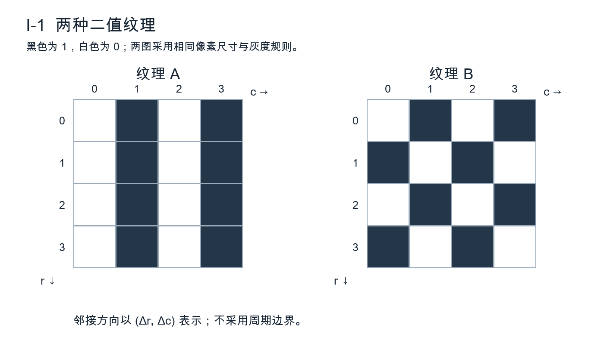

（1）分别求灰度直方图概率及灰度熵，说明能否仅据此区分两图（4分）。
（2）用位移(0,1)和(1,0)的GLCM对比度构成二维特征，求两图特征，并说明它捕捉了什么空间差异（5分）。
（3）若纹理可能旋转90°，提出一个保持本题可分性的方向汇聚办法；若把位移改为2像素，又有哪些信息可能消失？指出多尺度纹理描述的必要性（6分）。

#### 14. 局部匹配的几何一致性（15分）

图I-2为两图局部关键点坐标，均x向右、y向下。源点P1=(1,1)、P2=(5,1)、P3=(5,4)、P4=(1,4)；目标点Q1=(3,2)、Q2=(7,2)、Q3=(7,5)、Q4=(8,1)，另有未参加初始匹配的Q5=(3,5)。初始四对为Pi↔Qi，i=1,…,4。已知真实图间关系为平移，内点条件为欧氏重投影误差≤0.25像素。

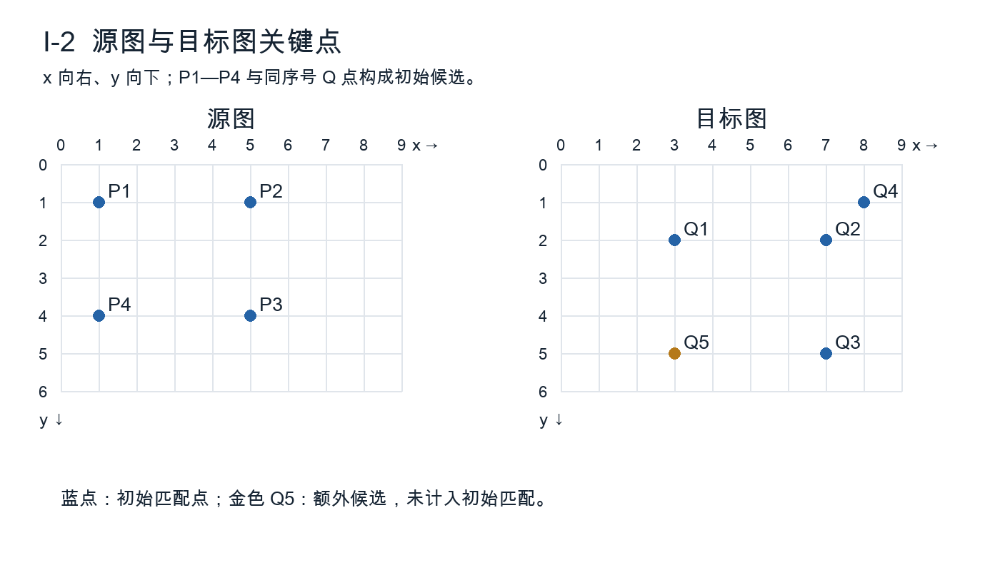

（1）枚举每一对匹配单独产生的平移假设，给出各假设的内点数、最佳平移与外点（6分）。
（2）两个独立待判匹配的最近/次近描述子距离分别为(0.20,0.21)和(0.20,0.50)，比值严格小于0.8才通过。分别判断，并说明距离比检查与几何检查为何不能互相替代（5分）。
（3）解释本题平移模型最少只需一对匹配，而一般二维仿射模型需要怎样的最小对应点集；说明共线点的问题（4分）。

#### 15. 织物纹理的传统分类实验（20分）

要把织物图像分为平纹、斜纹和不规则缺陷三类。每块布被裁成多个相邻图块，采集光照、缩放和方向略有差别；缺陷类较少。不使用深度学习。现有流程把全部图块随机划分，再用全数据均值方差标准化和PCA，测试准确率很高。

（1）指出该流程中的数据泄漏与评估偏差，给出正确的数据划分层级和训练顺序（6分）。
（2）设计至少两类互补特征，说明GLCM的方向/距离、滤波或频域特征的尺度如何与织纹相联系（5分）。
（3）提出一个传统分类器与参数选择方法，说明是否必须保留累计方差最大的所有主成分（5分）。
（4）给出反映少数类性能及跨采集条件稳定性的评价方法，说明错误样本分析如何反过来改进特征（4分）。

#### 16. 带姿态变化的零件检索（20分）

图库包含外形近似、孔位不同的平面零件。待检图允许平移、任意平面内旋转及统一缩放，并存在少量遮挡和亮度变化。目标是检索最相似零件并判断“库中无匹配”。同一类别不同视图不可同时落入训练与最终测试的重复拍摄组。可用边界、区域矩、拓扑、局部特征及传统分类，不使用CNN。

（1）设计分割、姿态/尺度处理与候选筛选流程，说明外形与孔洞信息应如何共同使用（6分）。
（2）说明归一化矩或傅里叶边界描述子适合提供什么信息、在遮挡下有何弱点，提出局部特征与几何验证的补充办法（6分）。
（3）设计相似度融合与拒识规则，明确阈值如何确定，为什么“总返回距离最近者”不满足任务（4分）。
（4）给出查询级评价指标和至少两种困难测试情形，说明如何避免同一零件重复拍摄造成结果过于乐观（4分）。

---

## 电子科技大学830数字图像处理原创模拟试卷 J

**专题侧重：彩色、伪彩色与不均匀照明；兼顾直方图、纹理、几何、复原和形态学。**

考试时间180分钟，满分150分。第1—8题每题5分，第9—12题每题10分，第13—14题每题15分，第15—16题每题20分。本卷为依照已提供考纲范围编写的原创训练卷，不是历年真题或命题预测。建议简答40分钟、计算50分钟、综合80分钟、检查10分钟。

统一约定：图像坐标x向右、y向下，数组按行列书写；RGB除另说明外均为线性实数，范围[0,1]，不能先舍入为8位再计算。中间结果优先保留精确式；根式、arccos及对数表达式均可作为最终答案，不要求计算器。若给小数则保留4位。阈值等号、边界和连通规则以各题为准。设计题须写处理对象、参数依据、停止条件及失败情形，只有算法名称不给足分。

### 一、简答题（40分）

#### 1. 真彩色与伪彩色（5分）

一幅热分布图以红黄蓝显示，另一幅照片由三个传感通道获取。说明二者在输入信息、颜色形成方式上的区别（3分）；说明为何把8位灰度映射为24位RGB并不意味着测量精度从256级提高到16777216级（2分）。

#### 2. RGB逐通道均衡的后果（5分）

对一幅人像的R、G、B分别进行不同的直方图均衡。分析原有中性灰像素是否一定保持中性（2分）；给出更适合“提高亮度对比度且尽量保色”的处理路径，并说明一个仍需检查的问题（3分）。不得只回答“转换颜色空间”。

#### 3. 色调在暗区的稳定性（5分）

解释HSI中纯灰像素与纯黑像素的色调定义问题（2分）。若以色调范围直接分割红色零件，为什么应先约束饱和度及亮度？说明两个不同的误检来源（3分）。

#### 4. 同态滤波的模型条件（5分）

从f(x,y)=i(x,y)r(x,y)说明取对数的作用（2分）；解释同态滤波通常如何设置低频与高频增益（2分）；指出“所有阴影都可无失真去除”这一说法的局限（1分）。假定图像非负，但允许存在零值。

#### 5. 彩色噪声与向量中值（5分）

解释逐通道中值可能形成邻域中从未出现过的颜色（2分）；写出以RGB欧氏距离定义向量中值的选择准则（2分），并说明其对边缘的一个取舍（1分）。不要求编程。

#### 6. 颜色直方图与空间结构（5分）

两个图像具有完全相同的颜色直方图，是否一定具有相同的纹理与形状？给出一种具体重排反例（2分）；提出两个能补充空间信息的特征，并说明各自描述什么（3分）。

#### 7. 颜色阈值与连通成分（5分）

颜色阈值选出的二值图有孤立像素、细桥和两个相邻目标。说明“阈值选中像素”与“得到独立对象”之间仍差哪些工作（3分）；解释一次大结构元素开运算可能造成的计数错误（2分）。

#### 8. 白平衡与恢复原色（5分）

写出通道增益模型(R',G',B')=(aR,bG,cB)（1分），说明从已知中性参照估计相对增益的基本依据（2分）；说明仅凭未知场景的一张RGB图，为什么不能保证唯一恢复物体真实反射率（2分）。

### 二、计算题（40分）

#### 9. HSI变换与均匀衰减（10分）

像素P=(0.8,0.4,0.2)，Q=(0.3,0.3,0.3)，O=(0,0,0)。采用I=(R+G+B)/3，非黑像素S=1−3min(R,G,B)/(R+G+B)，θ=arccos{[(R−G)+(R−B)]/[2√((R−G)²+(R−B)(G−B))]}；B≤G时H=θ，否则H=360°−θ。

（1）求P的H、S、I，色调可保留arccos精确式（角度制），不要求现场算出角度小数（4分）。（2）求Q的S、I，并讨论Q、O的H及O的S应该如何记录，而不是将0/0代入（3分）。（3）将P三个通道同时乘0.5，求新RGB和I，说明H、S的变化（3分）。

#### 10. 亮度直方图均衡（10分）

某图像有16个像素，亮度级0—7的计数依次为[0,2,2,4,4,2,2,0]。采用s(k)=floor(7CDF(k)+0.5)，即先用精确累计频率再四舍五入；不使用“扣除最小非零CDF”的另一公式。

（1）列出完整CDF和映射表（4分）。（2）计算输出0—7级的计数，核对总数（3分）。（3）说明离散均衡后为何仍可出现空灰度级；若结果再套用固定伪彩色查找表，哪些信息会改变、哪些数值结果不会改变（3分）。

#### 11. 颜色标签的共生矩阵（10分）

把颜色按固定量化表标为0、1、2，得到三行四列标签图：

```
0 0 1 2
0 1 1 2
2 2 1 0
```

仅统计位移(Δx,Δy)=(1,0)的有向相邻对，越界不计，不加转置项。矩阵行是起点标签，列是终点标签。

（1）求计数矩阵C及归一化矩阵P（5分）。（2）求标签对比度Σ(i−j)²Pij与能量ΣPij²（3分）。（3）若0、1、2只是任意颜色编号，解释对比度是否具有天然的颜色差异度意义，以及如何改进（2分）。

#### 12. 线性RGB图的双线性内插（10分）

四个源像素为f(0,0)=(0.2,0.4,0.6)，f(1,0)=(0.6,0.2,0.2)，f(0,1)=(0.4,0.8,0.2)，f(1,1)=(0.8,0.4,0.6)。目标像素经逆映射落在源坐标(0.25,0.50)，所有坐标以像素中心为整数。

（1）写四个权重并检查和为1（3分）。（2）逐通道求RGB及其I=(R+G+B)/3（4分）。（3）讨论先求四角I再内插与先内插RGB再求I是否相同，并指出对色调H不能直接照搬这一结论的原因（3分）。

### 三、综合题（70分）

#### 13. 阴影中的同色圆片检测（15分）

图J-13是256×128合成图，左上角(0,0)，圆心A=(48,64)、B=(128,64)、C=(208,64)，半径均为24。圆内反射率RGB为(0.8,0.2,0.1)，背景为(0.2,0.2,0.2)，照明i(x)=0.4+0.6x/255，观测f=i·r。图像显示时取round(255f)，解题按上述连续数值；相机无饱和、无加性噪声。圆片不相交。

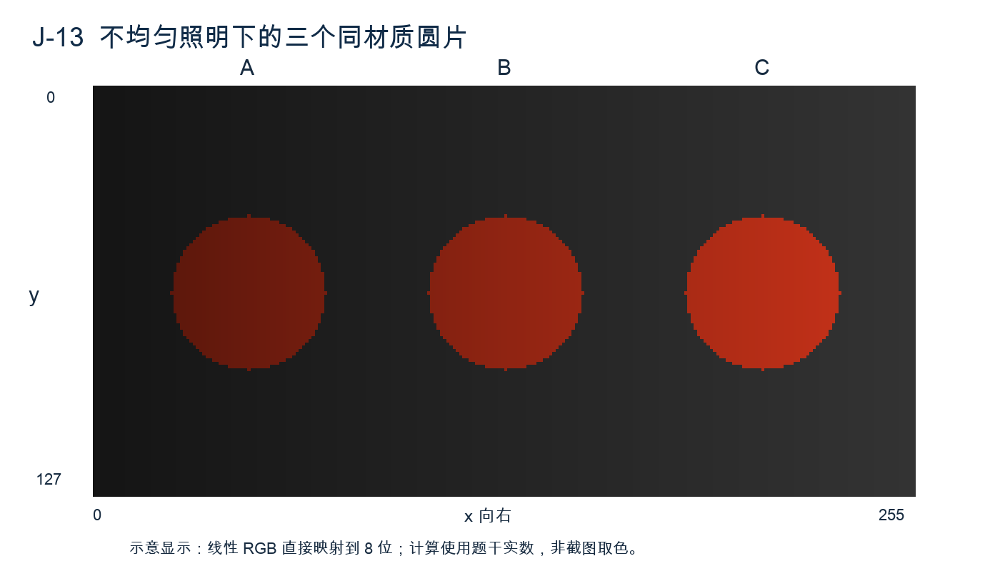

（1）依据图示指出直接用R的单一全局阈值可能对三个圆片产生什么偏差，结合照明方向解释（3分）。（2）构造归一化颜色或HSI颜色分割规则，明确分母、阈值及黑像素处理，论证能否分开背景（6分）。（3）加入实际暗区读出噪声后，给出修改后的检测、形态清理和计数流程，并说明何时应拒绝给出可靠颜色结论（6分）。

#### 14. 彩色图像的周期干扰复原（15分）

某彩色扫描图的三个通道叠加同频不同幅值的条纹n_c(x,y)=a_c cos[2π(12x/256+7y/256)+φ_c]，c∈{R,G,B}。图像为256×256，DFT正变换不归一化、逆变换除以256²。频谱已移至中心，中心索引为(128,128)。假设未发生截断。

（1）指出理想条纹在未移位与已移位频谱中的两个位置，坐标用(u,v)（4分）。（2）设计保持实值输出的陷波处理并说明为何应成对处理、为何不能随意扩大带宽（5分）。（3）比较RGB各自处理与只处理亮度的适用条件，给出判断残余色条纹及过度处理的办法（6分）。

#### 15. 科学标量场的伪彩色设计（20分）

图J-15两幅显示使用完全相同的标量区间标签，精确矩阵为[[0,0,1,1,2,2],[0,1,1,2,2,3],[1,1,2,2,3,3],[1,2,2,3,3,3]]；标签k代表原标量区间[k,k+1)，不代表区间内所有点数值相同。甲的RGB查找表依次为(30,30,30)、(90,90,90)、(160,160,160)、(230,230,230)，乙依次为(0,60,240)、(0,220,80)、(250,210,0)、(230,20,20)，均为8位显示值。

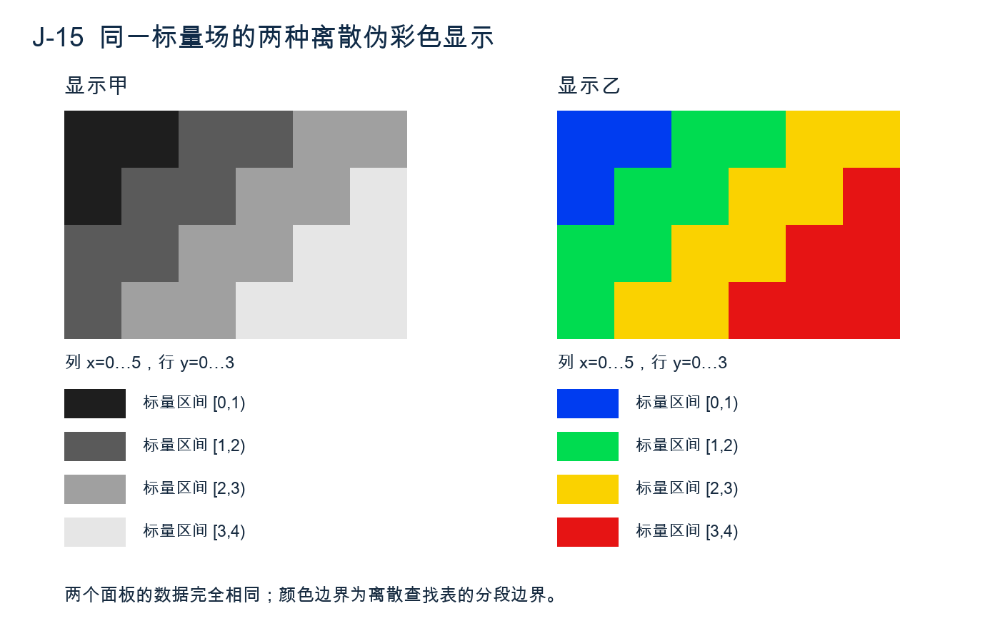

（1）从图观察并解释哪些边界由显示分段产生，能否据此认定原物理量有突变（4分）。（2）给一个需要定量比较大小的使用场景设计颜色映射、图例和异常值规则；说明线性与对数标尺的选择条件（6分）。（3）评价甲、乙在顺序辨认、灰度打印和色觉差异条件下的风险，不得只写“彩色更好”（5分）。（4）若只有伪彩色截图而无原始数据，说明可恢复与不可恢复的信息及记录可追溯结果的方法（5分）。

#### 16. 彩色零件表面缺陷检测方案（20分）

工件主表面为饱和蓝色，存在亮度渐变、少量白色高光、黑色划痕和与背景相似的阴影。工件位置与尺度轻度变化，每幅至少有一个中性参照片；划痕宽2—5像素、长度20—80像素。用户要输出工件数、每件缺陷面积与缺陷位置，允许少量人工复核，但不允许把高光作为划痕。

（1）给出包含颜色校准、工件分割、照明处理的步骤及每步作用（6分）。（2）设计对细划痕友好的检测与形态流程，写明结构元素形状、原点和尺度依据（6分）。（3）定义面积、定位及计数规则，说明接触工件、截边目标和高光区如何处理（4分）。（4）设计能区分“颜色失真”“漏检细线”“目标粘连”的验证方案及指标，不要求深度学习（4分）。

---

## 电子科技大学830数字图像处理原创模拟试卷 K

**专题侧重：DCT、Haar、沃尔什—哈达玛与多分辨率；兼顾频域、投影重建、形态学及视觉分析。**

考试时间180分钟，满分150分。第1—8题每题5分，第9—12题每题10分，第13—14题每题15分，第15—16题每题20分。本卷为原创训练材料，未声称与未来试题一致；不将图像压缩作为独立专题。建议简答40分钟、计算50分钟、综合80分钟、复核10分钟。

统一约定：x向右、y向下，矩阵按行列书写；变换约定由每题明确给出，不得擅自更换归一化、基函数顺序或细节系数符号。根式等可保留精确式作为最终答案，不要求计算器；若写小数则保留4位；误差均方值除以样本总数。设计题须交代尺度、边界、判断依据和失败情形，不能只堆叠算法名称。

### 一、简答题（40分）

#### 1. 正交变换与信息（5分）

对于实正交矩阵T，说明系数向量c=Tf为什么可无损重建（2分），写出能量守恒关系（2分），并说明“系数数目不变而多数系数接近零”与“原图信息量增加”是否等价（1分）。

#### 2. 傅里叶与小波的定位能力（5分）

比较傅里叶基与局部小波基描述短暂边缘事件的特点（3分）。说明选择小波并不意味着可以同时无限精确地定位空间与频率；结合尺度变化给出解释（2分）。

#### 3. DCT边界与分块处理（5分）

从延拓方式说明DCT与DFT在有限序列边界处的不同假设（2分）。解释为什么“采用DCT”本身不会产生有损误差，而分块系数修改后可能出现块边界不连续（3分）。

#### 4. 沃尔什—哈达玛基的顺序（5分）

说明沃尔什—哈达玛基函数与正弦基在取值及振荡形态上的区别（2分）。解释自然序、序率序等重排会改变系数的位置但不改变张成空间（2分）；为什么在未说明基顺序时不能简单把后半段系数全部叫作“高频”（1分）？

#### 5. 高斯金字塔与拉普拉斯金字塔（5分）

说明构建高斯金字塔每层降采样前为何需要低通（2分）；写出拉普拉斯层与相邻高斯层的关系，并说明重建时除细节层还必须保留什么（3分）。采用自己清楚定义的Expand算子即可。

#### 6. 软阈值与硬阈值（5分）

分别写出阈值λ>0的硬阈值和软阈值映射（2分）。比较在阈值附近的连续性、对保留系数的偏差及可能产生的图像影响（3分）。边界|c|=λ时均规定输出0。

#### 7. 采样、尺度与小目标（5分）

一条宽2像素的明线在图像连续降采样后可能消失。解释其与低通、采样相位及目标尺度的关系（3分）；说明为何不能只依赖最粗层检测细小目标，并提出一种多尺度信息保留方式（2分）。

#### 8. 变换域复原的适用条件（5分）

“把模糊图像的高频全部放大即可恢复清晰图像。”指出这句话的两个问题（3分），再说明退化函数接近零时逆滤波为什么不稳定，维纳方法引入什么约束信息来缓解（2分）。

### 二、计算题（40分）

#### 9. 二维正交DCT及误差（10分）

令F=[[4,2],[2,0]]，给定正交DCT矩阵C=(1/√2)[[1,1],[1,−1]]，变换Y=CFCᵀ，逆变换F=CᵀYC。此处F的左上元素是(x,y)=(0,0)。

（1）求完整系数矩阵Y（4分）。（2）仅保留Y₀₀，其余系数置0，求重建图像及MSE（4分）。（3）用系数域能量验证所得误差，说明为何本题不能把Y₀₀直接当作原图每个像素的均值（2分）。

#### 10. 两级正交Haar分解（10分）

序列f=[4,6,10,12]。一级对相邻样本进行a_k=(f₂k+f₂k+1)/√2，d_k=(f₂k−f₂k+1)/√2；再仅对一级近似a进行同样操作。系数按[A₂,D₂,d₀,d₁]排列。样本恰好成对，无需边界延拓。

（1）求一级和二级系数（4分）。（2）将所有细节系数中|c|≤2者置0，其余不变，近似A₂不修改，求逆变换结果（3分）。（3）求MSE并检验阈值前的能量守恒（3分）。

#### 11. 指定基序下的哈达玛变换（10分）

给定自然序矩阵H=(1/2)[[1,1,1,1],[1,−1,1,−1],[1,1,−1,−1],[1,−1,−1,1]]，序列f=[3,1,1,3]ᵀ。前向变换c=Hf，逆变换f=Hᵀc。

（1）计算c并用逆变换核验（4分）。（2）仅保留c₀，求重建及MSE（3分）。（3）写出承载非直流成分的基向量，结合其正负变化解释本序列的结构，并校验总能量（3分）。

#### 12. DFT滤波与循环卷积（10分）

长度4实序列f=[1,0,−1,0]。采用F[k]=Σₙf[n]exp(−j2πkn/4)，逆变换含1/4。给定频率响应H=[1,1/4,0,1/4]，不作中心化移位。

（1）求F和G=HF（4分）。（2）求g=IDFT(G)及h=IDFT(H)（4分）。（3）判断g是否实数并给出依据；若直接作长度4循环卷积f⊛h，结果应如何与g对应（2分）。

### 三、综合题（70分）

#### 13. 从可视纹理判断小波子带（15分）

图K-13的三幅8×8二值图按以下精确规则生成：A(x,y)=x mod 2；B(x,y)=y mod 2；C(x,y)=(x+y) mod 2，x,y=0,…,7，0黑1白。对每个2×2块先沿x、后沿y作正交Haar，相邻偶数索引为每对起点，无边界延拓。

本题子带名明确规定：LxLy为两方向低通；HxLy为x高通、y低通；LxHy为x低通、y高通；HxHy为两方向高通，所有高通均采用“前项减后项”。不得仅用含混的“水平细节”回答。

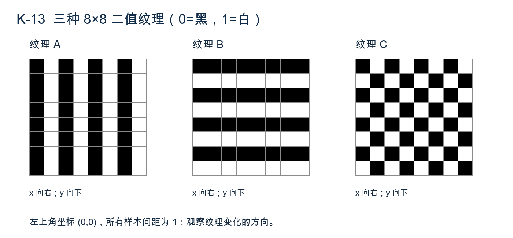

（1）依据图中纹理方向，为每幅图预测主要非零细节子带，并解释（6分）。（2）对每幅左上2×2块计算LxLy及三个细节值，以验证预测（6分）。（3）解释所有图整体平移1像素时，下采样小波系数的符号或位置可能如何变化，以及其与平移不变性的关系（3分）。

#### 14. 投影滤波与离散反投影（15分）

用一个离散算例分析滤波反投影。角度θ=0°的一维投影为p₀=[2,1,0,1]，投影坐标s=0,1,2,3。DFT正变换不归一、逆变换乘1/4；本算例按长度4周期数据计算，不作补零。斜坡响应明确给为R[k]=[0,1,2,1]，对应四个有符号频率的绝对值比例。

（1）求P₀=DFT(p₀)、Q₀=RP₀及滤波投影q₀=IDFT(Q₀)。（6分）  
（2）另一个θ=90°投影经相同滤波后为q₉₀=[0,1,0,−1]。按平行束投影坐标s=x cosθ+y sinθ，仅求未乘角度权重的回填和S(x,y)=q₀[x]+q₉₀[y]。列出x,y∈{0,1}的2×2结果，行表示y、列表示x。（4分）  
（3）说明斜坡滤波相对于直接反投影的作用，滤波投影出现负值是否必然错误，以及仅两个角度能否准确恢复一般二维图像。（5分）

本题是用于理解步骤的离散周期算例，不把两角度回填和当作具有正确物理尺度的完整CT重建。

#### 15. 多尺度去噪中的细线保留（20分）

图K-15为一条长度64的观测剖面g[x]=f[x]+n[x]。精确数据：f在x=16…31以及48…49时为80，其余为20；噪声n为[0,3,−2,1,−3,2,0,−1]循环重复8次。图像其他各行可视为同样剖面叠加独立噪声，目的是同时保留宽16像素亮条与宽2像素亮线。

处理时若需延拓，采用镜像延拓并说明实现；图示折线连接仅为显示，不代表非整数位置新增采样值。设计方法应能推广到未知噪声样本，不得直接把题中已知噪声序列相减作为最终方案。

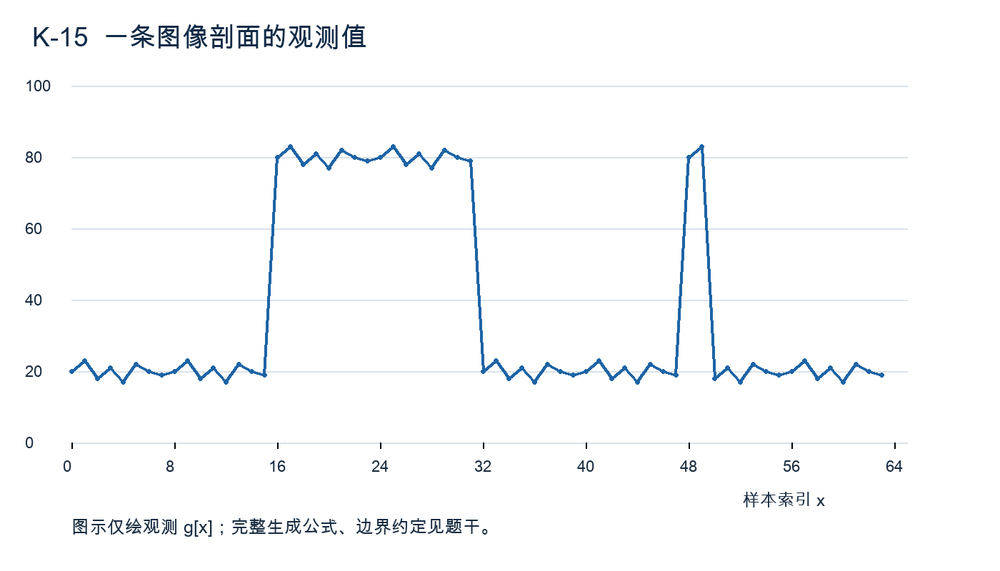

（1）从图辨认两种目标的尺度，解释大窗口均值及只保留粗尺度为何可能产生不同的误差（5分）。（2）设计一个多尺度小波去噪方案，写出噪声估计、阈值选择、尺度差异处理与重建步骤（6分）。（3）设计细线保护与跨尺度一致性判断，不允许简单地把所有高频系数都保留（5分）。（4）用哪些定量指标区分噪声减少、边缘模糊和细线消失？定义评价范围（4分）。

#### 16. 多分辨率图像融合的可执行流程（20分）

两幅同一平面场景图像A、B已经过曝光标定：A左侧清晰、右侧散焦，B左侧散焦、右侧清晰；两者仍有约1—2像素平移和少量传感器噪声。要求输出一幅全清晰图，同时保留窄文字笔画、避免接缝光晕。允许传统方法，不要求训练神经网络。

（1）说明几何对齐、有效区裁剪和噪声处理的必要性与先后关系（4分）。（2）设计拉普拉斯金字塔或小波融合流程，明确低频与细节系数的不同选择规则、活动度窗口及权重约束（7分）。（3）解释独立逐像素选择最大绝对系数为何可能产生伪影，并给出空间一致性与边界处理办法（5分）。（4）提出无参考和有局部参考时的验证方法，说明何种场景信息无法由两张输入凭空补回（4分）。

---

## 电子科技大学830数字图像处理原创模拟试卷 L

**专题侧重：特征、贝叶斯、CNN、SIFT与PCA；兼顾分割、形态学、纹理和处理流程。**

考试时间180分钟，满分150分。第1—8题每题5分，第9—12题每题10分，第13—14题每题15分，第15—16题每题20分。本卷为依据所给范围编写的原创模拟卷，不是官方真题。建议简答40分钟、计算50分钟、综合80分钟、复核10分钟。

统一约定：x向右、y向下，数组按行列书写；向量为列向量。概率用精确分数或自然对数表达式，涉及ln、exp、根式可保留精确值，若写小数则保留4位，不要求使用计算器。分类任务须区分训练、验证、测试；不得把测试集参与拟合的流程当作正确方案。设计题须说明输入、决策规则、参数与失败条件。

### 一、简答题（40分）

#### 1. 分类与分割的输出差别（5分）

图像中有多个相互接触的零件。说明图像级分类、语义分割、实例分离在输出形式上的不同（3分）。若只需要每件零件的类别与数量，为什么一个整图类别概率向量通常不够（2分）？

#### 2. 似然、后验与先验（5分）

说明p(x|ω)、P(ω|x)、P(ω)分别描述什么（3分），写出它们的关系（1分）；解释即使p(x|ω₁)>p(x|ω₂)，仍可能把样本判为ω₂的原因（1分）。这里采用最小错误率分类。

#### 3. PCA保方差与保类别（5分）

写出中心化样本协方差及PCA投影的基本形式（2分）。说明最大方差方向为何未必是最有利于类别分离的方向（2分），以及计算PCA所需均值、尺度、主轴应由哪部分数据拟合（1分）。

#### 4. SIFT的不变性边界（5分）

概括SIFT在尺度、旋转、亮度变化下获得一定稳定性的机制（3分）；说明它对大视角形变、镜面反射或重复纹理并不保证可靠匹配，任选两种解释（2分）。不得将“鲁棒”解释为对一切几何变换严格不变。

#### 5. CNN卷积核与参数共享（5分）

说明多通道卷积核深度与输入通道数的关系（2分）；解释参数共享与局部连接各自限制了什么（2分）；指出卷积层输出是否天然具有任意平移不变性（1分）。

#### 6. 池化与全局平均池化（5分）

比较局部最大池化和全局平均池化在输出尺寸及空间信息保留上的差异（3分）；说明分类网络采用全局平均池化的一个优点和对精确定位任务的一个限制（2分）。

#### 7. 共生矩阵的方向性（5分）

竖条纹和横条纹可以具有相同灰度直方图。解释为什么固定方向的共生矩阵能给出不同结果（2分）；说明旋转图像后应如何处理位移方向，以及方向平均在获得旋转稳定性时牺牲了什么（3分）。

#### 8. 类别不平衡与评价（5分）

有缺陷零件仅占测试集1%，某分类器将所有样本判为正常。求准确率（1分）；说明仅报告该准确率的问题（2分），并给出两个更有用的评价量，说明其关注的错误类型（2分）。

### 二、计算题（40分）

#### 9. 特征标准化与原型距离（10分）

两维特征分别描述形状和灰度。仅由训练集得到均值μ=(10,100)ᵀ、标准差s=(2,20)ᵀ；原型A=(8,120)ᵀ、B=(14,100)ᵀ，待分类样本x=(13,118)ᵀ。标准化各维为z_j=(x_j−μ_j)/s_j，原型使用同一组μ、s。规则均为最小距离，若平局才判A。

（1）用原始欧氏平方距离分类（3分）。（2）计算标准化后的样本与原型，求两平方距离并分类（4分）。（3）证明此处标准化欧氏距离等于使用Σ=diag(4,400)的马氏距离，解释判别变化的原因（3分）。

#### 10. 小型CNN的尺寸与参数（10分）

网络输入32×32×3，依次经过：卷积1（5×5核，8个输出通道，步长1，四边填充2）；ReLU；2×2最大池化（步长2，无填充）；卷积2（3×3核，16个输出通道，步长2，四边填充1）；ReLU；全局平均池化；全连接输出3类。两卷积层及全连接层均每个输出通道/单元有一个偏置；不存在批归一化和其他参数。

（1）列出卷积、池化、全局平均池化、全连接后的尺寸（4分）。（2）计算三个有参数层各自参数量及总数（4分）。（3）说明ReLU和两种池化是否增加训练参数，以及全局平均池化为什么不会输出8×8×16个数（2分）。

#### 11. SIFT距离比与几何验证（10分）

四个候选匹配的数据如下；d₁、d₂为描述子到最近与次近邻的欧氏距离，已经开平方。距离比测试采用d₁/d₂<0.8，严格小于才保留。

|匹配|参考坐标p|最近邻坐标q|d₁|d₂|
|---|---|---|---|---|
|A|(0,0)|(5,−2)|0.30|0.60|
|B|(10,0)|(15,−2)|0.50|0.60|
|C|(0,10)|(5,8)|0.20|0.50|
|D|(10,10)|(30,25)|0.20|0.40|

所有候选均已满足双向最近邻条件。另由可靠标定给定平移模型q=p+(5,−2)，几何残差为‖q−p−(5,−2)‖₂，残差≤1才通过。

（1）求四个比值及通过距离比的集合（4分）。（2）对该集合求几何残差及最终集合（3分）。（3）结合被拒绝的不同匹配，说明描述子比值测试与几何验证为什么不能互相替代（3分）。

#### 12. 先验移动贝叶斯判别边界（10分）

一维特征满足p(x|ω₁)=N(0,1)，p(x|ω₂)=N(2,1)，先验P(ω₁)=0.8、P(ω₂)=0.2。采用最小错误率规则，后验相等时判ω₁。正态密度为(1/√(2π))exp[−(x−μ)²/2]。

（1）写出对数后验比ln[P(ω₂|x)/P(ω₁|x)]，求判别边界与两侧类别（5分）。（2）若先验改为各0.5、类条件密度不变，求新边界并解释移动方向（2分）。（3）对x=1.4，判断最大似然类别与最大后验类别是否一致，给出后验ω₂的精确表达式（3分）。

### 三、综合题（70分）

#### 13. 从阈值图到对象分类（15分）

图L-13是10行16列二值候选图，前景1、背景0，图外为0；前景采用8连通，孔判断采用背景4连通。精确各行如下：

```
0000000000000000
0100000000000000
0001111001111000
0011111111111100
0011011111111100
0011111111111100
0001111001111000
0000000000000000
0000000000001000
0000000000000000
```

已知两个主要目标应分别计数，单个孤立1为噪点；内部单像素0为采集缺损，需填补；连接区域不是独立目标。此图用于讨论流程，不要求手算完整分水岭数组。

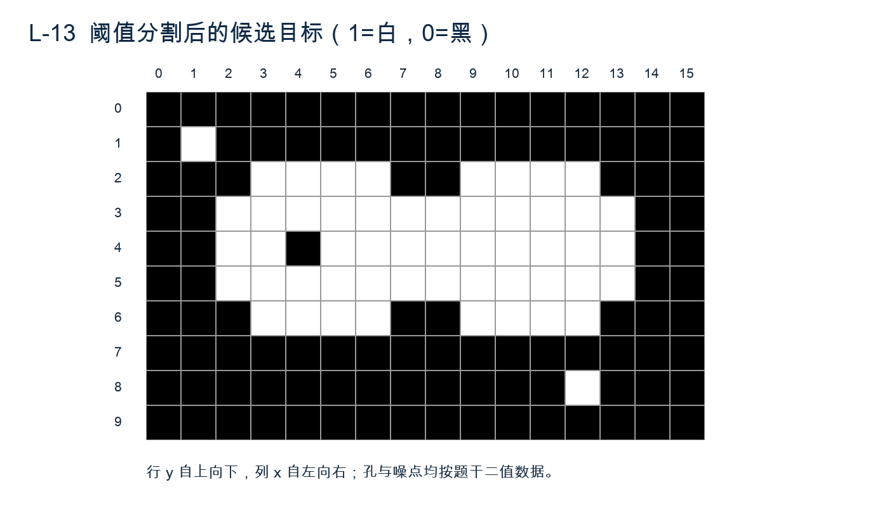

（1）根据图与数据指出孤点、内部孔的位置及未分离时主要区域数目，解释连通计数为什么不等于目标计数（5分）。（2）给出依次去小连通域、填孔和接触分离的可执行方案，说明连接规则、标记和停止条件（6分）。（3）说明对每个分离对象分类时应提取哪些形状或灰度纹理信息，并指出需从哪幅图取值（4分）。

#### 14. PCA与分类流程的失败分析（15分）

某研究者将全部数据混合后标准化并拟合PCA，保留累计方差95%的主成分，再随机按图像裁剪块划分训练与测试；同一零件的相邻裁剪块可能进入两个集合。分类器在测试集准确率很高，但换一台相机后效果大幅下降。

（1）指出两种独立的数据泄漏或评估偏差，并给出修正后的划分与拟合顺序（6分）。（2）解释保留95%方差不能保证保留类别信息，提出选择维数与检验PCA收益的办法（5分）。（3）给出相机变化后的三项检查，区分输入分布变化、预处理不一致与分类器能力不足（4分）。

#### 15. 重复纹理下的局部特征配准（20分）

图L-15的A为240×240参考图，B为其逆时针旋转90°后的示意图。源图上部为重复竖条：x=15,40,…,215，每条宽9像素、y=10…100；下部包括L形折角和带方形标记的圆环。图中的“上部/下部”均指A；不要求从显示缩放后的图上直接读坐标。

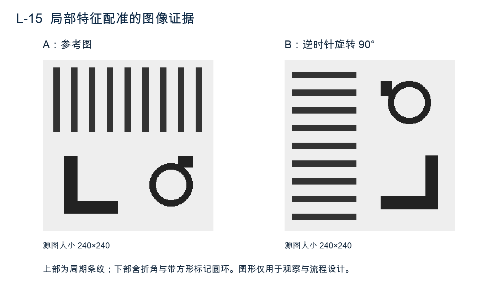

实际任务还会有缩放、轻微遮挡、噪声，未知变换限定为二维相似变换，允许错误匹配存在。

（1）依据图形指出哪些区域的局部描述可能缺乏唯一性，哪些区域可提供更多定位线索，解释原因（4分）。（2）写出SIFT从尺度空间到描述子匹配的主要步骤，说明方向与尺度归一化的作用（6分）。（3）设计距离比、双向检查与RANSAC几何验证的组合，写相似变换模型、残差和内点判据（6分）。（4）说明如何检验最终配准及什么情况下应报告失败，不能只以“有两对匹配”作为可靠性的充分条件（4分）。

#### 16. 传统特征与CNN的公平比较（20分）

有三类零件图像，每个零件拍摄多个角度，同一拍摄批次的照明相近。训练数据量有限，背景颜色与类别存在偶然相关；部署时背景与相机可能改变。目标是比较“人工特征+分类器”和“小型CNN”，输出类别及不确定样本列表，不要求设计超出考纲的新网络。

（1）给出数据划分、标注检查、预处理与增强方案，防止背景和同一零件重复图像造成虚高成绩（6分）。（2）分别提出传统特征模型和CNN流程，明确输入、特征/网络、分类规则和训练对象（6分）。（3）设计公平评价，给出类别不平衡、置信度及跨背景测试的处理（4分）。（4）利用失败样本区分分割错误、特征不足和过拟合，提出每类问题的可验证改进方向（4分）。

---

## 830数字图像处理模拟试卷 M

**原创训练卷｜综合诊断与条件辨析｜150分｜闭卷180分钟**

本卷依据用户提供的真题风格和考纲编写，非官方试卷。请另纸作答，保留步骤。矩阵默认行r向下、列c向右，坐标从0开始；笛卡尔坐标题另行说明。图示均为按题干条件生成的示意图，计算以给定像素、坐标和参数为准。答案独立存放。

姓名：________　日期：________　开始：________　结束：________

### 一、简答题（每题5分，共40分）

#### 1. 成像模型与动态范围（5分）

用照射分量与反射分量解释灰度图像的形成。在没有饱和的条件下，灰度变换可改善暗部显示；若传感器已经饱和，为什么通常不能仅靠灰度变换恢复亮部细节？

#### 2. 线性与位置不变（5分）

定义图像系统的线性和位置不变性。对无限网格上的点运算 $T[f](r,c)=f(r,c)^2$，分别判断这两个性质是否成立并说明依据。

#### 3. 梯度与边缘（5分）

说明图像梯度方向、梯度幅值与边缘走向之间的关系。为什么“梯度幅值较大”不必然意味着该处属于希望提取的目标边界？

#### 4. 幂律变换（5分）

对归一化灰度 $0\le r\le1$，采用 $s=r^\gamma$。说明0<γ<1与γ>1对中间灰度的影响，指出端点及顺序关系，并说明该变换与直方图均衡化的区别。

#### 5. 数字拓扑（5分）

定义二值图像的连通分量、孔洞和欧拉数。为什么在讨论像素接触及孔洞时，应明确前景与背景的连通性约定？

#### 6. 变换的边界延拓（5分）

DFT和常用DCT对有限数据的隐含边界延拓有何不同？这种差异怎样影响边界附近的高频系数？是否意味着DCT总不会产生振铃？

#### 7. 反投影与滤波反投影（5分）

比较简单反投影与滤波反投影，解释加入斜坡滤波器的目的，以及抑制噪声和保持空间分辨率之间的取舍。

#### 8. 分类评价（5分）

在缺陷样本仅占很小比例的数据中，为什么总体准确率可能掩盖严重漏检？说明混淆矩阵中至少两种应关注的指标，以及分类阈值和误判代价的关系。

### 二、计算题（每题10分，共40分）

#### 9. 顺序统计滤波（10分）

图M-1为8位灰度图中某中心像素的3×3邻域。数值为

$$W=\begin{bmatrix}10&10&12\\11&255&9\\10&8&11\end{bmatrix}.$$

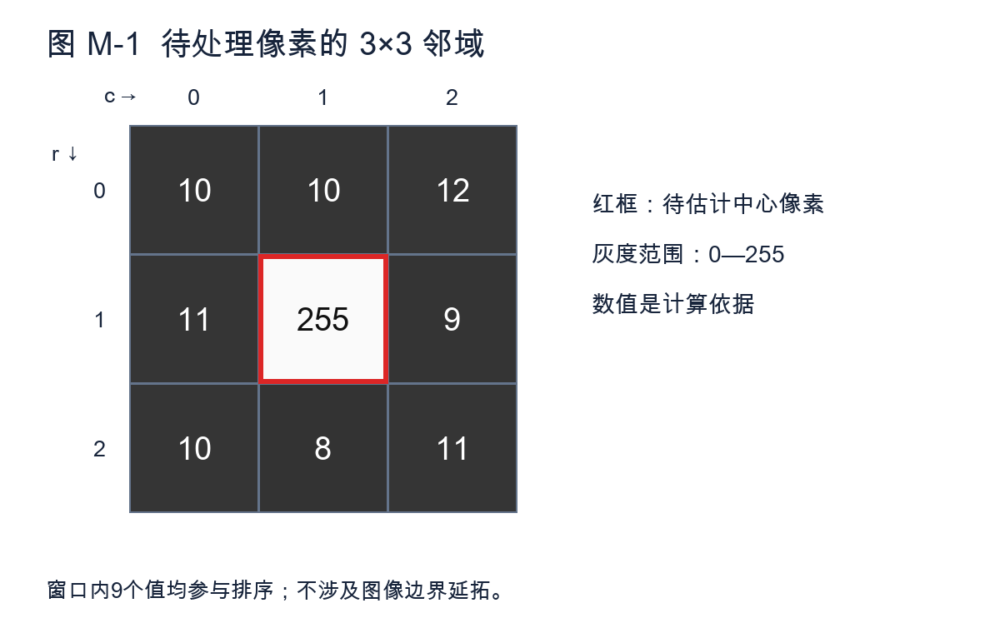

只求该窗口中心的输出，不作边界延拓。

（1）计算算术均值滤波结果，不取整。（2分）  
（2）列出排序后的9个灰度并计算中值滤波结果。（2分）  
（3）计算α截尾均值：本题定义d=4，即分别去掉最小的2个和最大的2个值，对剩余值取平均。（3分）  
（4）若255是正脉冲污染，比较三种结果；若它是真实的细小亮点，说明直接采用中值滤波的风险。（3分）

#### 10. 从控制点估计仿射变换（10分）

本题采用x向右、y向上的笛卡尔坐标，列向量表示点。三对准确对应点为：

| 源图点p | 目标图点q |
|---|---|
| (0,0) | (1,2) |
| (2,0) | (5,2) |
| (0,2) | (3,6) |

设 $q=Ap+t$。

（1）求A、t及齐次变换矩阵，并判断该变换是否可逆。（4分）  
（2）将目标像素q=(5,5)逆向映射到源图。（3分）  
（3）已知源图 f(1,1)=40、f(2,1)=80、f(1,2)=60、f(2,2)=100，计算该目标像素的双线性插值结果。（3分）

#### 11. Hough直线累加（10分）

笛卡尔点集如图M-2：P₁=(1,1)、P₂=(2,2)、P₃=(3,3)、P₄=(1,3)、P₅=(2,3)，x向右、y向上。采用法线式 $\rho=x\cos\theta+y\sin\theta$，本题仅考虑θ=90°、135°两种角度。

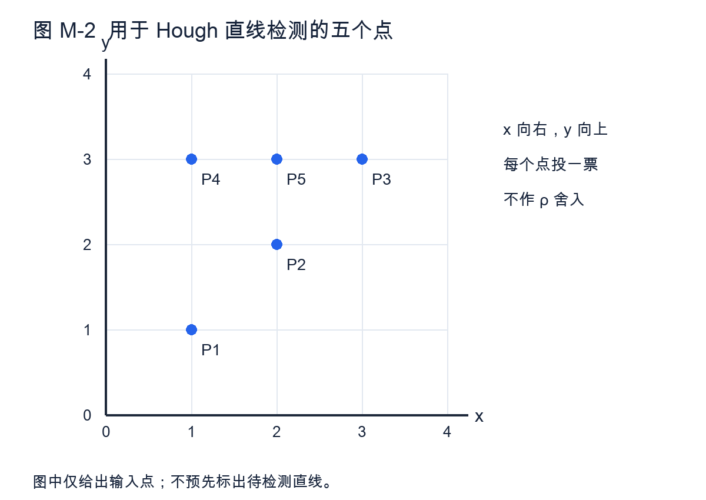

每点投一票，ρ保留精确值，不量化或合并不相等的ρ。

（1）分别列出两种角度下五个点的ρ值。（4分）  
（2）找出每个角度下票数最多的ρ，给出票数及对应直线方程。（4分）  
（3）累加器峰值为何不能直接给出线段的两个端点？（2分）

#### 12. 考虑误判代价的贝叶斯决策（10分）

工业零件有缺陷D与正常N两类，先验 $P(D)=1/10$、$P(N)=9/10$。观察到离散特征值a时，$P(a|D)=3/5$、$P(a|N)=1/5$。正确决策代价为0；把正常判成缺陷的代价为2，把缺陷判成正常的代价为10。代价单位相同；若风险相等，判为正常。

（1）计算给定a的后验概率，并给出只考虑最小错误率时的类别。（3分）  
（2）计算“判缺陷”与“判正常”的条件风险，给出最小风险决策。（4分）  
（3）令 $p=P(D|x)$，推导最小风险规则判为缺陷的p阈值，解释它为何与1/2不同。（3分）

### 三、综合分析与算法设计（共70分）

#### 13. 孔洞、噪点与连通分量（15分）

图M-3大小为19行×31列。白色为前景1，黑色为背景0；前景按8连通、背景按4连通，图像外为背景。

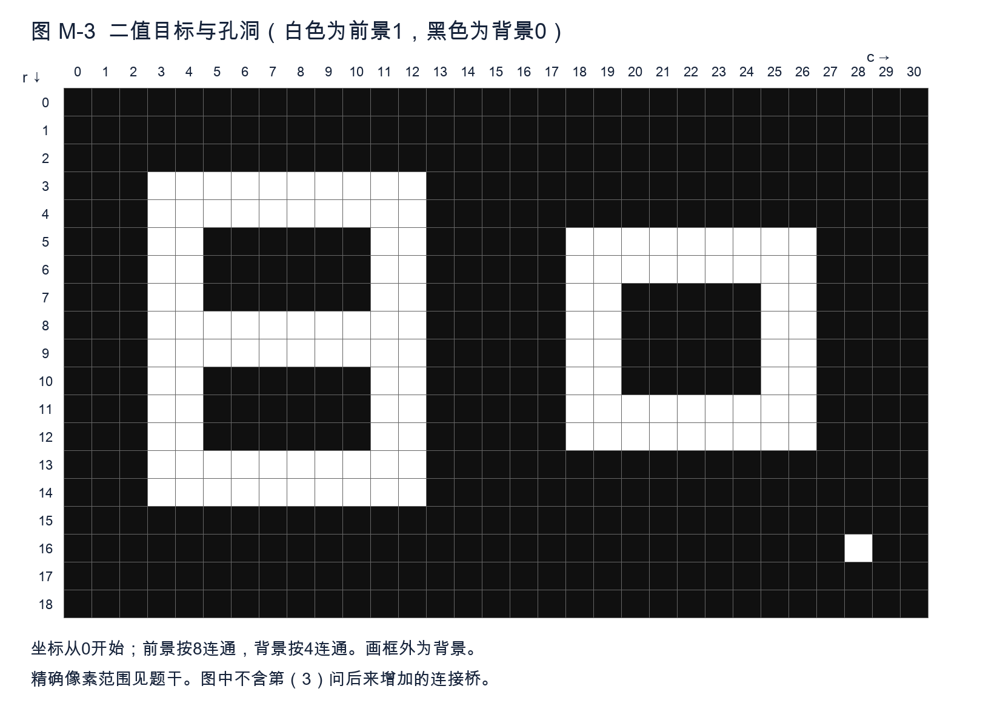

精确数据：先将矩形r=3…14、c=3…12及矩形r=5…12、c=18…26置1；再将三个区域r=5…7、c=5…10，r=10…12、c=5…10，r=7…10、c=20…24置0；最后将(16,28)置1，其余像素为0。所有区间均包含端点。

（1）求图中前景连通分量数C、孔洞数H和欧拉数E=C−H。（5分）  
（2）设计保持主体外轮廓的处理：去除面积小于4像素的前景分量，再填满所有孔洞。写出所需连通域筛选和基于背景重建的填孔步骤，给出最终C、H。（7分）  
（3）从“已去掉孤立白点、但未填孔”的图像出发，把r=8、c=13…17置1，得到一条连接桥。新的C、H、E各是多少？说明只按连通分量计数的局限。（3分）

#### 14. 乘性光照与同态滤波（15分）

一幅灰度图可近似为 $f(r,c)=i(r,c)r_f(r,c)>0$，其中照射分量i缓慢变化，反射分量r_f包含希望显示的细节。局部暗区细节弱，亮区尚未饱和。

（1）给出同态滤波的完整流程，并解释为什么先取对数。（6分）  
（2）采用

$$H(D)=(\gamma_H-\gamma_L)[1-e^{-c(D/D_0)^2}]+\gamma_L,$$

其中γ_L=1/2、γ_H=3/2、c>0、D₀>0。求H(0)及D趋于无穷时的极限，解释两类频率处理的目的。（5分）  
（3）说明实际图像含零值、噪声或强边界时，如何避免明显数值问题和过度增强；该方法能否恢复原本饱和掉的细节？（4分）

#### 15. 基于超像素的目标分割（20分）

彩色工业图像中，待提取涂层与背景颜色接近，但纹理不同。已知少量可靠的前景种子和背景种子，目标中有细窄裂纹需要保留。希望先生成超像素，再完成目标分割，不使用深度学习。

（1）说明超像素相对直接逐像素处理的作用，并设计其生成与尺度、紧凑性选择方法。（5分）  
（2）设计超像素的颜色、纹理描述及利用两类种子的区域判别方法。（6分）  
（3）说明如何形成最终掩模，并处理超像素跨越目标边界或吞没细裂纹的问题。（5分）  
（4）设计分割质量检查，说明为什么只检查整幅图的像素准确率可能不够。（4分）

#### 16. 运动模糊复原后的尺寸测量（20分）

拍摄平面零件时，相机在曝光期发生近似匀速水平运动，产生空间不变运动模糊，并叠加少量噪声。零件包含多条方向不同的清晰几何边缘；图像中有与零件共面的标尺。要求恢复可用轮廓并测量指定两边缘间的距离。可采用传统方法，不使用深度学习。

（1）设计估计模糊方向与长度的思路，说明可利用的空间域或频率域线索及不确定性。（6分）  
（2）在估计退化函数后选择复原方法，给出依据，解释为什么不宜直接对所有频率用1/H。（6分）  
（3）说明复原后的边缘定位、距离测量和像素尺度换算步骤。（5分）  
（4）提出检查测量可信度的方法，并说明复原伪影可能造成的误差。（3分）
