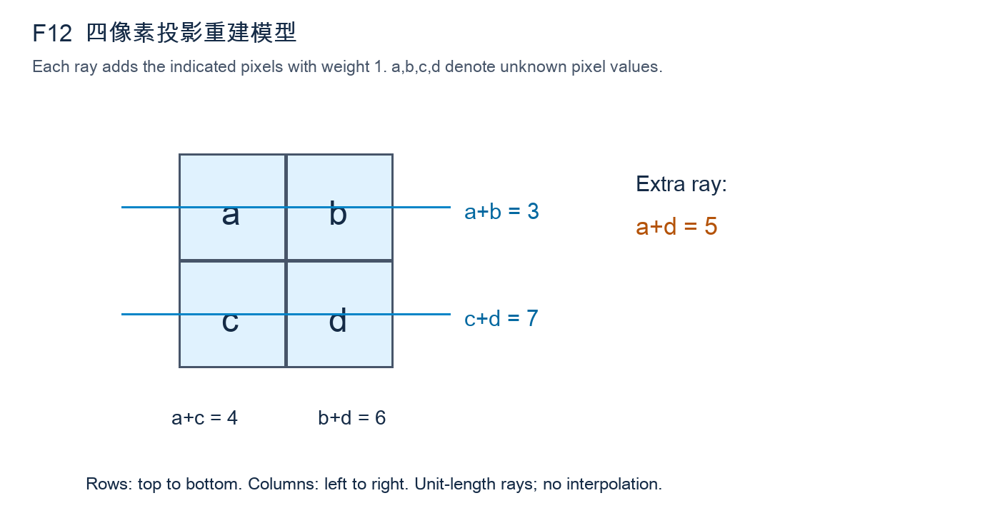
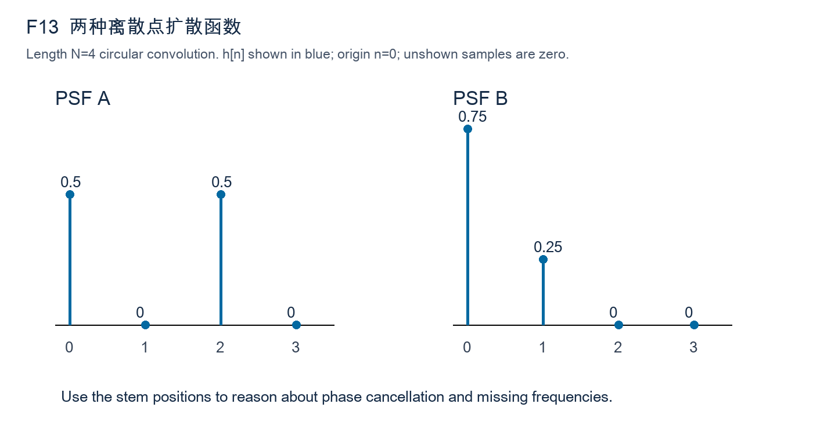

# 电子科技大学830数字图像处理原创模拟试卷 F卷

考试时间：180分钟；满分：150分。原创训练卷，非官方真题，分值与答案为训练用拟定。

答题要求：按题内坐标、边界及统计约定作答；过程分依据关键步骤。未要求取整时保留精确值；设计题可采用等效方案，但须说明参数、依据、失败条件和验证。

## 一、简答题（8题，共40分）

### 1. 退化模型的适用范围（5分）

题目仅讨论灰度与空间坐标上的成像近似，不涉及图像压缩或传输丢包。可把模糊看作系统的点响应，但必须区分信号依赖与位置依赖。

采用g=h*f+η进行图像复原。（1）分别解释f、h、η的意义及卷积模型隐含的空间条件。（3分）（2）镜头失焦程度随图像位置显著改变时，为什么一个全局h可能不够？（1分）（3）说明曝光饱和为何通常不能仅靠该线性模型描述。（1分）

### 2. 噪声分布与滤波器匹配（5分）

三种噪声分别独立讨论，不假设它们同时出现。对泊松噪声采用未经额外电子增益缩放的理想计数模型，不能直接套用恒定方差假设。

分别考虑：零均值加性高斯噪声、仅有少量亮脉冲的盐噪声、计数成像中的泊松噪声。（1）指出三者对灰度统计的典型影响。（3分）（2）为何不能把同一种线性均值滤波当作三种情况下都最优的选择？（2分）

### 3. 逆滤波的不可恢复频率（5分）

退化函数在讨论频率处已知，不考虑估计误差。请分别从唯一性和稳定性回答；两者相关，但不存在零点并不意味着任意直接求逆都稳定。

退化传递函数H在某一频率等于0。（1）无噪声时能否从该频率的观测G唯一确定F？说明原因。（2分）（2）H接近0但非0时，加性噪声会怎样影响直接逆滤波？（2分）（3）加入正则化是否等于重新测得了丢失信息？（1分）

### 4. 噪声功率估计（5分）

本题没有可用的干净参考图，允许提出额外采集重复帧的方案。若用拟合趋势后的残差，应说明它与真实噪声并非自动严格相等。

只有一张未知内容的噪声图像，打算从其中一块区域估计噪声方差。（1）该区域应满足哪些条件？（2分）（2）若区域含缓慢灰度梯度，直接计算样本方差会出现什么偏差？（2分）（3）给出一种改善办法。（1分）

### 5. 正则化参数的作用（5分）

所有候选解使用同一图像域和边界约定，避免将不同裁剪区域的残差直接比较。参数选择应能被数据或独立验证检查，而非只凭主观锐度。

约束最小二乘复原采用J(f)=||h*f−g||²+λ||Lf||²，λ≥0，L为离散拉普拉斯。（1）解释两项分别约束什么。（2分）（2）λ过小与过大的典型后果各是什么？（2分）（3）给出一种选择λ的可检验依据。（1分）

### 6. 投影与反投影（5分）

投影角度表示直线法向的方向，距离参数表示该直线到坐标原点的有符号距离。无需推导完整重建公式，但不能把投影误写成单个像素取样。

对连续二维函数f(x,y)进行平行束投影。（1）写出Radon投影pθ(s)的几何含义，可用积分表达。（2分）（2）简述傅里叶切片定理。（2分）（3）为何未经滤波的直接反投影通常模糊？（1分）

### 7. 退化估计的证据（5分）

允许利用同一次采集中的已知标记，但不能事先读取未知清晰整图。应区分观测频谱中的系统零点、真实图案结构与随机噪声扰动。

包装线上拍到一幅近似水平运动模糊图。（1）分别说明利用已知标记和频谱暗条纹估计退化函数的思路。（3分）（2）为什么误把物体本身周期纹理当作模糊零点会影响复原？（1分）（3）给出一种估计后检查h合理性的方法。（1分）

### 8. 复原与识别的目标差异（5分）

分类器已有类别标签训练数据，但真实应用时没有测试标签。问题关注预处理造成的分布变化和质量控制，不要求推导完整高斯后验公式。

某分类系统把去模糊后的纹理特征送入高斯贝叶斯分类器。（1）解释视觉更锐利不一定分类更准确的原因。（2分）（2）说明训练集与测试集预处理需要怎样保持一致。（2分）（3）为何低置信度或严重退化图像应允许拒识？（1分）

## 二、计算题（4题，共40分）

### 9. 平坦区直方图与噪声方差（10分）

观测值已减除固定电子偏置且未饱和，标定常数四视为准确已知。第一个问题的分布来自所给计数，后两个问题研究该经验分布的重复抽样。

已知某标定平坦区真实灰度恒为4，10个观测像素在灰度2、3、4、5、6的计数依次为[1,2,4,2,1]，其他灰度计数0。将经验频率视为概率，不采用无偏样本方差修正。（1）写出噪声η=g−4的概率分布、均值与方差。（5分）（2）若两个独立、同分布的此类噪声样本取平均，其均值和方差为多少？（3分）（3）若两个噪声的相关系数为ρ，写出平均后方差随ρ的表达式，并指出ρ=1时的结论。（2分）

### 10. 约束最小二乘的频率解（10分）

所给正则算子只作为确定频率响应使用，无需从空间模板重新推导。正则参数不随频率变化，最终图像要求保留实值，不进行灰度范围裁剪。

长度4循环退化模型采用正变换无归一系数、逆DFT乘1/4。频率索引k=0,1,2,3，已知G=[8,2,1,2]、H=[1,1/2,1/4,1/2]、正则算子频率响应P=[0,2,4,2]，均为实数。取λ=1/4，使用F̂[k]=H*[k]G[k]/(|H[k]|²+λ|P[k]|²)。（1）逐频率求F̂，保留分数。（5分）（2）逆DFT求空间域f̂，保留分数或四位小数。（3分）（3）解释为什么本例直流项不受λ影响，以及λ增大时非零频率的变化。（2分）

### 11. 两级Haar软阈值复原（10分）

最低频系数不参加阈值操作，细节排序在计算与重建中必须保持一致。软阈值不同于直接删除小系数后保留其余幅度不变的硬阈值。

一维观测向量g=[4,6,7,7]，使用正交归一Haar变换。第一级对相邻一对(a,b)计算低频(a+b)/√2和细节(a−b)/√2；第二级仅对两个低频再作同样运算。系数按[最粗低频c，最粗细节d，最细细节e₀,e₁]排列。（1）求全部系数。（4分）（2）仅对三个细节使用软阈值Sτ(z)=sign(z)max(|z|−τ,0)，τ=3/2，低频不变；求阈值后系数。（3分）（3）逐级逆变换重建向量并判断平均灰度是否保持。（3分）

### 12. 少量投影的唯一性（10分）

像素值允许为任意非负实数，不额外要求整数，因此唯一性必须由投影约束本身判断。图中的额外斜射线是独立测量，不是由行列和计算所得。

图F-12为2×2未知非负图像[[a,b],[c,d]]。离散射线按图中约定对经过像素求和，路径权重全为1，无噪声；已知行投影a+b=3、c+d=7，列投影a+c=4、b+d=6。（1）用单参数写出所有满足行列投影的解，并利用非负性给出参数范围。（4分）（2）加入斜射线a+d=5后求唯一解。（4分）（3）解释为何仅有行列投影并不足够，不能只按“方程4个、未知数4个”判断。（2分）

图F-12：a、b为上行，c、d为下行；橙色文字为额外斜射线a+d，蓝线表示行求和；所有射线均按离散权重1定义，不使用连续几何长度。

## 三、综合题（4题，共70分）

### 13. 点扩散函数零点与多帧融合（15分）

两幅观测已经精确配准，PSF也已知，并非需要同时估计运动轨迹的盲复原问题。融合公式需说明分子共轭与分母能量，不能直接平均两幅图。

图F-13给出长度4的两个循环PSF：h_A=[1/2,0,1/2,0]，h_B=[3/4,1/4,0,0]，索引n=0,…,3，核原点n=0。两幅图由同一未知f经这两个PSF生成，先忽略噪声。DFT正变换无归一，逆变换乘1/4。（1）根据图中脉冲间隔求H_A、H_B，指出各自是否有零点。（6分）（2）构造一非零实信号z使h_A*z=0，并说明仅观测A的歧义。（4分）（3）若两帧有独立同方差噪声，写出逐频率最小二乘融合公式并说明B帧的补充作用。（5分）

图F-13为精确离散茎状图：A在0、2处各为1/2，B在0处3/4、1处1/4，其余为0；横轴向右递增，不把脉冲连接为连续模糊曲线。

### 14. 重建能保留什么形状（15分）

前景采用四连通解释，孔洞指方框内部与外界不连通的背景。标记严格包含于掩膜，所有迭代结果均须被原掩膜限制，不得自行闭运算补点。

二值掩膜定义在0≤x≤8、0≤y≤6的整数网格上，x向右、y向下。A含方形边框{(x,y):1≤x≤5,1≤y≤5且x∈{1,5}或y∈{1,5}}，另加(6,3)、(7,3)两点构成与边框相连的毛刺，再加孤立点(8,6)；其余为0。方形边框条件整体括在1≤x,y≤5内。标记M={(1,1)}，结构元素B={(0,0),(±1,0),(0,±1)}，图外为0。（1）写出膨胀重建的迭代式与终止条件。（4分）（2）描述最终重建结果、孔洞和孤立点是否保留。（6分）（3）说明能否同时去除与边框相连的毛刺，并提出一种额外处理及其风险。（5分）

### 15. 运动模糊标签的可审核复原（20分）

最终识别需能追溯到原始照片中的字符位置，未知字符允许输出拒识。题目不要求声称恢复饱和区原始灰度，也不能把锐化当成退化参数估计。

流水线上同款包装标签包含黑色字符、灰色细分隔线和一条已知宽度的定位条。照片存在近似水平方向运动模糊与弱加性噪声，部分亮背景饱和。要求恢复可读标签并输出字符识别结果，禁止CNN。（1）给出退化及噪声参数估计方案，并说明定位条和饱和掩膜的用途。（6分）（2）比较截断逆滤波、维纳及约束最小二乘，选择一个主方案写明所需参数。（6分）（3）设计复原后字符分割与传统识别，同时说明怎样防止振铃被当作笔画。（5分）（4）给出可追溯的验收与失败回退方式。（3分）

### 16. 有限投影重建与材料分类（20分）

两类工件可有相近平均灰度，分类证据依赖孔洞及纹理。所有尺度阈值应联系像素对应的实际尺寸，不能仅根据重建图看起来更平滑作结论。

系统通过多个角度的平行束投影重建小工件截面，并依据孔洞结构与粗糙纹理把工件分为两类。投影中有随机噪声、少量坏探测器形成的异常通道，而且角度覆盖不足180°。不使用深度学习。（1）设计投影预处理与异常通道处理，区分随机噪声与固定异常。（5分）（2）解释有限角与噪声分别带来什么重建问题，给出滤波反投影或正则化迭代方案。（6分）（3）设计保留孔洞的分割、形态/纹理特征与传统分类流程。（5分）（4）提出投影域和最终分类两层验证，并明确不能做出的保证。（4分）
