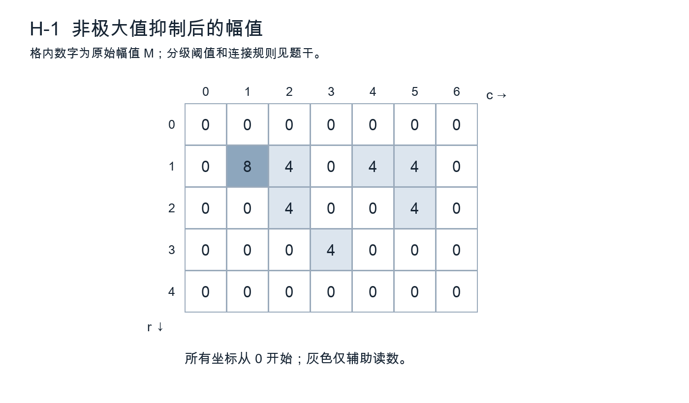
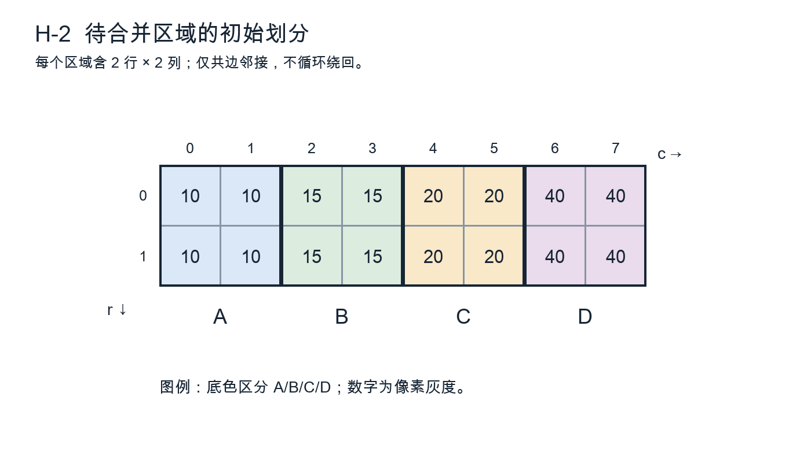

# H卷｜边缘、阈值与区域分割

原创模拟卷，非官方真题；根据已提供考纲及历史题型设计。满分150分，时间180分钟。建议简答40分钟、计算50分钟、综合80分钟、检查10分钟。作答时保留足以复核的中间量。

约定：矩阵左上角为(r,c)=(0,0)，r向下、c向右；几何坐标用x=c、y=r。图中灰度是精确教学数据，不是实拍样本。未要求的量化、归一化、边缘补齐不得自行添加。阈值等号归属以各题为准。

## 一、简答题（共40分）

### 1. 边缘位置与平滑尺度（5分）

同一幅图先用标准差σ=1和σ=3的高斯滤波，再计算梯度。解释增大σ对噪声、细小结构及相邻边缘分辨能力的影响（3分）；说明为什么不能只凭梯度峰值大小判断哪一种尺度更好（2分）。

### 2. 拉普拉斯零交叉（5分）

为什么拉普拉斯高斯算子需要先平滑（2分）？说明零交叉与一阶梯度峰的关系，并解释“所有零交叉都是有效物体边界”为什么不成立（3分）。

### 3. 非极大值抑制的方向（5分）

给出梯度方向与边缘切线方向的关系（2分）；说明非极大值抑制应沿哪一方向比较，以及把方向量化成0°、45°、90°、135°会带来什么近似误差（3分）。

### 4. 全局阈值的假设（5分）

分别解释双峰直方图为何常利于阈值分割、目标占比极小时Otsu可能出现什么问题（3分）；对于同一物体在阴影和亮区分别落入不同灰度范围的情况，提出一项改进并说明其代价（2分）。

### 5. 区域生长的更新策略（5分）

以“与当前区域均值差不超过阈值”为准则，逐点接纳和分批同时接纳是否必然给出同一结果？解释原因（3分）；给出一种可复现的访问与更新规则，并说明空候选集时怎样终止（2分）。

### 6. 分水岭与标记控制（5分）

说明直接在梯度图上做分水岭容易过分割的原因（2分）；解释内部标记和外部标记各自的作用，以及错误标记对结果的影响（3分）。

### 7. 超像素与语义类别（5分）

说明超像素中颜色距离与空间距离为什么需要尺度协调（2分）；判断“得到100个超像素就得到100个物体”是否正确，给出超像素之后还需完成的任务（3分）。

### 8. 分割评估中的类别不平衡（5分）

图像99%为背景。若算法把全部像素判为背景，计算像素准确率与前景召回率（2分）；定义前景交并比IoU，并说明按图像/对象统计与把全数据像素混在一起统计可能产生的区别（3分）。

## 二、计算题（共40分）

### 9. Sobel方向与边缘保留（10分）

只计算下列3×3邻域中心，采用相关，不翻转核，不除以8：
```
F = 10 10 30      Sx = -1 0 1      Sy = -1 -2 -1
    10 20 40           -2 0 2            0  0  0
    10 30 50           -1 0 1            1  2  1
```
（1）求Gx、Gy及欧氏幅值M（4分）。
（2）以x向右、y向下求θ=atan2(Gy,Gx)，归约到[0°,180°)，按最近方向量化至{0°,45°,90°,135°}（3分）。
（3）沿量化梯度方向的两个邻点幅值分别为120和140，中心仅当不小于两者才保留。判断中心是否保留；角度可保留arctan精确式，幅值可保留根式，若写小数则保留两位（3分）。

### 10. 迭代阈值及离散停止（10分）

灰度样本为[0,0,1,2,3,6,7,9]。初值T0=2，每轮按C0={f≤Tk}、C1={f>Tk}分组，求均值μ0、μ1，令Tk+1=(μ0+μ1)/2。均值和阈值不取整。
（1）列出前三次更新的两类成员、均值与阈值，分数或四位小数均可（6分）。
（2）给出稳定分组与最终阈值（2分）。
（3）解释为什么“阈值数值尚改变”与“像素分组改变”不是同一件事，并说明一般实现怎样处理空类（2分）。

### 11. 超像素距离中的紧致度（10分）

为便于手算，仅用单通道颜色L。像素P=(x,y,L)=(4,2,30)，三个中心A=(2,2,29)、B=(5,4,30)、C=(7,2,29)，间距尺度S=4。定义D²=(L-Lk)²+(m/S)²[(x-xk)²+(y-yk)²]；最小距离决定归属，平局选字母靠前者。
（1）m=10时计算三个D²并判归属（4分）。
（2）m=2时重新计算并判归属，解释变化的原因（3分）。
（3）若最终某簇仅有P和Q=(6,4,34)，按三个分量分别平均更新中心；说明新中心是否必须位于原图某个像素上（3分）。

### 12. 掩膜回映射与灰度插值（10分）

源图为2×2灰度矩阵[[20,40],[60,100]]，四像素中心坐标为(0,0)、(1,0)、(0,1)、(1,1)。前向几何变换为x′=2x+0.5，y′=y+0.25。仅处理映射落入[0,1]²的点。
（1）写逆变换，求输出位置(1.5,0.75)的源坐标及双线性插值灰度（5分）。
（2）若源图二值标签为[[0,0],[0,1]]，该位置按最近邻取标签；遇等距离时选较小r，再选较小c。给出标签值，并解释不直接把双线性结果当离散类别的原因（3分）。
（3）求此变换连续几何面积的比例，并说明像素目标计数为何不一定恰好按该比例变化（2分）。

## 三、综合题（共70分）

### 13. 双阈值连接的图示推演（15分）

图H-1给出已完成非极大值抑制的幅值M，原始矩阵如下。采用8邻接：M≥7为强边缘，3≤M<7为弱边缘，其余为非边缘。最终保留强边缘及经强/弱候选路径连到强边缘的全部弱边缘。
```
0 0 0 0 0 0 0
0 8 4 0 4 4 0
0 0 4 0 0 4 0
0 0 0 4 0 0 0
0 0 0 0 0 0 0
```


（1）列出强边缘、弱边缘和最终保留像素的坐标集合（6分）。
（2）用集合重建写出实现过程，注明标记、掩膜、邻接与停止条件（5分）。
（3）若改为4邻接，哪些最终结果改变？解释为什么不能把“双阈值连接”实现为对每个弱像素仅检查一次邻域中是否有原始强像素（4分）。

### 14. 邻接区域合并的顺序（15分）

图H-2有四个竖直区域A、B、C、D，各占2列×2行，灰度依次恒为10、15、20、40。只有共边区域相邻，区域初始面积均为4，边界不跨图像边缘循环。



合并规则：相邻区域均值差≤6才有资格；每轮选差值最小的一对，平局优先选包含最靠左初始区域的一对。合并后均值按像素数加权，更新邻接关系，再继续。
（1）列出初始邻接边、可合并边，按指定规则计算最终区域及均值（6分）。
（2）只把第一次平局改为优先合并B、C，计算最后分区，说明顺序依赖的来源（5分）。
（3）提出一种减少任意访问顺序影响的策略，并指出其仍然需要任务依据来确定什么（4分）。

### 15. 阴影下的透明瓶轮廓提取（20分）

固定视角下，一排透明瓶位于浅色背景。瓶身与背景灰度接近，瓶口存在较强边缘，部分瓶身边缘断裂；投影阴影与瓶体相连，背景有少量细线。要求获得每瓶外轮廓及宽度随高度的曲线，不使用深度学习。不能假定瓶身总比背景暗。

（1）说明全局单阈值失败的原因，设计平场校正及多尺度边缘候选方法（5分）。
（2）利用瓶口、近似轴对称和轮廓连续性提出连接与分离规则，限制最大补连间隔并说明如何排除阴影（6分）。
（3）写出由轮廓得到宽度曲线的坐标与测量步骤，说明倾斜瓶和缺边行的处理（5分）。
（4）设计轮廓定位及宽度测量的评价，说明如何处置无法可靠闭合的瓶体（4分）。

### 16. 彩色籽粒与黏连分割（20分）

浅色盘面上有红褐、浅黄两种籽粒，部分接触成团，表面有高光。目标是输出实例掩膜和两类数量；盘边也为红褐色，采集距离在小范围内改变。不使用CNN，可使用颜色空间、超像素、形态学、距离变换与传统分类方法。

（1）给出颜色与亮度处理流程，说明高光、低饱和度区域不能仅按色相硬分类的原因（5分）。
（2）设计盘内有效区和前景候选的形成方法，说明超像素可以在哪一步使用，以及跨籽粒边界的超像素如何处理（5分）。
（3）对接触团块提出标记控制的分离办法，给出标记数量过多、过少时的可观测异常与纠正策略（6分）。
（4）说明两种籽粒计数与分割应如何分别评价，如何避免调参使用测试集（4分）。
